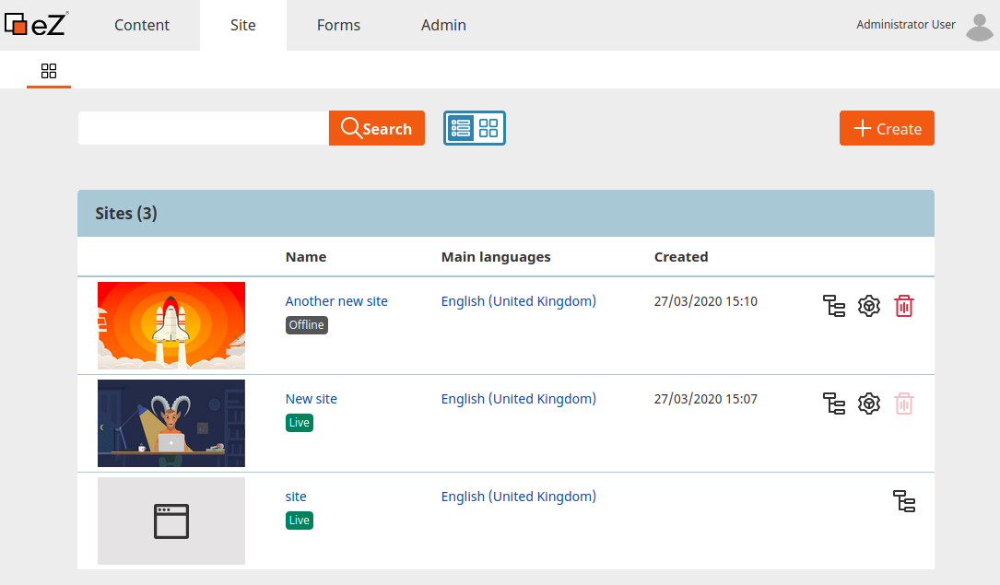

# Site Factory [[% include 'snippets/experience_badge.md' %]] [[% include 'snippets/commerce_badge.md' %]]

Site Factory is a site management User Interface, integrated with Admin UI.
It enables you to configure sites without editing:

- SiteAccess configuration
- multisite configuration

After [clean installation](../getting_started/install_ez_platform.md) the Site Factory will be disabled.
If you are not working on a clean installation, follow [Upgrading eZ Platform to v3](../upgrading/5_upgrade_database.md#site-factory-upgrade).
This results in the following message on the **Site** tab:
"There is a design configuration error, and you will not be able to create a new site. Please update the configuration."
If you plan to use Site Factory you need to enable and configure it.

To enable or disable Site Factory, follow respectively:

- [Enable Site Factory section](#enable-site-factory)
- [Disable Site Factory section](#disable-site-factory)

## Enable Site Factory

To enable Site Factory you need to set `enabled` to `true` in `config/packages/ezplatform_site_factory.yaml`.

### Configure designs

Next, configure Site Factory by adding empty SiteAccess groups, only one empty group is mandatory.
The number of empty SiteAccess groups must be equal to the number of templates that you want to have when you create the new site.

In this example, you add two SiteAccess groups (`example_site_factory_group_1` and `example_site_factory_group_2`) that correspond to the two templates (`ez_site1` and `ez_site2`) that you will add in the next step.
Under these groups you configure all the settings that do not expose the UI, e.g. the Content view.

Add groups in `config/packages/ezplatform.yaml`:

```yaml
ezplatform:
    siteaccess:
        list: [site]
        groups:
            site_group: [site]
            example_site_factory_group_1: []
            example_site_factory_group_2: []

    system:
        example_site_factory_group_1:
        example_site_factory_group_2:
```

Uncomment the SiteAccess matcher by removing the comment from `EzSystems\EzPlatformSiteFactory\SiteAccessMatcher` matcher under:

```yaml
ezplatform:
    siteaccess:
        match:
            # '@EzSystems\EzPlatformSiteFactory\SiteAccessMatcher': ~
```

`ezdesign` defines templates for your sites, so add them before continuing.
Next, add the configuration for `ezdesign` on the same level as `ezplatform`:

```yaml
ezdesign:
    design_list:
        example_1: [example_1_template]
        example_2: [example_2_template]
```

Finally, configure designs for empty SiteAccess groups:

```
ezplatform:
    system:
        example_site_factory_group_1:
            design: example_1
        example_site_factory_group_2:
            design: example_2
```

### Add templates configuration

Add thumbnails and names for your templates in `config/packages/ezplatform_site_factory.yaml`
It will connect SiteAccesses with the templates.

```yaml
ez_platform_site_factory:
    templates:
        ez_site1:
            siteaccess_group: example_site_factory_group_1
            name: example_site_1
            thumbnail: /path/to/image/example-thumbnail_1.png
        ez_site2:
            siteaccess_group: example_site_factory_group_2
            name: example_site_2
            thumbnail: /path/to/image/example-thumbnail_2.png
```

You can check the results of your work in the Back Office by going to the **Site** tab and selecting the **List** icon.

There, you should be able to add a new site and choose a design for it.

### Define domains

To be able to see your site online you need to define a domain for it.

!!! caution "Define domain for production environment"

    These steps are for `dev` environment only.
    If you want to define domains in production environment, you will need to configure Apache or Nginx by yourself.

In the `.env` file change line 2 to: `COMPOSE_FILE=doc/docker/base-dev.yml:doc/docker/multihost.yml`

Take a look into the `doc/docker/multihost.yml` file.
Here you will define your domains.
To add a new domain you must add it in `command:` and under frontend and backend aliases as shown in the example below.

```yaml hl_lines="3 6 11"
services:
  web:
    command: /bin/bash -c "cd /var/www && cp -a doc/nginx/ez_params.d /etc/nginx && bin/vhost.sh --host-name=site.example.com --host-alias='admin.example.com test.example.com' --template-file=doc/nginx/vhost.template > /etc/nginx/conf.d/default.conf && nginx -g 'daemon off;'"
    networks:
      frontend:
        aliases:
          - site.example.com
          - admin.example.com
          - test.example.com
      backend:
        aliases:
          - site.example.com
          - admin.example.com
          - test.example.com
```

Next, you must define the domains in `etc/hosts`:

`0.0.0.0 site.example.com admin.example.com test.example.com www.admin.example.com`

Then, run `docker-compose up`:

```bash
export COMPOSE_FILE="doc/docker/base-dev.yml:doc/docker/multihost.yml"
docker-compose up
```       

Your sites should be now visible under:

```
http://site.example.com:8080/
http://admin.example.com:8080/
http://localhost:8080/
http://test.example.com:8080/
```



### Define site directory

 You can adjust the place where the directory of the new site will be created.
 By default the Location for the site directories is defined in bundle configuration `src/bundle/Resources/config/default_settings.yaml`:

 ``` yaml
 parameters:
     ezsettings.default.site_factory.sites_location_id: 2
 ```

To change it to e.g. [[= product_name =]], go to `config/packages/ezplatform_site_factory.yaml`, and add the following parameter:

``` yaml
parameters:
    ezsettings.default.site_factory.sites_location_id: 42
```

Now, all new directories will be created under [[= product_name =]].

### Provide access

The Site Factory is set up, now you can provide sufficient permissions to the Users.

Set the below Policies to allow Users to:

- `site/view` - enter the Site Factory interface
- `site/create` - create sites
- `site/edit` - edit sites
- `site/change_status` - change status of the public accesses to `Live` or `Offline`
- `site/delete` - delete sites

For full documentation on how Permissions work and how to set them up, see [the Permissions section](permissions.md).

To learn how to use Site Factory, see [User documentation.](https://doc.ezplatform.com/projects/userguide/en/latest/site_organization/site_factory/#site-factory)

## Configuration

### Configure parent Location

You can define the parent Location for a new site in the configuration.
Each new site is created in the designated Location.

To define a parent Location, add a new configuration key to the template definition.
Each template is assigned its own Location.
This can be either a Location ID (e.g. `62`), or a recommended remote Location ID (e.g. `1548b8cd8dd4c6b5082e566615d45e91`).

Add the configuration key to your template:

```yaml hl_lines="7 12"
ez_platform_site_factory:
    templates:
        ez_site1:
            siteaccess_group: example_site_factory_group_1
            name: example_site_1
            thumbnail: /path/to/image/example-thumbnail_1.png
            parent_location_id: 62
        ez_site2:
            siteaccess_group: example_site_factory_group_2
            name: example_site_2
            thumbnail: /path/to/image/example-thumbnail_2.png
            parent_location_remote_id: 1548b8cd8dd4c6b5082e566615d45e91
```

Now, you can see the path to the new site's parent Location under design selection.   
If you have sufficient permissions you can change the defined Location during site creation.
If the parent Location is not defined, you have to choose it from Universal Discovery Widget.

### Configure Site skeleton

The Site skeleton enables you to copy an entire content structure of the site design to the defined Location.

Site skeleton copying is a one-off operation, it only happens during the site creation process.
After that, you cannot copy the Site skeleton again, for example in the edit view.

You can create as many skeletons as you need and assign them to templates.
Remember that one template can only have one Site skeleton assigned.

If the design does not have a defined Site skeleton, a directory of the new site is created in a standard Site Factory process.

!!! caution "Update from v3.0"

    To be able to create a Location for the Site skeletons, run the [update procedure](../updating/4_update_3.1.md#site-factory).

    Now, you should be able to see **Site skeletons** tab under **Admin** tab. The tab is only visible after the update procedure.

To define a Site skeleton, add a new configuration key to the template definition.
This can be either a Location ID (e.g. `5966`), or a recommended remote Location ID (e.g. `3bed95afb1f8126f06a3c464e461e1ae66`).

Add the configuration key to your template:

```yaml hl_lines="7 12"
ez_platform_site_factory:
    templates:
        ez_site1:
            siteaccess_group: example_site_factory_group_1
            name: example_site_1
            thumbnail: /path/to/image/example-thumbnail_1.png
            site_skeleton_id: 5966
        ez_site2:
            siteaccess_group: example_site_factory_group_2
            name: example_site_2
            thumbnail: /path/to/image/example-thumbnail_2.png
            site_skeleton_remote_id: 3bed95afb1f8126f06a3c464e461e1ae66
```

Now, you can choose a design with a defined Site skeleton, and decide if you want to use its skeleton by toggling **Generate site using site skeleton**.

### Configure User Group skeletons

With User Group skeletons you can define Policies and Limitations that apply to selected groups of users who can access the site.

You can create many User Group skeletons and associate them with many templates.
One template can have many User Group skeletons assigned.

To create a User Group skeleton, first go to **Admin** -> **Site skeletons** and add a User Group to a list of available skeletons.
Then, review the detailed information of the newly created User Group skeleton,
copy the Location ID or the the Location remote ID value, and add a configuration key to the template definition:

```yaml
ez_platform_site_factory:
    templates:
        <site_name>:
            # ...
            user_group_skeleton_ids: [ <id_skeleton1>, <id_skeleton2>, ... ]
            user_group_skeleton_remote_ids: [ <id_skeleton3>, <id_skeleton4>, ... ]
```

Manage the permissions associated to the User Group skeleton by [assigning Roles](https://doc.ibexa.co/projects/userguide/en/latest/site_organization/organizing_the_site/#managing-permissions).
Make sure that the Roles that you assign to the User Group skeleton do not contain Location-based Limitations. 
User Group skeletons cannot contain individual User Content items either.

User Group skeletons are retained after deleting the site.

## Disable Site Factory

Enabled Site Factory may cause following performance issues:

- Config Resolver will look for SiteAccesses in the database
- Site Factory matchers will be connected to the database in search for new SiteAccesses

You can disable Site Factory to boost Config Resolver performance.
Keep in mind that with disabled Site Factory you will not be able to add new sites or use existing ones.

1\. In `config/packages/ezplatform_site_factory.yaml` change enabled to `false`.

2\. In `config/packages/ezplatform.yaml` comment the `ezplatform.siteaccess.match: '@EzSystems\EzPlatformSiteFactory\SiteAccessMatcher': ~` if it is uncommented.

3\. Remove separate connection to database in `config/packages/doctrine.yaml`.

``` yaml
doctrine:
    dbal:
        connections:
            ...
            # This connection is dedicated for SiteFactory to avoid known issues
            site_factory:
```

4\. Remove separate cache pool in `config/packages/cache.yaml`.

``` yaml
framework:
    cache:
        ...
        pools:
            # This pool should be used only by SiteFactory bundle
            site_factory_pool:
```

The Site Factory should be disabled.
