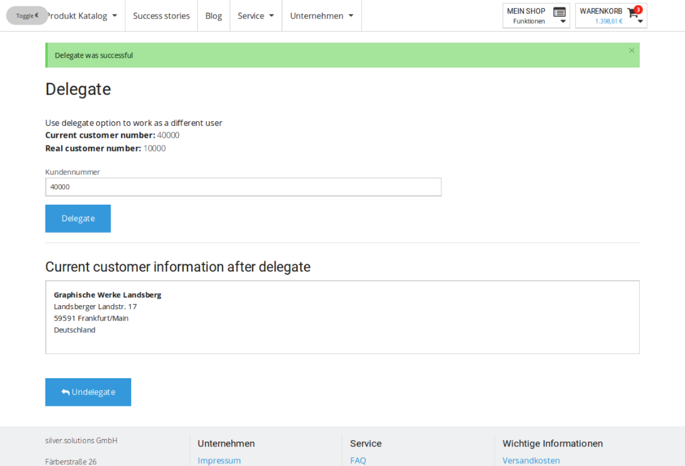
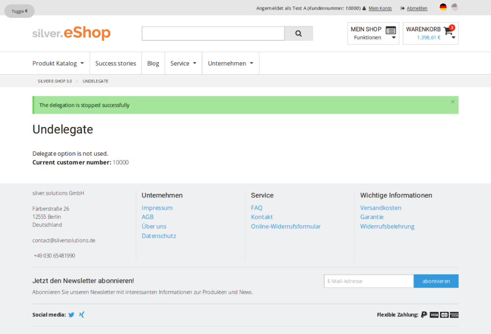

# Delegate function

You can delegate you operations in the shop to another user.
This user can then take over as if they had a different customer number.

The user must have the `siso_policy/delegate` Policy which gives them access to special delegate functions.
They can access these functions in the site header.
On the delegate page the user can enter a customer number of a known customer and click **Delegate**.

User data for the provided customer number is then fetched from ERP.
If the customer number is valid the number is assigned to the current user.
The delegate user then takes over as a different customer with a different customer number
and can even create an order with the given customer number.
They only get the ERP profile data from the different customer, but not other things, such as the basket.
The user always uses their own basket.

The user stays in the delegate role until they click **Undelegate**.

## Configuration

The delegate function is disabled by default. To enable it, add the following configuration in your [[= product_name_oss =]] project folder, the `config\packages\ezplatform.yaml` file, under the `parameters` key:

``` yaml
silver_eshop.default.enable_delegate: true    
```

### Delegation logic

When a user enters a customer number in the **Delegate** screen, the delegate function is called directly.

If no user is found with provided customer number, an error message is displayed.

If the delegation is successful, new user data is displayed.
In the top right corner in the header you can see the new customer number.

The user can return to their own profile by clicking the **Undelegate** button.

Delegate:


Successful delegation:



Undelegate:



Access the delegation from the menu:


### Routing / Controller (New actions) and logic

The `EshopBundle/Controller/DelegateCustomerController.php` controller handles delegating and undelegating actions.

The function adds two routes:

``` yaml
silversolutions_delegate:
    path:  /delegate
    defaults: { _controller: SilversolutionsEshopBundle:DelegateCustomer:delegate }

silversolutions_undelegate:
    path:  /undelegate
    defaults: { _controller: SilversolutionsEshopBundle:DelegateCustomer:undelegate }
```

Delegating is not always allowed, you can use the `DelegateCustomerController::isDelegateAllowed` method to check that.
The method returns true if delegation is allowed.

## Form and entity

??? note "src/Silversolutions/Bundle/EshopBundle/Controller/DelegateCustomerController.php"

    ``` php
     * Delegate Page, where user can enter a customer number of a known customer and click on delegate.
     * A list of users that match with the given criteria will ve shown.
     *
     * @param Request $request
     * @return Response
     */
    protected function buildDelegateForm(Request $request)
    {
        /** @var TransService $translatorService */
        $translatorService = $this->getTranslatorService();

        /** @var Delegate $delegate */
        $delegate = new Delegate();

        $form = $this->createFormBuilder($delegate)
            ->add('customer_number', 'text', array('label' =>  $translatorService->translate('Customer Number')))
            ->add('save', 'submit', array('label' => $translatorService->translate('label.delegate')))
            ->getForm();

        $form->handleRequest($request);

        return $form;
    }
    ```

For the form implementation you must have a new entity:

??? note "EshopBundle/Entity/Delegate.php"

    ```
    <?php

    /**
     * The delegate Entity is used in the "form" of Delegate list
     *
     * Class Delegate
     */
    class Delegate
    {
        /**
         * String, text field used for "customer number" or "name"
         * @var $customerNumber
         */
        protected $customerNumber;

        /**
         * @return mixed
         */
        public function getCustomerNumber()
        {
            return $this->customerNumber;
        }

        /**
         * @param mixed $customerNumber
         */
        public function setCustomerNumber($customerNumber)
        {
            $this->customerNumber = $customerNumber;
        }
    }
    ```

There are also two new templates to show the delegate forms and information.

## Customer profile data

The information whether the user is a delegate or not is stored in the customer profile data.

??? note "EshopBundle/Model/CustomerProfileData/CustomerProfileData.php"

    ```
    /**
     * Return true if user is in the delegate mode
     *
     * @param $userId
     * @return bool
     *
     */
    public function isDelegated()
    {
        $dataMap = $this->getDataMap();
        $delegated = $dataMap->getAttribute('delegated');

        return (bool) $delegated;
    }
    ```
