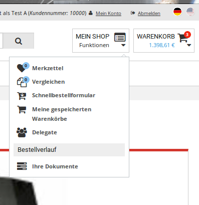
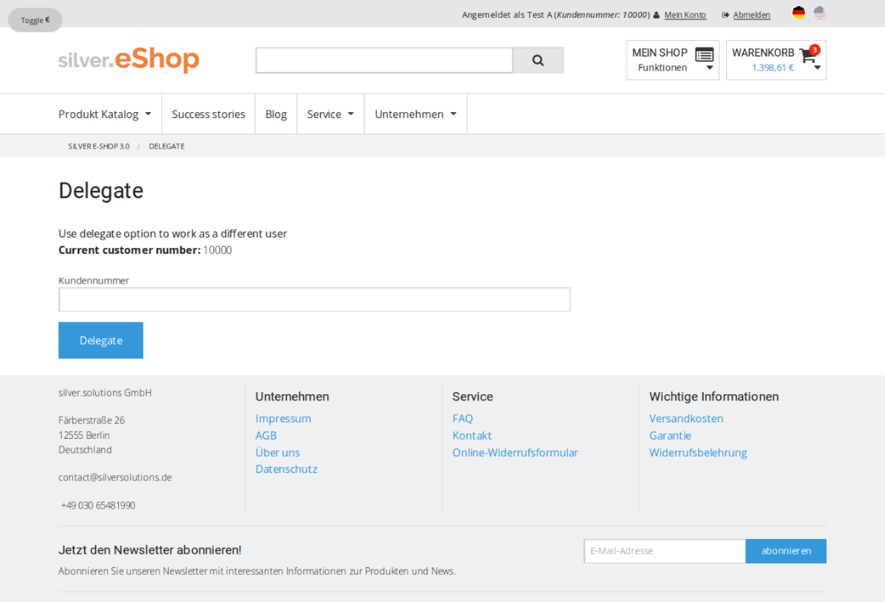

# Delegate function

You can delegate your operations in the shop to another user.
This user can then take over as if they had a different customer number.

The delegating user must have the `siso_policy/delegate` Policy which gives them access
to the delegation screen:



User data for the provided customer number is then fetched from ERP.
If the customer number is valid, the number is assigned to the current user.
The user then takes over as a different customer with a different customer number
and can even create an order with the given customer number.
They only get the ERP profile data from the different customer, but not other things, such as the basket.
The user always uses their own basket.

The user stays in the delegate role until they click **Undelegate**.

## Configuration

The delegate function is disabled by default. To enable it, use the following configuration:

``` yaml
silver_eshop.default.enable_delegate: true    
```

### Delegation logic

When a user enters a customer number in the **Delegate** screen, the delegate function is called directly.



If the delegation is successful, new user data is displayed.
In the top right corner in the header you can see the new customer number.

The user can return to their own profile by clicking the **Undelegate** button.

### Routes

The `EshopBundle/Controller/DelegateCustomerController.php` controller handles delegating and undelegating actions.

The function adds two routes:

``` yaml
silversolutions_delegate:
    path:  /delegate
    defaults: { _controller: SilversolutionsEshopBundle:DelegateCustomer:delegate }

silversolutions_undelegate:
    path:  /undelegate
    defaults: { _controller: SilversolutionsEshopBundle:DelegateCustomer:undelegate }
```

Delegating is not always allowed, you can use the `DelegateCustomerController::isDelegateAllowed` method to check that.
The method returns true if delegation is allowed.
