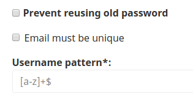

# Login methods

Two login methods are available: with User name or with email.

Providers for these two methods are `ezpublish.security.user_provider.username`
and `ezpublish.security.user_provider.email`.

You can configure which method is allowed in `packages/security.yaml`:

``` yaml
security:
    providers:
        ezplatform:
            chain:
                providers: [ezplatform_username, ezplatform_email]

        ezplatform_username:
            id: ezpublish.security.user_provider.username

        ezplatform_email:
            id: ezpublish.security.user_provider.email

    firewalls:
        #...
        ezpublish_front:
            # ...
            provider: ezplatform
```

You can customize per User Field whether the email address used as a login method must be unique or not.

To check that all existing User accounts have unique emails,
run the `ibexa:user:audit-database` command.
It lists all User accounts with duplicate emails.

!!! caution

    Because logging in with email was not available until version v3.0,
    you can come across issues if you use the option on an existing database.

    This may happen if more than one account uses the same email address.
    Login through the User name will still be available.

    To resolve the issues, run `ibexa:user:audit-database`
    and manually modify accounts that have duplicate emails.

## Login rules

You can set the rules for allowed User names in the Back Office per User Field.

The rules are set using regular expressions.

For example, to ensure that User names can only contain lowercase letters,
set `[a-z]+$` as **Username pattern**:



To check that all existing User accounts have names that fit the current pattern,
run the `ibexa:user:audit-database` command.
It checks all User accounts in the database and list those that do not fit the pattern.