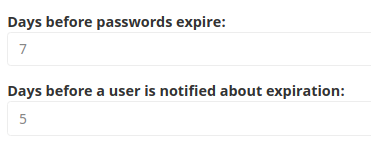

# Passwords

## Changing and recovering passwords

The user may request to change their password, or may forget it and ask to have it reset.

To change password, the user must have the `user/password` permission.

When the user requests a reset of a forgotten password, an email is sent to them with a token.
It allows them to create a new password.

For information about how to create and configure the template, see [Add forgot password option](../content_rendering/layout/add_forgot_password.md)

The template for this email is located in `templates/Security/mail/forgot_user_password.html.twig` in `ezsystems/ezplatform-user`.
You can [customize it according to your needs](../content_rendering/layout/add_login_form.md#customize-login-form).

The validity of the password recovery token can be set using the `ezplatform.system.<siteaccess>.security.token_interval_spec` parameter.
By default, it is set to `PT1H` (one hour).

## Revoking passwords

In case of a security situation such as a data leakage, you may need to force users to change their passwords.
You can do it with the help of the `ibexa:user:expire-password` command,
which revokes the passwords for specific users, User Groups or users belonging to the chosen Content Type.

To select which users to revoke passwords for, use one of the following options with the command:

- `--user-id|-u` - the ID of the user. Accepts multiple user IDs
- `--user-group-id|-ug` - the ID of the user group. Accepts multiple group IDs
- `--user-content-type-identifier|-ct` - the identifier of the user Content Type. Accepts multiple Content Types

You can use the following additional options with the command:

- `--force|-f` - commits the change, otherwise the command only performs a dry run
- `--iteration-count|-c` - defines how many users are fetched at once. Lowering this value helps with memory issues
- `--password-ttl|-t` - number of days after which new passwords expire. Used when the command enables password expiration for user Content Types that do not use it yet.

For example, to revoke the passwords of all users of the `user` Content Type, run:

``` bash
php bin/console ibexa:user:expire-password --user-content-type-identifier=user --force
```

To perform a dry run (without saving the results) of revoking passwords of all users from user group 13, run:

``` bash
php bin/console ibexa:user:expire-password --user-group-id=13
```

## Password rules

You can customize the password policy in your project.
Each password setting is customizable per User Field Type.
You can change the [password attributes](#password-attributes) or [password expiration settings](#password-expiration), and determine the rules for [repeating passwords](#repeating-passwords).

To access the password settings:

1. In the Back Office, in the **Admin** Panel, open the **Content Types** tab.
1. In the **Content Type groups** table, click on **Users**.
1. Edit the User Content Type.
1. In the **Field definitions** list, view the settings for **User account (ezuser)**.

!!! tip

    There can be other Content Types that function as users, beyond the built-in User Content Type.
    For details, see [User Identifiers](../configuration/config_repository.md#user-identifiers).

### Password attributes

In the **User account (ezuser)** Field definition, you can determine if the password must contain at least:

- One uppercase letter
- One lowercase letter
- One number
- One non-alphanumeric character

You can also set the minimum password length.

### Password expiration

In the **User account (ezuser)** Field definition, you can set password expiration rules, which forces users to change their passwords periodically.



You can also decide when the user is notified that they need to change their password.
The notification is displayed in the Back Office after login and in the User Content item's preview.

### Repeating passwords

You can set a rule that the password cannot be reused.
You set it for the User Content Type in the **User account (ezuser)** Field Type's settings.
When this is set, the user cannot type in the same password when it expires.
It has to be changed to a new one.

This only checks the new password against the current one.
A password that has been used before can be used again.

This rule is valid by default when password expiration is set.