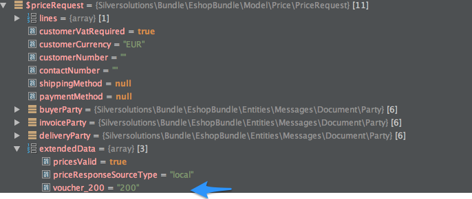

# Voucher FAQ

## How is voucher data sent to ERP?

Voucher data is sent to ERP in `PriceRequest` and `CreateOrderRequest`.

If enabled in the [configuration](vouchers_from_erp.md#configuration), an additional line with negative quantity is also sent.
The ERP must respond with negative cost.

### Data sent in the header

``` xml
//Data sent in the header, in SesExtension:
<SesExtension>
    <voucherNumber>[voucher_number]</voucherNumber> 
    <voucherNumber>[voucher_number2]</voucherNumber>  
</SesExtension>

//Additional line sent
<OrderLine>    
    <LineItem>
        <Item>
            <SellersItemIdentification>
                <ID>[voucher_number]</ID>
            </SellersItemIdentification>
        </Item>
        <Quantity>-1</Quantity>
        <Price>
            <PriceAmount></PriceAmount>
        </Price>
    </LineItem>
    <SesExtension>
        <isVoucher>1</isVoucher>
        <voucherNumber>[voucher_number]</voucherNumber>        
    </SesExtension>
</OrderLine>
```

## What happens if a voucher is invalid?

The ERP can send a message that the voucher is invalid. In that case this message is displayed in the basket.
The message must be mapped into a response like this:

``` xml
<SesExtension>
    <ErpMessage>008</ErpMessage>
</SesExtension>
```

In addition the `LineType` and `CostType` have to be set in `OrderLine` (response):

``` xml
<SesExtension>
    <ErpMessage>008</ErpMessage>
</SesExtension>
```

## Does the price engine have access to a voucher code?

The price request contains the voucher code:



The customer can provide one or more vouchers during checkout.
The `extendedData` structure provides simple data structures only.
This is why the field name contains the voucher number as well (here `voucher_200`).
