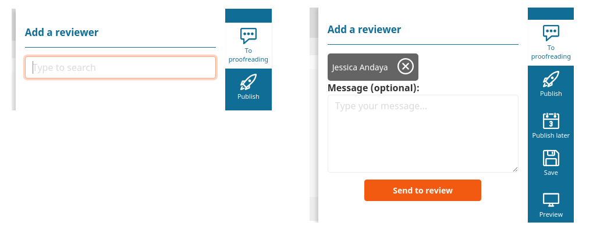
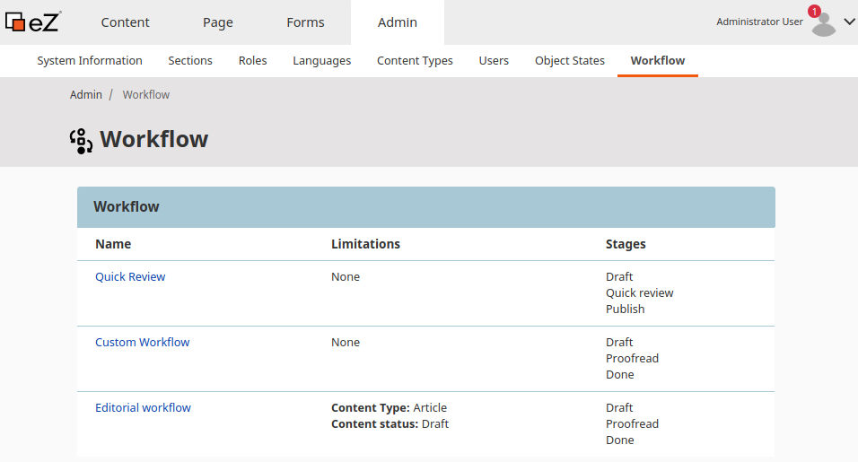
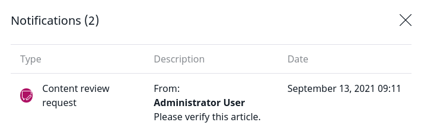

# Editorial workflow

The workflow functionality passes a Content item version through a series of stages.

For example, an editorial workflow can pass a Content item from draft stage through design and proofreading.

You can define different workflow in configuration. The workflow is permission-aware.

## Workflow configuration

Each workflow consists of stages and transitions between them.

The following configuration defines a workflow where you can pass a draft to proofreading, and then to final approval.
The workflow is defined in the `config/packages/ezplatform.yaml` configuration file.

``` yaml hl_lines="16 17 18 30 31 32 33 34 35 36 37"
ezplatform:
    system:
        # Workflow configuration is SiteAccess-aware
        default:
            workflows:
                # Identifier of the workflow
                custom_workflow:
                    name: Custom Workflow
                    matchers:
                        # Which Content Types can use this workflow, optional
                        content_type: article
                        # Which status of the Content item can use this workflow, optional. Available statuses are draft and published.
                        content_status: draft
                    # All stages the content goes through
                    stages:
                        draft:
                            label: Draft
                            color: '#f15a10'
                        proofread:
                            label: Proofread
                            color: '#5a10f1'
                        done:
                            label: Done
                            color: '#301203'
                            # Content items in this stage don't appear on My dashboard and in Review Queue.
                            last_stage: true
                    initial_stage: draft
                    # Available transitions between stages
                    transitions:
                        to_proofread:
                            from: draft
                            to: proofread
                            label: To proofreading
                            color: '#8888ba'
                            icon: '/bundles/ezplatformadminui/img/ez-icons.svg#comment'
                            reviewers:
                                required: true
                        back_to_draft:
                            reverse: to_proofread
                            label: Back to draft
                            color: '#cb8888'
                            icon: '/bundles/ezplatformadminui/img/ez-icons.svg#comment'
                        done:
                            from: proofread
                            to: done
                            label: Done
                            color: '#88ad88'
                            icon: '/bundles/ezplatformadminui/img/ez-icons.svg#comment'
```

Each stage in the workflow has an identifier and can be assigned a label and a color (lines 16-18).

Each transition also has an identifier. It must state between which stages it transitions, or be marked as `reverse` of a different transition.

Transitions can also have labels, colors, and icons (lines 33-35).
If you don't define a custom color for a transition, a default setting will be used (`$ez-color-base-light`, i.e. `#878787`).

You can require that a reviewer has to be selected when content is sent through a transition (lines 36-37).
The user will then not have the option to send the Content item without selecting a reviewer:



!!! note

    If a User does not have the permissions to view or edit the Content item,
    you cannot select them as a reviewer.

You can view all configured workflows in the Admin Panel by selecting **Workflow**.



## Publishing content with workflow

You can automatically publish a Content item once it goes through a specific transition.
To do so, configure the `publish` action for the transition:

``` yaml
custom_workflow:
    # ...
    transitions:
        # ...
        done:
            from: proofread
            to: done
            label: Done
            color: '#88ad88'
            actions:
                publish: ~
```

## Sending notifications

When an editor selects a reviewer in the Back Office, your configuration can send a notification to the reviewer:

``` yaml
custom_workflow:
    # ...
    stages:
        # ...
        proofread:
            label: Proofread
            color: '#5a10f1'
            actions:
                notify_reviewer: ~
```

The notification is displayed in the user menu:



## Permissions

You can limit access to workflows at stage and transition level.
Use the `workflow/change_stage` Policy to grant a User permission to change stages in a specific workflow.

This Policy can be limited with the [Workflow Transition Limitation](limitation_reference.md#workflow-transition-limitation) to only allow sending content in the allowed transition.

For example, using the example above, a `workflow/change_stage` Policy with `WorkflowTransitionLimitation` set to `To Proofreading`
will allow the Technical team to send content to proofreading after they are done with technical review.

You can also use the [Workflow Stage Limitation](limitation_reference.md#workflow-stage-limitation) together with the `content/edit` and `content/publish` Policy to limit the ability to edit content in specific stages.
For example, you can use it to only allow Technical team to edit content in the `technical` stage.

## Workflow service

Workflow makes use of the Symfony [Workflow Component](https://symfony.com/doc/5.0/components/workflow.html),
but special [[= product_name =]] treatment is covered in the Workflow service.

The service implements the following methods:

- `start` - places a Content item in a workflow
- `apply` - performs a transition
- `can` - checks if a transition is possible

!!! tip

    The methods `apply` and `can` are the same as in Symfony Workflow, but the implementation in Workflow Service
    extends them, for example by providing messages.

You can also use the following methods to read information about workflow from the database:

- `loadWorkflowMetadataForContent` - reads all workflow information about a Content item (as `WorkflowMetadata`)
- `loadWorkflowMetadataOriginatedByUser` - reads all workflow actions performed by the provided user (as `WorkflowMetadata`)
- `loadAllWorkflowMetadata` - reads all workflow information from the system

`\EzSystems\EzPlatformWorkflow\Value\WorkflowMetadata` object contains all information about a workflow, such as ID, name, transitions and current stage.
`\EzSystems\EzPlatformWorkflow\Value\WorkflowMetadata::$workflow` gives you direct access to native Symfony Workflow object.
