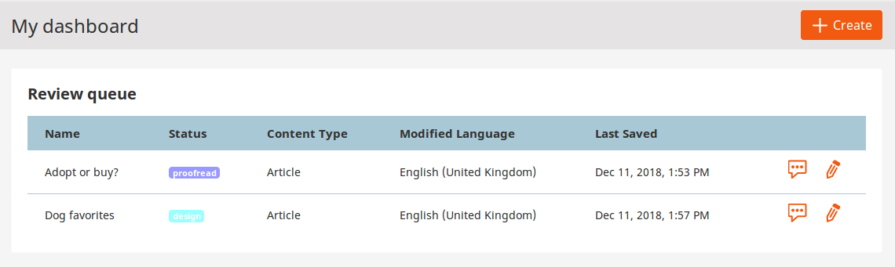
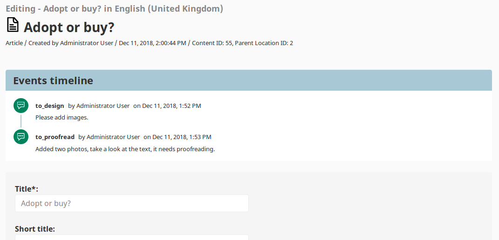

# Editorial workflow

The workflow functionality passes a Content item version through a series of stages.

For example, you can use the built-in editorial workflow to pass a Content item from draft stage through design and proofreading.

You can define different workflow in configuration. The workflow is permission-aware.

## Workflow configuration

Each workflow consists of stages and transitions between them.

The following configuration defines a workflow where you can pass a draft to technical review, then to proofreading, and finally it is done.

``` yaml hl_lines="15 16 17 30 31 32 33 34"
system:
    # Workflow configuration is SiteAccess-aware
    default:
        workflows:
            # Identifier of the workflow
            custom_workflow:
                name: 'Custom Workflow'
                matchers:
                    # Which Content Types can use this workflow
                    content_type: article
                    # Which status of the Content item can use this workflow. Available statuses are draft and published.
                    content_status: draft
                # All stages the content goes through
                stages:
                    draft:
                        label: 'Draft'
                        color: '#f15a10'
                    technical:
                        label: 'Technical review'
                        color: '#10f15a'
                    proofread:
                        label: 'Proofread'
                        color: '#5a10f1'
                    done:
                        label: 'Done'
                        color: '#301203'
                initial_stage: draft
                # Available transitions between stages
                transitions:
                    to_technical:
                        from: draft
                        to: technical
                        label: 'To technical review'
                        icon: '/bundles/ezplatformadminui/img/ez-icons.svg#comment'
                    back_to_draft:
                        reverse: to_technical
                        label: 'Back to draft'
                        icon: '/bundles/ezplatformadminui/img/ez-icons.svg#comment'
                    to_proofread:
                        from: technical
                        to: proofread
                        label: 'To proofreading'
                        icon: '/bundles/ezplatformadminui/img/ez-icons.svg#comment'
                    back_to_technical:
                        reverse: to_proofread
                        label: 'Back to technical review'
                        icon: '/bundles/ezplatformadminui/img/ez-icons.svg#comment'
                    done:
                        from: proofread
                        to: done
                        label: 'Done'
                        icon: '/bundles/ezplatformadminui/img/ez-icons.svg#comment'
```

Each stage in the workflow has an identifier and can be assigned a label and a color (lines 13-15).

Each transition also has an identifier. It must either state between which stages it transitions, or else be marked as `reverse` of a different transition.
Transitions can also have labels and icons (lines 33-34).

## Admin panel

You can view Content items which are under review in the Dashboard in the Review queue table.



When you edit a Content item that has been sent for review, you will see the Events timeline.
It lists all the transitions that this content has gone through.



## Permissions

You can limit access to workflows at stage and transition level.
Use the `workflow/change_stage` Policy to grant a User permission to change stages in a specific workflow.

This Policy can be limited with the [`WorkflowTransitionLimitation`](limitations.md#workflowtransitionlimitation) to only allow sending content in the allowed transition.

For example, using the example above, a `workflow/change_stage` Policy with `WorkflowTransitionLimitation` set to `to_proofread`
will allow the Technical team to send content to proofreading after they are done with technical review.

You can also use the [`WorkflowStageLimitation`](limitations.md#workflowstagelimitation) together with the `content/edit` Policy to limit the ability to edit content in specific stages.
For example, you can use it to only allow Technical team to edit content in the `technical` stage.
