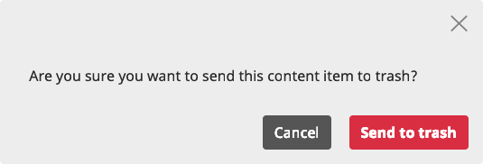
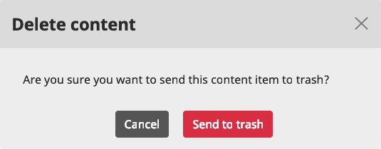

# Modals

We use modals as components for displaying specific information directly related to the content item currently checked which needs interaction from the user.

##
Introduction

Right below you have a modal (with interaction removed). This use case contains the three standard elements that we usually add to it: `modal-header`, `modal-body`, and `modal-footer`. All of our modals include a `modal-header`s with dismiss actions as standard best practice. Often (but not always) they also have explicit dismiss action buttons.

!!! note
    The objective of this component is to showcase `modal` structures. Content inside them is representative, but not an accurate representation of a real use case.

**
Modal sample
**

[[code_example {html}

    

        

            

                <button type="button" class="close" data-dismiss="modal" aria-label="Close">
                    <svg class="ez-icon ez-icon--medium" aria-hidden="true">
                        <use xmlns:xlink="http://www.w3.org/1999/xlink" xlink:href="../../ez-icons.svg#discard"></use>
                    </svg>
                </button>
            

            

                
Are you sure you want to send this content item to trash?

            

            

                <button type="button" class="btn btn-dark">Cancel</button>
                <button type="button" class="btn btn-danger font-weight-bold">Send to trash</button>
            

        

    

code_example]]

!!! note
    Remember when combining two buttons together to emphasize the preferred primary action button. We add class `font-weight-bold` for the primary button. Check more in [Buttons - Set of two buttons](buttons.md#set-of-two-buttons).

##
Send to Trash modals

Removing and deleting content are important actions in our application. Whereas in the former case the Content item is later retrievable from the Trash, in the second case the Content item is completely erased. Given the significant effects that these actions can have, their purpose have to be highlighted with a specific group of modals.

**
Send to Trash
**

Use it when removing content created by the user that will be sent to Trash.

[[code_example {html}
<!-- Button trigger modal -->
<button type="button" class="btn btn-secondary btn-modal-launcher" data-toggle="modal" data-target="#trash-location-modal">Launch Send to Trash modal</button>

<!-- Modal -->

    

        

            

                <button type="button" class="close" data-dismiss="modal" aria-label="Close">
                    <svg class="ez-icon ez-icon--medium" aria-hidden="true">
                        <use xmlns:xlink="http://www.w3.org/1999/xlink" xlink:href="../../ez-icons.svg#discard"></use>
                    </svg>
                </button>
            

            

                
Are you sure you want to send this content item to trash?

            

            

                <button type="button" class="btn btn-dark" data-dismiss="modal">Cancel</button>
                <button type="button" class="btn btn-danger font-weight-bold">Send to Trash</button>
            

        

    

code_example]]

All Send to Trash modals should have the same styling in order to help users quickly identify what the modal's message is about. We don't add `.modal-title` to the header and we position `.modal-footer` set of two buttons to the right.
##

Yes

##

No

##
Modals with headers

We recommend using them when you have to display listed information in tables and you want users to interact with the information contained within that specific table through action buttons (either the whole row or specific buttons). Hence, there is no need to add more interaction buttons, like in `.modal-footer`.

##

[[code_example {html}
<!-- Button trigger modal -->
<button type="button" class="btn btn-secondary btn-modal-launcher" data-toggle="modal" data-target="#view-notifications">Launch modal with header</button>

<!-- Modal -->

    

        

            

                <h5 class="modal-title" data-notifications-total="(1)">Notifications </h5>
                <button type="button" class="close" data-dismiss="modal" aria-label="Close">
                    <svg class="ez-icon ez-icon--medium" aria-hidden="true">
                        <use xmlns:xlink="http://www.w3.org/1999/xlink" xlink:href="../../ez-icons.svg#discard"></use>
                    </svg>
                </button>
            

            

                

                    <svg class="ez-icon ez-icon--medium" aria-hidden="true">
                        <use xmlns:xlink="http://www.w3.org/1999/xlink" xlink:href="../../ez-icons.svg#spinner"></use>
                    </svg>
                

                

                    <table class="table n-table--notifications">
                        <thead>
                            <tr>
                                <th>Type</th>
                                <th>Description</th>
                                <th>Date</th>
                            </tr>
                        </thead>
                        <tbody class="n-table__body">
                            <tr class="n-notifications-modal__item fw-notification">
                                <td class="n-notifications-modal__type">
                                    
                                        <svg class="ez-icon ez-icon--review">
                                            <use xmlns:xlink="http://www.w3.org/1999/xlink" xlink:href="../../ez-icons.svg#review"></use>
                                        </svg>
                                    
                                    
                                        Content review request
                                    
                                </td>
                                <td class="n-notifications-modal__description">
                                    

                                        From:
                                        Administrator user
                                    

                                    
Can you check this? Thxs!

                                </td>
                                <td class="n-notifications-modal__time">
                                    Sep 13, 2018, 2:58 PM
                                </td>
                            </tr>
                        </tbody>
                    </table>
                

            

        

    

code_example]]

##
Modals with headers and footers

We display them when users need to add or modify specific settings of a content item. This modal includes buttons within its `.modal-footer` due to the need of having an action button that submits changes added or defined.

##

[[code_example {html}
<!-- Button trigger modal -->
<button type="button" class="btn btn-secondary btn-modal-launcher" data-toggle="modal" data-target="#ez-modal--custom-url-alias">Launch modal with header and footer</button>

<!-- Modal -->

    

        

            

                <h3 class="modal-title">Create new translation</h3>
                <button type="button" class="close" data-dismiss="modal" aria-label="Close">
                    <svg class="ez-icon ez-icon--medium" aria-hidden="true">
                        <use xmlns:xlink="http://www.w3.org/1999/xlink" xlink:href="../../ez-icons.svg#discard"></use>
                    </svg>
                </button>
            

            

                Select a language for your new translation
                

                    

                        <label class="ez-translation__label">French</label>
                    

                    

                        <label class="ez-translation__label">German</label>
                    

                    

                        <label class="ez-translation__label">Norwegian</label>
                    

                

                Base this translation on an existing translation
                

                    

                        <label class="ez-translation__label">English (United Kingdom)</label>
                    

                

            

            

                <button type="button" class="btn btn-dark" data-dismiss="modal">Cancel</button>
                <button type="button" class="btn btn-primary font-weight-bold" type="submit" name="custom_url_add[add]" disabled="true">Create</button>
            

        

    

code_example]]

