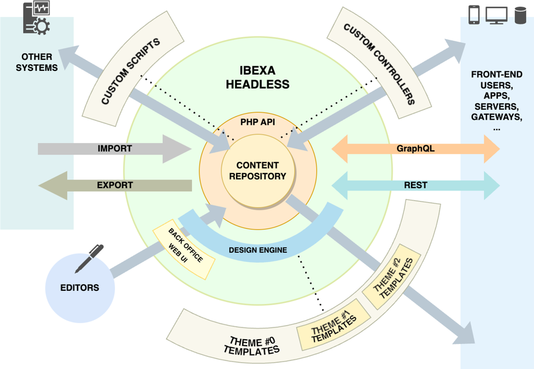

# Ibexa DXP Headless edition product guide

## What is [[= product_name_headless =]]

[[= product_name =]] Headless edition focuses on content management.
It provides tools to collaboratively create content, and interfaces (API) to distribute this content.

Multilingual, multichannel, extensible, [[= product_name_headless =]] is an advanced Content Management Framework (CMF), a Product Information Management (PIM) platform, and even a Digital Asset Management (DAM) repository.
It's provided without a default front office, but with a complete Back Office and several APIs to manage and access content.

## Availability

To start using [[= product_name_headless =]] you must purchase a product license.
For more information, see [[[= product_name_headless =]] license pricing](https://www.ibexa.co/products/pricing?tab=1).
You can [contact us](https://www.ibexa.co/products/pricing) or [contact one of our partners](https://www.ibexa.co/partners).

## How it works

### Editorial stage

You access with any web browser from any platform to a rich Back Office, the main place to

- define users and their rights (customers, subscribers, editors, etc.),
- organize content (content types, fields, tree, tags, languages, and more),
- edit content in a collaborative workplace with versions and workflows.

Then, content is available to end users through REST, GraphQL, or every output you can imagine like websites or apps.

### Technical backstage

When you have a license, you install [[= product_name_headless =]] through Composer
on an architecture including at least a web server with PHP and a relational database server.
For performance, several bricks can be added to your stack such as a reverse proxy or a search engine.

[[= product_name_headless =]] is based on Symfony. Any Symfony developer, or even PHP developer, can quickly learn how to extend it with the help of an online documentation.

By using a version control system and environment variables, you can deploy your configuration and extensions on several environments including [[= product_name_cloud =]].

Standard web APIs and [[= product_name_connect =]] help establish interoperability, even if you aren't an advanced developer.

APIs summary:

- The REST and GraphQL APIs give access to access the content in standardized ways.
- The OAuth 2 Client and Server allow to connect to an SSO or be the SSO.
- The design engine and its theme templates mechanism allows to serve the content in several shapes.
- The PHP API opens [[= product_name_headless =]] to extendability to fit your needs.
  For example, content can be computed, edited or served in specific ways such as
  scheduled/live imports/exports, automated edition tasks, or specific controllers to communicate with other applications.

## Capabilities and benefits

[[= product_name_headless =]] is a tool box with a Back Office.
It comes without a default front office.
You don't lose time to develop a theme for a provided front office before discovering it won't fit your needs.
No distraction.
[[= product_name_headless =]] helps you focus on the content, create and organize with its straightforward user interface (UI),
imagine its inputs/outputs, and implement them with its various layers' APIs.

### Core features

The core of [[= product_name =]] Headless edition is already awesome as it offers everything to structure your content repositories and access them.

#### Content model

Content modeling and management are the foundation of [[= product_name =]] with the following main layers:

- Content items are organized as a tree in a repository.
- An item can have multiple locations in this tree.
- Content items are typed.
- Content types are sets of typed data fields, with eventually conditions on the possible values.
- Rich Text Field Type comes with an [online editor](online_editor_guide.md).
- Multilingual, it can store a content in several languages, the content model define which field must be translated, and which don't vary.

For more information, see [Content management product guide](content_management_guide.md).

#### User management

User and user group rights are set by roles with thin granular limited permission policies in a safe deny-by-default security system.
Users are content items as well, so your knowledge about content management is reused.

See [User management product guide](user_management_guide.md) for more.

#### Content access

There is many paths to access the content in many shapes:

- The REST API and GraphQL API support access to, and edition of the content.
- [[= product_name_headless =]] offers a complete PHP API to extend the ways to access content.
- A design engine and a view controller offer to create plain text content views (such as HTML, JSON, XML, CSS, JS, CSV, or Markdown),
  and to factorize those views by using theme cascades.
  This design engine is used in the Back Office which is equally extendable.
- Multichannel, content can be accessed through several channel configurations,
  such as the domain name it replies to, the sub-part of the content tree it starts from, the users rights, or the design theme.
  The Back Office itself is such a channel.
- Multi-repository, the same platform can use separate databases if impermeability is needed between channel groups.

### Advanced features

On top of this strong core, [[= product_name =]] Headless edition brings tools to increase user experience, from final front users to Back Office contributors.

#### Complete DXP

[[= product_name_headless =]] is a complete Digital Experience Platform (DXP), which comes with the following components to enhance user's journey:

- [Personalization](personalization_brochure.md) engine, which allows you to recommend content to end users according to their behavior,
  or, when authenticated, by matching with their segment/group.
- Content scheduler, which allows you to establish the future of the content and use events to have a living front application, even when the editorial team is absent or reduced.
This way, visitors can discover new content at midnight, during weekends or vacations.
A calendar summarises those scheduled content events.
Like everything in the Back Office, the calendar is extendable: you can add an event source to coordinate content events with other company events.

#### Many ways to structure and organize content

[Product Information Management](pim_guide.md) (PIM) helps organize complex products and their catalogs:
    - Product are organized per product types × variants × catalogs × categories × tags.
    - Product attributes are grouped and factorized among product types. For example, fabric + color + size can be shared by many clothing product types.
    - Product variants can rapidly be created by the automatic declination of attributes having a defined set of values.
- [[= product_name_headless =]]' taxonomy feature allows to tag content items to organize them by topics in a much intuitive way for the editor than a content tree with multiple locations would.
  Tags themselves are organized in a tree, and synonyms are linked to a favorite terms. This tags organization can be the task of a supervisor who won't need to move content items around a corporate content tree. At search time, tags can be keywords with a high value in relevance score to help the end user having results closer to the searched topic.

#### Collaboration

Several features help end users collaborate on the content:

- Version comparison helps track changes and solve concurrent editing conflicts.
- Workflows helps with collaborative editing chain.
  A built-in “Quick review“ workflow allows an editor to send a content draft to a colleague for review, and comment or publishing.
  But, as a framework, more complex workflows can be imagined, with several steps and paths, even some automated tasks.

#### Accelerated content editing

- [[= product_name_headless =]]'s content tree has several actions available directly on its items. For example, no need to open a content to hide it, you can do it directly from the content tree.
- An Image Editor offers to crop and flip images. When serving the image in various context, you can even set a focal point to indicate to automated cropping which part of the image should be kept.
- A Digital Asset Management (DAM) helps you crawl through your image resources to use and reuse them in your content. And a DAM connector allows you to search for images hosted on third party DAM servers.

#### Network integration

##### Intranets and extranets

- [[= product_name_connect =]]'s role is to create application interconnections with low code and drag-and-drop, in a compelling visual interface.
  Complex data flows can be easily implemented with a huge library of connectors and actions for famous to specific applications.
  See [[[= product_name_connect =]] product guide]([[= connect_doc =]]/general/ibexa_connect/) for more.
- An OAuth 2 server offers the possibility to use the DXP as the authentication service for other applications.
- An OAuth 2 client supports authentication with a third-party OAuth 2 server.
- A DAM Connector, previously mentioned, helps to access any image repository when needing to illustrate a content.
- [[= product_name_headless =]] supports Elasticsearch and Solr.
  It gives the choice between using Solr or Elasticsearch as a search engine, whether hosted on [[= product_name_cloud =]] or on-premises.
  This choice might be influenced by technology you already use, or you want to invest in for other internal projects.
- [[= product_name_headless =]] offers to export and import from command line part of the content model or content items.
  For example, it can be used to move new content types and items from a staging instance to the production one.

##### Internet, delivery, web search engines, and social networks

- [[= product_name_headless =]] comes with the support of Fastly content delivery network (CDN).
  The HTTP cache varies on current user's role and is purged when content change.
  With is huge network of points of presence (POP) around the world, Fastly is quickly delivering cached content from nearest server for a better user experience.
- A Search Engine Optimization (SEO) field implements best practices about web search engine indexing and social network sharing.
  It covers canonical URLs which are mandatory if multiple locations are used for a same Content item to avoid duplicate content,
  Open Graph protocol to better describe a Content item to social networks and search engine, and Twitter Cards.

## Use cases

As a content repository with an omnipotent Back Office,
many APIs to absorb, compute and distribute content,
even a recommendation engine to deliver the right content to various readers,
[[= product_name_headless =]] can be used in several cases.
Here are few examples.

### Brick and mortar, but with an online showcase

If you prefer the human warmth of a retail store,
if your products' numerous complex options should be discussed,
or if you're simply not ready yet to sell online,
[[= product_name_headless =]] helps to build an exposition of your product catalog and your philosophy,
an online presence to keep earlier customers interested and gather new ones.
It can be a structuring first step to test customer's adoption of your website,
before increasing user experience with [[= product_name_exp =]],
and finally becoming an online store with [[= product_name_com =]].

### Large network with multiple inputs and outputs

Departments, subsidiaries, and even partners now produce content in the same repository from the same collaborative workspace.
Thanks to migration feature and PHP API, existing content has been imported from previous repositories.
Fine-tuned user rights and workflows ensure that each collaborator can focus on their own tasks without the risk to disturb the content model or content organization.
Content is distributed on several websites and applications, some running on the [[= product_name_base =]] platform itself, some on third parties' servers, some as native mobile apps.
Part of the content has multiple locations or is translated, and reused from place to place.
While the Back Office offers to search into the whole repository, the front end apps have correctly circumscribed search capabilities.
