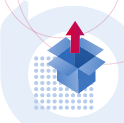

<!-- vale off -->

    

        

            <h1>Ibexa Developer Documentation</h1>
            <h2>How to start?</h2>
        

        

            <a class="info-tile" href="getting_started/requirements/">
                

                    <svg width="20" height="25"><use xlink:href="images/icons.svg#check-requirements" /></svg>
                

                

                    

                        Details
                        <svg class="info-tile__arrow-icon"><use xlink:href="images/icons.svg#arrow" /></svg>
                    

                    

                        Check the <strong>Requirements</strong>
                    

                

            </a>
        

        

            <a class="info-tile" href="getting_started/install_ibexa_dxp/">
                

                    <svg width="25" height="25"><use xlink:href="images/icons.svg#install-dxp" /></svg>
                

                

                    

                        Details
                        <svg class="info-tile__arrow-icon"><use xlink:href="images/icons.svg#arrow" /></svg>
                    

                    

                        Install <strong>Ibexa DXP</strong>
                    

                

            </a>
        

        

            <a class="info-tile" href="ibexa_cloud/install_on_ibexa_cloud/">
                

                    <svg width="25" height="18"><use xlink:href="images/icons.svg#install-cloud" /></svg>
                

                

                    

                        Details
                        <svg class="info-tile__arrow-icon"><use xlink:href="images/icons.svg#arrow" /></svg>
                    

                    

                        Install on <strong>Ibexa Cloud</strong>
                    

                

            </a>
        

        

            <a class="info-tile" href="getting_started/first_steps/">
                

                    <svg width="25" height="24"><use xlink:href="images/icons.svg#first-steps" /></svg>
                

                

                    

                        Details
                        <svg class="info-tile__arrow-icon"><use xlink:href="images/icons.svg#arrow" /></svg>
                    

                    

                        Go through the <strong>First steps</strong>
                    

                

            </a>
        

    

    

        

            

                

                    <h2>The latest release is [[= latest_tag_5_0 =]]</h2>
                    
The latest version of Ibexa DXP is [[= latest_tag_5_0 =]]. You can now update your application to the latest version.

                

                

                    <a href="release_notes/ibexa_dxp_v4.6/">Release notes</a>
                

                

                    
                

            

        

    

    

        

            

                

                    

                        <h2>Notable changes in v4.6</h2>
                        

                            <svg><use xlink:href="images/icons.svg#toggler" /></svg>
                        

                    

                    

                        

                            <ul>
                                <li><a href="release_notes/ibexa_dxp_v4.6/#customizable-dashboard">Customizable dashboard</a></li>
                                <li><a href="release_notes/ibexa_dxp_v4.6/#page-builder-improvements">Page Builder improvements</a></li>
                                <li><a href="release_notes/ibexa_dxp_v4.6/#focus-mode">Focus mode</a></li>
                            </ul>
                        

                        

                            <ul>
                                <li><a href="release_notes/ibexa_dxp_v4.6/#remote-pim-support">Remote PIM</a></li>
                                <li><a href="release_notes/ibexa_dxp_v4.6/#reorder">Changes in Order management</a></li>
                                <li><a href="release_notes/ibexa_dxp_v4.6/#triggers">Personalization triggers</a></li>
                            </ul>
                        

                    

                

            

        

        

            

                

                    

                        <h2>Most popular pages</h2>
                        

                            <svg><use xlink:href="images/icons.svg#toggler" /></svg>
                        

                    

                    

                        

                            <ul>
                                <li><a href="api/php_api/php_api/">PHP API</a></li>
                                <li><a href="content_management/rich_text/rich_text/">RichText and Online Editor</a></li>
                                <li><a href="search/search_api/">Search API</a></li>
                            </ul>
                        

                        

                            <ul>
                                <li><a href="content_management/content_model/">Content model</a></li>
                                <li><a href="content_management/images/images/">Images</a></li>
                                <li><a href="content_management/pages/page_blocks/">Page blocks</a></li>
                            </ul>
                        

                    

                

            

        

    

    

        

            <h2>Manage your DXP</h2>
        

        

            

                

                    <h3>
                        <a href="content_management/content_management/">
                            <svg><use xlink:href="images/icons.svg#content-draft" /></svg>
                            Content
                        </a>
                    </h3>
                    <ul>
                        <li><a href="content_management/content_model/">Content model</a></li>
                        <li><a href="content_management/file_management/file_management/">File management</a></li>
                        <li><a href="content_management/pages/pages/">Pages</a></li>
                    </ul>
                

            

        

        

            

                

                    <h3>
                        <a href="pim/pim/">
                            <svg><use xlink:href="images/icons.svg#product" /></svg>
                            Product
                        </a>
                    </h3>
                    <ul>
                        <li><a href="pim/pim_configuration/">PIM configuration</a></li>
                        <li><a href="pim/catalogs/">Catalogs</a></li>
                        <li><a href="pim/prices/">Prices</a></li>
                    </ul>
                

            

        

        

            

                

                    <h3>
                        <a href="commerce/commerce/">
                            <svg><use xlink:href="images/icons.svg#cart" /></svg>
                            Commerce
                        </a>
                    </h3>
                    <ul>
                        <li><a href="commerce/cart/cart/">Cart</a></li>
                        <li><a href="commerce/payment/payment/">Payment</a></li>
                        <li><a href="commerce/storefront/storefront/">Storefront</a></li>
                    </ul>
                

            

        

        

            

                

                    <h3>
                        <a href="customer_management/customer_portal/">
                            <svg><use xlink:href="images/icons.svg#profile" /></svg>
                            Customer
                        </a>
                    </h3>
                    <ul>
                        <li><a href="customer_management/cp_configuration/">Configuration</a></li>
                        <li><a href="customer_management/cp_page_builder/">Build Customer Portal</a></li>
                        <li><a href="customer_management/create_user_registration_form/">Registration form</a></li>
                    </ul>
                

            

        

    

