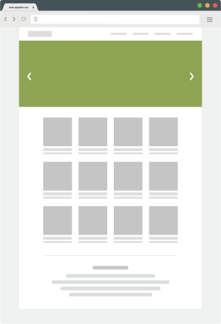

# eZ Platform developer documentation

&nbsp;

    

        

        

            
<a href="../tutorials/platform_beginner/building_a_bicycle_route_tracker_in_ez_platform/" class="card-link">Tutorials</a>

        

    

    

        

        

            
<a href="../getting_started/get_started_with_ez_platform" class="card-link">Get started</a>

        

    

    

        

        

            
<a href="../guide/architecture/" class="card-link">Guide to eZ Platform</a>

        

    

  
Other topics

  <ul class="list-group list-group-flush">
    <li class="list-group-item"><a href="../releases/releases/" class="card-link">Releases</a></li>
    <li class="list-group-item"><a href="../migrating/migrating_from_ez_publish_platform/" class="card-link">Migration</a></li>
    <li class="list-group-item"><a href="../community_resources/resources/" class="card-link">Community resources</a></li>
    <li class="list-group-item"><a href="../cookbook/authenticating_a_user_with_multiple_user_providers/" class="card-link">Cookbook</a></li>
  </ul>

  
Further documentation

  <ul class="list-group list-group-flush">
      <li class="list-group-item"><a href="https://doc.ezplatform.com/projects/userguide/en/latest/" class="card-link">User Guide</a></li>
      <li class="list-group-item"><a href="https://doc.ezplatform.com/projects/ezservices/en/latest/" class="card-link">eZ Services documentation</a></li>
    <li class="list-group-item"><a href="https://doc.ez.no/display/EZP/eZ+Publish+5.x+Developer+Documentation" class="card-link">eZ Publish 5 documentation</a></li>
    <li class="list-group-item"><a href="https://doc.ez.no/eZ-Publish" class="card-link">eZ Publish Legacy documentation</a></li>
  </ul>

  
The latest release is v2.3

  

      

          
Major features:

          <ul>
            <li>Form Builder</li>
            <li>Content scheduling</li>
            <li>ImageAsset Field Type</li>
          </ul>
          
See <a href="../releases/ez_platform_v2.3/" class="card-link">2.3 release notes</a> for more information

      

  

  
For a roadmap of planned features see

