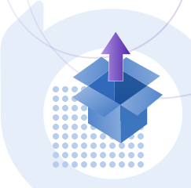

<!-- vale off -->

    

        

            <h1>Cohesivo by Ibexa</h1>
            
Cohesivo is a headless SaaS content management system.
            You model, author, and administer content, products, and customers in a hosted back office,
            and you retrieve everything over HTTP to render in the front end that you build.

            <h2>How to start?</h2>
        

        

            <a class="info-tile" href="getting_started/first_steps/">
                

                    <svg width="25" height="24"><use xlink:href="images/icons.svg#first-steps" /></svg>
                

                

                    

                        Details
                        <svg class="info-tile__arrow-icon"><use xlink:href="images/icons.svg#arrow" /></svg>
                    

                    

                        Go through the <strong>First steps</strong>
                    

                

            </a>
        

        

            <a class="info-tile" href="api/api/">
                

                    <svg width="25" height="18"><use xlink:href="images/icons.svg#install-cloud" /></svg>
                

                

                    

                        Details
                        <svg class="info-tile__arrow-icon"><use xlink:href="images/icons.svg#arrow" /></svg>
                    

                    

                        Explore the <strong>APIs</strong>
                    

                

            </a>
        

        

            <a class="info-tile" href="product_guides/product_guides/">
                

                    <svg width="20" height="25"><use xlink:href="images/icons.svg#check-requirements" /></svg>
                

                

                    

                        Details
                        <svg class="info-tile__arrow-icon"><use xlink:href="images/icons.svg#arrow" /></svg>
                    

                    

                        Read the <strong>Product guides</strong>
                    

                

            </a>
        

    

    

        

            

                

                    <h2>What's new in Cohesivo</h2>
                    
Cohesivo is delivered as a service, so new capabilities reach you without an upgrade project. The release notes list what has been delivered.

                

                

                    <a href="release_notes/">Release notes</a>
                

                

                    
                

            

        

        

            

                

                    <h2>Looking for the on-premise product?</h2>
                    
Cohesivo is also available as an on-premise, self-hosted product that you install and extend yourself. It has its own documentation.

                

                

                    <a href="on_premise/">About on-premise Cohesivo</a>
                

                

                    
                

            

        

    

    

        

            <h2>What Cohesivo does</h2>
        

        

            

                

                    <h3>
                        <a href="content_management/content_management/">
                            <svg><use xlink:href="images/icons.svg#content-draft" /></svg>
                            Content
                        </a>
                    </h3>
                    <ul>
                        <li><a href="content_management/content_model/">Content model</a></li>
                        <li><a href="content_management/pages/pages/">Pages</a></li>
                        <li><a href="content_management/forms/forms/">Forms</a></li>
                        <li><a href="content_management/rich_text/rich_text/">RichText and Online Editor</a></li>
                        <li><a href="content_management/images/images/">Images</a></li>
                        <li><a href="content_management/taxonomy/taxonomy/">Taxonomy</a></li>
                        <li><a href="content_management/workflow/workflow/">Editorial workflow</a></li>
                    </ul>
                

            

        

        

            

                

                    <h3>
                        <a href="administration/administration/">
                            <svg><use xlink:href="images/icons.svg#filters" /></svg>
                            Sites and administration
                        </a>
                    </h3>
                    <ul>
                        <li><a href="multisite/multisite/">Multisite</a></li>
                        <li><a href="multisite/site_factory/site_factory/">Site Factory</a></li>
                        <li><a href="multisite/languages/languages/">Languages and translations</a></li>
                        <li><a href="content_management/url_management/url_management/">URL management</a></li>
                        <li><a href="administration/back_office/back_office/">Back office</a></li>
                        <li><a href="users/users/">Users</a></li>
                        <li><a href="permissions/permissions/">Permissions</a></li>
                    </ul>
                

            

        

        

            

                

                    <h3>
                        <a href="product_catalog/product_catalog/">
                            <svg><use xlink:href="images/icons.svg#product" /></svg>
                            Products and customers
                        </a>
                    </h3>
                    <ul>
                        <li><a href="product_catalog/products/">Products</a></li>
                        <li><a href="product_catalog/catalogs/">Catalogs</a></li>
                        <li><a href="product_catalog/prices/">Prices</a></li>
                        <li><a href="product_catalog/quable/quable/">Quable integration</a></li>
                        <li><a href="customer_management/customer_portal/">Customer Portal</a></li>
                        <li><a href="qualifio/qualifio/">Data collection with Qualifio</a></li>
                    </ul>
                

            

        

        

            

                

                    <h3>
                        <a href="api/api/">
                            <svg><use xlink:href="images/icons.svg#search" /></svg>
                            APIs, search, and AI
                        </a>
                    </h3>
                    <ul>
                        <li><a href="api/api/">REST API</a></li>
                        <li><a href="api/rest_api/rest_api_authentication/">REST API authentication</a></li>
                        <li><a href="search/search/">Search</a></li>
                        <li><a href="ai/ai_actions/ai_actions/">AI Actions</a></li>
                        <li><a href="ai/mcp/mcp/">MCP servers</a></li>
                        <li><a href="recommendations/raptor_integration/raptor_connector/">Recommendations</a></li>
                        <li><a href="raptor_cdp/raptor_cdp/">Customer Data Platform</a></li>
                    </ul>
                

            

        

    

    

        

            

                

                    

                        <h2>Most popular pages</h2>
                        

                            <svg><use xlink:href="images/icons.svg#toggler" /></svg>
                        

                    

                    

                        

                            <ul>
                                <li><a href="content_management/rich_text/rich_text/">RichText and Online Editor</a></li>
                                <li><a href="content_management/content_model/">Content model</a></li>
                            </ul>
                        

                        

                            <ul>
                                <li><a href="content_management/images/images/">Images</a></li>
                                <li><a href="content_management/pages/page_blocks/">Page blocks</a></li>
                            </ul>
                        

                    

                

            

        

    

