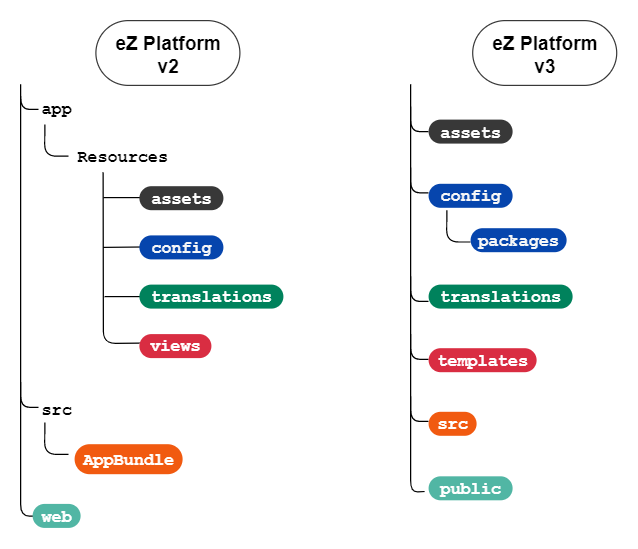

# Migrating to v3

## Project structure

!!! tip

    For details on all changes related to the switch to Symfony 4, see [Symfony 4 upgrade doc.](https://github.com/symfony/symfony/blob/master/UPGRADE-4.0.md)

Symfony 4 changes the organization of your project into folders and bundles.
When updating to eZ Platform v3 you need to move your files and modify file paths and namespace references.



### Configuration

Configuration files have been moved from `app/Resources/config` to `config`.
Package-specific configuration is placed in `config/packages` (e.g. `config/packages/ezplatform_admin_ui.yaml`).
This folder also contains `config/packages/ezplatform.yaml`, which contains all settings coming in from the Kernel.

### PHP code and bundle organization

In Symfony 4 your code is no longer organized in bundles.
`AppBundle` has been removed from eZ Platform.
You need to move all your PHP code, such as controllers or event listeners, in the `src` folder.
Use the `App` namespace for your custom code instead.

### View templates

Templates are no longer stored in `app/Resources/views`.
You need to move all your templates in the `templates` folder in your project's root.

### Translations

Translation files have been moved out of `app/Resources/translations` into `translations` in your project's root.

### `web` and assets

Content of the `web` folder is now placed in `public`.
Content of `app/Resources/assets` has been moved to `assets`.

## Templates

### Back-Office templates

The naming and location of templates in the Back Office have been changed.
If you extend or modify these templates, you need to adapt your code.

For the full list of template changes, see [the list of removals and deprecations](../releases/ez_platform_v3.0_deprecations.md#template-organization).

### Twig functions and filters

A number of [Twig functions, filters and helpers have been renamed](../releases/ez_platform_v3.0_deprecations.md#functions-renamed).
If your templates use them, you need to update them.

### Templating component

Following the upgrade to Symfony 4, [the templating component integration is now deprecated.](https://symfony.com/blog/new-in-symfony-4-3-deprecated-the-templating-component-integration)
As a result, the way to indicate a template path has changed.

For example:

- **Use**: `"@@EzPlatformUser/user_settings/list.html.twig"`
- **Instead of**: `"EzPlatformUserBundle:user_settings:list.html.twig"`


- **Use**: ``
- **Instead of**: ``

### Form templates

Content Type editing has been [moved from `repository-forms` to `ezplatform-admin-ui`](../releases/ez_platform_v3.0_deprecations.md#content-type-forms).

Forms for content creation have been [moved from `repository-forms` to `ezplatform-content-forms`](../releases/ez_platform_v3.0_deprecations.md#repository-forms).

If your templates extend any of those built-in templates, you need to update their paths

## Configuration

### `ezpublish` configuration key

The main YAML configuration key is now [`ezplatform` instead of `ezpublish`](../releases/ez_platform_v3.0_deprecations.md#configuration-through-ezplatform).
You need to change your configuration files to make use of the new key. For example:

**Use:**

``` yaml
ezplatform:
    system:
        default:
            # ...
```

**Instead of:***

``` yaml
ezpublish:
    system:
        default:
            # ...
```

### Resolving settings

If you used dynamic settings (through `$setting$`),
or got settings from the ConfigResolver in a class constructor,
you now need to rewrite your code to inject the ConfigResolver and get the relevant setting:

**Use:**

``` php
use eZ\Publish\Core\MVC\ConfigResolverInterface;

class MyService
{
    /** @var \eZ\Publish\Core\MVC\ConfigResolverInterface */
    private $configResolver;

    public function __construct(ConfigResolverInterface $configResolver)
    {
        $this->configResolver = $configResolver;
    }

    public function myMethodWhichUsesSetting(): void
    {
        $setting = $this->configResolver->getParameter('setting');
    }
}
```

**instead of:**

``` php
use eZ\Publish\Core\MVC\ConfigResolverInterface;

class MyService
{
    public function __construct(ConfigResolverInterface $configResolver)
    {
        $this->setting = $configResolver->getParameter('setting');
    }
}
```

## Field Types

To update to v3.0, your Field Type must not implement the `eZ\Publish\SPI\FieldType\Nameable` interface.
Remove the `getFieldName(Value $value, FieldDefinition $fieldDefinition, $languageCode)` method.
You must also adjust `getName()` arguments and add return type hints `string`.

### Extending Field Type templates

If you extended templates for `ezobjectrelationlist_field`, `ezimageasset_field`, or `ezobjectrelation_field` Fields
using ``,
you now need to extend `EzSystemsPlatformHttpCache` instead, if you wish to make use of cache:
``.

## Signal Slots and Events

If you used Signal Slots to listen for events in you custom code,
you need to rewrite them using Symfony Events and Listeners instead.

The application now triggers two Events per operation: one before and one after the relevant thing happens
(see for example [Bookmark events](https://github.com/ezsystems/ezpublish-kernel/blob/master/eZ/Publish/Core/Event/BookmarkService.php)).

To use them, create [Event Listeners](https://symfony.com/doc/4.3/event_dispatcher.html) in your code,
for example:

**Use:**

``` php
public static function getSubscribedEvents(): array
{
    return [
        CreateBookmarkEvent::class => 'onCreateBookmark',
    ]
}

public function onCreateBookmark(CreateBookmarkEvent $event): void
{
    /// your code
}
```

**instead of:**

``` php
public function receive(Signal $signal)
{
    if (!($signal instanceof CreateBookmarkSignal)) {
        return;
    }
}

// your code
```

## Online Editor

### Extra buttons

## Workflow

[`flex-workflow` has been combined with `ezplatform-workflow`](../releases/ez_platform_v3.0_deprecations.md#flex-workflow) in the form of a Quick Review functionality.

### Migrating your data

## Universal Discovery Widget

If you extended the Universal Discovery Widget
(e.g. added your own tabs or triggered opening the UDW for your own customizations),
you need to rewrite this extension using the new YAML configuration.

## Back Office extensibility

If you added custom tab groups in the Back Office,
you now need to [make use of the `TabsComponent`](../guide/extending/extending_tabs.md#adding-a-new-tab-group).

## HTTP cache

HTTP cache bundle now uses FOS Cache Bundle v2.
If your code makes use of HTTP cache bundle, see [the list of changes and deprecations](../releases/ez_platform_v3.0_deprecations.md#http-cache-bundle).

## REST

If your code extends the REST API, you need to modify namespaces.
The `eZ\Publish\Core\REST` and `eZ\Publish\Core\REST\Common\` namespaces have been replaced by `EzSystems\EzPlatformRest`.
This is due to the fact that REST code has been moved from kernel to a new `ezpublish-rest` package.

### Custom installers

eZ Platform provides extension point to create named custom installer which can be used instead of the native one.
To use it, execute the Symfony command:

``` bash
php ./bin/console ezplatform:install <installer type name>
```

In eZ Platform v3.0, service definitions around that extension point have changed:

1\. The deprecated Clean Installer has been dropped from `ezpublish-kernel` package.
If your project uses custom installer and has relied on Clean Installer service definition (`ezplatform.installer.clean_installer`) you need to switch to Core Installer.

Before:
    
``` php
services:
    Acme\App\Installer\MyCustomInstaller:
        parent: ezplatform.installer.clean_installer
```

After:
    
``` php
services:
    Acme\App\Installer\MyCustomInstaller:
        parent: EzSystems\PlatformInstallerBundle\Installer\CoreInstaller
```

`CoreInstaller` relies on [`DoctrineSchemaBundle`](https://github.com/ezsystems/doctrine-dbal-schema).
Custom schema can be installed defining Symfony Event Subscriber subscribing to `EzSystems\DoctrineSchema\API\Event\SchemaBuilderEvents::BUILD_SCHEMA` event.

2\. The deprecated Symfony Service definition `ezplatform.installer.db_based_installer` has been removed in favor of its FQCN-named definition.

Before:

``` php
services:
    Acme\App\Installer\MyCustomInstaller:
        parent: ezplatform.installer.db_based_installer
```

After:

``` php
services:
    Acme\App\Installer\MyCustomInstaller:
        parent: EzSystems\PlatformInstallerBundle\Installer\DbBasedInstaller
```

## Misc

### User checker

Add the user checker to firewall by adding the following line to `config/packages/security.yaml`:

``` yaml hl_lines="5"
security:
    firewalls:
        ezpublish_front:
            # ...
            user_checker: eZ\Publish\Core\MVC\Symfony\Security\UserChecker
            # ...
```

## Database update
