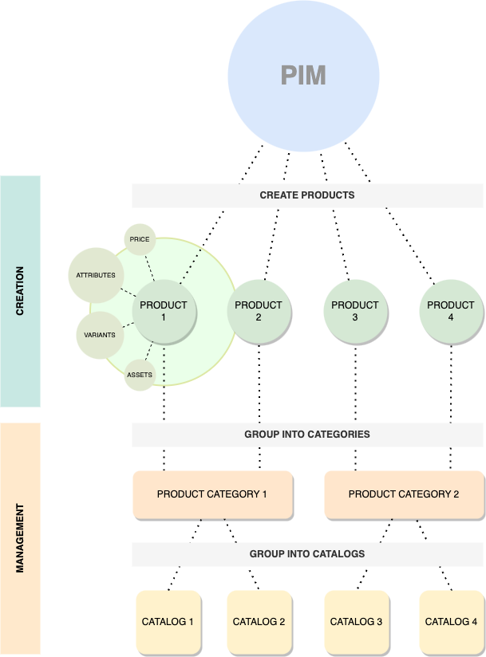
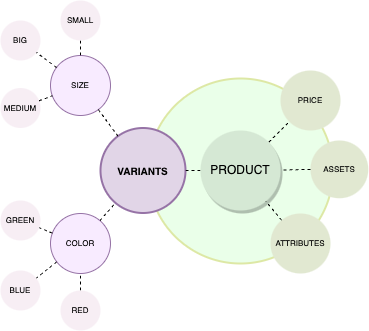
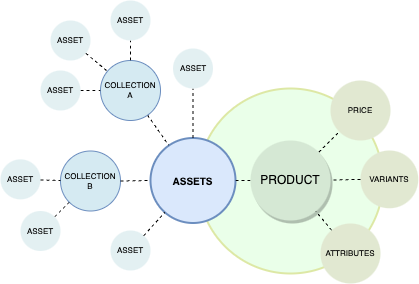
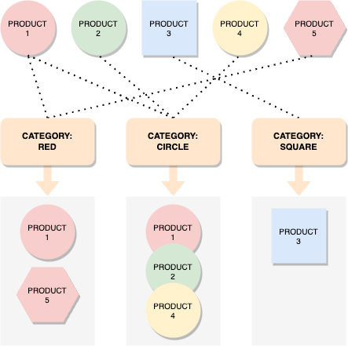
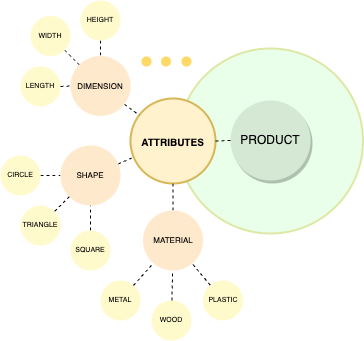
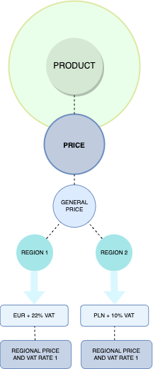
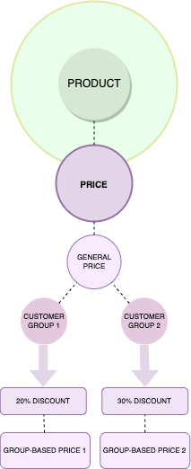
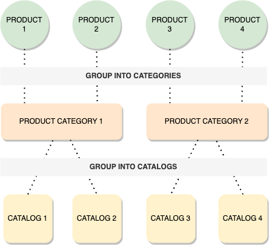
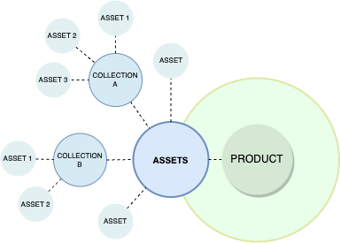

# PIM product guide

## What is PIM

PIM is a Product Information Management module that lets you create, configure and
manage products, their specifications, assets, variants and prices, 
as well as group products into categories and catalogs.

## Availability

PIM is available in all [[= product_name =]] editions.

## How does PIM work

Products in [[= product_name =]]’s PIM have underlying Content items enriched with 
product-specific information such as attributes, assets, prices, and others.

PIM lets you group products into categories and catalogs.

Catalogs are collections of products selected by using configurable filters. 
They are specific to each of your sites or storefronts and only contain 
the products in them that you wish to sell in their associated storefronts.

Catalogs contain a complete list of related products that can be displayed on a store site. You can have as many catalogs as required.

## Capabilities

### Product specifications

Product specifications rely on product attributes. Available attributes are defined per product type.

### Product attributes

Each product has its own, specific attributes. You can describe a product in technical terms, 
define its physical characteristics such as size, color or shape, or functional characteristics 
(for example, for a laptop it could be the operating system, amount of memory or available ports).

Product attributes can belong to one of existing types (numbers, selection, checkout, etc.), 
but you can also [add custom attribute types](create_custom_attribute_type.md).
You can configure selected product attributes to be used as a basis for variants.

[Product attributes](img/product_attributes.png)

### Product variants

One product can have multiple versions, for example, there can be a t-shirt in different colors. 
You can [create variants of products](product_api.md#creating-variants), differing in some characteristics, based on product attributes.

### Product assets

Each product or product variant can have assets in a form of images. 
They can be assigned to the base product or per one or more of its variants. 
For easier management you can create collections - by using them you can group assets that correspond to specific values of attributes. 
Created collection is automatically assigned to the variant or variants that have these attribute values.

### Availability

Product availability defines whether a product is available in the catalog. 
For each product you can [set availability]([[= user_doc =]]/pim/manage_prices_and_stock/#set-product-availability) per variant or per base product.
When a product is available, it can have numerical stock defined, that you can set. 
The stock can also be set to infinite, for example, for digital, downloadable products.
A product can only be ordered when it has either positive stock, or stock set to infinite.

### Product categories

Product categories help you to organize your products within PIM and also create relationships between them. 
Each product can belong to multiple categories of, depending on user’s choice, different or similar character. 
Category can also be assigned to multiple products.

One of the reasons for applying product categories is assisting users in searching for products.
Before you can assign categories to products, you need to [enable product categories]([[= user_doc =]]/pim/work_with_product_categories/#enable-product-categories).

### Currencies

Currencies are used when calculating product price. In the system you can find a list of available currencies,
but you can also create custom ones by providing its code.

### Regions

Each product or product type can have different regional pricing and regional VAT rate.
You can configure regions in [YAML configuration](enable_purchasing_products.md#region-and-currency).

### VAT

For each product you can configure VAT rate. You can set it globally (per SiteAccess) or individually for each product type and product.
To set up different VAT rates for different regions (countries),you need to first configure them in [YAML configuration](enable_purchasing_products.md#vat-rates).

### Base price

For each product or product variant you can set a base price. 
If you use more than one currency, in the product’s page you can see base price per currency.

### Custom price

You can set up different prices depending on customer group or currency. 
Each customer group can have a default price discount that applies to all products. 
For example, you can offer a 10% discount for all products in the catalog to users who belong to the Resellers customer group. 
You can also set different prices for specific products or product variants for different customer groups.

### Product completeness

Created product has its own list of the tasks required for product configuration: 
attributes, assets, content, prices, availability, and so on. 
You can check how complete the configuration is in the product’s view.

When you create or edit a product, under the product name, 
you can see visual indication of what part of product information (tasks) you have completed, and what part is still missing.

### Catalogs

With catalogs you can create product lists for special purposes, for example, for B2B and B2C uses, for retailers and distributors or for different regions. 
Catalogs contain a sub-set of products from the system.

You can copy existing catalogs, for example, to create a variant version of an offer with slightly differing filters. 
You can then modify the copied catalog and save the updated version.

### Catalog filters and custom filter

When you create a new catalog, all products are included in it by default. 
To have a better overview for a specific group of products, you can filter the list by:

- price (Solr or Elasticsearch only)
- product attributes
- product type
- product code
- availability
- product category
- the date when the product was created

Catalog filters let you narrow down the products from the PIM that are available in the given catalog.
Besides, the built-in catalog filters, you can also [create custom ones](create_custom_catalog_filter.md).

## How to get started

To start working with the products, you need to enable purchasing from the catalog. 
For this, the following configuration is required:

- at least one region and one currency added in the shop,
- VAT rates set for the product type,
- at least one price added for the product,
- availability of the product set with positive or infinitive stock.

Next, follow steps from [product management in user documentation]([[= user_doc =]]/persona_paths/manage_products/).

## Benefits

### Product technical and marketing information

Products added in the shop have both technical and marketing information. 
You can see all the attributes, specification and variants in a very detailed way, which helps you to manage and present all the products in the technical way. 
In addition, each product and its variants may have assets in the form of images and a description. 
Products have underlying Content items, which means you can customize the content structure to contain all the marketing information about the product that you need.

### Detailed specification with multiple attribute types

Product attributes help you to create products with detailed, complicated specification. 
Thanks to this, you can create product variants based on multiple product attributes that include different information about a product. 
Additionally, product attributes are collected in groups so they are easier to manage.

### Multiple-level variants

Product variants enable you to have multiple versions of one product, differing in some characteristics. Each product can have more than one variant on one or more levels. It makes it possible to have multiple-level variants of the products complicated in terms of specifications, such as laptops.

### Extensible availability

By default, you can configure products with specific number in stock, or with infinite availability. You can also extend the availability mechanism to cover other use cases, such as pre-orders.

### Regional pricing including regional VAT rates

Each product type can have different regional pricing and regional VAT rate. What is more, you can configure VAT rate globally or set it individually. Thanks to this, the management of the products that can be sold to various markets is easier and more intuitive.

### Customer group-based pricing

You can set up different prices depending on customer group - it means that you can have a default price discount for different customer groups that applies to all the products or specific products or product variants.

### Product taxonomy

The taxonomy mechanism enables creating tags or categories with a tree structure and assign them to a Content item, for example, Products. Thanks to this mechanism product categories can be organized into a Category tree to make it easy for the users to browse and to deliver content appropriate for them.

### Grouping products into catalogs

You can group all the products into smaller catalogs. 
They contain subsets of the whole product list and you can use them to build special catalogs, 
for example, for retailers and distributors or for different regions.

### General and variant-specific assets

Products and product variants can have their image assets. 
You can set up general assets — it means that the product has an asset visible in the main product view. 
Additionally, you can assign assets to product variants and place them in a collection.

