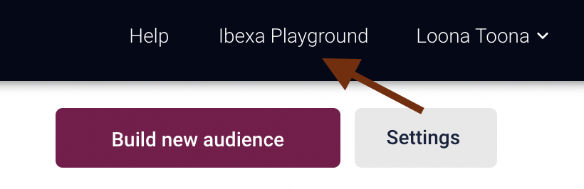
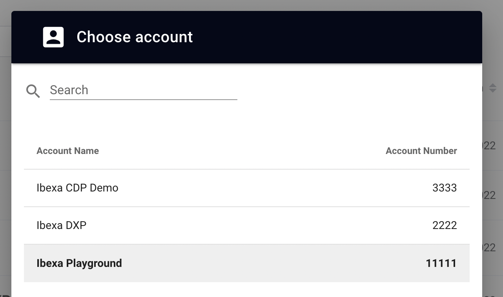
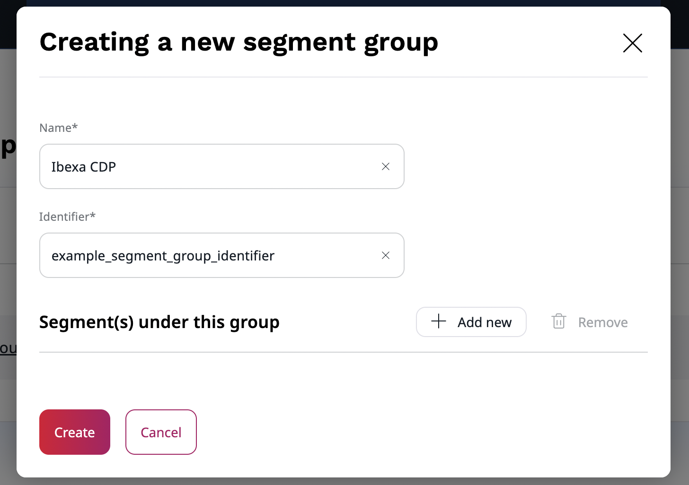

# Configure [[= product_name_cdp =]]

To configure [[= product_name_cdp =]], use the `ibexa.system.<scope>.cdp` [configuration key](configuration.md#configuration-files):

```yaml
ibexa:
    system:
        default:
            cdp:
                account_number: 123456
                data_export:
                    user_data:
                        transport: stream_file
                        stream_file:
                            stream_id: 00000000-00000000-00000000-00000000
                    content_data:
                        transport: stream_file
                        stream_file:
                            stream_id: 00000000-00000000-00000000-00000000
                    product_data:
                        transport: stream_file
                        stream_file:
                            stream_id: 00000000-00000000-00000000-00000000
                activations:
                    -
                        client_id: '%env(CDP_ACTIVATION_CLIENT_ID)%'
                        client_secret: '%env(CDP_ACTIVATION_CLIENT_SECRET)%'
                        segment_group_identifier: example_segment_group_identifier
                membership: # For anonymous user segmentation
                    activation_id: '%env(CDP_MEMBERSHIP_ACTIVATION_ID)%'
                    api_key: '%env(CDP_MEMBERSHIP_API_KEY)%'
                    base_url: 'https://cdp-api.raptorsmartadvisor.com'
                    timeout: 5
```

- `account_number` - a [number](#account-number) obtained from Accounts settings in [[= product_name_cdp =]] dashboard
- `stream_id` - stream ID generated when importing data from the stream file in Data Manage
- `activations` - activation details. You can configure multiple activations. They have to be of type `Ibexa` in [[= product_name =]] dashboard
- `client_id` and `client_secret` - client credentials are used to authenticate against the Webhook endpoint. Make sure they're random and secure
- `segment_group_identifier` - a [location](#segment-group) to which CDP data is imported
- `membership` - configuration that enables support for [anonymous user segmentation](#anonymous-user-segmentation)
- `membership.activation_id` and `membership.api_key` - credentials for the CDP Membership API, required for [anonymous user segmentation](#anonymous-user-segmentation)
- `membership.base_url` - base URL of the CDP Membership API (default: `https://cdp-api.raptorsmartadvisor.com`)
- `membership.timeout` - timeout in seconds for Membership API requests (default: `5`)

## Account number

Now, fill in the account number.
Log in to [[= product_name_cdp =]] and in the top right corner, select available accounts.



A pop-up window displays a list of all available accounts and their numbers.



## Segment group

Create a segment group in the back office.
It serves as a container for all segments data generated by [[= product_name_cdp =]].
Go to **Admin** -> **Segments** and select **Create**.
Fill in name and identifier for a segment group.
Choose wisely, as once connected to CDP segment group cannot be changed.

!!! caution "[[= product_name_cdp =]] segment group"

    After you create the segment group in the back office and connect it to [[= product_name_cdp =]], you cannot change it in any way, including edit its name.



Next, add a segment group identifier to the configuration.

## Anonymous user segmentation

To set up [segmentation for anonymous users](raptor_cdp_guide.md#anonymous-user-segmentation), take the following steps:

### Set up CDP API activation

Create an activation of type "CDP API" in the Raptor dashboard.
For instructions, see [CDP API activations](https://content.raptorservices.com/help-center/cdp/activations/cdp-api) in Raptor documentation.

### Configure website tracking dataflow

Set up a "Website tracking" dataflow with `coid` (cookie ID) as the person identifier so that Raptor can use the tracking data in the CDP.

For more information, see [Website tracking dataflow](https://content.raptorservices.com/help-center/tools/datamanager/introduction-to-the-data-manager) in Raptor documentation.

### Configuration

Add the `membership.activation_id` and `membership.api_key` credentials to your [`ibexa.system.<scope>.cdp` configuration](#configuration), using the credentials for [CDP API activation](#set-up-cdp-api-activation).
To control for how long resolved segment memberships are cached per visitor, use the `ibexa_segmentation.anonymous.cache` configuration key:

```yaml
# config/packages/ibexa_segmentation.yaml
ibexa_segmentation:
    anonymous:
        cache:
            enabled: true            # default; set to false to disable
            ttl: 300                 # cache lifetime in seconds, default 300 (5 minutes)
            pool: 'ibexa.cache_pool' # Symfony cache pool service ID, default ibexa.cache_pool
```

- `enabled` - whether to cache CDP segment results per visitor cookie. Disabling this causes an additional API call to Raptor on every request
- `ttl` - how long resolved segment results are cached per visitor (in seconds)
- `pool` - the Symfony cache pool used to store the results
