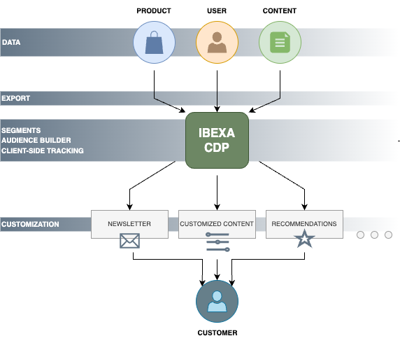
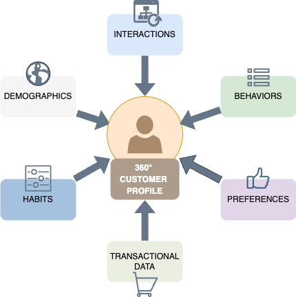
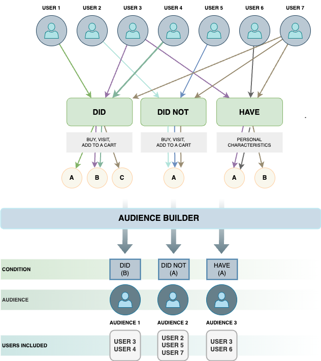

# Raptor CDP (Customer Data Platform) product guide

## What is [[= product_name_cdp =]]

[[= product_name_cdp =]] is a Customer Data Platform module that helps you build unique and memorable experiences for your customers.
By using [[= product_name_cdp =]] you can monitor and compile data about your customers' activity on multiple channels.
It also allows you to create individual customer profiles so you can customize their experience on your platform.

With [[= product_name_cdp =]] you can store and manage large volumes of customer data in a structured manner.
This central data storage supports business growth with a scalable infrastructure, helping to futureproof your business.
You can get customer data from both online and offline data sources.
It includes first, second, and third-party data from multiple sources such as transactional systems, website tracking, and behavior, POS, CRM, and others.

## Availability

[[= product_name_cdp =]] is available in [[= product_name_exp =]] and [[= product_name_com =]] editions.

## How does [[= product_name_cdp =]] work

[[= product_name_cdp =]] unifies customer data throughout your whole organization.
It helps you activate your users and give them real-time interaction.
You can target certain user segments with the appropriate message, content, or products at the right time through the most used channels by using specified audiences.
Customer data is gathered through a system of trackers embedded in various areas of your website.

### Installation and configuration

To start using [[= product_name_cdp =]], first you need to contact your sales representative, who provides you with a link to [register your [[= product_name_cdp =]] account](/raptor_cdp/raptor_cdp_installation.md#register-in-raptor-cdp-dashboard).
When you're done with registration process, you're able to access a separate instance with the data needed to configure, activate, and use this feature.

After your account is created, you can [download and install the [[= product_name_cdp =]] package](/raptor_cdp/raptor_cdp_installation.md#install-cdp-package) that is opt-in and needs to be downloaded separately.
Last step is to go through the [configuration process](raptor_cdp_configuration.md).

### Customer profile

In [[= product_name_cdp =]] you can build 360° customer profiles.
It unifies customer data from different sources to help you understand your prospects and customer needs.
After you get customer data, you can unify and match customer profiles based on their preferences and habits.
You can create and analyze complete, 360° customer profiles based on demographics, interactions, behaviors, and transactional data.
This approach helps you create a single customer view.

### Segment groups

To create a personalized customer experience, you need to group your clients into specified audiences.
[[= product_name =]] comes with a ready solution - segment groups.
Segment group information is reused by various [[= product_name =]] functionalities, such as [Recommendations](raptor_connector_guide.md) or content targeting.

You can [create a segment group](segments_admin_panel.md) in the back office of [[= product_name =]].
It serves as a container for all segments data generated by [[= product_name_cdp =]].
When you create a segment group, you need to provide its name and identifier.
Be careful while doing so, as after you create the segment group in the back office and connect it to [[= product_name_cdp =]], you cannot change it in any way, including edit its name.

Remember to add a segment group identifier to the configuration, under the `segment_group_identifier` field.

## Capabilities

### Data export

Configuration in [[= product_name_cdp =]] allows you to automate the process of exporting content, users, and products.
An `ibexa_cdp.data_export` [configuration key](raptor_cdp_data_export_schedule.md#configuration-key) includes the `schedule` setting where you can find separate sections for exporting user, content, and product.
Structure of each section is exactly the same and includes `interval` and `options` elements:

- `interval` - sets the frequency at which the command is invoked, uses cron expressions, for example, '*/30 * * * *' means "every 30 minutes", '0 */12 * * *' means "every 12th hour"

- `options` - allows you to add arguments that have to be passed to the export command

This configuration allows you to provide multiple export workflows with parameters.
It's important, because all the types of content/product must have their own parameters on the CDP side, where each has a different Stream ID key and different required values configured per data source.

Regarding data export, currently, only Stream File transport is supported and can be initialized from the configuration.

For more information, see [CDP data export](raptor_cdp_data_export.md).

### Data customization

​You can customize content and product data exported to [[= product_name_cdp =]] and control what field type information you want to export.
With [[= product_name_cdp =]], you can export field types and field type values.
They're exported with metadata and attributes, for example, ID, field definition name, type, or value.

For more information, see [data customization](raptor_cdp_data_customization.md#data-customization) documentation in Developer Documentation.

### Client-side Tracking

The final step is setting up a tracking script.
For more information, see [CDP add client-side tracking](raptor_cdp_add_tracking.md) and [Introduction to tracking in Raptor documentation](https://content.raptorservices.com/help-center/introduction-to-tracking-documentation).

### Audience Builder

In the Audience Builder, you can create audiences - groups of users that meet the assumed conditions.
You can choose specific conditions: `did`, `did not`, or `have`.
The conditions `did` and `did not` allow you to use events like buy, visit or add to a cart from online tracking.
The `have` conditions are tied to personal characteristics and can be used to track the sum of all buys or top-visited categories.

You can also connect created audiences to the activations.

### Anonymous user segmentation

[[= product_name_cdp =]] can build audiences for anonymous users, enabling personalised experiences for not logged-in visitors.

When an anonymous visitor accesses your site, Raptor starts building an [anonymous profile](https://content.raptorservices.com/help-center/introduction-to-person-identifiers-and-profile-unification).

You can segment these anonymous profiles into different audiences, exactly as in case of logged-in users, and use this information in [[= product_name =]] to provide personalized experiences.

## Benefits

### Personalized user experience

With [[= product_name_cdp =]] you can build unique and memorable experience for your customers and create individual customer profiles.
By using 360° client profiles, you can connect with the right customer at the right moment, in the right place.
Build extensive customer profiles that include their interactions, habits, and preferences from several touchpoints.

### Segment groups

Provide a personalized customer experience, group your clients into specified audiences, and provide recommendations depending on the user data.
Create segment groups to deliver personalized campaigns to boost engagement and conversion rates.

### Audience Builder

Create user groups - audiences - based on conditions and events.

### Data export

Export data regarding content, users, and products.
Data export includes automatic file mapping.
Analyze customer data, track campaigns, and discover the most effective strategies to boost performance.

### Data customization

Customize data to control what field type information you want to export.

### Real-time action

Deliver relevant interactions in the right place at the right time for optimal results thanks to dynamic, real-time data updates.
Take advantage of event-triggered communications which are aligned with your customers immediate interests.
