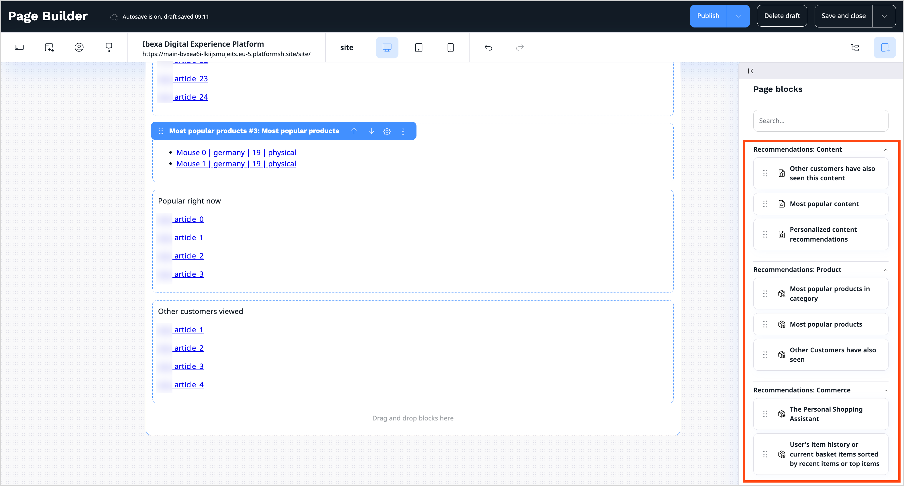
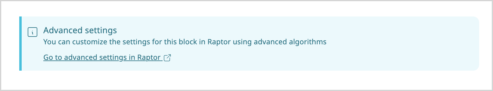

# Recommendation blocks in Page Builder

One of the Raptor Integration elements is the introduction of recommendation blocks available in the [Page Builder](page_builder_guide.md).

Each Content, Product, and Commerce recommendation can be added to a landing page using the blocks.

Editors can configure these blocks to display:

- personalized product recommendations
- related articles or content
- recently viewed or popular items

In the toolbar, corresponding categories for recommendation blocks are available, containing sets of blocks depending on the recommendation type:

- **Recommendations: Content** - presents content recommendations:
    - [Most popular content]([[= user_doc =]]/personalization/raptor_integration/raptor_recommendation_blocks/#most-popular-content-block)
    - [Other customers have also seen this content]([[= user_doc =]]/personalization/raptor_integration/raptor_recommendation_blocks/#other-customers-have-also-seen-this-content-block)
    - [Personalized content recommendations]([[= user_doc =]]/personalization/raptor_integration/raptor_recommendation_blocks/#personalized-content-recommendations-block)
- **Recommendations: Product** - displays product suggestions based on visitors’ browsing history:
    - [Most popular products]([[= user_doc =]]/personalization/raptor_integration/raptor_recommendation_blocks/#most-popular-products-block)
    - [Most popular products in category]([[= user_doc =]]/personalization/raptor_integration/raptor_recommendation_blocks/#most-popular-products-in-category-block)
    - [Other customers have also seen]([[= user_doc =]]/personalization/raptor_integration/raptor_recommendation_blocks/#other-customers-have-also-seen-block)
- **Recommendations: Commerce** - shows recommendations based on visitors' purchase history (buy and basket events):
    - [The Personal Shopping Assistant]([[= user_doc =]]/personalization/raptor_integration/raptor_recommendation_blocks/#the-personal-shopping-assistant-block)
    - [User's item history or current basket items sorted by recent items or top items]([[= user_doc =]]/personalization/raptor_integration/raptor_recommendation_blocks/#users-item-history-or-current-basket-items-sorted-by-recent-items-or-top-items-block)

After opening the settings of a recommendation block, a link is available at the bottom of the window.
It leads to the [Raptor Control Panel](https://controlpanel.raptorsmartadvisor.com/) (opens in a separate tab), where you can configure advanced settings and fine-tune the recommendation strategy.

For a complete description of Recommendation blocks see [Recommendation blocks]([[= user_doc =]]/recommendations/raptor_integration/raptor_recommendation_blocks/).
For the list of all page blocks that are available in Page Builder, see [Block reference page]([[= user_doc =]]/content_management/block_reference/).
