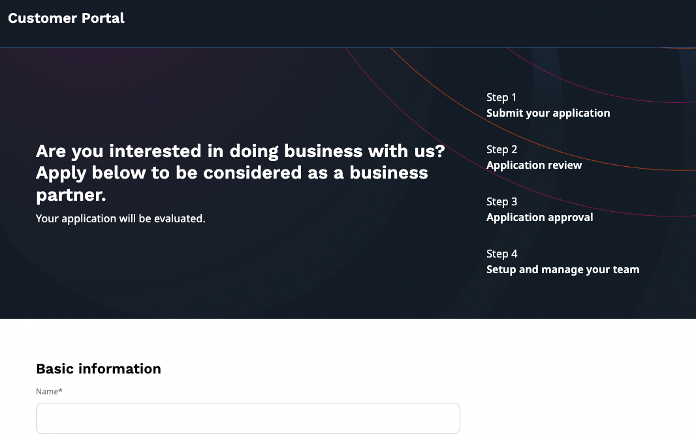
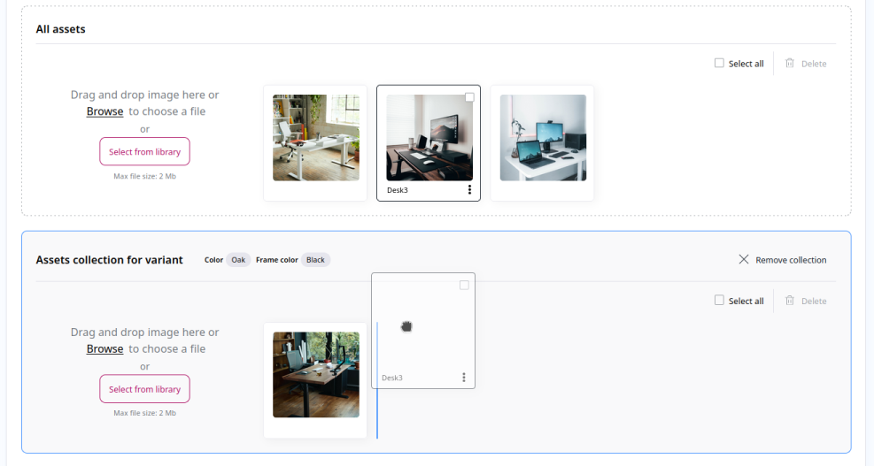
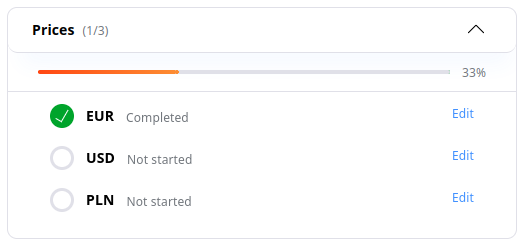

# Ibexa DXP v4.3

**Version number**: v4.3

**Release date**: November 10, 2022

**Release type**: [Fast Track](https://support.ibexa.co/Public/service-life)

**Update**: [v4.2.x to v4.3](https://doc.ibexa.co/en/4.3/update_and_migration/from_4.2/update_from_4.2/)

## Notable changes

### Customer Portal [[% include 'snippets/experience_badge.md' %]] [[% include 'snippets/commerce_badge.md' %]]

#### Company self-registration

Now, a prospective buyer can apply to [create a company account](https://doc.ibexa.co/projects/userguide/en/latest/shop_administration/company_self_registration/) on a seller's website.

The application goes through an approval process
where admin specifies the customer group and sales representative for the new company account.
Finally, the invitation link is sent back to the applicant to finish the registration process
and give them access to the Customer Portal.

For more information, see [Customer Portal applications documentation](cp_applications.md).

#### Customization of approval process

You can now [customize the approval process](cp_applications.md#customization-of-an-approval-process) for company self-registration.
By adding additional steps and options, you can build a process that perfectly meets your business needs.

### SEO configuration exposed

SEO configuration gains a more prominent place on the Content Type editing screen.
For example, to enable SEO, you now have to edit the Content Type that you want to modify, 
scroll down to the SEO section and switch the **Enable SEO for this content type** toggle.

For more information, see [Work with SEO](https://doc.ibexa.co/projects/userguide/en/latest/search_engine_optimization/work_with_seo/).

!!! note

    This change is also implemented in v4.2.

## Other changes

### PIM improvements

#### Price Sort Clauses

When querying for products, you can now use one of two price-related Sort Clauses:

- [`BasePrice` Sort Clause](https://doc.ibexa.co/en/master/search/sort_clause_reference/baseprice_sort_clause/) sorts results by the products' base prices
- [`CustomPrice` Sort Clause](https://doc.ibexa.co/en/master/search/sort_clause_reference/customprice_sort_clause/) enables sorting by the custom price configured for the provided customer group.

#### Usability improvements

This release also includes a number of usability improvements in PIM,
such as full information about available attribute values or improved display of Selection attributes.

You can now move assets between collections by using drag and drop.

From product's Completeness tab you can now jump directly to editing the product prices in all configured currencies.

#### Catalog filters

In catalogs, you can now [configure default filters](https://doc.ibexa.co/en/master/pim/pim_configuration/#catalog-filters) that are always added to a catalog,
as well as define filter order and group custom filters.
Built-in filters are also divided into groups now for easier browsing.

Filtering by the Color attribute is now possible.

#### Integration with recommendation engine

Now, during product creation, edition, or deletion, information about the selected product categories (Taxonomies) is sent to the recommendation engine as an attribute
and can be used for recommendation engine filtering.

### Users

#### New User Content Type

This release brings you a new Content Type for private customers registering from the front page.
We also prepared a migration command for already existing users to ease your upgrade process.
For more information, refer to upgrade documentation.

### API improvements

The catalogs functionality in PIM is now covered in REST API, including:

- [Getting catalog list](https://doc.ibexa.co/en/4.3/api/rest_api/rest_api_reference/rest_api_reference.html#product-catalog-filter-catalogs)
- [Creating, modifying, copying and deleting catalogs](https://doc.ibexa.co/en/4.3/api/rest_api/rest_api_reference/rest_api_reference.html#product-catalog-create-catalog)
- [Changing catalog status](https://doc.ibexa.co/en/4.3/api/rest_api/rest_api_reference/rest_api_reference.html#product-catalog-update-catalog)
- [Getting catalog filters and sorting options](https://doc.ibexa.co/en/4.3/api/rest_api/rest_api_reference/rest_api_reference.html#product-catalog-load-catalog-filters)

### Personalization improvements

Now, as a Personalization admin, after editing a model in the Back Office,
[you can build this model](https://doc.ibexa.co/projects/userguide/en/master/personalization/recommendation_models/#trigger-model-build), use the **Trigger model build** button to build this model with your modifications.

### Taxonomy improvements

Objects of `Ibexa\Contracts\Taxonomy\Value\TaxonomyEntry` type,
which are returned by `TaxonomyService`, now contain the information about nesting level in the tree.

The `TaxonomyEntryId` Search Criterion is not available in Legacy search Engine.

### Other improvements

- You can now [customize Elasticsearch index structure](https://doc.ibexa.co/en/master/search/extensibility/customize_elasticsearch_index_structure/) to manage how documents in the index are grouped.
- A new [`ibexa_seo_is_empty()` Twig function](https://doc.ibexa.co/en/master/templating/twig_function_reference/content_twig_functions/#ibexa_content_name) checks whether SEO data is available for a Content item.

## Full changelog

| Ibexa Content  | Ibexa Experience  | Ibexa Commerce |
|--------------|------------|------------|
| [Ibexa Content v4.3](https://github.com/ibexa/content/releases/tag/v4.3.0) | [Ibexa Experience v4.3](https://github.com/ibexa/experience/releases/tag/v4.3.0) | [Ibexa Commerce v4.3](https://github.com/ibexa/commerce/releases/tag/v4.3.0)|
