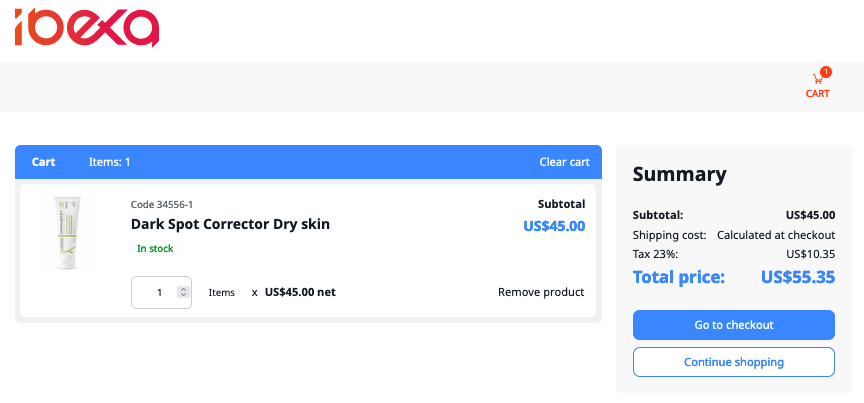

# Ibexa DXP v4.4

**Version number**: v4.4

**Release date**: January 27, 2023

**Release type**: [Fast Track](https://support.ibexa.co/Public/service-life)

**Update**: [v4.3.x to v4.4](https://doc.ibexa.co/en/4.4/update_and_migration/from_4.3/update_from_4.3/)

## Notable changes

### All-new Ibexa Commerce packages

This release deprecates all Commerce packages that you've known from previous releases 
and brings a completely redesigned and reconstructed Commerce offering.

As part of this effort, two all-new components have been created: Cart and Checkout, 
that you can use to build your own e-commerce presence. 
Another addition is the Storefront component that serves as a proof-of-concept 
and a basis for your customization and extension.

For more information, see [Commerce](https://doc.ibexa.co/en/4.4/commerce/commerce/).

### Fastly Image Optimizer (Fastly IO)

You can now use Fastly IO to serve optimized versions of your images in real time and cache them.
Fastly can perform multiple transformations on your image,
for example, cropping, resizing and trimming before serving it to end user.
Fastly is an external service that requires a separate subscription,
to learn more see, [Fastly Image Optimizer website](https://docs.fastly.com/en/guides/about-fastly-image-optimizer).

If you already have Fastly IO subscription, you can move to Fastly IO configuration in Ibexa DXP.

#### Fastly VCL upload

With this release, you can manipulate your Fastly VCL configuration directly from the command line.
For example, you can define formats or source path for images.

### New page blocks

This release introduces new page blocks that rely on Personalization and PIM features 
to let editors visually organize products on a page: 

- [Catalog block](https://doc.ibexa.co/projects/userguide/en/4.4/content_management/block_reference/#catalog-block) displays products from a specific catalog to a selected customer group.
- [Last purchased](https://doc.ibexa.co/projects/userguide/en/4.4/content_management/block_reference/#last-purchased-block) displays a list of products that were recently purchased, either generally, or by a specific user.
- [Last viewed](https://doc.ibexa.co/projects/userguide/en/4.4/content_management/block_reference/#last-viewed-block) displays a list of products that were recently viewed.
- [Product collection](https://doc.ibexa.co/projects/userguide/en/4.4/content_management/block_reference/#product-collection-block) displays a collection of specifically selected products.

## Other changes

### Flysystem v2

We have made significant upgrades to the codebase to rely on Flysystem v2.
Our Flysystem Adapter implementation now supports dynamic paths
described by complex settings resolvable for the SiteAccess context.
For more information, see [Configuring the DFS IO handler](https://doc.ibexa.co/en/latest/infrastructure_and_maintenance/clustering/clustering/#configuring-the-dfs-io-handler).

If your custom project relies directly on a Flysystem features instead of using our IO abstraction,
it will require an upgrade as well,
using [these instructions](https://flysystem.thephpleague.com/docs/upgrade-from-1.x/).

### Dedicated migration type for companies

To simplify data migration, you can now create a company with underling objects such as members group and address book.
You can also extract those objects as references. 
For more information on data migration actions, see [documentation](https://doc.ibexa.co/en/latest/content_management/data_migration/data_migration_actions/#data-migration-actions).

### API improvements

### Deprecations

- Support for overwriting existing files has been dropped (catch block of `\Ibexa\Core\IO\IOBinarydataHandler\Flysystem::create` and test). The new native Flysystem v2 Local Adapter performs this out of the box.
- Support for no last modified timestamp has been dropped (in the form of a test case). The new Flysystem v2 throws `UnableToRetrieveMetadata` exception in such case.

## Full changelog

| Ibexa Content          | Ibexa Experience          | Ibexa Commerce          |
|------------------------|---------------------------|-------------------------|
| [Ibexa Content v4.4]() | [Ibexa Experience v4.4]() | [Ibexa Commerce v4.4]() |
