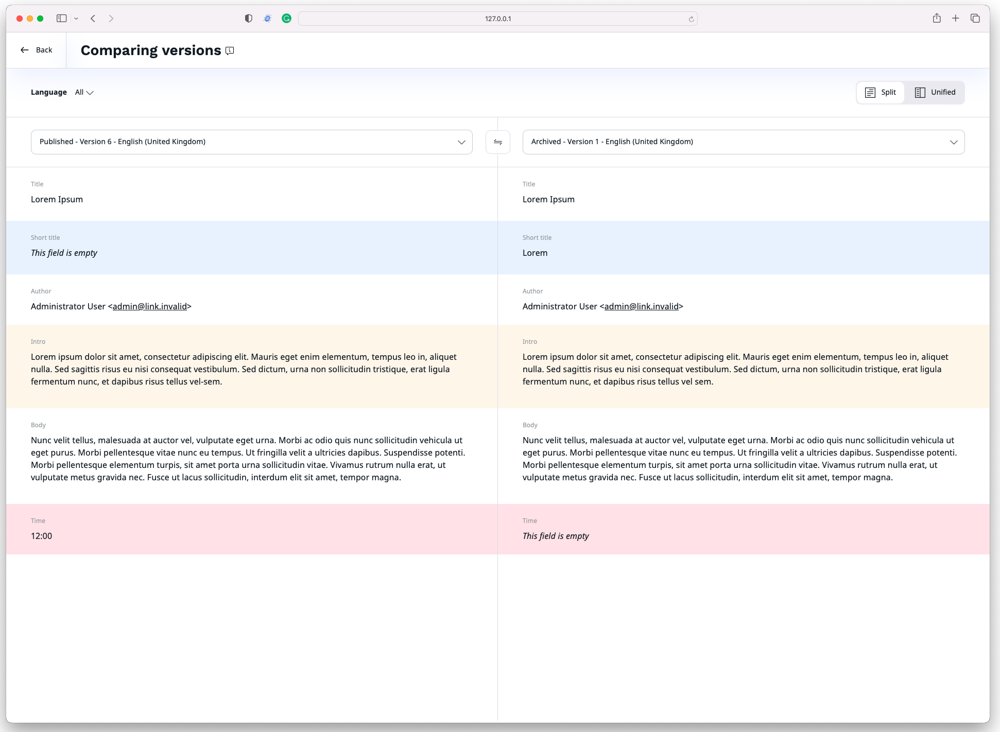
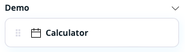

# Ibexa DXP v4.5

**Version number**: v4.5

**Release date**: 

**Release type**: [Fast Track](https://support.ibexa.co/Public/service-life)

**Update**: [v4.4.x to v4.5](https://doc.ibexa.co/en/latest/update_and_migration/from_4.4/update_from_4.4/)

## Notable changes

### Translation comparison

With this release, you can compare different versions of the translations of the Content item, including comparison between different languages. 

You can now choose between two new options of the view:

- Split - default, side by side view to compare versions of the same or different languages
- Unified - single column view to compare versions of the same language

Now, when you compare different versions within the same language, the system highlights the changes using the colors:

- yellow - content updated
- blue - content added
- red - content deleted

For more information, see [Translation comparison](https://doc.ibexa.co/projects/userguide/en/master/content_management/translate_content/#translation-comparison).

### New commerce page blocks [[% include 'snippets/experience_badge.md' %]] [[% include 'snippets/commerce_badge.md' %]]

This release introduces new page blocks:

- [Bestsellers block](https://doc.ibexa.co/projects/userguide/en/4.5/content_management/block_reference/#bestsellers-block) displays a list of products from PIM that were recently a bestseller.

- [React app block](https://doc.ibexa.co/projects/userguide/en/4.5/content_management/pages/#react-app-block) allows an editor to embed a preconfigured React application into a page. React app block requires configuration. For more information, see [React App Block configuration](https://doc.ibexa.co/projects/userguide/en/4.5/content_management/pages/react_app_block/#react-app-block-configuration).

## Other changes

### Customer Data Platform (CDP) configuration
 
In this release, the CDP configuration becomes more generic
and allows us to support other transport types accepted by CDP.
Currently, only `stream_file` transport is supported and can be initialized from the configuration.

Ibexa v4.5 adds the abstraction that allows you to implement other transport types from third parties.
For more information, see [CDP configuration](https://doc.ibexa.co/en/4.5/cdp/cdp_activation/#configuration).

### API improvements

#### REST API for company accounts

This release, adds new endpoints that will allow you to manage companies in your platform with REST API:

- GET  `/corporate/companies/{companyId}/members` - supports filtering, sorting, and pagination
- POST `/corporate/companies/{companyId}/members` - creates new member in a company
- GET `/corporate/companies/{companyId}/members/{memberId}` - loads a member from a company
- DELETE  `/corporate/companies/{companyId}/members/{memberId}` - deletes a member from a company
- PATCH `/corporate/companies/{companyId}/members/{memberId}` - updates member data

#### PHP API for company accounts

To create a company with proper structure and shipping address by using PHP API, we recommend new
`\Ibexa\Contracts\CorporateAccount\Service\CorporateAccountService::createCompany` service instead of
`\Ibexa\Contracts\CorporateAccount\Service\CompanyService::createCompany`.

### Ibexa Connect

For list of changes in Ibexa Connect, see [Ibexa app release notes](https://doc.ibexa.co/projects/connect/en/latest/general/ibexa_app_release_notes/).

### Deprecations

#### `ibexa/admin-ui`

Changes:

- `\Ibexa\PageBuilder\Siteaccess\SiteaccessService::resolveSiteAccessForContent` moved to `\Ibexa\AdminUi\Siteaccess\SiteaccessResolverInterface`

Deprecations:

- `\Ibexa\AdminUi\Siteaccess\SiteaccessResolverInterface::getSiteaccessesForLocation`
  replaced by: `\Ibexa\AdminUi\Siteaccess\SiteaccessResolverInterface::getSiteAccessesList`
- `\Ibexa\AdminUi\Siteaccess\SiteaccessResolverInterface::getSiteaccesses` replaced by `\Ibexa\AdminUi\Siteaccess\SiteaccessResolverInterface::getSiteAccessesListForLocation`

## Full changelog

| Ibexa Content          | Ibexa Experience          | Ibexa Commerce          |
|------------------------|---------------------------|-------------------------|
| [Ibexa Content v4.5]() | [Ibexa Experience v4.5]() | [Ibexa Commerce v4.5]() |
