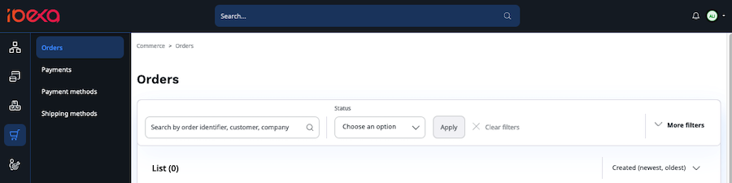
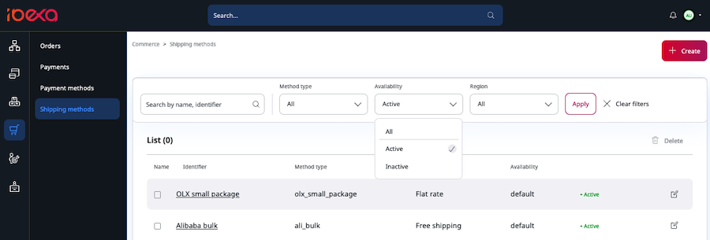
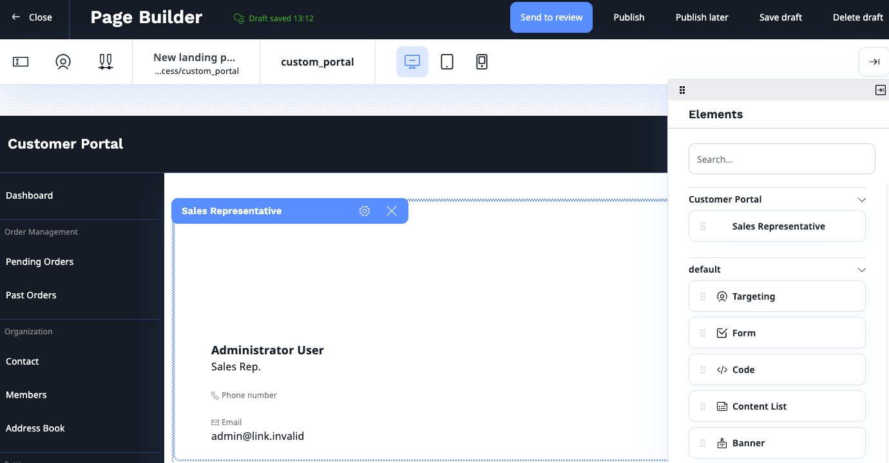
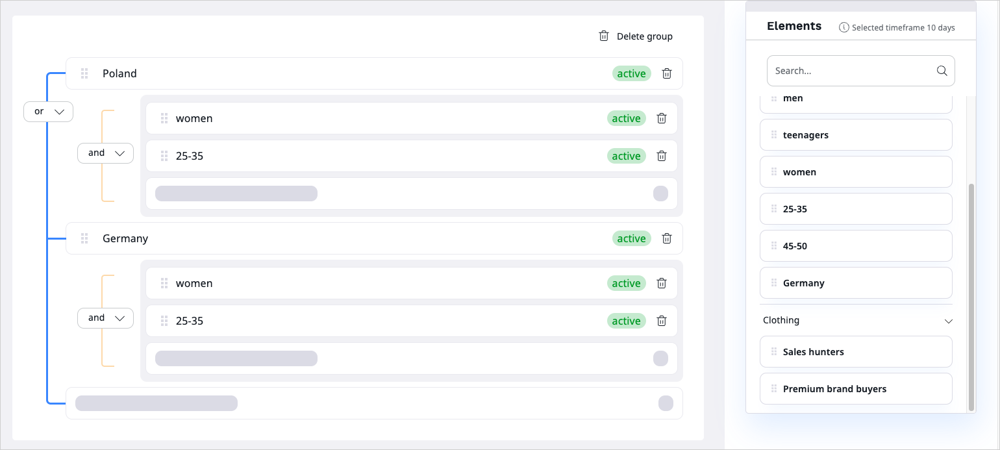
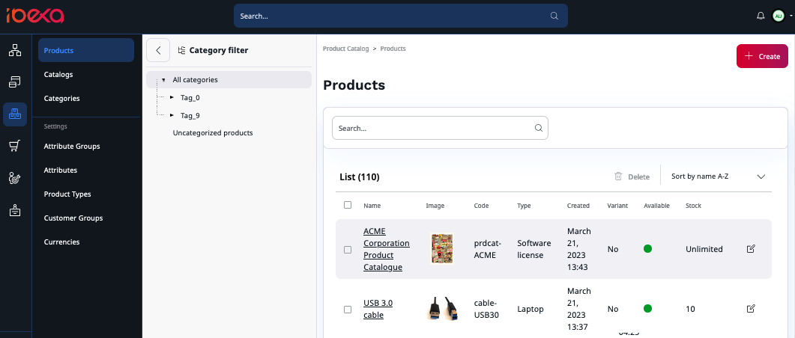

# Ibexa DXP v4.5

**Version number**: v4.5

**Release date**: April 27, 2023

**Release type**: [Fast Track](https://support.ibexa.co/Public/service-life)

**Update**: [v4.4.x to v4.5](https://doc.ibexa.co/en/latest/update_and_migration/from_4.4/update_from_4.4/)

## Notable changes

### All-new Ibexa Commerce packages [[% include 'snippets/commerce_badge.md' %]]

This release brings new packages to complement the redesigned and reconstructed Commerce offering.
You can use them to further enhance your e-commerce presence:

- `ibexa/order-management`
- `ibexa/payment`

Modules can interact with each other, for example, to decrease stock as a result of a sale, or cancel shipments and payments when orders are cancelled, and so on.

#### Order management

With order management in place, users can now search for orders and filter search results. 
They can also review order details and completion status, as well as cancel orders.

#### Payment

With the Payment module, users can define and manage payment methods, as well as create and manage payments, search for payments and filter the results. 
Users can also enable or disable payment methods, modify payment information, and cancel payments.

For more information, see [Commerce](https://doc.ibexa.co/en/4.4/commerce/commerce/).

### Changes to the Checkout package

The Checkout package has been modified by adding shipping management capabilities that let users define and manage shipping methods of different types and their related costs, as well as create and manage shipments, search for shipments and filter search results. 
Users can also enable or disable shipping methods, change status of shipments, and cancel shipments.

### Translation comparison

With this release, you can compare different versions of the translations of the Content item, including comparison between different languages. 

You can now choose between two new options of the view:

- Split - default, side by side view to compare versions of the same or different languages
- Unified - single column view to compare versions of the same language

Now, when you compare different versions within the same language, the system highlights the changes using the colors:

- yellow - content updated
- blue - content added
- red - content deleted

For more information, see [Translation comparison](https://doc.ibexa.co/projects/userguide/en/master/content_management/translate_content/#translation-comparison).

### New commerce page blocks [[% include 'snippets/experience_badge.md' %]] [[% include 'snippets/commerce_badge.md' %]]

This release introduces new page blocks:

- [Bestsellers block](https://doc.ibexa.co/projects/userguide/en/4.5/content_management/block_reference/#bestsellers-block) displays a list of products from PIM that were recently a bestseller.

- [React app block](https://doc.ibexa.co/projects/userguide/en/4.5/content_management/pages/#react-app-block) allows an editor to embed a preconfigured React application into a page. React app block requires configuration. For more information, see [React App Block configuration](https://doc.ibexa.co/projects/userguide/en/4.5/content_management/pages/react_app_block/#react-app-block-configuration).

### Page Builder for B2B portalss [[% include 'snippets/experience_badge.md' %]] [[% include 'snippets/commerce_badge.md' %]]

With this release, you will be able to use Page Builder to create custom Customer Portals for your clients. 
With new Sales rep page block and using all available blocks from original Page Builder, you can create unique experience for each customer group.
Additionally, you can assign each customer group to a specific Customer Portal or create an availability hierarchy based on rules and configuration.

### Personalization improvements

#### New B2B models in Personalization engine

Personalization engine introduces two new types of models: [last clicked and last purchased B2B, and B2B recurring purchase models](https://doc.ibexa.co/projects/userguide/en/master/personalization/recommendation_models/#b2b-model), dedicated to B2B users.
Built on the fly, and based on segment groups models return actual items clicked by user with the same segment ID and actual bought items.
B2B recurring purchase model anticipates and predicts purchase of products that were bought recursively within the same segment ID.

### Segment management

Now you can use segmentation logic with operators to can build complex segment groups which enable precise filtering.
With intuitive drag-and-drop interface, define rules, add logic operators and nest segments in segment 
groups to get the most accurate, precise and targeted recommendations for your customers.

## Other changes

### Customer Data Platform (CDP) configuration
 
In this release, the CDP configuration becomes more generic
and allows us to support other transport types accepted by CDP.
Currently, only `stream_file` transport is supported and can be initialized from the configuration.

Ibexa v4.5 adds the abstraction that allows you to implement other transport types from third parties.
For more information, see [CDP configuration](https://doc.ibexa.co/en/4.5/cdp/cdp_activation/#configuration).

### API improvements

#### REST API for company accounts [[% include 'snippets/experience_badge.md' %]] [[% include 'snippets/commerce_badge.md' %]]

This release, adds new endpoints that will allow you to manage companies in your platform with REST API:

- GET `/corporate/companies` - supports pagination and existing Content Criteria and Sort Clauses but via query parameters
- POST `/corporate/companies` - creates a company by using `CorporateAccount::createCompany` PAPI
- GET `/corporate/companies/{companyId}` - loads a company
- DELETE `/corporate/companies/{companyId}` - deletes a company
- PATCH `/corporate/companies/{companyId}` - updates company data
- GET  `/corporate/companies/{companyId}/members` - supports filtering, sorting, and pagination
- POST `/corporate/companies/{companyId}/members` - creates new member in a company
- GET `/corporate/companies/{companyId}/members/{memberId}` - loads a member from a company
- DELETE  `/corporate/companies/{companyId}/members/{memberId}` - deletes a member from a company
- PATCH `/corporate/companies/{companyId}/members/{memberId}` - updates member data

#### PHP API for company accounts [[% include 'snippets/experience_badge.md' %]] [[% include 'snippets/commerce_badge.md' %]]

To create a company with proper structure and shipping address by using PHP API, we recommend new
`\Ibexa\Contracts\CorporateAccount\Service\CorporateAccountService::createCompany` service instead of
`\Ibexa\Contracts\CorporateAccount\Service\CompanyService::createCompany`.

#### REST API for order management [[% include 'snippets/commerce_badge.md' %]]

This release adds new endpoints that allow you to manage orders by using REST API:

- GET `/orders/orders` - loads a list of orders
- POST `/orders/orders` - creates an order 
- GET `/orders/order` - loads an order by identifier
- GET `/orders/order/{id}` - loads an order
- POST `/orders/orders/{id}` - cancels an order
- PATCH `/orders/orders/{id}` - updates an order

#### PHP API for order management [[% include 'snippets/commerce_badge.md' %]]

The Order Management package provides the `Ibexa\Contracts\OrderManagement\OrderServiceInterface` service, which is the entrypoint for calling the backend API for managing orders.

#### PHP API for shipping methods and shipments [[% include 'snippets/commerce_badge.md' %]]

The Shipping package provides the following services that are entrypoints to the backend API:

- `Ibexa\Contracts\Checkout\ShipmentServiceInterface` for managing shipments 
- `Ibexa\Contracts\Checkout\ShippingMethodServiceInterface` for managing shipment methods 

#### PHP API for payment methods and payments [[% include 'snippets/commerce_badge.md' %]]

The Payment package provides the following services that are entrypoints to the backend API:

- `Ibexa\Contracts\Payment\PaymentServiceInterface` for managing payments
- `Ibexa\Contracts\Payment\PaymentMethodServiceInterface` for managing payment methods

### Category filter in product search

To help users search for products, products in Main Catalog view can now be filtered by product category.

### Product aggregations

Product search now supports aggregations, with the following aggregations available:

- [Product attribute](https://doc.ibexa.co/en/4.5/search/aggregation_reference/product_attribute_aggregations/) - based on product attribute values
- [ProductAvailabilityTerm](https://doc.ibexa.co/en/4.5/search/aggregation_reference/productavailabilityterm_aggregation/) - based on product availability
- [ProductPriceRange](https://doc.ibexa.co/en/4.5/search/aggregation_reference/productpricerange_aggregation/) - based on product price
- [ProductTypeTerm](https://doc.ibexa.co/en/4.5/search/aggregation_reference/producttypeterm_aggregation/) - based on product type

### Ibexa Connect

For list of changes in Ibexa Connect, see [Ibexa app release notes](https://doc.ibexa.co/projects/connect/en/latest/general/ibexa_app_release_notes/).

### Deprecations

#### `ibexa/admin-ui`

Changes:

- `\Ibexa\PageBuilder\Siteaccess\SiteaccessService::resolveSiteAccessForContent` moved to `\Ibexa\AdminUi\Siteaccess\SiteaccessResolverInterface`

Deprecations:

- `\Ibexa\AdminUi\Siteaccess\SiteaccessResolverInterface::getSiteaccessesForLocation`
  replaced by `\Ibexa\AdminUi\Siteaccess\SiteaccessResolverInterface::getSiteAccessesList`
- `\Ibexa\AdminUi\Siteaccess\SiteaccessResolverInterface::getSiteaccesses` replaced by `\Ibexa\AdminUi\Siteaccess\SiteaccessResolverInterface::getSiteAccessesListForLocation`

## Full changelog

| Ibexa Content          | Ibexa Experience          | Ibexa Commerce          |
|------------------------|---------------------------|-------------------------|
| [Ibexa Content v4.5]() | [Ibexa Experience v4.5]() | [Ibexa Commerce v4.5]() |
