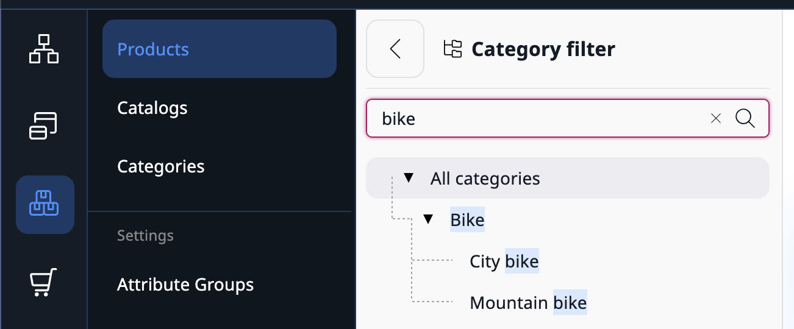

# Ibexa DXP v4.5

**Version number**: v4.5

**Release date**: May 12, 2023

**Release type**: [Fast Track](https://support.ibexa.co/Public/service-life)

**Update**: [v4.4.x to v4.5](https://doc.ibexa.co/en/latest/update_and_migration/from_4.4/update_from_4.4/)

## Notable changes

### All-new Ibexa Commerce packages [[% include 'snippets/commerce_badge.md' %]]

This release brings new packages to complement the redesigned and reconstructed Commerce offering.
You can use them to further enhance your e-commerce presence:

- `ibexa/order-management`
- `ibexa/payment`
- `ibexa/shipping`

Modules can interact with each other, for example, to decrease stock as a result of a sale, or cancel shipments and payments when orders are cancelled, and so on.

#### Order management

With order management in place, it is now possible to create orders, configure and customize the order processing workflow, as well as manage orders by using the APIs. 

New screens added to the Back Office user interface let [[= product_name =]] users search for orders and filter search results. 
Users can also review order details and completion status, as well as cancel orders.

#### Payment

The all-new Payment module brings a possibility of tracking payment progress and defining a custom payment processing workflow. 
New Back Office screens allow users to search for payment methods and payments, as well as define, enable and disable offline payment methods.

Additionally, new APIs are available, which can be used for managing payment methods and payments.

#### Shipping

With the arrival of the Shipping module, it is now possible to define and manage shipping methods of different types, together with their related costs, on a dedicated Back Office screen, as well as configure and customize the shipment workflow.

New APIs enable managing shipping methods and payments, while an extension point can be used to expand the default list of shipping method types. 

For more information, see [Commerce](https://doc.ibexa.co/en/4.5/commerce/commerce/).

### New commerce page blocks [[% include 'snippets/experience_badge.md' %]] [[% include 'snippets/commerce_badge.md' %]]

This release introduces new page blocks:

- [Bestsellers block](https://doc.ibexa.co/projects/userguide/en/4.5/content_management/block_reference/#bestsellers-block) displays a list of products from PIM that were recently a bestseller.

- [React app block](https://doc.ibexa.co/en/4.5/content_management/pages/react_app_block/) allows an editor to embed a preconfigured React application in a page. React app block requires configuration. For more information, see [React App Block configuration](https://doc.ibexa.co/en/4.5/content_management/pages/react_app_block/#react-app-block-configuration).

### Translation comparison

With this release, you can compare different versions of translations of a Content item, including comparison between different languages.

You can now choose between two new options of the view:

- Split - default, side by side view to compare versions of the same or different languages
- Unified - single column view to compare versions of the same language

Now, when you compare different versions within the same language, the system highlights the changes using colors:

- yellow - content updated
- blue - content added
- red - content deleted

For more information, see [Translation comparison](https://doc.ibexa.co/projects/userguide/en/4.5/content_management/translate_content/#translation-comparison).

### Page Builder for B2B portals [[% include 'snippets/experience_badge.md' %]] [[% include 'snippets/commerce_badge.md' %]]

With this release, you will be able to use Page Builder to create custom Customer Portals for your clients.
With new Sales rep page block and using all available blocks from the original Page Builder, you can create a unique experience for each customer group.
Additionally, you can assign each customer group to a specific Customer Portal or create an availability hierarchy based on rules and configuration.

For more information, see [backend configuration](https://doc.ibexa.co/en/4.5/customer_management/cp_page_builder/)
and [user guide](https://doc.ibexa.co/projects/userguide/en/4.5/customer_management/build_customer_portal/) on how to create and edit Customer Portals.

### Personalization improvements

#### New B2B models in Personalization engine

Personalization engine introduces two new types of models: [last clicked and last purchased B2B, and B2B recurring purchase models](https://doc.ibexa.co/projects/userguide/en/4.5/personalization/recommendation_models/#b2b-model), dedicated to B2B users.
Built on the fly, and based on segment groups, the models return actual items clicked by users with the same segment ID and actual bought items.
B2B recurring purchase model anticipates and predicts purchase of products that were bought recursively within the same segment ID.

### Segment management

Now you can use segmentation logic with operators to build complex segment groups which enable precise filtering.
With intuitive drag-and-drop interface, define rules, add logic operators and nest segments in segment 
groups to get the most accurate, precise and targeted recommendations for your customers.

For more information, see [Segment management](https://doc.ibexa.co/projects/userguide/en/4.5/personalization/segment_management/).

## Other changes

### Customer Data Platform (CDP) configuration
 
In this release, the CDP configuration becomes more generic
and allows supporting other transport types accepted by CDP.
Currently, only `stream_file` transport is supported and can be initialized from the configuration.

Ibexa DXP v4.5 adds the abstraction that allows you to implement other transport types from third parties.
For more information, see [CDP configuration](https://doc.ibexa.co/en/4.5/cdp/cdp_activation/#configuration).

### API improvements

#### REST API for company accounts [[% include 'snippets/experience_badge.md' %]] [[% include 'snippets/commerce_badge.md' %]]

This release adds new endpoints that allow you to manage companies in your platform with REST API:

- GET `/corporate/companies` - supports pagination and existing Content Criteria and Sort Clauses but via query parameters
- POST `/corporate/companies` - creates a company
- GET `/corporate/companies/{companyId}` - loads a company
- DELETE `/corporate/companies/{companyId}` - deletes a company
- PATCH `/corporate/companies/{companyId}` - updates company data
- GET  `/corporate/companies/{companyId}/members` - supports filtering, sorting, and pagination
- POST `/corporate/companies/{companyId}/members` - creates new member in a company
- GET `/corporate/companies/{companyId}/members/{memberId}` - loads a member from a company
- DELETE  `/corporate/companies/{companyId}/members/{memberId}` - deletes a member from a company
- PATCH `/corporate/companies/{companyId}/members/{memberId}` - updates member data

#### PHP API for company accounts [[% include 'snippets/experience_badge.md' %]] [[% include 'snippets/commerce_badge.md' %]]

To create a company with proper structure and shipping address by using PHP API, we recommend new
`\Ibexa\Contracts\CorporateAccount\Service\CorporateAccountService::createCompany` service instead of
`\Ibexa\Contracts\CorporateAccount\Service\CompanyService::createCompany`.

#### REST API for order management [[% include 'snippets/commerce_badge.md' %]]

This release adds new endpoints that allow you to manage orders by using REST API:

- GET `/orders/orders` - loads a list of orders
- POST `/orders/orders` - creates an order 
- GET `/orders/order` - loads an order by its identifier
- GET `/orders/order/{id}` - loads an order
- POST `/orders/orders/{id}` - cancels an order
- PATCH `/orders/orders/{id}` - updates an order

#### PHP API for order management [[% include 'snippets/commerce_badge.md' %]]

The Order Management package provides the `Ibexa\Contracts\OrderManagement\OrderServiceInterface` service, which is the entrypoint for calling the backend API for managing orders.

#### PHP API for shipping methods and shipments [[% include 'snippets/commerce_badge.md' %]]

The Checkout package provides the following services that are entrypoints to the backend API:

- `Ibexa\Contracts\Shipping\ShipmentServiceInterface` for managing shipments 
- `Ibexa\Contracts\Shipping\ShippingMethodServiceInterface` for managing shipment methods 

#### PHP API for payment methods and payments [[% include 'snippets/commerce_badge.md' %]]

The Payment package provides the following services that are entrypoints to the backend API:

- `Ibexa\Contracts\Payment\PaymentServiceInterface` for managing payments
- `Ibexa\Contracts\Payment\PaymentMethodServiceInterface` for managing payment methods

### Category filter in product search

To help users search for products, products in the main catalog view can now be filtered by product category.

### Product aggregations

Product search now supports aggregations, with the following aggregations available:

- [Product attribute](https://doc.ibexa.co/en/4.5/search/aggregation_reference/product_attribute_aggregations/) - based on product attribute values
- [ProductAvailabilityTerm](https://doc.ibexa.co/en/4.5/search/aggregation_reference/productavailabilityterm_aggregation/) - based on product availability
- [ProductPriceRange](https://doc.ibexa.co/en/4.5/search/aggregation_reference/productpricerange_aggregation/) - based on product price
- [ProductTypeTerm](https://doc.ibexa.co/en/4.5/search/aggregation_reference/producttypeterm_aggregation/) - based on product type

The new [TaxonomyEntryIdAggregation](https://doc.ibexa.co/en/4.5/search/aggregation_reference/taxonomyentryid_aggregation/) aggregates results based on content taxonomy entries or product categories.

### Password security

You can now enhance password security with a setting that prevents using passwords that have been exposed in a public breach.
To do it, the system checks the password against known password dumps by using the https://haveibeenpwned.com/ API.

See [Breached passwords](https://doc.ibexa.co/en/4.5/users/user_management/#breached-passwords) for more information.

### Ibexa Connect

For list of changes in Ibexa Connect, see [Ibexa app release notes](https://doc.ibexa.co/projects/connect/en/latest/general/ibexa_app_release_notes/).

### Deprecations

#### `ibexa/admin-ui`

Changes:

- `\Ibexa\PageBuilder\Siteaccess\SiteaccessService::resolveSiteAccessForContent` moved to `\Ibexa\AdminUi\Siteaccess\SiteaccessResolverInterface`

Deprecations:

- `\Ibexa\AdminUi\Siteaccess\SiteaccessResolverInterface::getSiteaccessesForLocation`
  replaced by `\Ibexa\AdminUi\Siteaccess\SiteaccessResolverInterface::getSiteAccessesList`
- `\Ibexa\AdminUi\Siteaccess\SiteaccessResolverInterface::getSiteaccesses` replaced by `\Ibexa\AdminUi\Siteaccess\SiteaccessResolverInterface::getSiteAccessesListForLocation`

## Full changelog

| Ibexa Content | Ibexa Experience | Ibexa Commerce|
|---------------|------------------|---------------|
| [Ibexa Content v4.5](https://github.com/ibexa/content/releases/tag/v4.5.0) | [Ibexa Experience v4.5](https://github.com/ibexa/experience/releases/tag/v4.5.0) | [Ibexa Commerce v4.5](https://github.com/ibexa/commerce/releases/tag/v4.5.0) |

## v4.5.1

### Product category tree filter

In the main catalog view, the tree of categories now has a search input to reduce the tree to matching categories.

### Product stock criteria and aggregation

Product search now supports stock availability:

- [ProductStock Criterion](https://doc.ibexa.co/en/4.5/search/criteria_reference/productstock_criterion/) - searches for products with a stock compared to a given number
- [ProductStockRange Criterion](https://doc.ibexa.co/en/4.5/search/criteria_reference/productstockrange_criterion/) - searches for products with a stock in a given range
- [ProductStockRangeAggregation](https://doc.ibexa.co/en/4.5/search/aggregation_reference/productstockrange_aggregation/) - aggregates search results by products' stock ranges

### `X-Expected-User` REST request header

The [`X-Expected-User` header](https://doc.ibexa.co/en/4.5/api/rest_api/rest_api_usage/rest_requests/#expected-user) checks that the REST request is executed with the desired user (and not, for example, the Anonymous user because of an expired authentication).
