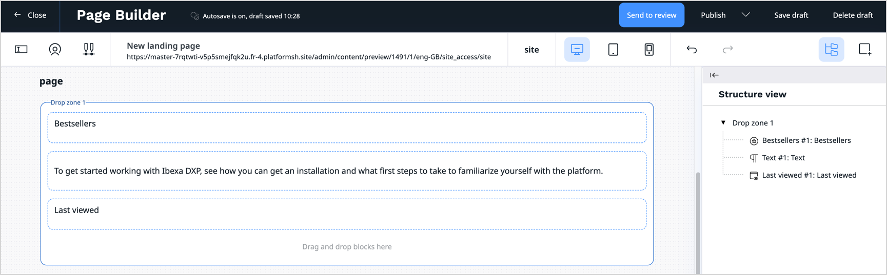
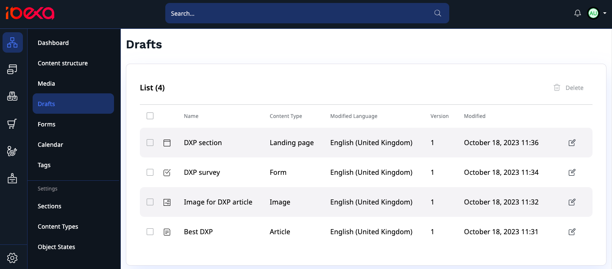
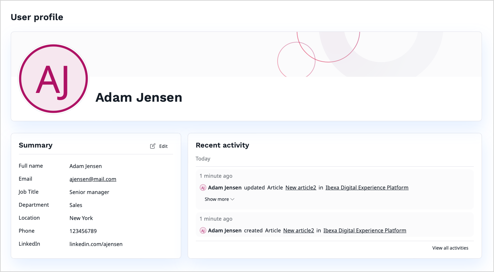
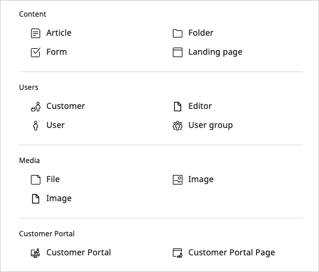
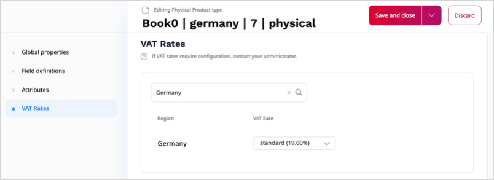

<!-- vale VariablesVersion = NO -->

[[= release_notes_filters('Ibexa DXP v4.6 LTS', ['Headless', 'Experience', 'Commerce', 'LTS Update', 'New feature']) =]]

<div class="release-notes" markdown="1">

[[% set version = 'v4.6.19' %]]
[[= release_note_entry_begin("AI Actions " + version, '2025-04-09', ['LTS Update', 'New feature']) =]]

#### Features

AI Actions can now integrate with [Ibexa Connect]([[= connect_doc =]]), giving you an opportunity to build complex data transformation workflows without having to rely on custom code.
To learn more, see the [setup instructions for this integration](install_ai_actions.md#configure-access-to-ibexa-connect).

[[= release_note_entry_end() =]]

[[% set version = 'v4.6.19' %]]
[[= release_note_entry_begin("Ibexa DXP " + version, '2025-04-09', ['Headless', 'Experience', 'Commerce']) =]]

#### Security

- This release includes security fixes.
To learn more, see the [published security advisory IBEXA-SA-2025-002](https://developers.ibexa.co/security-advisories/ibexa-sa-2025-002-xxe-vulnerability-in-richtext)

#### Features

- The [CartSummary endpoint](https://doc.ibexa.co/en/latest/api/rest_api/rest_api_reference/rest_api_reference.html#managing-commerce-carts-cart-summary) now supports a new `Accept` header: `application/vnd.ibexa.api.ShortCartSummary`, returning only the essential data about products in the cart
- Added a new repository setting: [grace period for archived versions](https://doc.ibexa.co/en/latest/administration/configuration/repository_configuration/#grace-period-for-archived-versions)
- Added a new `group_remote_id` setting for [controlling the user group in which registering users are created](https://doc.ibexa.co/en/latest/users/user_registration/#user-groups)

#### Ibexa Rector

- The [Ibexa Rector package](https://github.com/ibexa/rector/tree/4.6?tab=readme-ov-file#ibexa-dxp-rector) has been released, allowing you to automatically refactor your code and remove deprecations.
To learn how to use it, see the [update instructions](https://doc.ibexa.co/en/latest/update_and_migration/from_4.6/update_from_4.6/#ibexa-rector)

#### PHP API

The PHP API has been enhanced with the following new classes:

- [`Ibexa\Contracts\Connect\Ai\ActionHandlerDataStructureAwareInterface`](https://doc.ibexa.co/en/latest/api/php_api/php_api_reference/classes/Ibexa-Contracts-Connect-Ai-ActionHandlerDataStructureAwareInterface.html)
- [`Ibexa\Contracts\Connect\Resource\CustomPropertyStructure\CustomPropertyStructureCreateStruct`](https://doc.ibexa.co/en/latest/api/php_api/php_api_reference/classes/Ibexa-Contracts-Connect-Resource-CustomPropertyStructure-CustomPropertyStructureCreateStruct.html)
- [`Ibexa\Contracts\Connect\Resource\CustomPropertyStructure\CustomPropertyStructureFilter`](https://doc.ibexa.co/en/latest/api/php_api/php_api_reference/classes/Ibexa-Contracts-Connect-Resource-CustomPropertyStructure-CustomPropertyStructureFilter.html)
- [`Ibexa\Contracts\Connect\Resource\CustomPropertyStructure\CustomPropertyStructureItemCreateStruct`](https://doc.ibexa.co/en/latest/api/php_api/php_api_reference/classes/Ibexa-Contracts-Connect-Resource-CustomPropertyStructure-CustomPropertyStructureItemCreateStruct.html)
- [`Ibexa\Contracts\Connect\Resource\CustomPropertyStructureInterface`](https://doc.ibexa.co/en/latest/api/php_api/php_api_reference/classes/Ibexa-Contracts-Connect-Resource-CustomPropertyStructureInterface.html)
- [`Ibexa\Contracts\Connect\Resource\Scenario\CustomPropertiesDataFillInStruct`](https://doc.ibexa.co/en/latest/api/php_api/php_api_reference/classes/Ibexa-Contracts-Connect-Resource-Scenario-CustomPropertiesDataFillInStruct.html)
- [`Ibexa\Contracts\Connect\Response\CustomPropertyStructure\CreateItemResponse`](https://doc.ibexa.co/en/latest/api/php_api/php_api_reference/classes/Ibexa-Contracts-Connect-Response-CustomPropertyStructure-CreateItemResponse.html)
- [`Ibexa\Contracts\Connect\Response\CustomPropertyStructure\CreateResponse`](https://doc.ibexa.co/en/latest/api/php_api/php_api_reference/classes/Ibexa-Contracts-Connect-Response-CustomPropertyStructure-CreateResponse.html)
- [`Ibexa\Contracts\Connect\Response\CustomPropertyStructure\DeleteItemResponse`](https://doc.ibexa.co/en/latest/api/php_api/php_api_reference/classes/Ibexa-Contracts-Connect-Response-CustomPropertyStructure-DeleteItemResponse.html)
- [`Ibexa\Contracts\Connect\Response\CustomPropertyStructure\ListItemResponse`](https://doc.ibexa.co/en/latest/api/php_api/php_api_reference/classes/Ibexa-Contracts-Connect-Response-CustomPropertyStructure-ListItemResponse.html)
- [`Ibexa\Contracts\Connect\Response\CustomPropertyStructure\ListResponse`](https://doc.ibexa.co/en/latest/api/php_api/php_api_reference/classes/Ibexa-Contracts-Connect-Response-CustomPropertyStructure-ListResponse.html)
- [`Ibexa\Contracts\Connect\Response\CustomPropertyStructure\RetrieveItemResponse`](https://doc.ibexa.co/en/latest/api/php_api/php_api_reference/classes/Ibexa-Contracts-Connect-Response-CustomPropertyStructure-RetrieveItemResponse.html)
- [`Ibexa\Contracts\Connect\Response\CustomPropertyStructure\RetrieveResponse`](https://doc.ibexa.co/en/latest/api/php_api/php_api_reference/classes/Ibexa-Contracts-Connect-Response-CustomPropertyStructure-RetrieveResponse.html)
- [`Ibexa\Contracts\Connect\Response\Scenario\RetrieveCustomPropertiesDataResponse`](https://doc.ibexa.co/en/latest/api/php_api/php_api_reference/classes/Ibexa-Contracts-Connect-Response-Scenario-RetrieveCustomPropertiesDataResponse.html)
- [`Ibexa\Contracts\Core\Repository\Events\Notification\BeforeMarkNotificationAsUnreadEvent`](https://doc.ibexa.co/en/latest/api/php_api/php_api_reference/classes/Ibexa-Contracts-Core-Repository-Events-Notification-BeforeMarkNotificationAsUnreadEvent.html)
- [`Ibexa\Contracts\Core\Repository\Events\Notification\MarkNotificationAsUnreadEvent`](https://doc.ibexa.co/en/latest/api/php_api/php_api_reference/classes/Ibexa-Contracts-Core-Repository-Events-Notification-MarkNotificationAsUnreadEvent.html)
- [`Ibexa\Contracts\ProductCatalog\CustomerGroupAssignedItemsServiceDecorator`](https://doc.ibexa.co/en/latest/api/php_api/php_api_reference/classes/Ibexa-Contracts-ProductCatalog-CustomerGroupAssignedItemsServiceDecorator.html)
- [`Ibexa\Contracts\ProductCatalog\CustomerGroupAssignedItemsServiceInterface`](https://doc.ibexa.co/en/latest/api/php_api/php_api_reference/classes/Ibexa-Contracts-ProductCatalog-CustomerGroupAssignedItemsServiceInterface.html)
- [`Ibexa\Contracts\ProductCatalog\Events\CustomerGroupCanBeDeletedEvent`](https://doc.ibexa.co/en/latest/api/php_api/php_api_reference/classes/Ibexa-Contracts-ProductCatalog-Events-CustomerGroupCanBeDeletedEvent.html)
- [`Ibexa\Contracts\ProductCatalog\Values\CustomerGroup\AssignedItem`](https://doc.ibexa.co/en/latest/api/php_api/php_api_reference/classes/Ibexa-Contracts-ProductCatalog-Values-CustomerGroup-AssignedItem.html)
- [`Ibexa\Contracts\ProductCatalog\Values\CustomerGroup\AssignedItemInterface`](https://doc.ibexa.co/en/latest/api/php_api/php_api_reference/classes/Ibexa-Contracts-ProductCatalog-Values-CustomerGroup-AssignedItemInterface.html)

#### Full changelog
[[% include 'snippets/release_46.md' %]]

[[= release_note_entry_end() =]]

[[% set version = 'v4.6.18' %]]
[[= release_note_entry_begin("Ibexa DXP " + version, '2025-03-06', ['Headless', 'Experience', 'Commerce']) =]]

#### PHP API
The PHP API has been enhanced with the following new classes:

- [`Ibexa\Contracts\ProductCatalog\Form\Data\ProductSelectorData`](../api/php_api/php_api_reference/classes/Ibexa-Contracts-ProductCatalog-Form-Data-ProductSelectorData.html)
- [`Ibexa\Contracts\ProductCatalog\Form\Data\ProductsSelectorData`](../api/php_api/php_api_reference/classes/Ibexa-Contracts-ProductCatalog-Form-Data-ProductsSelectorData.html)
- [`Ibexa\Contracts\ProductCatalog\Form\Type\ProductSelectorType`](../api/php_api/php_api_reference/classes/Ibexa-Contracts-ProductCatalog-Form-Type-ProductSelectorType.html)

#### Full changelog
[[% include 'snippets/release_46.md' %]]

[[= release_note_entry_end() =]]

[[= release_note_entry_begin("Date and time attribute", '2025-03-04', ['Headless', 'Experience', 'Commerce', 'LTS Update', 'New feature']) =]]

The Date and time attributes allow you to represent date and time values as part of the product specification in the [Product Information Management](pim_guide.md) system.

For more information, see [Date and time attributes](date_and_time.md).

[[= release_note_entry_end() =]]

[[% set version = 'v4.6.17' %]]
[[= release_note_entry_begin("AI Actions " + version, '2025-03-04', ['LTS Update', 'New feature']) =]]

#### Features
You can now [duplicate AI actions]([[= user_doc =]]/ai_actions/work_with_ai_actions/#duplicate-ai-actions) in the AI actions list.

#### PHP API

The PHP API has been expanded with the following classes and interfaces:

- [`Ibexa\Contracts\ConnectorAi\ActionConfiguration\ActionConfigurationCopyStruct`](../api/php_api/php_api_reference/classes/Ibexa-Contracts-ConnectorAi-ActionConfiguration-ActionConfigurationCopyStruct.html)
- [`Ibexa\Contracts\ConnectorAi\ActionHandlerRegistryInterface`](../api/php_api/php_api_reference/classes/Ibexa-Contracts-ConnectorAi-ActionHandlerRegistryInterface.html)
- [`Ibexa\Contracts\ConnectorAi\Prompt\PromptFactory`](../api/php_api/php_api_reference/classes/Ibexa-Contracts-ConnectorAi-Prompt-PromptFactory.html)
- [`Ibexa\Contracts\ConnectorAi\Prompt\PromptInterface`](../api/php_api/php_api_reference/classes/Ibexa-Contracts-ConnectorAi-Prompt-PromptInterface.html)
- [`Ibexa\Contracts\ConnectorAi\PromptResolverInterface`](../api/php_api/php_api_reference/classes/Ibexa-Contracts-ConnectorAi-PromptResolverInterface.html)

[[= release_note_entry_end() =]]
[[= release_note_entry_begin("Ibexa DXP " + version, '2025-03-04', ['Headless', 'Experience', 'Commerce', 'New feature']) =]]
#### Security

This release includes security fixes.
To learn more, see the [corresponding security advisory](https://developers.ibexa.co/security-advisories/ibexa-sa-2025-001-vulnerabilities-in-shopping-cart-and-publish-unscheduling).

#### Features

- New REST API endpoints for [Segments](../api/rest_api/rest_api_reference/rest_api_reference.html#segments) and [Segment Groups](../api/rest_api/rest_api_reference/rest_api_reference.html#segment-groups)
- PHP API Client ([`Ibexa\Contracts\Connect\ConnectClientInterface`](../api/php_api/php_api_reference/classes/Ibexa-Contracts-Connect-ConnectClientInterface.html)) for [Ibexa Connect]([[= connect_doc =]])
- The following Twig functions now additionally support objects implementing the [`ContentAwareInterface`](../api/php_api/php_api_reference/classes/Ibexa-Contracts-Core-Repository-Values-Content-ContentAwareInterface.html) as arguments:
    - [`ibexa_content_field_identifier_first_filled_image`](image_twig_functions.md#ibexa_content_field_identifier_first_filled_image)
    - [`ibexa_content_name`](content_twig_functions.md#ibexa_content_name)
    - [`ibexa_field_is_empty`](field_twig_functions.md#ibexa_field_is_empty)
    - [`ibexa_field_description`](field_twig_functions.md#ibexa_field_description)
    - [`ibexa_field_name`](field_twig_functions.md#ibexa_field_name)
    - [`ibexa_field_value`](field_twig_functions.md#ibexa_field_value)
    - [`ibexa_field`](field_twig_functions.md#ibexa_field)
    - [`ibexa_has_field`](field_twig_functions.md#ibexa_has_field)
    - [`ibexa_render_field`](field_twig_functions.md#ibexa_render_field)
    - [`ibexa_seo_is_empty`](content_twig_functions.md#ibexa_seo_is_empty)
    - [`ibexa_seo`](content_twig_functions.md#ibexa_seo)
    - [`ibexa_taxonomy_entries_for_content`](content_twig_functions.md#ibexa_taxonomy_entries_for_content-filter)
- Added new Twig filter for product attributes grouping: [`ibexa_product_catalog_group_attributes`](product_twig_functions.md#ibexa_product_catalog_group_attributes)

#### PHP API

The PHP API has been enhanced with the following new classes and interfaces:

- `Ibexa\Contracts\Cart`:
    - [`Value\Query\Criterion\LogicalAnd`](../api/php_api/php_api_reference/classes/Ibexa-Contracts-Cart-Value-Query-Criterion-LogicalAnd.html)
    - [`Value\Query\Criterion\OwnerCriterion`](../api/php_api/php_api_reference/classes/Ibexa-Contracts-Cart-Value-Query-Criterion-OwnerCriterion.html)
    - [`Value\Query\CriterionInterface`](../api/php_api/php_api_reference/classes/Ibexa-Contracts-Cart-Value-Query-CriterionInterface.html)
- `Ibexa\Contracts\Segmentation`:
    - [`Exception\ValidationFailedExceptionInterface`](../api/php_api/php_api_reference/classes/Ibexa-Contracts-Segmentation-Exception-ValidationFailedExceptionInterface.html)
- `Ibexa\Contracts\ProductCatalog`:
    - [`Iterator\BatchIteratorAdapter\RegionFetchAdapter`](../api/php_api/php_api_reference/classes/Ibexa-Contracts-ProductCatalog-Iterator-BatchIteratorAdapter-RegionFetchAdapter.html)
- `Ibexa\Contracts\Connect`:
    - [`ConnectClientInterface`](../api/php_api/php_api_reference/classes/Ibexa-Contracts-Connect-ConnectClientInterface.html)
    - [`Exception\BadResponseException`](../api/php_api/php_api_reference/classes/Ibexa-Contracts-Connect-Exception-BadResponseException.html)
    - [`Exception\UnserializablePayload`](../api/php_api/php_api_reference/classes/Ibexa-Contracts-Connect-Exception-UnserializablePayload.html)
    - [`Exception\UnserializableResponse`](../api/php_api/php_api_reference/classes/Ibexa-Contracts-Connect-Exception-UnserializableResponse.html)
    - [`PaginationInterface`](../api/php_api/php_api_reference/classes/Ibexa-Contracts-Connect-PaginationInterface.html)
    - [`Resource\DataStructure\DataStructureBuilder`](../api/php_api/php_api_reference/classes/Ibexa-Contracts-Connect-Resource-DataStructure-DataStructureBuilder.html)
    - [`Resource\DataStructure\DataStructureCreateStruct`](../api/php_api/php_api_reference/classes/Ibexa-Contracts-Connect-Resource-DataStructure-DataStructureCreateStruct.html)
    - [`Resource\DataStructure\DataStructureFilter`](../api/php_api/php_api_reference/classes/Ibexa-Contracts-Connect-Resource-DataStructure-DataStructureFilter.html)
    - [`Resource\DataStructure\DataStructureProperty`](../api/php_api/php_api_reference/classes/Ibexa-Contracts-Connect-Resource-DataStructure-DataStructureProperty.html)
    - [`Resource\DataStructure\DataStructurePropertyType`](../api/php_api/php_api_reference/classes/Ibexa-Contracts-Connect-Resource-DataStructure-DataStructurePropertyType.html)
    - [`Resource\DataStructureInterface`](../api/php_api/php_api_reference/classes/Ibexa-Contracts-Connect-Resource-DataStructureInterface.html)
    - [`Resource\Hook\HookCreateStruct`](../api/php_api/php_api_reference/classes/Ibexa-Contracts-Connect-Resource-Hook-HookCreateStruct.html)
    - [`Resource\Hook\HookFilter`](../api/php_api/php_api_reference/classes/Ibexa-Contracts-Connect-Resource-Hook-HookFilter.html)
    - [`Resource\Hook\HookSetDetailsStruct`](../api/php_api/php_api_reference/classes/Ibexa-Contracts-Connect-Resource-Hook-HookSetDetailsStruct.html)
    - [`Resource\HookInterface`](../api/php_api/php_api_reference/classes/Ibexa-Contracts-Connect-Resource-HookInterface.html)
    - [`Resource\Scenario\ScenarioCreateStruct`](../api/php_api/php_api_reference/classes/Ibexa-Contracts-Connect-Resource-Scenario-ScenarioCreateStruct.html)
    - [`Resource\Scenario\ScenarioFilter`](../api/php_api/php_api_reference/classes/Ibexa-Contracts-Connect-Resource-Scenario-ScenarioFilter.html)
    - [`Resource\ScenarioInterface`](../api/php_api/php_api_reference/classes/Ibexa-Contracts-Connect-Resource-ScenarioInterface.html)
    - [`Resource\Team\TeamVariableCreateStruct`](../api/php_api/php_api_reference/classes/Ibexa-Contracts-Connect-Resource-Team-TeamVariableCreateStruct.html)
    - [`Resource\Team\TeamVariableFilter`](../api/php_api/php_api_reference/classes/Ibexa-Contracts-Connect-Resource-Team-TeamVariableFilter.html)
    - [`Resource\Team\TeamVariableUpdateStruct`](../api/php_api/php_api_reference/classes/Ibexa-Contracts-Connect-Resource-Team-TeamVariableUpdateStruct.html)
    - [`Resource\TeamInterface`](../api/php_api/php_api_reference/classes/Ibexa-Contracts-Connect-Resource-TeamInterface.html)
    - [`Resource\Template\TemplateCreateStruct`](../api/php_api/php_api_reference/classes/Ibexa-Contracts-Connect-Resource-Template-TemplateCreateStruct.html)
    - [`Resource\Template\TemplateFilter`](../api/php_api/php_api_reference/classes/Ibexa-Contracts-Connect-Resource-Template-TemplateFilter.html)
    - [`Resource\TemplateInterface`](../api/php_api/php_api_reference/classes/Ibexa-Contracts-Connect-Resource-TemplateInterface.html)
    - [`Response\DataStructure\CreateResponse`](../api/php_api/php_api_reference/classes/Ibexa-Contracts-Connect-Response-DataStructure-CreateResponse.html)
    - [`Response\DataStructure\ListResponse`](../api/php_api/php_api_reference/classes/Ibexa-Contracts-Connect-Response-DataStructure-ListResponse.html)
    - [`Response\DataStructure\RetrieveResponse`](../api/php_api/php_api_reference/classes/Ibexa-Contracts-Connect-Response-DataStructure-RetrieveResponse.html)
    - [`Response\Hook\CreateResponse`](../api/php_api/php_api_reference/classes/Ibexa-Contracts-Connect-Response-Hook-CreateResponse.html)
    - [`Response\Hook\ListResponse`](../api/php_api/php_api_reference/classes/Ibexa-Contracts-Connect-Response-Hook-ListResponse.html)
    - [`Response\Hook\RetrieveResponse`](../api/php_api/php_api_reference/classes/Ibexa-Contracts-Connect-Response-Hook-RetrieveResponse.html)
    - [`Response\Hook\SetDetailsResponse`](../api/php_api/php_api_reference/classes/Ibexa-Contracts-Connect-Response-Hook-SetDetailsResponse.html)
    - [`Response\Scenario\CreateResponse`](../api/php_api/php_api_reference/classes/Ibexa-Contracts-Connect-Response-Scenario-CreateResponse.html)
    - [`Response\Scenario\ListResponse`](../api/php_api/php_api_reference/classes/Ibexa-Contracts-Connect-Response-Scenario-ListResponse.html)
    - [`Response\Scenario\RetrieveResponse`](../api/php_api/php_api_reference/classes/Ibexa-Contracts-Connect-Response-Scenario-RetrieveResponse.html)
    - [`Response\Team\TeamVariableCreateResponse`](../api/php_api/php_api_reference/classes/Ibexa-Contracts-Connect-Response-Team-TeamVariableCreateResponse.html)
    - [`Response\Team\TeamVariableListResponse`](../api/php_api/php_api_reference/classes/Ibexa-Contracts-Connect-Response-Team-TeamVariableListResponse.html)
    - [`Response\Team\TeamVariableRetrieveResponse`](../api/php_api/php_api_reference/classes/Ibexa-Contracts-Connect-Response-Team-TeamVariableRetrieveResponse.html)
    - [`Response\Team\TeamVariableUpdateResponse`](../api/php_api/php_api_reference/classes/Ibexa-Contracts-Connect-Response-Team-TeamVariableUpdateResponse.html)
    - [`Response\Template\BlueprintResponse`](../api/php_api/php_api_reference/classes/Ibexa-Contracts-Connect-Response-Template-BlueprintResponse.html)
    - [`Response\Template\CreateResponse`](../api/php_api/php_api_reference/classes/Ibexa-Contracts-Connect-Response-Template-CreateResponse.html)
    - [`Response\Template\ListResponse`](../api/php_api/php_api_reference/classes/Ibexa-Contracts-Connect-Response-Template-ListResponse.html)
    - [`Response\Template\RetrieveResponse`](../api/php_api/php_api_reference/classes/Ibexa-Contracts-Connect-Response-Template-RetrieveResponse.html)
    - [`ResponseInterface`](../api/php_api/php_api_reference/classes/Ibexa-Contracts-Connect-ResponseInterface.html)
    - [`TransportInterface`](../api/php_api/php_api_reference/classes/Ibexa-Contracts-Connect-TransportInterface.html)
    - [`Value\Blueprint\Flow`](../api/php_api/php_api_reference/classes/Ibexa-Contracts-Connect-Value-Blueprint-Flow.html)
    - [`Value\Blueprint\Metadata\Scenario`](../api/php_api/php_api_reference/classes/Ibexa-Contracts-Connect-Value-Blueprint-Metadata-Scenario.html)
    - [`Value\Blueprint\Metadata`](../api/php_api/php_api_reference/classes/Ibexa-Contracts-Connect-Value-Blueprint-Metadata.html)
    - [`Value\Blueprint\Module\CustomWebhook`](../api/php_api/php_api_reference/classes/Ibexa-Contracts-Connect-Value-Blueprint-Module-CustomWebhook.html)
    - [`Value\Blueprint\Module\JsonCreate`](../api/php_api/php_api_reference/classes/Ibexa-Contracts-Connect-Value-Blueprint-Module-JsonCreate.html)
    - [`Value\Blueprint\Module\ModuleDesigner`](../api/php_api/php_api_reference/classes/Ibexa-Contracts-Connect-Value-Blueprint-Module-ModuleDesigner.html)
    - [`Value\Blueprint\Module\WebhookRespond`](../api/php_api/php_api_reference/classes/Ibexa-Contracts-Connect-Value-Blueprint-Module-WebhookRespond.html)
    - [`Value\Blueprint`](../api/php_api/php_api_reference/classes/Ibexa-Contracts-Connect-Value-Blueprint.html)
    - [`Value\Controller`](../api/php_api/php_api_reference/classes/Ibexa-Contracts-Connect-Value-Controller.html)
    - [`Value\Scheduling`](../api/php_api/php_api_reference/classes/Ibexa-Contracts-Connect-Value-Scheduling.html)

#### Full changelog
[[% include 'snippets/release_46.md' %]]
[[= release_note_entry_end() =]]

[[% set version = 'v4.6.16' %]]
[[= release_note_entry_begin("AI Actions " + version, '2025-01-16', ['LTS Update', 'New feature']) =]]

#### Features

The new AI Assistant allows you to use the AI capabilities in additional places, including RichText, Text line, Text Block fields, and certain Page Builder blocks.

[[= release_note_entry_end() =]]

[[= release_note_entry_begin("Ibexa DXP " + version, '2025-01-16', ['Headless', 'Experience', 'Commerce']) =]]

#### PHP API

The PHP API has been enhanced with the following new classes:

- [`Ibexa\Contracts\AdminUi\Permission\PermissionCheckContextProviderInterface`](../api/php_api/php_api_reference/classes/Ibexa-Contracts-AdminUi-Permission-PermissionCheckContextProviderInterface.html)
- [`Ibexa\Contracts\AdminUi\Values\PermissionCheckContext`](../api/php_api/php_api_reference/classes/Ibexa-Contracts-AdminUi-Values-PermissionCheckContext.html)
- [`Ibexa\Contracts\Checkout\Discounts\DataMapper\DiscountsDataMapperInterface`](../api/php_api/php_api_reference/classes/Ibexa-Contracts-Checkout-Discounts-DataMapper-DiscountsDataMapperInterface.html)
- [`Ibexa\Contracts\Seo\Resolver\FieldValueResolverInterface`](../api/php_api/php_api_reference/classes/Ibexa-Contracts-Seo-Resolver-FieldValueResolverInterface.html)

#### Full changelog
[[% include 'snippets/release_46.md' %]]
[[= release_note_entry_end() =]]

[[% set version = 'v4.6.15' %]]
[[= release_note_entry_begin("AI Actions " + version, '2024-12-13', ['LTS Update', 'New feature']) =]]

#### REST API

The REST API has been extended to include endpoints for:

- [Action Configurations](../api/rest_api/rest_api_reference/rest_api_reference.html#ai-actions-list-action-configurations)
- [Action Types](../api/rest_api/rest_api_reference/rest_api_reference.html#ai-actions-list-action-types)
[[= release_note_entry_end() =]]


[[= release_note_entry_begin("Ibexa DXP " + version, '2024-12-13', ['Headless', 'Experience', 'Commerce', 'New feature']) =]]

### Features

You can now reuse Page Builder blocks between landing pages using the ["Copy block" action]([[= user_doc =]]/content_management/create_edit_pages/#copy-blocks).

#### PHP API
The PHP API has been enhanced with the following new classes and interfaces:

- [`Ibexa\Contracts\ProductCatalog\Values\Price\PriceEnvelopeInterface`](../api/php_api/php_api_reference/classes/Ibexa-Contracts-ProductCatalog-Values-Price-PriceEnvelopeInterface.html)
- [`Ibexa\Contracts\ProductCatalog\Values\Price\PriceStampInterface`](../api/php_api/php_api_reference/classes/Ibexa-Contracts-ProductCatalog-Values-Price-PriceStampInterface.html)
- [`Ibexa\Contracts\ProductCatalog\Values\StampInterface`](../api/php_api/php_api_reference/classes/Ibexa-Contracts-ProductCatalog-Values-StampInterface.html)

#### Full changelog
[[% include 'snippets/release_46.md' %]]
[[= release_note_entry_end() =]]

[[% set version = 'v4.6.14' %]]
[[= release_note_entry_begin("Ibexa DXP " + version, '2024-11-28', ['Headless', 'Experience', 'Commerce']) =]]

#### Security
This release includes security fixes.
To learn more, see the [corresponding security advisory](https://developers.ibexa.co/security-advisories/ibexa-sa-2024-006-vulnerabilities-in-content-name-pattern-commerce-shop-and-varnish-vhost-templates).

#### UX Improvements

- The identifiers for content types and field definitions are now autogenerated based on the provided name
- You can now search in [Trash]([[= user_doc =]]/content_management/content_organization/copy_move_hide_content/#remove-content) by content's name

#### Search

- New search criterion: [IsUserEnabled](isuserenabled_criterion.md)

#### PHP API

The PHP API has been enhanced with the following new classes and interfaces:

- [`Ibexa\Contracts\Core\Validation\AbstractValidationStructWrapper`](../api/php_api/php_api_reference/classes/Ibexa-Contracts-Core-Validation-AbstractValidationStructWrapper.html)
- [`Ibexa\Contracts\Core\Validation\StructValidator`](../api/php_api/php_api_reference/classes/Ibexa-Contracts-Core-Validation-StructValidator.html)
- [`Ibexa\Contracts\Core\Validation\StructWrapperValidator`](../api/php_api/php_api_reference/classes/Ibexa-Contracts-Core-Validation-StructWrapperValidator.html)
- [`Ibexa\Contracts\Core\Validation\ValidationFailedException`](../api/php_api/php_api_reference/classes/Ibexa-Contracts-Core-Validation-ValidationFailedException.html)
- [`Ibexa\Contracts\Core\Validation\ValidationStructWrapperInterface`](../api/php_api/php_api_reference/classes/Ibexa-Contracts-Core-Validation-ValidationStructWrapperInterface.html)
- [`Ibexa\Contracts\Notifications\SystemNotification\SystemMessage`](../api/php_api/php_api_reference/classes/Ibexa-Contracts-Notifications-SystemNotification-SystemMessage.html)
- [`Ibexa\Contracts\Notifications\SystemNotification\SystemNotification`](../api/php_api/php_api_reference/classes/Ibexa-Contracts-Notifications-SystemNotification-SystemNotification.html)
- [`Ibexa\Contracts\Notifications\SystemNotification\SystemNotificationInterface`](../api/php_api/php_api_reference/classes/Ibexa-Contracts-Notifications-SystemNotification-SystemNotificationInterface.html)
- [`Ibexa\Contracts\Notifications\Value\Recipent\UserRecipientInterface`](../api/php_api/php_api_reference/classes/Ibexa-Contracts-Notifications-Value-Recipent-UserRecipientInterface.html)
- [`Ibexa\Contracts\ProductCatalog\ProductReferencesResolverStrategy`](../api/php_api/php_api_reference/classes/Ibexa-Contracts-ProductCatalog-ProductReferencesResolverStrategy.html)
- [`Ibexa\Contracts\ProductCatalog\Values\Product\Query\Criterion\UpdatedAt`](../api/php_api/php_api_reference/classes/Ibexa-Contracts-ProductCatalog-Values-Product-Query-Criterion-UpdatedAt.html)
- [`Ibexa\Contracts\ProductCatalog\Values\Product\Query\Criterion\UpdatedAtRange`](../api/php_api/php_api_reference/classes/Ibexa-Contracts-ProductCatalog-Values-Product-Query-Criterion-UpdatedAtRange.html)

#### Full changelog
[[% include 'snippets/release_46.md' %]]
[[= release_note_entry_end() =]]

[[% set version = 'v4.6.13' %]]
[[= release_note_entry_begin("Ibexa DXP " + version, '2024-10-22', ['Headless', 'Experience', 'Commerce']) =]]

#### PHP API

The PHP API has been enhanced with the following new classes and interfaces:

- [Ibexa\Contracts\CoreSearch\Persistence\CriterionMapper\AbstractCompositeCriterionMapper](../api/php_api/php_api_reference/classes/Ibexa-Contracts-CoreSearch-Persistence-CriterionMapper-AbstractCompositeCriterionMapper.html)
- [Ibexa\Contracts\CoreSearch\Persistence\CriterionMapper\AbstractFieldCriterionMapper](../api/php_api/php_api_reference/classes/Ibexa-Contracts-CoreSearch-Persistence-CriterionMapper-AbstractFieldCriterionMapper.html)
- [Ibexa\Contracts\Rest\Output\Exceptions\AbstractExceptionVisitor](../api/php_api/php_api_reference/classes/Ibexa-Contracts-Rest-Output-Exceptions-AbstractExceptionVisitor.html)
- [Ibexa\Contracts\CoreSearch\Values\Query\CriterionMapper](../api/php_api/php_api_reference/classes/Ibexa-Contracts-CoreSearch-Values-Query-CriterionMapper.html)

#### Full changelog

[[% include 'snippets/release_46.md' %]]
[[= release_note_entry_end() =]]

[[% set version = 'v4.6.12' %]]

[[= release_note_entry_begin("AI Actions", '2024-10-04', ['Headless', 'Experience', 'Commerce', 'LTS Update', 'New feature']) =]]

The AI Actions LTS update enhances the usability and flexibility of [[=product_name=]] v4.6 LTS by harnessing the potential of artificial intelligence to automate time-consuming editorial tasks.
By default, the AI Actions feature can help users with their work in following scenarios:

- Refining text: when editing a content item, users can request that a passage selected in online editor is modified, for example, by adjusting the length of the text, changing its tone, or correcting linguistic errors.
- Generating alternative text: when working with images, users can ask AI to generate alternative text for them, which helps improve accessibility and SEO.


For more information, see [AI Actions product guide](ai_actions_guide.md).

[[= release_note_entry_end() =]]


[[= release_note_entry_begin("Ibexa DXP " + version, '2024-10-04', ['Headless', 'Experience', 'Commerce']) =]]

#### PHP API

The PHP API has been enhanced with the following new classes and interfaces:

- [Ibexa\Contracts\AdminUi\Menu\AbstractFormContextMenuBuilder](../api/php_api/php_api_reference/classes/Ibexa-Contracts-AdminUi-Menu-AbstractFormContextMenuBuilder.html)
- [Ibexa\Contracts\AdminUi\Menu\CopyFormContextMenuBuilder](../api/php_api/php_api_reference/classes/Ibexa-Contracts-AdminUi-Menu-CopyFormContextMenuBuilder.html)
- [Ibexa\Contracts\AdminUi\Menu\CreateFormContextMenuBuilder](../api/php_api/php_api_reference/classes/Ibexa-Contracts-AdminUi-Menu-CreateFormContextMenuBuilder.html)
- [Ibexa\Contracts\AdminUi\Menu\MenuItemFactoryInterface](../api/php_api/php_api_reference/classes/Ibexa-Contracts-AdminUi-Menu-MenuItemFactoryInterface.html)
- [Ibexa\Contracts\AdminUi\Menu\UpdateFormContextMenuBuilder](../api/php_api/php_api_reference/classes/Ibexa-Contracts-AdminUi-Menu-UpdateFormContextMenuBuilder.html)
- [Ibexa\Contracts\Core\Pool\Pool](../api/php_api/php_api_reference/classes/Ibexa-Contracts-Core-Pool-Pool.html)
- [Ibexa\Contracts\Core\Pool\PoolInterface](../api/php_api/php_api_reference/classes/Ibexa-Contracts-Core-Pool-PoolInterface.html)
- [Ibexa\Contracts\CoreSearch\Values\Query\AbstractCriterionQuery](../api/php_api/php_api_reference/classes/Ibexa-Contracts-CoreSearch-Values-Query-AbstractCriterionQuery.html)
- [Ibexa\Contracts\CoreSearch\Values\Query\AbstractSortClause](../api/php_api/php_api_reference/classes/Ibexa-Contracts-CoreSearch-Values-Query-AbstractSortClause.html)
- [Ibexa\Contracts\CoreSearch\Values\Query\Criterion\AbstractCompositeCriterion](../api/php_api/php_api_reference/classes/Ibexa-Contracts-CoreSearch-Values-Query-Criterion-AbstractCompositeCriterion.html)
- [Ibexa\Contracts\CoreSearch\Values\Query\Criterion\CriterionInterface](../api/php_api/php_api_reference/classes/Ibexa-Contracts-CoreSearch-Values-Query-Criterion-CriterionInterface.html)
- [Ibexa\Contracts\CoreSearch\Values\Query\Criterion\FieldValueCriterion](../api/php_api/php_api_reference/classes/Ibexa-Contracts-CoreSearch-Values-Query-Criterion-FieldValueCriterion.html)
- [Ibexa\Contracts\CoreSearch\Values\Query\Criterion\LogicalAnd](../api/php_api/php_api_reference/classes/Ibexa-Contracts-CoreSearch-Values-Query-Criterion-LogicalAnd.html)
- [Ibexa\Contracts\CoreSearch\Values\Query\Criterion\LogicalOr](../api/php_api/php_api_reference/classes/Ibexa-Contracts-CoreSearch-Values-Query-Criterion-LogicalOr.html)
- [Ibexa\Contracts\CoreSearch\Values\Query\CriterionMapper](../api/php_api/php_api_reference/classes/Ibexa-Contracts-CoreSearch-Values-Query-CriterionMapper.html)
- [Ibexa\Contracts\CoreSearch\Values\Query\CriterionMapperInterface](../api/php_api/php_api_reference/classes/Ibexa-Contracts-CoreSearch-Values-Query-CriterionMapperInterface.html)
- [Ibexa\Contracts\CoreSearch\Values\Query\SortClause\FieldValueSortClause](../api/php_api/php_api_reference/classes/Ibexa-Contracts-CoreSearch-Values-Query-SortClause-FieldValueSortClause.html)
- [Ibexa\Contracts\CoreSearch\Values\Query\SortDirection](../api/php_api/php_api_reference/classes/Ibexa-Contracts-CoreSearch-Values-Query-SortDirection.html)
- [Ibexa\Contracts\ProductCatalog\Local\Attribute\ContextAwareValueValidatorInterface](../api/php_api/php_api_reference/classes/Ibexa-Contracts-ProductCatalog-Local-Attribute-ContextAwareValueValidatorInterface.html)

#### Full changelog

[[% include 'snippets/release_46.md' %]]
[[= release_note_entry_end() =]]

[[% set version = 'v4.6.11' %]]
[[= release_note_entry_begin("Ibexa DXP " + version, '2024-09-16', ['Headless', 'Experience', 'Commerce']) =]]

#### Search
- New search criterion: [IsBookmarked](isbookmarked_criterion.md)

#### PHP API
The PHP API has been enhanced with the following new classes and interfaces:

- [`Ibexa\Contracts\Core\Repository\Values\Content\Query\Criterion\Location\IsBookmarked`](../api/php_api/php_api_reference/classes/Ibexa-Contracts-Core-Repository-Values-Content-Query-Criterion-Location-IsBookmarked.html)

And the new methods are:

- [`Ibexa\Contracts\Core\Persistence\Bookmark\Handler::loadUserIdsByLocation()`](../api/php_api/php_api_reference/classes/Ibexa-Contracts-Core-Persistence-Bookmark-Handler.html#method_loadUserIdsByLocation)
- [`Ibexa\Contracts\ProductCatalog\Local\LocalProductTypeServiceDecorator::addContentTypeFieldDefinition()`](../api/php_api/php_api_reference/classes/Ibexa-Contracts-ProductCatalog-Local-LocalProductTypeServiceDecorator.html#method_addContentTypeFieldDefinition)
- [`Ibexa\Contracts\ProductCatalog\Local\LocalProductTypeServiceDecorator::removeContentTypeFieldDefinition()`](../api/php_api/php_api_reference/classes/Ibexa-Contracts-ProductCatalog-Local-LocalProductTypeServiceDecorator.html#method_removeContentTypeFieldDefinition)
- [`Ibexa\Contracts\ProductCatalog\Local\LocalProductTypeServiceInterface::addContentTypeFieldDefinition()`](../api/php_api/php_api_reference/classes/Ibexa-Contracts-ProductCatalog-Local-LocalProductTypeServiceInterface.html#methods)
- [`Ibexa\Contracts\ProductCatalog\Local\LocalProductTypeServiceInterface::removeContentTypeFieldDefinition()`](../api/php_api/php_api_reference/classes/Ibexa-Contracts-ProductCatalog-Local-LocalProductTypeServiceInterface.html#method_removeContentTypeFieldDefinition)

[[% include 'snippets/release_46.md' %]]
[[= release_note_entry_end() =]]

[[% set version = 'v4.6.10' %]]
[[= release_note_entry_begin("Ibexa DXP " + version, '2024-08-14', ['Headless', 'Experience', 'Commerce']) =]]
#### Security

This release includes security fixes.
To learn more, see the [corresponding security advisory](https://developers.ibexa.co/security-advisories/ibexa-sa-2024-005-persistent-xss-in-richtext).

[[% include 'snippets/release_46.md' %]]
[[= release_note_entry_end() =]]

[[% set version = 'v4.6.9' %]]
[[= release_note_entry_begin("Ibexa DXP " + version, '2024-07-31', ['Headless', 'Experience', 'Commerce']) =]]
#### Security

This release includes security fixes.
To learn more, see the [corresponding security advisory](https://developers.ibexa.co/security-advisories/ibexa-sa-2024-004-dom-based-xss-in-file-upload).

#### PHP API

The PHP API has been enhanced with the following new classes and interfaces:

- [`Ibexa\Contracts\ConnectorQualifio\Exception\QualifioException`](../api/php_api/php_api_reference/classes/Ibexa-Contracts-ConnectorQualifio-Exception-QualifioException.html)
- [`Ibexa\Contracts\ConnectorQualifio\Exception\CampaignFeedNotFoundException`](../api/php_api/php_api_reference/classes/Ibexa-Contracts-ConnectorQualifio-Exception-CampaignFeedNotFoundException.html)
- [`Ibexa\Contracts\ConnectorQualifio\Exception\CommunicationException`](../api/php_api/php_api_reference/classes/Ibexa-Contracts-ConnectorQualifio-Exception-CommunicationException.html)
- [`Ibexa\Contracts\ConnectorQualifio\Exception\NotConfiguredException`](../api/php_api/php_api_reference/classes/Ibexa-Contracts-ConnectorQualifio-Exception-NotConfiguredException.html)

[[% include 'snippets/release_46.md' %]]
[[= release_note_entry_end() =]]

[[% set version = 'v4.6.8' %]]
[[= release_note_entry_begin("Ibexa DXP " + version, '2024-07-11', ['Headless', 'Experience', 'Commerce']) =]]

#### PHP API

The PHP API has been enhanced with the following new class:

- [`Ibexa\Contracts\FieldTypeRichText\Configuration\ProviderConfiguratorInterface`](../api/php_api/php_api_reference/classes/Ibexa-Contracts-FieldTypeRichText-Configuration-ProviderConfiguratorInterface.html)

#### Full changelog

[[% include 'snippets/release_46.md' %]]
[[= release_note_entry_end() =]]

[[% set version = 'v4.6.7' %]]
[[= release_note_entry_begin("Ibexa DXP " + version, '2024-06-10', ['Headless', 'Experience', 'Commerce']) =]]

#### PHP API

The PHP API has been enhanced with the following new classes:

-  [`Ibexa\Contracts\Calendar\EventAction\EventActionCollection`](../api/php_api/php_api_reference/classes/Ibexa-Contracts-Calendar-EventAction-EventActionCollection.html)
- [`Ibexa\Contracts\Calendar\EventSource\InMemoryEventSource`](../api/php_api/php_api_reference/classes/Ibexa-Contracts-Calendar-EventSource-InMemoryEventSource.html)
- [`Ibexa\Contracts\Core\Event\Mapper\ResolveMissingFieldEvent`](../api/php_api/php_api_reference/classes/Ibexa-Contracts-Core-Event-Mapper-ResolveMissingFieldEvent.html)
- [`Ibexa\Contracts\Core\FieldType\DefaultDataFieldStorage`](../api/php_api/php_api_reference/classes/Ibexa-Contracts-Core-FieldType-DefaultDataFieldStorage.html)

#### Full changelog

[[% include 'snippets/release_46.md' %]]
[[= release_note_entry_end() =]]

[[% set version = 'v4.6.6' %]]
[[= release_note_entry_begin("Ibexa DXP " + version, '2024-05-17', ['Headless', 'Experience', 'Commerce']) =]]
[[% include 'snippets/release_46.md' %]]
[[= release_note_entry_end() =]]

[[% set version = 'v4.6.5' %]]
[[= release_note_entry_begin("Ibexa DXP " + version, '2024-05-14', ['Headless', 'Experience', 'Commerce']) =]]
[[% include 'snippets/release_46.md' %]]
[[= release_note_entry_end() =]]

[[% set version = 'v4.6.4' %]]
[[= release_note_entry_begin("Ibexa DXP " + version, '2024-05-13', ['Headless', 'Experience', 'Commerce', 'New feature']) =]]
#### Security

This release includes security fixes.
To learn more, see the [corresponding security advisory](https://developers.ibexa.co/security-advisories/ibexa-sa-2024-003-vulnerability-in-image-optimizer-dependency).

### Ibexa Engage

[Ibexa Engage](ibexa_engage.md) is a data collection tool you can use to engage your audiences.

#### Full changelog

[[% include 'snippets/release_46.md' %]]
[[= release_note_entry_end() =]]

[[% set version = 'v4.6.3' %]]
[[= release_note_entry_begin("Ibexa DXP " + version, '2024-04-11', ['Headless', 'Experience', 'Commerce']) =]]
[[% include 'snippets/release_46.md' %]]
[[= release_note_entry_end() =]]

[[% set version = 'v4.6.2' %]]
[[= release_note_entry_begin("Ibexa DXP " + version, '2024-03-20', ['Headless', 'Experience', 'Commerce']) =]]

#### Security

This release includes security fixes.
To learn more, see the [corresponding security advisory](https://developers.ibexa.co/security-advisories/ibexa-sa-2024-002-file-validation-and-workflow-stages).

#### Full changelog

[[% include 'snippets/release_46.md' %]]
[[= release_note_entry_end() =]]

[[% set version = 'v4.6.1' %]]
[[= release_note_entry_begin("Ibexa DXP " + version, '2024-02-28', ['Headless', 'Experience', 'Commerce']) =]]
[[% include 'snippets/release_46.md' %]]
[[= release_note_entry_end() =]]

[[% set version = 'v4.6.0' %]]
[[= release_note_entry_begin("Ibexa DXP " + version, '2024-02-13', ['Headless', 'Experience', 'Commerce', 'New feature']) =]]

### Notable changes

#### [[= product_name_headless =]]

[[= product_name_content =]] changes name to [[= product_name_headless =]] to emphasize [[= product_name_base =]]'s capacity for headless architecture.

The feature set and capabilities of the product remain the same.

#### Customizable dashboard [[% include 'snippets/experience_badge.md' %]] [[% include 'snippets/commerce_badge.md' %]]

Users can now customize the dashboard depending on their needs and preferences, select required blocks, and easily access important information.
This solution uses an online editor - Dashboard Builder.
It improves productivity, allows to enhance the default dashboard with additional widgets,
and helps to make better business decisions based on data.


For more information, see [Customizable dashboard](https://doc.ibexa.co/projects/userguide/en/master/getting_started/dashboard/dashboard/#customizable-dashboard).

#### UX and UI improvements

Several improvements to the back office interface enhance the user experience.

##### Page Builder improvements [[% include 'snippets/experience_badge.md' %]] [[% include 'snippets/commerce_badge.md' %]]

Page Builder user interface has new functionalities and improvements.

Here are the most important changes:

- new design of Page Builder interface, including block settings window,
- two main toolboxes: **Elements** and **Structure view**,
- quick preview of a structure of the page with the possibility of reorganizing the blocks,
- new visual feedback indicates the correct drop locations,
- intuitive dragging makes it easier for users to interact with the Page Builder,
- new actions added in the block settings toolbox,
- user can now adjust the size of the block settings window,
- **Undo** and **Redo** buttons.



For more information, see [Page Builder interface](https://doc.ibexa.co/projects/userguide/en/master/content_management/create_edit_pages/#page-builder-interface).

##### Editing embedded content items

User can now edit embedded content items without leaving current window.
This function is available in the Rich Text Field when creating content items, for selected blocks in the Page Builder,
and while adding or modifying a Content relation.


For more information, see [Edit embedded content items](https://doc.ibexa.co/projects/userguide/en/master/content_management/create_edit_content_items/#edit-embedded-content-items).

##### Focus mode

With multiple changes to the back office UI intended to expose the most important information and actions, editors can now better focus on their work.
The UI is now more friendly and appealing for marketers and editors, with simplified Content structure, designed with new and non-advanced users in mind.

For more information, see [Focus mode](https://doc.ibexa.co/projects/userguide/en/latest/getting_started/discover_ui/#focus-mode).


As part of this effort, some other changes were introduced that apply to both regular and Focus mode:

- In content item details view, tabs have been reordered by their relevance
- **Authors** and **Sub-items** are now separate tabs in content item details view
- Former **Details** tab is now called **Technical details** and changed its position
- Preview is available in many new places, such as the **View** tab in content item details view, or as miniatures when you hover over the content tree
- `ibexa_is_focus_mode_on` and `ibexa_is_focus_mode_off` Twig helpers have been introduced, which check whether focus mode is enabled or not.


##### Ability to change site context

With a drop-down list added to the top bar, which changes the site context, editors can choose that the content tree shows only those content items that belong to the selected website.
And if content items belong to multiple websites but use different designs or languages depending on the SiteAccess settings, their previews also change.

As part of this effort, the name of the "Sites" area of the main menu has changed to "Site management".


##### Distraction free mode

While editing Rich Text Fields, user can switch to distraction free mode.
It expands the workspace to full screen and shows only editor toolbar.


For more information, see [Distraction free mode](https://doc.ibexa.co/projects/userguide/en/master/content_management/create_edit_content_items/#distraction-free-mode).

##### Simplified user actions

Button text now precisely describes actions, so that users who create or edit content understand the purpose of each button.


##### Draft section added to Content

For streamlining purpose, the **Draft** section is now situated under **Content**.
Users can now easily find and manage their drafts and published content from one area.



##### User profile and new options in user settings

With personal touch in mind, editors can now upload their photos (avatar), and provide the following information in their user profiles:

- Email
- Department
- Position
- Location
- Signature
- Roles the user is assigned to
- Recent activity



Also, editors and other users can customize their experience even better, with new preferences that have been added to user settings.

For more information, see [user profile and settings documentation](https://doc.ibexa.co/projects/userguide/en/master/getting_started/get_started/#edit-user-profile).

##### Recent activity log

Several actions on the repository or the application are logged.
In the back office, last activity logs can be listed on a dedicated interface (Admin -> Activity list),
on the dashboard within Recent activity block, or on the user profile.


For more information, see feature's [User Documentation](https://doc.ibexa.co/projects/userguide/en/master/recent_activity/recent_activity/), and [Developer Documentation](https://doc.ibexa.co/en/master/administration/recent_activity/recent_activity/).

##### Back office search

###### Search bar, suggestions, autocompletion, and spellcheck

The search bar can be focused with the shortcut Ctrl+/ (Windows, Linux) or Command+/ (Mac).

While typing text in the bar, autocompletion suggestions is made under the bar itself.
If a relevant suggestion occurs, it can be clicked, or navigated too with up/down keys then selected with Enter, and the content is be directly opened.

In the search result page, a spellcheck suggestion can be made.
For example, if the searched text is "Comany", the result page may ask "Did you mean company?", which is clickable to relaunch the search with this word.

For more information, see [User Documentation](https://doc.ibexa.co/projects/userguide/en/master/search/search_for_content/), and how to [customize autocompletion suggestions](https://doc.ibexa.co/en/master/administration/back_office/customize_search_suggestion/).

###### Filtering and sorting

The search result page can be sorted in other orders than relevance. Name, publication of modification dates, this can be extended.

Filters can be applied to the search page to narrow down the results.

For more information, see [User Documentation](https://doc.ibexa.co/projects/userguide/en/master/search/search_for_content/#filtered-search), and how to [customize search sorting](https://doc.ibexa.co/en/master/administration/back_office/customize_search_sorting/).

##### New and updated content type icons

To help users quickly identify different content types in the back office, all content type references are now accompanied with icons.
Also, content type icons have changed slightly.



#### Ibexa Image picker

Editors can now use a Digital Asset Management platform that enables storing media assets in a central location, organizing, distributing, and sharing them across many channels.

For more information, see [Ibexa DAM](https://doc.ibexa.co/projects/userguide/en/master/dam/ibexa_dam/).

#### New features and improvements in PIM

##### Remote PIM support

This release introduces a foundation for connecting [[= product_name =]] to other sources of product data.
You can use it to implement a custom solution and connect to external PIM or ERP systems, import product data, and present it side-by-side with your organization's existing content, while managing product data in a remote system of your choice.

Here are the most important benefits of Remote PIM support:

- Integration with external data sources: your organization can utilize [[= product_name =]]'s features, without having to migrate data to a new environment.
- Increased accessibility of product information: customers and users can access product data through different channels, including [[= product_name =]].
- Centralized product data management: product information can be maintained and edited in one place, which then serves as a single source of truth for different applications.

Among other things, the Remote PIM support feature allows [[= product_name =]] customers to:

- let their users purchase products by following a regular or quick order path,
- manage certain aspects of product data,
- define and use product types,
- use product attributes for filtering,
- build product catalogs based on certain criteria, such as type, availability, or product attributes,
- use Customer Groups to apply different prices to products,
- define and use currencies.

For more information about Remote PIM support and the solution's limitations, see [PIM product guide](https://doc.ibexa.co/en/master/pim/pim_guide/#limitations).

##### Virtual products

With this feature, you can create virtual products - non-tangible items such as memberships, services, warranties.
Default Checkout and Order workflows have been adjusted to allow purchase of virtual products.

For more information, see [Create virtual products](https://doc.ibexa.co/projects/userguide/en/master/pim/create_virtual_product/).

##### Product page URLs

When you're creating a new product type, you can set up a product URL alias name pattern.
With this feature, you can also create custom URL and URL alias name pattern field based on product attributes.
Customized URLs are easier to remember, help with SEO optimization and reduce bounce rates on the website.

For more information, see [Product page URLs](https://doc.ibexa.co/projects/userguide/en/master/pim/work_with_product_page_urls/).

##### Improved UX of VAT rate assignment

Users who are creating or editing a product type are less likely to forget about setting VAT rates, because they now have a more prominent place.



For more information, see [Create product types](https://doc.ibexa.co/projects/userguide/en/master/pim/create_product_types/).

##### Updated VAT configuration

VAT rates configuration has been extended to accept additional flags under the `extras` key.
Developers can use them, for example, to pass additional information to the UI, or define special exclusion rules.

For more information, see [VAT rates](https://doc.ibexa.co/en/master/pim/pim_configuration/#vat-rates).

##### Ability to search through products in a catalog

When you're reviewing catalog details, on the **Products** tab, you can now see what criteria are used to include products in the catalog, and search for a specific product in the catalog.

##### New Twig functions

The `ibexa_is_pim_local` Twig helper has been introduced, which can be used in templates to [check whether product data comes from a local or remote data source](https://doc.ibexa.co/en/master/templating/twig_function_reference/storefront_twig_functions/#ibexa_is_pim_local), and adjust their behavior accordingly.
Also, several new Twig functions have been implemented that help [get product availability information](https://doc.ibexa.co/en/master/templating/twig_function_reference/product_twig_functions/#ibexa_has_product_availability).

##### New and modified query types

The `ProductContentAwareListQueryType` has been created to allow finding products that come from a local database, while `ProductListQueryType` has been modified to find products from an external source of truth.

##### New Search Criterion

With `IsVirtual` criterion that searches for virtual or physical products, product search now supports products of virtual and physical type.

##### Product migration

[Product variants](https://doc.ibexa.co/en/master/content_management/data_migration/importing_data/#product-variants) and [product assets](https://doc.ibexa.co/en/master/content_management/data_migration/importing_data/#product-assets) can now be created through [data migration](https://doc.ibexa.co/en/master/content_management/data_migration/data_migration/).

####  New features and improvements in Commerce [[% include 'snippets/commerce_badge.md' %]]

##### Reorder

With the new Reorder feature, customers can effortlessly repurchase previously bought items
directly from their order history with a single click, eliminating the need for manual item selection.
The system streamlines the process by recreating the cart, retrieving shipping information, and pre-filling payment details from past orders.
This feature is exclusively accessible to logged-in users, ensuring a secure and personalized shopping experience.

For more information, see [reorder documentation](https://doc.ibexa.co/en/master/commerce/checkout/reorder/).

##### Orders block

Orders block displays a list of orders associated with a specific company or an individual customer.
This block allows users to configure orders statuses, columns, number of orders, and sorting order.

For more information, see [Orders block documentation](https://doc.ibexa.co/projects/userguide/en/master/content_management/block_reference/#orders-block).

##### Quick order

The quick order form allows users to streamline the process of placing orders
with multiple items in bulk directly from the storefront.
Customers don't need to browse through products in the catalog.
They can fill in a provided form with products' code and quantity,
or upload their own list directly into the system.
Quick order form is available to both registered and guest users.


For more information, see [Quick order documentation](https://doc.ibexa.co/en/master/commerce/cart/quick_order/).

##### Cancel order

This version allows you to customize order cancellations by defining a specific order status and related transition.

For more information, see [Define cancel order](https://doc.ibexa.co/en/master/commerce/order_management/configure_order_management/#define-cancel-order).

##### Integrate with payment gateways

[[= product_name =]] can now be configured to integrate with various payment gateways, like Stripe and PayPal, by using the solution provided by [Payum](https://github.com/Payum).

##### Shipments

Users can now work with the shipments: view and modify their status, filter shipments in shipment lists and check all the details.
You can access shipments for your own orders or all the shipments that exist in the system, depending on your permissions.


For more information, see [Work with shipments](https://doc.ibexa.co/projects/userguide/en/master/commerce/shipping_management/work_with_shipments/).

##### Owner criterion

Orders and shipments search now supports user reference:

- `OwnerCriterion` Criterion searches for orders based on the user reference.
- `Owner` Criterion searches for shipments based on the user reference.

##### Customize checkout workflow

You can create a PHP definition of the new strategy that allows for workflow manipulation.
Defining strategy allows to add conditional steps for workflow if needed.
When a conditional step is added, the checkout process uses the specified workflow and proceeds to the defined step.

For more information, see [Create custom strategy](https://doc.ibexa.co/en/master/commerce/checkout/customize_checkout/#create-custom-strategy).

##### Manage multiple checkout workflows

When working with multiple checkout workflows, you can now specify the desired workflow by passing its name as an argument to the checkout initiation button or link.

For more information, see [Manage multiple workflows](https://doc.ibexa.co/en/master/commerce/checkout/customize_checkout/#manage-multiple-workflows).

##### Adding context data to cart

Attach context data to both the Cart and its individual Cart Entries.
This feature enhances the flexibility and customization of your e-commerce application,
enabling you to associate additional information with your cart and its contents.
By leveraging context data, such as promo codes or custom texts,
you can tailor the shopping experience for your customers and enhance the capabilities of your application.

For more information, see [Adding context data](https://doc.ibexa.co/en/master/commerce/cart/cart_api/#adding-context-data).

#### New features and improvements in Personalization

##### Triggers

Triggers are push messages delivered to end users.
With triggers, store managers can increase the engagement of their visitors and customers by delivering recommendations straight to their devices or mailboxes.
While they experience improved fulfillment of their needs, more engaged customers mean bigger income for the store.
The feature requires that your organization exposes an endpoint that passes data to an internal message delivery system and supports the following use cases:

- Inducing a purchase by pushing a message with cart contents or equivalents, when the customer's cart status remains unchanged for a set time.

- Inviting a customer to come back to the site by pushing a message with recommendations, when they haven't returned to the site for a set time.

- Reviving the customer's interest by pushing a message with products that are similar to the ones the customer has already seen.

- Inducing a purchase by pushing a message when a price of the product from the customer's wishlist decreases.

For more information, see [Email triggers](https://doc.ibexa.co/projects/userguide/en/master/personalization/triggers/).

##### Multiple attributes in recommendation computation

With this feature, you get an option to combine several attribute types when computing recommendations.
As a result, users can be presented with recommendations from an intersection of submodel results.

For more information, see [Submodel parameters](https://doc.ibexa.co/en/master/personalization/api_reference/recommendation_api/#submodel-parameters) and [Submodels](https://doc.ibexa.co/projects/userguide/en/latest/personalization/recommendation_models/#submodels).

##### New scenario filter

Depending on a setting that you make when defining a scenario, the recommendation response can now include either product variants or base products only.
This way you can deliver more accurate recommendations and avoid showing multiple variants of the same product to the client.

For more information, see [Commerce-specific filters](https://doc.ibexa.co/projects/userguide/en/latest/personalization/filters/#commerce-specific-filters).

### Other changes

#### Expression Language

New `project_dir()` expression language function that allows you to reference current project directory in YAML migration files.

#### Site Factory events

Site Factory events have been moved from the `Ibexa\SiteFactory\ServiceEvent\Events` namespace to the `Ibexa\Contracts\SiteFactory\Events` namespace, keeping the backward compatibility.
For a full list of events, see [Site events](https://doc.ibexa.co/en/latest/api/event_reference/site_events/).

Event handling system was improved with the addition of listeners based on `CreateSiteEvent`, `DeleteSiteEvent`, and `UpdateSiteEvent`.
New listeners automatically grant permissions to log in to a site, providing a more seamless site management experience.

#### Integration with Actito

By using the Actito gateway you can send emails to the end-users about changes in the status of various operations in your commerce presence.

#### Integration with Qualifio Engage

Use Qualifio Engage integration to create engaging marketing experiences to your customers.

#### Integration with SeenThis!

Unlike conventional streaming services, integration with SeenThis! service provides an adaptive streaming technology with no limitations.
It allows you to preserve the best video quality with a minimum amount of data transfer.

For more information, see [SeenThis! block](https://doc.ibexa.co/projects/userguide/en/master/content_management/block_reference/#seenthis-block).

#### API improvements

##### REST API

###### REST API for shipping [[% include 'snippets/commerce_badge.md' %]]

Endpoints that allow you to manage shipping methods and shipments by using REST API:

- GET `/shipments` -  loads a list of shipments
- GET `/shipments/{identifier}` - loads a single shipment based on its identifier
- PATCH `/shipments/{identifier}` - updates a shipment
- GET `/shipping/methods` - loads shipping methods
- GET `/shipping/methods/{identifier}` - loads shipping methods based on their identifiers
- GET `/shipping/method-types` - loads shipping methods types
- GET `/shipping/method-types/{identifier}` - loads shipping methods type based on their identifiers
- GET `/orders/order/{identifier}/shipments` - loads a list of shipments

###### REST API for company accounts [[% include 'snippets/experience_badge.md' %]] [[% include 'snippets/commerce_badge.md' %]]

Endpoints that allow you to manage companies in your platform with REST API:

- GET `/sales-representatives` - returns paginated list of available sales representatives

###### REST API for prices

Endpoints that allow you to manage prices in your platform with REST API:

- GET `/product/catalog/products/{code}/prices` -  loads a list of product prices
- GET `/product/catalog/products/{code}/prices/{currencyCode}` - loads a list of product prices for a given currency
- GET `/product/catalog/products/{code}/prices/{currencyCode}/customer-group/{identifier}` - loads a list of product prices for a given currency and customer group
- POST `/product/catalog/products/{code}/prices` - creates price or custom price for a given product
- PATCH `/product/catalog/products/{code}/prices/{id}` - updates price or custom price for a given product
- DELETE `/product/catalog/products/{code}/prices/{id}` - deletes price for a given product

###### New method signature

A signature for the `\Ibexa\Contracts\Rest\Output\Generator::startValueElement` method has been updated to the following:

```php
    /**
     * @phpstan-param scalar $value
     * @phpstan-param array<string, scalar> $attributes
     */
    abstract public function startValueElement(string $name, $value, array $attributes = []): void;
```

Any third party code that extends `\Ibexa\Contracts\Rest\Output\Generator` needs to update the method signature accordingly.

#### Helpers

A new helper method `ibexa.helpers.contentType.getContentTypeDataByHref` has been introduced to help you get content type data in JavaScript.

#### [[= product_name_connect =]]

For a list of changes in [[= product_name_connect =]], see [Ibexa app release notes]([[= connect_doc =]]/general/ibexa_app_release_notes/).

##### Scenario block

New [[= product_name_connect =]] scenario block retrieves and displays data from an [[= product_name_connect =]] webhook.
Scenario block is a regular Page block and can be configured on field definition level as any other block.
You also need to configure scenario block in the Page Builder. To do it, you need to provide name for the block, enter webhook link for the [[= product_name_connect =]] webhook and select the template to be used to present the webhook.

For more information, see [[[= product_name_connect =]] scenario block](https://doc.ibexa.co/en/master/content_management/pages/ibexa_connect_scenario_block/).

#### DDEV

[[[= product_name =]] can officially be run on DDEV](https://ddev.readthedocs.io/en/latest/users/quickstart/#ibexa-dxp).

For more information, see the [DDEV guide](https://doc.ibexa.co/en/master/getting_started/install_with_ddev/), which offers a step-by-step walkthrough for installing [[= product_name =]].

#### Customer Data Platform (CDP)

In this release, the CDP configuration allows you to automate the process of exporting data.
Users can now export not only Content, but also Users and Products data.

For more information, see [CDP Activation](https://doc.ibexa.co/en/master/cdp/cdp_activation/cdp_activation/).

### Developer experience

#### New packages 

The following packages has been introduced in [[= product_name =]] v4.6.0:

- [ibexa/oauth2-server](oauth_server.md) (optional)
- ibexa/site-context
- ibexa/activity-log
- ibexa/notifications
- ibexa/dashboard
- ibexa/connector-seenthis (optional)
- ibexa/connector-actito (optional)
- ibexa/connector-qualifio (optional)
- ibexa/connector-payum
- ibexa/image-picker
- ibexa/core-persistence
- ibexa/corporate-account-commerce-bridge

!!! note

    The ibexa/content package has been renamed to ibexa/headless.

#### REST APIs

[[= product_name =]] v4.6.0 adds REST API coverage for the following features:

- Price engine
- Shipping
- Corporate accounts
- Activity Log
- UDW configuration (internal)

##### Endpoints list

The following endpoints have been added in 4.6.0 release (27 endpoints in total):

| Endpoint                                                               | Functions |     |     | Parameters                                                                                                          |
|-:----------------------------------------------------------------------|-:---------|-:---|-:---|-:-------------------------------------------------------------------------------------------------------------------|
| `ibexa.activity_log.rest.activity_log.list`                              | GET/POST  | ANY | ANY | `/api/ibexa/v2/activity-log/list`                                                                                     |
| `ibexa.udw.location.data`                                                | GET       | ANY | ANY | `/api/ibexa/v2/module/universal-discovery/location/{locationId}`                                                      |
| `ibexa.udw.location.gridview.data`                                       | GET       | ANY | ANY | `/api/ibexa/v2/module/universal-discovery/location/{locationId}/gridview`                                             |
| `ibexa.udw.locations.data`                                               | GET       | ANY | ANY | `/api/ibexa/v2/module/universal-discovery/locations`                                                                  |
| `ibexa.udw.accordion.data`                                               | GET       | ANY | ANY | `/api/ibexa/v2/module/universal-discovery/accordion/{locationId}`                                                     |
| `ibexa.udw.accordion.gridview.data`                                      | GET       | ANY | ANY | `/api/ibexa/v2/module/universal-discovery/accordion/{locationId}/gridview`                                            |
| `ibexa.rest.application_config`                                          | GET       | ANY | ANY | `/api/ibexa/v2/application-config`                                                                                    |
| `ibexa.cart.authorize`                                                   | POST      | ANY | ANY | `/api/ibexa/v2/cart/authorize`                                                                                        |
| `ibexa.rest.corporate_account.sales_representatives.get`                 | GET       | ANY | ANY | `/api/ibexa/v2/corporate/sales-representatives`                                                                       |
| `ibexa.product_catalog.rest.prices.create`                               | POST      | ANY | ANY | `/api/ibexa/v2/product/catalog/products/{productCode}/prices`                                                         |
| `ibexa.product_catalog.rest.prices.list`                                 | GET       | ANY | ANY | `/api/ibexa/v2/product/catalog/products/{productCode}/prices`                                                        |
| `ibexa.product_catalog.rest.prices.get.custom_price`                     | GET       | ANY | ANY | `/api/ibexa/v2/product/catalog/products/{productCode}/prices/{currencyCode}/customer-group/{customerGroupIdentifier}` |
| `ibexa.product_catalog.rest.prices.get.base_price`                       | GET       | ANY | ANY | `/api/ibexa/v2/product/catalog/products/{productCode}/prices/{currencyCode}`                                          |
| `ibexa.product_catalog.rest.prices.update`                               | PATCH     | ANY | ANY | `/api/ibexa/v2/product/catalog/products/{productCode}/prices/{id}`                                                    |
| `ibexa.product_catalog.rest.prices.delete`                               | DELETE    | ANY | ANY | `/api/ibexa/v2/product/catalog/products/{productCode}/prices/{id}`                                                    |
| `ibexa.product_catalog.personalization.rest.product_variant.get_by_code` | GET       | ANY | ANY | `/api/ibexa/v2/personalization/v1/product_variant/code/{code}`                                                        |
| `ibexa.product_catalog.personalization.rest.product_variant_list`        | GET       | ANY | ANY | `/api/ibexa/v2/personalization/v1/product_variant/list/{codes}`                                                      |
| `ibexa.shipping.rest.shipping_method.type.list`                          | GET       | ANY | ANY | `/api/ibexa/v2/shipping/method-types`                                                                                 |
| `ibexa.shipping.rest.shipping_method.type.get`                           | GET       | ANY | ANY | `/api/ibexa/v2/shipping/method-types/{identifier}`                                                                    |
| `ibexa.shipping.rest.shipping_method.get`                                | GET       | ANY | ANY | `/api/ibexa/v2/shipping/methods/{identifier}`                                                                         |
| `ibexa.shipping.rest.shipping_method.find`                               | GET       | ANY | ANY | `/api/ibexa/v2/shipping/methods`                                                                                      |
| `ibexa.shipping.rest.shipment.get`                                       | GET       | ANY | ANY | `/api/ibexa/v2/shipments/{shipmentIdentifier}`                                                                        |
| `ibexa.shipping.rest.shipment.delete`                                    | DELETE    | ANY | ANY | `/api/ibexa/v2/shipments/{shipmentIdentifier}`                                                                        |
| `ibexa.shipping.rest.shipment.all.find`                                  | GET       | ANY | ANY | `/api/ibexa/v2/shipments`                                                                                             |
| `ibexa.shipping.rest.shipment.order.find`                                | GET       | ANY | ANY | `/api/ibexa/v2/orders/order/{orderIdentifier}/shipments`                                                             |
| `ibexa.shipping.rest.shipment.create`                                    | POST      | ANY | ANY | `/api/ibexa/v2/orders/order/{orderIdentifier}/shipments`                                                              |
| `ibexa.shipping.rest.shipment.update`                                    | PATCH     | ANY | ANY | `/api/ibexa/v2/shipments/{shipmentIdentifier}`                                                                        |

#### PHP API

- Autosave API (`\Ibexa\Contracts\AdminUi\Autosave\AutosaveServiceInterface`)
- Activity Log API
- Spellchecking API
- Site Context API (`\Ibexa\Contracts\SiteContext\SiteContextServiceInterface`)
- Dashboard API (`\Ibexa\Contracts\Dashboard\DashboardServiceInterface`)
- Price resolver API (`\Ibexa\Contracts\ProductCatalog\PriceResolverInterface`)
- Location Preview URL resolver (`\Ibexa\Contracts\SiteContext\PreviewUrlResolver\LocationPreviewUrlResolverInterface`, see [GitHub](https://github.com/ibexa/site-context/pull/25))
- ContentAware API (`\Ibexa\Contracts\Core\Repository\Values\Content\ContentAwareInterface`)
- Sorting Definition API (`\Ibexa\Contracts\Search\SortingDefinition`)

#### Search Criteria

Content

- `\Ibexa\Contracts\Core\Repository\Values\Content\Query\Criterion\ContentName`
- Image criteria:
    - `\Ibexa\Contracts\Core\Repository\Values\Content\Query\Criterion\Image\Dimensions`
    - `\Ibexa\Contracts\Core\Repository\Values\Content\Query\Criterion\Image\FileSize`
    - `\Ibexa\Contracts\Core\Repository\Values\Content\Query\Criterion\Image\Height`
    - `\Ibexa\Contracts\Core\Repository\Values\Content\Query\Criterion\Image\MimeType`
    - `\Ibexa\Contracts\Core\Repository\Values\Content\Query\Criterion\Image\Orientation`
    - `\Ibexa\Contracts\Core\Repository\Values\Content\Query\Criterion\Image\Width`

Product

- `\Ibexa\Contracts\ProductCatalog\Values\Product\Query\Criterion\IsVirtual`
- `ProductStock` and `ProductStockRange`

#### Sort Clauses

- `\Ibexa\Contracts\ProductCatalog\Values\Product\Query\SortClause\ProductStock`

#### Aggregations

- Aggregation API for product catalog
- Labeled ranges
- Range::INF to improve readability of unbounded ranges
- Added support for creating range aggregations from generator (see `\Ibexa\Contracts\Core\Repository\Values\Content\Query\Aggregation\Ranges\RangesGeneratorInterface`) and built-in step generators:
    - `\Ibexa\Contracts\Core\Repository\Values\Content\Query\Aggregation\Ranges\DateTimeStepRangesGenerator`
    - `\Ibexa\Contracts\Core\Repository\Values\Content\Query\Aggregation\Ranges\FloatStepRangesGenerator`
    - `\Ibexa\Contracts\Core\Repository\Values\Content\Query\Aggregation\Ranges\IntegerStepRangesGenerator`
- Allowed direct access to aggregation keys from results
    - `\Ibexa\Contracts\Core\Repository\Values\Content\Search\AggregationResult\TermAggregationResult::getKeys`
    - `\Ibexa\Contracts\Core\Repository\Values\Content\Search\AggregationResult\RangeAggregationResult::getKeys`

#### Events

The following events have been added in the v4.6.0 release (39 events in total):

- ibexa/activity-log
    - `\Ibexa\Contracts\ActivityLog\Event\PostActivityListLoadEvent`
- ibexa/admin-ui
    - `\Ibexa\Contracts\AdminUi\Event\FocusModeChangedEvent`
- ibexa/cart
    - `\Ibexa\Contracts\AdminUi\Event\FocusModeChangedEvent`
    - `\Ibexa\Contracts\Cart\Event\BeforeMergeCartsEvent`
- ibexa/core 
    - URL and name schema resolving events:
        - `\Ibexa\Contracts\Core\Event\NameSchema\ResolveUrlAliasSchemaEvent`
        - `\Ibexa\Contracts\Core\Event\NameSchema\ResolveNameSchemaEvent`
        - `\Ibexa\Contracts\Core\Event\NameSchema\ResolveContentNameSchemaEvent`
    - Tokens
        - `\Ibexa\Contracts\Core\Repository\Events\Token\BeforeRevokeTokenByIdentifierEvent`
        - `\Ibexa\Contracts\Core\Repository\Events\Token\BeforeRevokeTokenEvent`
        - `\Ibexa\Contracts\Core\Repository\Events\Token\RevokeTokenByIdentifierEvent`
        - `\Ibexa\Contracts\Core\Repository\Events\Token\RevokeTokenEvent`
- ibexa/migration
    - `\Ibexa\Contracts\Migration\Event\BeforeMigrationEvent`
    - `\Ibexa\Contracts\Migration\Event\MigrationEvent`
- ibexa/page-builder
    - `\Ibexa\Contracts\PageBuilder\Event\GenerateContentPreviewUrlEvent`
- ibexa/search:
    - `\Ibexa\Contracts\Search\Event\Service\BeforeSuggestEvent`
    - `\Ibexa\Contracts\Search\Event\Service\SuggestEvent`
- ibexa/segmentation
    - `\Ibexa\Contracts\Segmentation\Event\AssignUserToSegmentEvent`
    - `\Ibexa\Contracts\Segmentation\Event\BeforeAssignUserToSegmentEvent`
    - `\Ibexa\Contracts\Segmentation\Event\BeforeCreateSegmentEvent`
    - `\Ibexa\Contracts\Segmentation\Event\BeforeCreateSegmentGroupEvent`
    - `\Ibexa\Contracts\Segmentation\Event\BeforeRemoveSegmentEvent`
    - `\Ibexa\Contracts\Segmentation\Event\BeforeRemoveSegmentGroupEvent`
    - `\Ibexa\Contracts\Segmentation\Event\BeforeUnassignUserFromSegmentEvent`
    - `\Ibexa\Contracts\Segmentation\Event\BeforeUpdateSegmentEvent`
    - `\Ibexa\Contracts\Segmentation\Event\BeforeUpdateSegmentGroupEvent`
    - `\Ibexa\Contracts\Segmentation\Event\CreateSegmentEvent`
    - `\Ibexa\Contracts\Segmentation\Event\CreateSegmentGroupEvent`
    - `\Ibexa\Contracts\Segmentation\Event\RemoveSegmentEvent`
    - `\Ibexa\Contracts\Segmentation\Event\RemoveSegmentGroupEvent`
    - `\Ibexa\Contracts\Segmentation\Event\UnassignUserFromSegmentEvent`
    - `\Ibexa\Contracts\Segmentation\Event\UpdateSegmentEvent`
    - `\Ibexa\Contracts\Segmentation\Event\UpdateSegmentGroupEvent`
- ibexa/site-context
    - `\Ibexa\Contracts\SiteContext\Event\ResolveLocationPreviewUrlEvent`
- ibexa/site-factory
    - `\Ibexa\Contracts\SiteFactory\Events\BeforeCreateSiteEvent`
    - `\Ibexa\Contracts\SiteFactory\Events\BeforeDeleteSiteEvent`
    - `\Ibexa\Contracts\SiteFactory\Events\BeforeUpdateSiteEvent`
    - `\Ibexa\Contracts\SiteFactory\Events\CreateSiteEvent`
    - `\Ibexa\Contracts\SiteFactory\Events\DeleteSiteEvent`
    - `\Ibexa\Contracts\SiteFactory\Events\UpdateSiteEvent`

#### Twig functions

- `ibexa_is_user_profile_available`
- `ibexa_is_focus_mode_on`
- `ibexa_is_focus_mode_off`
- `ibexa_is_pim_local`
- `ibexa_current_user`
- `ibexa_is_current_user`
- `ibexa_get_user_preference_value`
- `ibexa_has_user_preference`
- `ibexa_has_field`
- `ibexa_field_group_name`
- `ibexa_render_activity_log`
- `ibexa_render_activity_log_group`
- `ibexa_choices_as_facets`
- `ibexa_taxonomy_entries_for_content`
- `ibexa_url` / `ibexa_path` (support for content wrappers)

#### View matchers

The following view matchers have been introduced in [[= product_name =]] v4.6.0:

- `\Ibexa\Core\MVC\Symfony\Matcher\ContentBased\IsPreview`
- `\Ibexa\Taxonomy\View\Matcher\TaxonomyEntryBased\Id`
- `\Ibexa\Taxonomy\View\Matcher\TaxonomyEntryBased\Identifier`
- `\Ibexa\Taxonomy\View\Matcher\TaxonomyEntryBased\Level`
- `\Ibexa\Taxonomy\View\Matcher\TaxonomyEntryBased\Taxonomy`

### Full changelog

[[% include 'snippets/release_46.md' %]]

To update your application, see the [update instructions](update_from_4.6.md).

[[= release_note_entry_end() =]]

</div>
