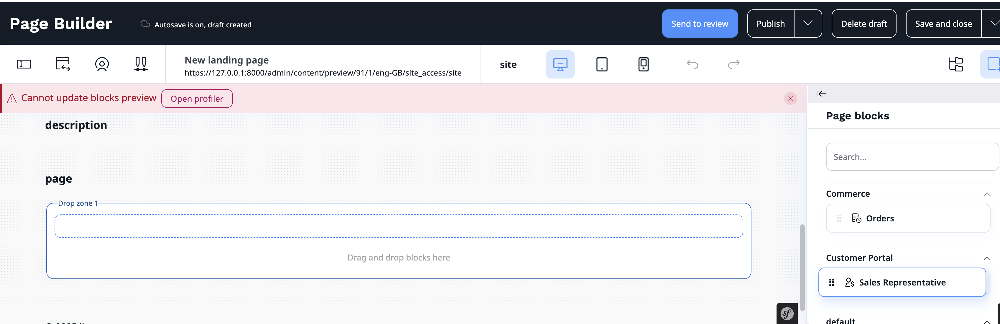
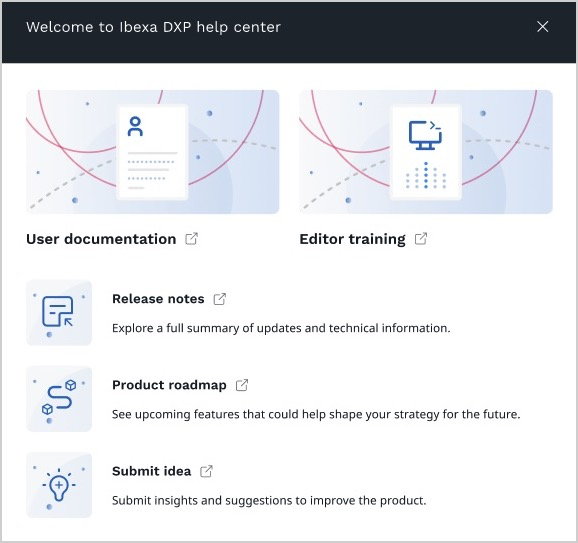
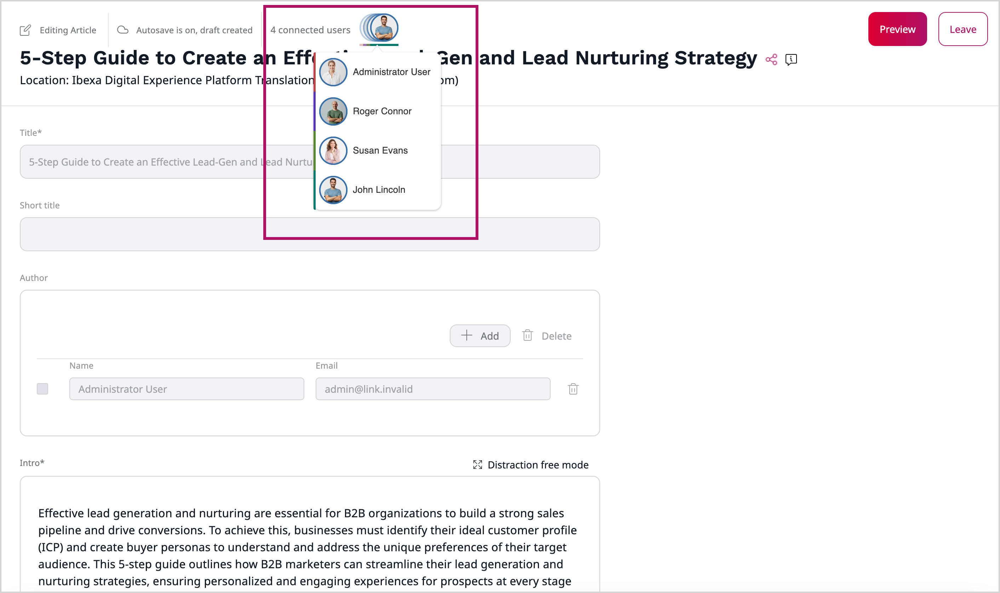
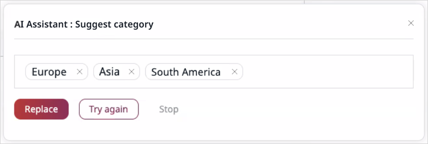

<!-- vale Ibexa.VariablesVersion = NO -->

[[= release_notes_filters('Ibexa DXP v5.0 LTS', ['Headless', 'Experience', 'Commerce', 'LTS Update', 'New feature', 'First release']) =]]

<div class="release-notes" markdown="1">

[[% set version = 'v5.0.9' %]]
[[% set date = '2026-07-01' %]]

[[= release_note_entry_begin(
    'MCP Servers ' + version,
    date,
    ['Headless', 'Experience', 'Commerce', 'LTS Update', 'New feature']
) =]]

<!-- markdownlint-disable-next-line heading-increment -->
### Tools

Several new experimental content type tools were added to the MCP Servers feature:

- `create_content_type`
- `get_content_type`
- `get_content_type_by_identifier`
- `get_content_type_list`
- `get_content_type_draft`
- `publish_content_type_draft`
- `add_field_definition`
- `remove_field_definition`
- `update_field_definition`
- `get_content_type_groups`

Among translation tools:

- `list_non_translated_content_ids` tool is added
- `list_content_translations` is now renamed to `list_content_languages`

For more information, see [Built-in tools](https://doc.ibexa.co/en/5.0/ai/mcp/mcp_config/#built-in-tools).

### Configuration

- An `allowed_hosts` parameter is added to configuration to restrict access to an MCP server. It's default value covers only few cases for local development. For more information, see [Allowed hosts](https://doc.ibexa.co/en/5.0/ai/mcp/mcp_config/#allowed-hosts).
- A `title` property is added to capability attributes to optionally provide a friendly UI label. For more information, see [MCP server capabilities](https://doc.ibexa.co/en/5.0/ai/mcp/mcp_usage/#mcp-server-capabilities).

[[= release_note_entry_end() =]]

[[= release_note_entry_begin(
    "Ibexa DXP " + version,
    date,
    ['Headless', 'Experience', 'Commerce', 'New feature']
) =]]

### Raptor connector

#### Hybrid tracking

New `hybrid` tracking mode is available alongside [`client` and `server`](tracking_functions.md).
In this mode, the browser uses a first-party tracking shim provided by the DXP instance.
Tracking events are forwarded through a same-origin endpoint and processed server side before being sent to Raptor, helping reduce the impact of ad blockers while preserving client side event tracking.

For more information, see [hybrid tracking](https://doc.ibexa.co/en/5.0/recommendations/raptor_integration/hybrid_tracking/).

#### New recommendation blocks [[% include 'snippets/experience_badge.md' %]] [[% include 'snippets/commerce_badge.md' %]]

Two new recommendation blocks are available in Page Builder:

- **Items of Customized Feeds sorted by personal preferences and popularity or trendiness** sorts items from Customized Feeds based on user preferences, popularity, and current trends
- **Merchandising content sorted by personal preferences and popularity** uses merchandising content and sorts it by personal preferences and popularity

For more information, see [recommendation blocks](https://doc.ibexa.co/en/5.0/recommendations/raptor_integration/recommendation_blocks/).

### Developer experience

#### PHP API

The following additions were made to the PHP API:

- [`Ibexa\Contracts\ConnectorRaptor\Message\TrackProxiedEventMessage`](https://doc.ibexa.co/en/5.0/api/php_api/php_api_reference/classes/Ibexa-Contracts-ConnectorRaptor-Message-TrackProxiedEventMessage.html)
- [`Ibexa\Contracts\ConnectorRaptor\Tracking\ContextProvider\WebsiteIdContextProviderInterface`](https://doc.ibexa.co/en/5.0/api/php_api/php_api_reference/classes/Ibexa-Contracts-ConnectorRaptor-Tracking-ContextProvider-WebsiteIdContextProviderInterface.html)
- [`Ibexa\Contracts\ConnectorRaptor\Tracking\TrackingBehaviorProviderInterface`](https://doc.ibexa.co/en/5.0/api/php_api/php_api_reference/classes/Ibexa-Contracts-ConnectorRaptor-Tracking-TrackingBehaviorProviderInterface.html)
- [`Ibexa\Contracts\Messenger\Stamp\DeduplicateStamp`](https://doc.ibexa.co/en/5.0/api/php_api/php_api_reference/classes/Ibexa-Contracts-Messenger-Stamp-DeduplicateStamp.html)
- [`Ibexa\Contracts\Messenger\Stamp\SudoStamp`](https://doc.ibexa.co/en/5.0/api/php_api/php_api_reference/classes/Ibexa-Contracts-Messenger-Stamp-SudoStamp.html)
- [`Ibexa\Contracts\Messenger\Stamp\UserPermissionStamp`](https://doc.ibexa.co/en/5.0/api/php_api/php_api_reference/classes/Ibexa-Contracts-Messenger-Stamp-UserPermissionStamp.html)

### Full changelog

[[% include 'snippets/release_50.md' %]]

[[= release_note_entry_end() =]]

[[% set version = 'v5.0.8' %]]
[[% set date = '2026-05-21' %]]

[[= release_note_entry_begin(
    'MCP Servers ' + version,
    date,
    ['Headless', 'Experience', 'Commerce', 'LTS Update', 'New feature', 'First release']
) =]]

MCP servers make it easier for AI agents to discover the available interactions with Ibexa DXP.
With the MCP Servers feature, you can configure multiple MCP servers with their specific sets of tools.

For more information, see [MCP Servers product guide](https://doc.ibexa.co/en/5.0/ai/mcp/mcp_guide/).

[[= release_note_entry_end() =]]

[[= release_note_entry_begin(
    product_name + ' ' + version,
    date,
    ['Headless', 'Experience', 'Commerce', 'New feature']
) =]]

### Security

This release includes security fixes.
To learn more, see the [corresponding security advisory](https://developers.ibexa.co/security-advisories/ibexa-sa-2026-003-vulnerabilities-in-forms-submissions-rest-sessions-and-solr-logs).

### Raptor connector

#### New recommendation blocks [[% include 'snippets/experience_badge.md' %]] [[% include 'snippets/commerce_badge.md' %]]

Four new recommendation blocks are available in Page Builder:

- **User's content history** compiles a chronological list of recently interacted content or a list of most interacted content
- **Items associated with the given Content** generates a list of complementary and relevant products that customers often view with a given content
- **The Personal Shopping Assistant (additional sales)** encourages additional purchases by suggesting complementary cross-selling items
- **The Personal Shopping Assistant (conversion)** helps users discover better product matches by suggesting similar items based on their activity

For more information, see [recommendation blocks](https://doc.ibexa.co/en/5.0/recommendations/raptor_integration/recommendation_blocks/).

#### Category parameter for product events

You can now configure which product category is sent in tracking events.

Raptor accepts only a single category value.
By default, the connector uses the first category assigned to a product, but you can override this behavior and select a different category to be included in tracking events.

To learn more, see [category parameter for product events](https://doc.ibexa.co/en/5.0/recommendations/raptor_integration/tracking_php_api/#category-parameter-for-product-events).

#### Cookie lifetime configuration

A new `cookie_id_lifetime_days` configuration option controls the lifetime in days of the server-side tracking identifier cookie.

For more information, see [connector installation and configuration](https://doc.ibexa.co/en/5.0/recommendations/raptor_integration/connector_installation_configuration/).

### Anonymous user segmentation in [[= product_name_cdp =]] [[% include 'snippets/experience_badge.md' %]] [[% include 'snippets/commerce_badge.md' %]]

[[= product_name_cdp =]] can now build audiences for anonymous visitors.
Use them in Ibexa DXP to deliver personalized experiences even before users log in.

For more information, see [Anonymous user segmentation](https://doc.ibexa.co/en/5.0/cdp/cdp_activation/cdp_configuration/#anonymous-user-segmentation).

### Gaussian blur optimization in Image Editor

The [Image Editor]([[= user_doc =]]/image_management/edit_images/) now supports configuring the strength of the gaussian blur that is used for image optimization.
You can adjust the blur level to balance between file size reduction and image sharpness.
For more information, see [Configure image editor](https://doc.ibexa.co/en/5.0/content_management/images/configure_image_editor/#gaussian-blur-strength).

### Developer experience

#### Repeatable migration steps with items

The `repeatable` migration type now supports an `items` key, allowing you to provide a list of items to iterate over, similar to a `foreach` loop.

For more information, see [Repeatable steps with items](https://doc.ibexa.co/en/5.0/content_management/data_migration/importing_data/#repeatable-steps-with-items).

#### Twig Component groups

Three new [Twig Component groups](https://doc.ibexa.co/en/5.0/templating/components/) are added to the back office:

- `admin-ui-content-column-end`
- `admin-ui-content-translations-row-actions`
- `admin-ui-form-product-add-translation-body`

For more information, see [available Admin UI Twig Component groups](https://doc.ibexa.co/en/5.0/administration/back_office/back_office_elements/custom_components/#admin-ui).

#### PHP API

##### Product API: Computed availability for products

[`AvailabilityInterface`](/api/php_api/php_api_reference/classes/Ibexa-Contracts-ProductCatalog-Values-Availability-AvailabilityInterface.html) now uses separate values for availability and computed availability:

- `getAvailability()` returns whether the product or variant is manually set as available
- `getComputedAvailability()` returns whether the product or variant can be ordered, for example, based on its stock level

For more information, see [Availability and computed availability](https://doc.ibexa.co/en/5.0/product_catalog/products/#product-availability-and-stock).

##### Workflow API: new `loadWorkflowMetadataForVersionInfo` method

The new [`WorkflowServiceInterface::loadWorkflowMetadataForVersionInfo`](/api/php_api/php_api_reference/classes/Ibexa-Contracts-Workflow-Service-WorkflowServiceInterface.html#method_loadWorkflowMetadataForVersionInfo) method loads workflow information directly from a [`VersionInfo`](/api/php_api/php_api_reference/classes/Ibexa-Contracts-Core-Repository-Values-Content-VersionInfo.html) object, without loading the content item.

For more information, see [Workflow API](https://doc.ibexa.co/en/5.0/content_management/workflow/workflow_api/#getting-workflow-information).

##### Addition summary

The following additions were made to the PHP API:

- [`Ibexa\Contracts\Cdp\Exception\MembershipApiException`](https://doc.ibexa.co/en/5.0/api/php_api/php_api_reference/classes/Ibexa-Contracts-Cdp-Exception-MembershipApiException.html)
- [`Ibexa\Contracts\Cdp\Membership`](https://doc.ibexa.co/en/5.0/api/php_api/php_api_reference/namespaces/ibexa-contracts-cdp-membership.html)
- [`Ibexa\Contracts\ConnectorRaptor\Message\TrackServerSideEventMessage`](https://doc.ibexa.co/en/5.0/api/php_api/php_api_reference/classes/Ibexa-Contracts-ConnectorRaptor-Message-TrackServerSideEventMessage.html)
- [`Ibexa\Contracts\ConnectorRaptor\Tracking\Event\PageViewEventData`](https://doc.ibexa.co/en/5.0/api/php_api/php_api_reference/classes/Ibexa-Contracts-ConnectorRaptor-Tracking-Event-PageViewEventData.html)
- [`Ibexa\Contracts\ConnectorRaptor\Tracking\PageViewTrackerInterface`](https://doc.ibexa.co/en/5.0/api/php_api/php_api_reference/classes/Ibexa-Contracts-ConnectorRaptor-Tracking-PageViewTrackerInterface.html)
- [`Ibexa\Contracts\Mcp`](https://doc.ibexa.co/en/5.0/api/php_api/php_api_reference/namespaces/ibexa-contracts-mcp.html)

### Full changelog

[[% include 'snippets/release_50.md' %]]

[[= release_note_entry_end() =]]

[[% set version = 'v5.0.7' %]]
[[% set date = null %]]

[[= release_note_entry_begin(
    "Google Gemini connector " + version,
    '2026-04-20',
    ['Headless', 'Experience', 'Commerce', 'LTS Update', 'New feature', 'First release']
) =]]

This release introduces a new AI connector that allows you to integrate [AI Actions](https://doc.ibexa.co/en/5.0/ai/ai_actions/ai_actions/) with [Google Gemini](https://gemini.google/overview/#what-gemini-is).
You can also use it as an alternative embeddings provider for the [taxonomy suggestions feature](taxonomy.md#taxonomy-suggestions).

For more information, see how to [install and configure the Google Gemini connector](https://doc.ibexa.co/en/5.0/ai/ai_actions/configure_ai_actions/#install-google-gemini-connector).

[[= release_note_entry_end() =]]

[[= release_note_entry_begin(
    "Integrated help " + version,
    '2026-04-20',
    ['Headless', 'Experience', 'Commerce', 'LTS Update', 'New feature']
) =]]

### Product tour

The product tour is a new Integrated help feature that helps back office contributors to discover Ibexa DXP.

With product tours, you can create customized onboarding journeys.
This accelerates user adoption, reduces training time, and helps users confidently navigate the platform.

For more information, see [Product tour](https://doc.ibexa.co/en/5.0/administration/back_office/product_tour/).

[[= release_note_entry_end() =]]

[[= release_note_entry_begin(
    "Ibexa DXP " + version,
    '2026-04-20',
    ['Headless', 'Experience', 'Commerce', 'New feature']
) =]]

### Security

This release includes security fixes.
To learn more, see the [corresponding security advisory](https://developers.ibexa.co/security-advisories/ibexa-sa-2026-002-access_control-in-security.yaml-not-working).

### Raptor connector

The Raptor connector provides a seamless integration between Ibexa DXP and [Raptor Recommendation Engine](https://www.raptorservices.com/website-recommendations/).

For more information, see [Raptor connector](https://doc.ibexa.co/en/5.0/recommendations/raptor_integration/raptor_connector/).

#### Tracking

This add-on includes two Twig functions to ease tracking setting:

- `ibexa_tracking_script` to load the JavaScript tracking code
- `ibexa_tracking_track_event` to send tracking events from your pages

For more information, see [Raptor tracking functions](https://doc.ibexa.co/en/5.0/recommendations/raptor_integration/tracking_functions/).

#### Recommendations blocks [[% include 'snippets/experience_badge.md' %]] [[% include 'snippets/commerce_badge.md' %]]

This add-on introduces a set of recommendation blocks available in the [Page Builder](https://doc.ibexa.co/en/5.0/content_management/pages/page_builder_guide/), designed to suggest relevant content or products to users, such as the most popular items or viewed by others.

For more information about Recommendation blocks in Page Builder, see the relevant [Developer Documentation](https://doc.ibexa.co/en/5.0/recommendations/raptor_integration/recommendation_blocks/) and [User Documentation](https://doc.ibexa.co/projects/userguide/en/5.0/recommendations/raptor_integration/raptor_recommendation_blocks/).

### [[= pim_product_name =]]

The [[= pim_product_name =]] integration add-on allows you to connect Ibexa DXP with [[[= pim_product_name =]]](https://www.quable.com/en), making [[= pim_product_name =]] the authoritative source of product information for every website powered by Ibexa DXP.

[[= pim_product_name =]] can serve as the single source of truth for all product data, including attributes, classifications, variants, and translations.
Ibexa DXP consumes this data and makes it available for use in content and digital experiences.

For more information, see [[[= pim_product_name =]] Integration](https://doc.ibexa.co/en/5.0/product_catalog/quable/quable/).

### AI Actions in Page Builder blocks [[% include 'snippets/experience_badge.md' %]] [[% include 'snippets/commerce_badge.md' %]]

You can now use the [refining text AI Actions](https://doc.ibexa.co/en/5.0/ai/ai_actions/ai_actions_guide/#refining-text) in Page Builder blocks string and text inputs.

### Developer experience

#### Symfony 7.4

Symfony is upgraded from 7.3 to 7.4.
It's the latest [LTS release](https://symfony.com/releases#long-term-support-release), maintained till November 2029.
See [what's new in Symfony 7.4](https://symfony.com/blog/category/living-on-the-edge/8.0-7.4) and [how to update Symfony within Ibexa DXP](https://doc.ibexa.co/en/5.0/update_and_migration/from_5.0/update_from_5.0/#update-symfony-from-73-to-74).

#### Taxonomy search

One [taxonomy search](https://doc.ibexa.co/en/5.0/content_management/taxonomy/taxonomy_api/#search) criterion is added:

- [`TaxonomyNoEntries`](https://doc.ibexa.co/en/5.0/search/criteria_reference/taxonomy_no_entries/) to find content items to which no taxonomy entries have been assigned.

#### Custom parameters in `ibexa_render()`

You can now pass custom parameters to templates when using the `ibexa_render()` Twig function with the new `params` option, similar to how you can with `render(controller())`.

This allows you to provide additional context or data to your view templates:

``` html+twig
{{ ibexa_render(content, {
    'viewType': 'line',
    'method': 'inline',
    'params': {
        'custom_param': 'custom_value',
        'another_param': 'another_value'
    }
}) }}
```

The parameters are available in your template as regular variables.

For more information, see [`ibexa_render()` Twig function](https://doc.ibexa.co/en/5.0/templating/twig_function_reference/content_twig_functions/#ibexa_render).

#### Try-catch support in data migrations

Data migrations now support try-catch error handling, allowing you to wrap migration steps with exception handling logic.
You can use it for migrations that might fail under certain conditions but should not break the entire migration process.

For example, you can create languages without checking if they already exist:

``` yaml
[[= include_file('code_samples/data_migration/examples/try_catch_step.yaml') =]]
```

The `try_catch` step allows you to specify which exceptions to catch and whether to continue executing remaining steps after an exception occurs.

For more information, see [Error handling with try-catch](https://doc.ibexa.co/en/5.0/content_management/data_migration/importing_data/#error-handling-with-try-catch).

#### Translation-related Twig Component groups

Four new [Twig component groups](https://doc.ibexa.co/en/5.0/templating/components/) related to Admin UI translation are added:

- `admin-ui-product-translation-modal-footer`
- `admin-ui-product-translations-actions-modal`
- `admin-ui-product-translations-actions`
- `admin-ui-product-translations-row-actions`

For more information, see [available Admin UI Twig Component groups](https://doc.ibexa.co/en/5.0/administration/back_office/back_office_elements/custom_components/#admin-ui).

#### REST API

You can now find examples for some REST request bodies in the [OpenAPI REST API](rest_api_usage.md#openapi-support):

- in the right column of the [online reference](https://doc.ibexa.co/en/5.0/api/rest_api/rest_api_reference/rest_api_reference.html),
  and in the downloadable OpenAPI specification files
- on your dev instance at `/api/ibexa/v2/doc` in an “Example Value” tab of the "Request Body" section, alongside the "Schema" tab
- in the generated JSON or YAML OpenAPI specifications when running `ibexa:openapi` command

#### PHP API

The following additions were made to the PHP API:

- [`Ibexa\Contracts\Core\FieldType\ReferenceAwareExternalStorage`](https://doc.ibexa.co/en/5.0/api/php_api/php_api_reference/classes/Ibexa-Contracts-Core-FieldType-ReferenceAwareExternalStorage.html)
- [`Ibexa\Contracts\Core\Options\Context`](https://doc.ibexa.co/en/5.0/api/php_api/php_api_reference/classes/Ibexa-Contracts-Core-Options-Context.html)
- [`Ibexa\Contracts\CorporateAccount\Order\OrderStatusLabelProviderInterface`](https://doc.ibexa.co/en/5.0/api/php_api/php_api_reference/classes/Ibexa-Contracts-CorporateAccount-Order-OrderStatusLabelProviderInterface.html)
- [`Ibexa\Contracts\ProductCatalog\Events\ProductAttributeRenderEvent`](https://doc.ibexa.co/en/5.0/api/php_api/php_api_reference/classes/Ibexa-Contracts-ProductCatalog-Events-ProductAttributeRenderEvent.html)
- [`Ibexa\Contracts\Taxonomy\Search\Query\Criterion\TaxonomyNoEntries`](https://doc.ibexa.co/en/5.0/api/php_api/php_api_reference/classes/Ibexa-Contracts-Taxonomy-Search-Query-Criterion-TaxonomyNoEntries.html)
  <br>For more information, see [search criteria reference entry](https://doc.ibexa.co/en/5.0/search/criteria_reference/taxonomy_no_entries/).
- [`Ibexa\Contracts\ConnectorRaptor` namespace](https://doc.ibexa.co/en/5.0/api/php_api/php_api_reference/namespaces/ibexa-contracts-connectorraptor.html) from the [Raptor connector add-on](https://doc.ibexa.co/en/5.0/recommendations/raptor_integration/raptor_connector/)
- [`Ibexa\Contracts\IntegratedHelp` namespace](https://doc.ibexa.co/en/5.0/api/php_api/php_api_reference/namespaces/ibexa-contracts-integratedhelp.html) from the [Integrated help LTS-Update](https://doc.ibexa.co/en/5.0/administration/back_office/integrated_help/)

### Full changelog

[[% include 'snippets/release_50.md' %]]

[[= release_note_entry_end() =]]

[[% set version = 'v5.0.6' %]]

[[= release_note_entry_begin(
    'Shopping Lists ' + version,
    '2026-03-05',
    ['Commerce', 'LTS Update', 'New feature']
) =]]

Shopping list is a new feature that allows users to save products into wishlists.
An authenticated customer has a default "My wishlist", and can create custom shopping lists to organize their potential or recurrent purchases.
Products can be moved from cart to shopping list, from a shopping list to another shopping list, and copied from a shopping list to the cart.

For more information, see [Shopping list feature guide](https://doc.ibexa.co/en/5.0/commerce/shopping_list/shopping_list_guide/).

[[= release_note_entry_end() =]]

[[= release_note_entry_begin(
    "Ibexa DXP " + version,
    '2026-03-05',
    ['Headless', 'Experience', 'Commerce', 'New feature']
) =]]

### Security

This release includes security fixes.
To learn more, see the [corresponding security advisory](https://developers.ibexa.co/security-advisories/ibexa-sa-2026-001-insufficient-main-landing-page-access-control).

### Improved product variant querying

Product variant querying now supports filtering by variant codes and product attribute criteria.

You can now use the [`ProductServiceInterface::findVariants()`](/api/php_api/php_api_reference/classes/Ibexa-Contracts-ProductCatalog-ProductServiceInterface.html#method_findVariants) method to search for variants across all products, regardless of their base product.

For more information, see [Product API - Searching variants](https://doc.ibexa.co/en/5.0/product_catalog/product_api/#searching-for-variants-across-all-products).

### Infrastructure

#### Ibexa Cloud package

A new `ibexa/cloud` package is now available for [[= product_name_cloud =]] deployments.
This package replaces the previous `composer ibexa:setup --platformsh` command with a dedicated console command.

The package automatically generates environment variables based on the configuration of relationships and routes in [[= product_name_cloud =]],
making it easier to configure services like databases, cache, search engines, and session storage.

For more information, see [Install on Ibexa Cloud](https://doc.ibexa.co/en/5.0/ibexa_cloud/install_on_ibexa_cloud/) and [Environment variables on Ibexa Cloud](https://doc.ibexa.co/en/5.0/ibexa_cloud/environment_variables/).

#### PHP 8.4 support

PHP 8.4 is now [officially supported](https://doc.ibexa.co/en/5.0/getting_started/requirements/#php).

### Query subtree limit configuration

A new `query_subtree.limit` configuration option improves performance when working with large content trees by limiting count operations.
This prevents performance degradation from database queries when determining if locations have children or calculating subtree sizes.

For more information, see [Subtree operations configuration](https://doc.ibexa.co/en/5.0/administration/back_office/back_office_configuration/#subtree-operations).

### Improved HTTP caching for Page Builder and dashboard blocks [[% include 'snippets/experience_badge.md' %]] [[% include 'snippets/commerce_badge.md' %]]

You can now indicate which [query parameters](https://en.wikipedia.org/wiki/Query_string) must be used as keys when generating [HTTP cache](https://doc.ibexa.co/en/5.0/infrastructure_and_maintenance/cache/http_cache/http_cache/) for block requests.

This allows you to improve performance for blocks by utilizing HTTP cache more effectively, for example, for paginated blocks in the [dashboard](https://doc.ibexa.co/en/5.0/administration/dashboard/customize_dashboard/).

To set it up, use the new `cacheable_query_params` [block setting](https://doc.ibexa.co/en/5.0/content_management/pages/page_blocks/#block-configuration).

Then, adjust your [layouts](https://doc.ibexa.co/en/5.0/templating/render_content/render_page/#configure-layout) and pass the parameters to [Symfony's `controller function`]([[= symfony_doc =]]/reference/twig_reference.html#controller) by using the new `ibexa_append_cacheable_query_params` Twig function, as in the example below:

``` html+twig
{{ render_esi(controller('Ibexa\\Bundle\\FieldTypePage\\Controller\\BlockController::renderAction',
    {
        'locationId': locationId,
        'contentId': contentInfo.id,
        'blockId': block.id,
        'versionNo': versionInfo.versionNo,
        'languageCode': field.languageCode
    },
    ibexa_append_cacheable_query_params(block)
)) }}
```

### Developer experience

#### PHP API

The following additions were made to the PHP API:

- [`Ibexa\Contracts\Cdp\Value\Webhook\PersonIdType`](/api/php_api/php_api_reference/classes/Ibexa-Contracts-Cdp-Value-Webhook-PersonIdType.html)
- [`Ibexa\Contracts\Cdp\Webhook`](/api/php_api/php_api_reference/namespaces/ibexa-contracts-cdp-webhook.html)
- [`Ibexa\Contracts\Core\Persistence\Filter\Query`](/api/php_api/php_api_reference/namespaces/ibexa-contracts-core-persistence-filter-query.html)
- [`Ibexa\Contracts\ImageEditor\Event`](/api/php_api/php_api_reference/namespaces/ibexa-contracts-imageeditor-event.html)
- [`Ibexa\Contracts\ProductCatalog\Config`](/api/php_api/php_api_reference/namespaces/ibexa-contracts-productcatalog-config.html)
- [`Ibexa\Contracts\ShoppingList`](/api/php_api/php_api_reference/namespaces/ibexa-contracts-shoppinglist.html)
- [`Ibexa\Contracts\Taxonomy\Embedding\Exception`](/api/php_api/php_api_reference/namespaces/ibexa-contracts-taxonomy-embedding-exception.html)

### Full changelog

[[% include 'snippets/release_50.md' %]]

[[= release_note_entry_end() =]]

[[% set version = 'v5.0.5' %]]

[[= release_note_entry_begin("Ibexa DXP " + version, '2026-01-15', ['Headless', 'Experience', 'Commerce']) =]]

### Infrastructure

#### Added support for Elasticsearch 8

Elasticsearch 8 is now officially supported.
If you're currently using Elasticsearch 7, which is [no longer maintained](https://www.elastic.co/support/eol), it's recommended to upgrade.
See the [update instructions](https://doc.ibexa.co/en/5.0/update_and_migration/from_5.0/update_from_5.0/#update-elasticsearch-server) for more information.

#### Added support for Valkey

Valkey is now [officially supported](https://doc.ibexa.co/en/5.0/getting_started/requirements/) alongside Redis.

#### Added support for PostgreSQL 18

PostgreSQL 18 is now [officially supported](https://doc.ibexa.co/en/5.0/getting_started/requirements#dbms).

### Developer experience

#### Easier debugging of Page Builder blocks

In Symfony's `dev` environment, use the "Open profiler" action to quickly debug Page Builder's block rendering failures.



#### Improved logging for Ibexa CDP

You can configure the new `ibexa.cdp.webhook` Monolog channels to direct all CDP webhook logs to specific output for easier separation of logs.

Example configuration:

```yaml
when@prod:
    monolog:
        handlers:
            cdp_webhook:
                type: stream
                path: "%kernel.logs_dir%/cdp_webhook_%kernel.environment%.log"
                level: debug
                channels: [ 'ibexa.cdp.webhook' ]
```

#### Added OpenAPI support for Collaborative editing REST API

The [Collaborative editing](https://doc.ibexa.co/en/5.0/content_management/collaborative_editing/collaborative_editing/) REST API endpoints are now included in the [OpenAPI-based REST API reference](https://doc.ibexa.co/en/5.0/api/rest_api/rest_api_reference/rest_api_reference.html#tag/Collaboration-Sessions).

### Full changelog

[[% include 'snippets/release_50.md' %]]

[[= release_note_entry_end() =]]

[[% set version = 'v5.0.4' %]]

[[= release_note_entry_begin("Integrated help " + version, '2025-12-10', ['Headless', 'Experience', 'Commerce', 'LTS Update', 'New feature', 'First release']) =]]

Integrated help brings contextual documentation, guidance, and partner-specific resources right into the user interface of Ibexa DXP.
It helps editors, store managers, and developers to quickly access relevant content, training and resources without leaving the UI, narrowing the gap between product and documentation.

The default help menu can be modified to include links to internal editorial guidelines, custom tutorials, or support pages.



For more information, see [Integrated help](https://doc.ibexa.co/en/5.0/administration/back_office/integrated_help/).

[[= release_note_entry_end() =]]

[[= release_note_entry_begin("Anthropic connector " + version, '2025-12-10', ['Headless', 'Experience', 'Commerce', 'LTS Update', 'New feature', 'First release']) =]]

This release introduces a new AI connector that allows you to integrate [AI Actions](https://doc.ibexa.co/en/5.0/ai/ai_actions/ai_actions/) with [Anthropic Claude](https://claude.com/product/overview).

For more information, see how to [install Anthropic connector](https://doc.ibexa.co/en/5.0/ai/ai_actions/configure_ai_actions#install-anthropic-connector).

[[= release_note_entry_end() =]]

[[= release_note_entry_begin("Ibexa DXP " + version, '2025-12-10', ['Headless', 'Experience', 'Commerce', 'New feature']) =]]

### Security

This release includes security fixes.
To learn more, see the [corresponding security advisory](https://developers.ibexa.co/security-advisories/ibexa-sa-2025-005-password-change-and-xss-vulnerabilities-in-back-office).

### Real-time collaborative editing

Real-time editing is now part of the [Collaborative editing](https://doc.ibexa.co/en/5.0/content_management/collaborative_editing/collaborative_editing/) feature.

By using it, users can edit and review content in real time, making teamwork faster, more efficient, and streamlining the content review process.
The system automatically tracks changes, allowing seamless collaboration within a single content item.

This extends the already existing capabilities allowing editors to work on the same content created in Ibexa DXP simultaneously, streamlining the content creation and review process.



For more information, see how to [configure Collaborative editing](https://doc.ibexa.co/en/5.0/content_management/collaborative_editing/configure_collaborative_editing/).

### Taxonomy suggestions for faster content classification

You can now speed up taxonomy assignment with AI-powered taxonomy suggestions.

Instead of manually browsing through large taxonomy trees and selecting categories or tags one by one, editors can choose from automatically generated suggestions based on the product or content information, for example name and description.

This approach reduces manual effort, minimizes errors, and significantly improves the speed and consistency of content and product classification.



For more information, see [Taxonomy suggestions](https://doc.ibexa.co/en/5.0/content_management/taxonomy/taxonomy/#taxonomy-suggestions).

### Infrastructure

- MariaDB 11.4 is now [officially supported](https://doc.ibexa.co/en/5.0/getting_started/requirements/#dbms)

### Developer experience

#### PHP API

The following additions were made to the PHP API:

##### Real-time collaborative editing

- [`Ibexa\Contracts\Collaboration\Invitation\Query\Criterion\ParticipantScope`](https://doc.ibexa.co/en/5.0/api/php_api/php_api_reference/classes/Ibexa-Contracts-Collaboration-Invitation-Query-Criterion-ParticipantScope.html)
- [`Ibexa\Contracts\Collaboration\Invitation\Query\Criterion\ParticipantType`](https://doc.ibexa.co/en/5.0/api/php_api/php_api_reference/classes/Ibexa-Contracts-Collaboration-Invitation-Query-Criterion-ParticipantType.html)
- [`Ibexa\Contracts\Collaboration\Participant\ParticipantDiscriminator`](https://doc.ibexa.co/en/5.0/api/php_api/php_api_reference/classes/Ibexa-Contracts-Collaboration-Participant-ParticipantDiscriminator.html)
- [`Ibexa\Contracts\FieldTypeRichTextRTE\ChannelIdGeneratorInterface`](https://doc.ibexa.co/en/5.0/api/php_api/php_api_reference/classes/Ibexa-Contracts-FieldTypeRichTextRTE-ChannelIdGeneratorInterface.html)
- [`Ibexa\Contracts\FieldTypeRichTextRTE\Config\LicenseKeyProviderInterface`](https://doc.ibexa.co/en/5.0/api/php_api/php_api_reference/classes/Ibexa-Contracts-FieldTypeRichTextRTE-Config-LicenseKeyProviderInterface.html)
- [`Ibexa\Contracts\FieldTypeRichTextRTE\Config\LocalStorageInterface`](https://doc.ibexa.co/en/5.0/api/php_api/php_api_reference/classes/Ibexa-Contracts-FieldTypeRichTextRTE-Config-LocalStorageInterface.html)
- [`Ibexa\Contracts\FieldTypeRichTextRTE\TokenServiceInterface`](https://doc.ibexa.co/en/5.0/api/php_api/php_api_reference/classes/Ibexa-Contracts-FieldTypeRichTextRTE-TokenServiceInterface.html)
- [`Ibexa\Contracts\FieldTypeRichTextRTE\ToS\LicenseTermsStatusServiceInterface`](https://doc.ibexa.co/en/5.0/api/php_api/php_api_reference/classes/Ibexa-Contracts-FieldTypeRichTextRTE-ToS-LicenseTermsStatusServiceInterface.html)
- [`Ibexa\Contracts\FieldTypeRichTextRTE\ToS\NoResponseException`](https://doc.ibexa.co/en/5.0/api/php_api/php_api_reference/classes/Ibexa-Contracts-FieldTypeRichTextRTE-ToS-NoResponseException.html)
- [`Ibexa\Contracts\FieldTypeRichTextRTE\ToS\Status`](https://doc.ibexa.co/en/5.0/api/php_api/php_api_reference/classes/Ibexa-Contracts-FieldTypeRichTextRTE-ToS-Status.html)
- [`Ibexa\Contracts\FieldTypeRichTextRTE\ToS\ToSServiceInterface`](https://doc.ibexa.co/en/5.0/api/php_api/php_api_reference/classes/Ibexa-Contracts-FieldTypeRichTextRTE-ToS-ToSServiceInterface.html)
- [`Ibexa\Contracts\Share\Mapper\Action\ShareActionItemsMapperInterface`](https://doc.ibexa.co/en/5.0/api/php_api/php_api_reference/classes/Ibexa-Contracts-Share-Mapper-Action-ShareActionItemsMapperInterface.html)

##### AI Taxonomy suggestions

- [`Ibexa\Contracts\ConnectorAi\Action\DataType\Taxonomy`](https://doc.ibexa.co/en/5.0/api/php_api/php_api_reference/classes/Ibexa-Contracts-ConnectorAi-Action-DataType-Taxonomy.html)
- [`Ibexa\Contracts\ConnectorAi\Action\DataType\TaxonomyEntry`](https://doc.ibexa.co/en/5.0/api/php_api/php_api_reference/classes/Ibexa-Contracts-ConnectorAi-Action-DataType-TaxonomyEntry.html)
- [`Ibexa\Contracts\ConnectorAi\Action\DataType\TaxonomySuggestion`](https://doc.ibexa.co/en/5.0/api/php_api/php_api_reference/classes/Ibexa-Contracts-ConnectorAi-Action-DataType-TaxonomySuggestion.html)
- [`Ibexa\Contracts\ConnectorAi\Action\DataType\TaxonomySuggestionInterface`](https://doc.ibexa.co/en/5.0/api/php_api/php_api_reference/classes/Ibexa-Contracts-ConnectorAi-Action-DataType-TaxonomySuggestionInterface.html)
- [`Ibexa\Contracts\ConnectorAi\Action\DataType\TextToTaxonomyInput`](https://doc.ibexa.co/en/5.0/api/php_api/php_api_reference/classes/Ibexa-Contracts-ConnectorAi-Action-DataType-TextToTaxonomyInput.html)
- [`Ibexa\Contracts\ConnectorAi\Action\Response\TaxonomyResponse`](https://doc.ibexa.co/en/5.0/api/php_api/php_api_reference/classes/Ibexa-Contracts-ConnectorAi-Action-Response-TaxonomyResponse.html)
- [`Ibexa\Contracts\ConnectorAi\Action\SuggestTaxonomyAction`](https://doc.ibexa.co/en/5.0/api/php_api/php_api_reference/classes/Ibexa-Contracts-ConnectorAi-Action-SuggestTaxonomyAction.html)
- [`Ibexa\Contracts\ConnectorAi\Action\TextToTaxonomy\Action`](https://doc.ibexa.co/en/5.0/api/php_api/php_api_reference/classes/Ibexa-Contracts-ConnectorAi-Action-TextToTaxonomy-Action.html)
- [`Ibexa\Contracts\ConnectorAi\Action\TextToTaxonomy\ActionResponse`](https://doc.ibexa.co/en/5.0/api/php_api/php_api_reference/classes/Ibexa-Contracts-ConnectorAi-Action-TextToTaxonomy-ActionResponse.html)
- [`Ibexa\Contracts\ConnectorAi\Action\TextToTaxonomy\ActionType`](https://doc.ibexa.co/en/5.0/api/php_api/php_api_reference/classes/Ibexa-Contracts-ConnectorAi-Action-TextToTaxonomy-ActionType.html)
- [`Ibexa\Contracts\Core\Repository\Values\Content\EmbeddingQuery`](https://doc.ibexa.co/en/5.0/api/php_api/php_api_reference/classes/Ibexa-Contracts-Core-Repository-Values-Content-EmbeddingQuery.html)
- [`Ibexa\Contracts\Core\Repository\Values\Content\EmbeddingQueryBuilder`](https://doc.ibexa.co/en/5.0/api/php_api/php_api_reference/classes/Ibexa-Contracts-Core-Repository-Values-Content-EmbeddingQueryBuilder.html)
- [`Ibexa\Contracts\Core\Repository\Values\Content\Query\Embedding`](https://doc.ibexa.co/en/5.0/api/php_api/php_api_reference/classes/Ibexa-Contracts-Core-Repository-Values-Content-Query-Embedding.html)
- [`Ibexa\Contracts\Core\Repository\Values\Content\QueryValidatorInterface`](https://doc.ibexa.co/en/5.0/api/php_api/php_api_reference/classes/Ibexa-Contracts-Core-Repository-Values-Content-QueryValidatorInterface.html)
- [`Ibexa\Contracts\Core\Repository\Values\ContentType\Query\Criterion\ContentTypeGroupName`](https://doc.ibexa.co/en/5.0/api/php_api/php_api_reference/classes/Ibexa-Contracts-Core-Repository-Values-ContentType-Query-Criterion-ContentTypeGroupName.html)
- [`Ibexa\Contracts\Core\Search\Embedding\EmbeddingConfigurationInterface`](https://doc.ibexa.co/en/5.0/api/php_api/php_api_reference/classes/Ibexa-Contracts-Core-Search-Embedding-EmbeddingConfigurationInterface.html)
- [`Ibexa\Contracts\Core\Search\Embedding\EmbeddingProviderInterface`](https://doc.ibexa.co/en/5.0/api/php_api/php_api_reference/classes/Ibexa-Contracts-Core-Search-Embedding-EmbeddingProviderInterface.html)
- [`Ibexa\Contracts\Core\Search\Embedding\EmbeddingProviderRegistryInterface`](https://doc.ibexa.co/en/5.0/api/php_api/php_api_reference/classes/Ibexa-Contracts-Core-Search-Embedding-EmbeddingProviderRegistryInterface.html)
- [`Ibexa\Contracts\Core\Search\Embedding\EmbeddingProviderResolverInterface`](https://doc.ibexa.co/en/5.0/api/php_api/php_api_reference/classes/Ibexa-Contracts-Core-Search-Embedding-EmbeddingProviderResolverInterface.html)
- [`Ibexa\Contracts\Core\Search\Embedding\EmbeddingResolverNotFoundException`](https://doc.ibexa.co/en/5.0/api/php_api/php_api_reference/classes/Ibexa-Contracts-Core-Search-Embedding-EmbeddingResolverNotFoundException.html)
- [`Ibexa\Contracts\Core\Search\FieldType\EmbeddingField`](https://doc.ibexa.co/en/5.0/api/php_api/php_api_reference/classes/Ibexa-Contracts-Core-Search-FieldType-EmbeddingField.html)
- [`Ibexa\Contracts\Core\Search\FieldType\EmbeddingFieldFactory`](https://doc.ibexa.co/en/5.0/api/php_api/php_api_reference/classes/Ibexa-Contracts-Core-Search-FieldType-EmbeddingFieldFactory.html)
- [`Ibexa\Contracts\Elasticsearch\Query\EmbeddingVisitor`](https://doc.ibexa.co/en/5.0/api/php_api/php_api_reference/classes/Ibexa-Contracts-Elasticsearch-Query-EmbeddingVisitor.html)
- [`Ibexa\Contracts\Solr\Query\EmbeddingVisitor`](https://doc.ibexa.co/en/5.0/api/php_api/php_api_reference/classes/Ibexa-Contracts-Solr-Query-EmbeddingVisitor.html)
- [`Ibexa\Contracts\Taxonomy\Embedding\TaxonomyEmbeddingConfigurationInterface`](https://doc.ibexa.co/en/5.0/api/php_api/php_api_reference/classes/Ibexa-Contracts-Taxonomy-Embedding-TaxonomyEmbeddingConfigurationInterface.html)
- [`Ibexa\Contracts\Taxonomy\Embedding\TaxonomyEmbeddingFieldProviderInterface`](https://doc.ibexa.co/en/5.0/api/php_api/php_api_reference/classes/Ibexa-Contracts-Taxonomy-Embedding-TaxonomyEmbeddingFieldProviderInterface.html)
- [`Ibexa\Contracts\Taxonomy\Search\Query\Value\TaxonomyEmbedding`](https://doc.ibexa.co/en/5.0/api/php_api/php_api_reference/classes/Ibexa-Contracts-Taxonomy-Search-Query-Value-TaxonomyEmbedding.html)

##### Search

- [`Ibexa\Contracts\AdminUi\ContentType\ContentTypeFieldsByExpressionServiceInterface`](https://doc.ibexa.co/en/5.0/api/php_api/php_api_reference/classes/Ibexa-Contracts-AdminUi-ContentType-ContentTypeFieldsByExpressionServiceInterface.html)
- [`Ibexa\Contracts\CoreSearch\Values\Query\PaginationAwareInterface`](https://doc.ibexa.co/en/5.0/api/php_api/php_api_reference/classes/Ibexa-Contracts-CoreSearch-Values-Query-PaginationAwareInterface.html)
- [`Ibexa\Contracts\SiteFactory\Values\Query\Criterion\MatchTreeRootLocationIds`](https://doc.ibexa.co/en/5.0/api/php_api/php_api_reference/classes/Ibexa-Contracts-SiteFactory-Values-Query-Criterion-MatchTreeRootLocationIds.html)

##### Other

- [`Ibexa\Contracts\ProductCatalog\CapabilitiesEnum`](https://doc.ibexa.co/en/5.0/api/php_api/php_api_reference/classes/Ibexa-Contracts-ProductCatalog-CapabilitiesEnum.html)
- [`Ibexa\Contracts\ProductCatalog\CapabilitiesServiceInterface`](https://doc.ibexa.co/en/5.0/api/php_api/php_api_reference/classes/Ibexa-Contracts-ProductCatalog-CapabilitiesServiceInterface.html)
- [`Ibexa\Contracts\User\PasswordReset\NotifierInterface`](https://doc.ibexa.co/en/5.0/api/php_api/php_api_reference/classes/Ibexa-Contracts-User-PasswordReset-NotifierInterface.html)

[[% include 'snippets/release_50.md' %]]

[[= release_note_entry_end() =]]

[[% set version = 'v5.0.3' %]]

[[= release_note_entry_begin("Ibexa DXP " + version, '2024-10-17', ['Headless', 'Experience', 'Commerce']) =]]

### Security

This release includes security fixes.
To learn more, see the [corresponding security advisory](https://developers.ibexa.co/security-advisories/ibexa-sa-2025-004-xss-and-enumeration-vulnerabilities-in-back-office).

### Developer experience

#### PHP API

The PHP API has been expanded with the following:

??? note "PHP API classes and interfaces"
    - [`Ibexa\Contracts\ContentForms\Event`](https://doc.ibexa.co/en/5.0/api/php_api/php_api_reference/namespaces/ibexa-contracts-contentforms-event.html)
    - [`Ibexa\Contracts\Core\Persistence\Content\Type\CriterionHandlerInterface`](https://doc.ibexa.co/en/5.0/api/php_api/php_api_reference/classes/Ibexa-Contracts-Core-Persistence-Content-Type-CriterionHandlerInterface.html)
    - [`Ibexa\Contracts\Core\Repository\Values\ContentType\Query`](https://doc.ibexa.co/en/5.0/api/php_api/php_api_reference/namespaces/ibexa-contracts-core-repository-values-contenttype-query.html)
    - [`Ibexa\Contracts\Core\Repository\Values\ContentType\Query\ContentTypeQuery`](https://doc.ibexa.co/en/5.0/api/php_api/php_api_reference/classes/Ibexa-Contracts-Core-Repository-Values-ContentType-Query-ContentTypeQuery.html)
    - [`Ibexa\Contracts\Core\Repository\Values\ContentType\Query\Criterion`](https://doc.ibexa.co/en/5.0/api/php_api/php_api_reference/namespaces/ibexa-contracts-core-repository-values-contenttype-query-criterion.html)
    - [`Ibexa\Contracts\Core\Repository\Values\ContentType\Query\CriterionInterface`](https://doc.ibexa.co/en/5.0/api/php_api/php_api_reference/classes/Ibexa-Contracts-Core-Repository-Values-ContentType-Query-CriterionInterface.html)
    - [`Ibexa\Contracts\Core\Repository\Values\ContentType\Query\SortClause`](https://doc.ibexa.co/en/5.0/api/php_api/php_api_reference/classes/Ibexa-Contracts-Core-Repository-Values-ContentType-Query-SortClause.html)
    - [`Ibexa\Contracts\Core\Repository\Values\ContentType\Query\SortClause`](https://doc.ibexa.co/en/5.0/api/php_api/php_api_reference/namespaces/ibexa-contracts-core-repository-values-contenttype-query-sortclause.html)
    - [`Ibexa\Contracts\Core\Repository\Values\ContentType\SearchResult`](https://doc.ibexa.co/en/5.0/api/php_api/php_api_reference/classes/Ibexa-Contracts-Core-Repository-Values-ContentType-SearchResult.html)

??? note "Events"
    - [`Ibexa\Contracts\ContentForms\Event\AutosaveEnabled`](https://doc.ibexa.co/en/5.0/api/php_api/php_api_reference/classes/Ibexa-Contracts-ContentForms-Event-AutosaveEnabled.html)

??? note "Search criteria"
    - [`Ibexa\Contracts\Core\Repository\Values\ContentType\Query\Criterion\ContainsFieldDefinitionId`](https://doc.ibexa.co/en/5.0/api/php_api/php_api_reference/classes/Ibexa-Contracts-Core-Repository-Values-ContentType-Query-Criterion-ContainsFieldDefinitionId.html)
    - [`Ibexa\Contracts\Core\Repository\Values\ContentType\Query\Criterion\ContentTypeGroupId`](https://doc.ibexa.co/en/5.0/api/php_api/php_api_reference/classes/Ibexa-Contracts-Core-Repository-Values-ContentType-Query-Criterion-ContentTypeGroupId.html)
    - [`Ibexa\Contracts\Core\Repository\Values\ContentType\Query\Criterion\ContentTypeId`](https://doc.ibexa.co/en/5.0/api/php_api/php_api_reference/classes/Ibexa-Contracts-Core-Repository-Values-ContentType-Query-Criterion-ContentTypeId.html)
    - [`Ibexa\Contracts\Core\Repository\Values\ContentType\Query\Criterion\ContentTypeIdentifier`](https://doc.ibexa.co/en/5.0/api/php_api/php_api_reference/classes/Ibexa-Contracts-Core-Repository-Values-ContentType-Query-Criterion-ContentTypeIdentifier.html)
    - [`Ibexa\Contracts\Core\Repository\Values\ContentType\Query\Criterion\IsSystem`](https://doc.ibexa.co/en/5.0/api/php_api/php_api_reference/classes/Ibexa-Contracts-Core-Repository-Values-ContentType-Query-Criterion-IsSystem.html)
    - [`Ibexa\Contracts\Core\Repository\Values\ContentType\Query\Criterion\LogicalAnd`](https://doc.ibexa.co/en/5.0/api/php_api/php_api_reference/classes/Ibexa-Contracts-Core-Repository-Values-ContentType-Query-Criterion-LogicalAnd.html)
    - [`Ibexa\Contracts\Core\Repository\Values\ContentType\Query\Criterion\LogicalNot`](https://doc.ibexa.co/en/5.0/api/php_api/php_api_reference/classes/Ibexa-Contracts-Core-Repository-Values-ContentType-Query-Criterion-LogicalNot.html)
    - [`Ibexa\Contracts\Core\Repository\Values\ContentType\Query\Criterion\LogicalOperator`](https://doc.ibexa.co/en/5.0/api/php_api/php_api_reference/classes/Ibexa-Contracts-Core-Repository-Values-ContentType-Query-Criterion-LogicalOperator.html)
    - [`Ibexa\Contracts\Core\Repository\Values\ContentType\Query\Criterion\LogicalOr`](https://doc.ibexa.co/en/5.0/api/php_api/php_api_reference/classes/Ibexa-Contracts-Core-Repository-Values-ContentType-Query-Criterion-LogicalOr.html)

??? note "Sort clauses"
    - [`Ibexa\Contracts\Core\Repository\Values\ContentType\Query\SortClause\Id`](https://doc.ibexa.co/en/5.0/api/php_api/php_api_reference/classes/Ibexa-Contracts-Core-Repository-Values-ContentType-Query-SortClause-Id.html)
    - [`Ibexa\Contracts\Core\Repository\Values\ContentType\Query\SortClause\Identifier`](https://doc.ibexa.co/en/5.0/api/php_api/php_api_reference/classes/Ibexa-Contracts-Core-Repository-Values-ContentType-Query-SortClause-Identifier.html)
    - [`Ibexa\Contracts\Core\Repository\Values\ContentType\Query\SortClause\Name`](https://doc.ibexa.co/en/5.0/api/php_api/php_api_reference/classes/Ibexa-Contracts-Core-Repository-Values-ContentType-Query-SortClause-Name.html)

[[% include 'snippets/release_50.md' %]]

[[= release_note_entry_end() =]]

[[% set version = 'v5.0.2' %]]

[[= release_note_entry_begin("Ibexa DXP " + version, '2025-09-09', ['Headless', 'Experience', 'Commerce', 'New feature']) =]]

### Collaboration

The new [Collaborative editing feature](https://doc.ibexa.co/en/5.0/content_management/collaborative_editing/collaborative_editing_guide/) allows multiple users to preview, review, and edit the same content, improving teamwork and streamlining the review process.
Internal and external users can be invited to a collaboration session, through different sharing options.

With Real-time editing, more advanced part of the feature, users can see each other’s changes in the real time, or work on the content asynchronously.

Additionally, shared drafts can be accessed and managed through new dashboard tabs: **My shared drafts** and **Drafts shared with me**, helping users stay organized.

### Discount indexing

Discounts now allow scheduling a re-indexing of discounted product catalog prices at the most convenient time by using the Ibexa Messenger package.
Ibexa Messenger is a customization of the Symfony Messenger package, created to adjust it to Ibexa DXP's needs.

Once properly configured, it uses a background queue to trigger price re-indexing, ensuring efficient use of system resources without causing performance disruptions.

### Improvements to notifications

An improved notifications system is now more intuitive.
Developers can now create and configure their own notification types, while users can now [browse through a list of notifications](https://doc.ibexa.co/projects/userguide/en/5.0/getting_started/notifications/), where they can either act on them or dismiss them.


### Chat GPT 5.0 support

With improved reasoning and greater accuracy in mind, the AI Connector package has been enhanced by adding ChatGPT 5.0 to its list of supported LLMs.


### Developer experience

#### New packages

The following packages have been introduced in Ibexa DXP v5.0.2:

- ibexa/collaboration
- ibexa/messenger

#### New version of PHP Storm Plugin

To further improve your experience with Ibexa DXP, a 1.14.0 version of [PHP Storm Plugin](https://doc.ibexa.co/en/5.0/resources/phpstorm_plugin/) has been released, which brings the following changes:

- Added support for Ibexa DXP v5.0
- Added compatibility with PhpStorm 2024.3.6+
- Added file template for Twig Component class
- Added code completion for Twig Component Groups in YAML config files and AsTwigComponent attribute
- Added code completion for Twig Component Types in YAML config files

#### REST APIs

Ibexa DXP v5.0.2 adds REST API coverage for the following features:

- Collaboration:
    - Invitation
    - CollaborationSession
    - Participant
    - ParticipantList
- AI Actions
    - Action
    - ActionType
    - ActionTypeList
    - ActionConfiguration
    - ActionConfigurationList
- Discounts
    - Discount
    - DiscountList

#### PHP API

The PHP API has been expanded with the following:

??? note "PHP API classes and interfaces"
    - [`Ibexa\Contracts\AdminUi\Exception`](https://doc.ibexa.co/en/5.0/api/php_api/php_api_reference/namespaces/ibexa-contracts-adminui-exception.html)
    - [`Ibexa\Contracts\AdminUi\Exception\UnresolvedPreviewUrlException`](https://doc.ibexa.co/en/5.0/api/php_api/php_api_reference/classes/Ibexa-Contracts-AdminUi-Exception-UnresolvedPreviewUrlException.html)
    - [`Ibexa\Contracts\AdminUi\PreviewUrlResolver`](https://doc.ibexa.co/en/5.0/api/php_api/php_api_reference/namespaces/ibexa-contracts-adminui-previewurlresolver.html)
    - [`Ibexa\Contracts\AdminUi\PreviewUrlResolver\VersionPreviewUrlResolverInterface`](https://doc.ibexa.co/en/5.0/api/php_api/php_api_reference/classes/Ibexa-Contracts-AdminUi-PreviewUrlResolver-VersionPreviewUrlResolverInterface.html)
    - [`Ibexa\Contracts\AutomatedTranslation\Exception`](https://doc.ibexa.co/en/5.0/api/php_api/php_api_reference/namespaces/ibexa-contracts-automatedtranslation-exception.html)
    - [`Ibexa\Contracts\AutomatedTranslation\Exception\ClientNotConfiguredException`](https://doc.ibexa.co/en/5.0/api/php_api/php_api_reference/classes/Ibexa-Contracts-AutomatedTranslation-Exception-ClientNotConfiguredException.html)
    - [`Ibexa\Contracts\Collaboration\Configuration\ShareableUserConfigurationInterface`](https://doc.ibexa.co/en/5.0/api/php_api/php_api_reference/classes/Ibexa-Contracts-Collaboration-Configuration-ShareableUserConfigurationInterface.html)
    - [`Ibexa\Contracts\Collaboration\Security`](https://doc.ibexa.co/en/5.0/api/php_api/php_api_reference/namespaces/ibexa-contracts-collaboration-security.html)
    - [`Ibexa\Contracts\Collaboration\Security\ShareableLinkMatcherStrategyInterface`](https://doc.ibexa.co/en/5.0/api/php_api/php_api_reference/classes/Ibexa-Contracts-Collaboration-Security-ShareableLinkMatcherStrategyInterface.html)
    - [`Ibexa\Contracts\Collaboration\Session\JoinSessionRedirectResolverInterface`](https://doc.ibexa.co/en/5.0/api/php_api/php_api_reference/classes/Ibexa-Contracts-Collaboration-Session-JoinSessionRedirectResolverInterface.html)
    - [`Ibexa\Contracts\Collaboration\Session\LeaveSessionRedirectResolverInterface`](https://doc.ibexa.co/en/5.0/api/php_api/php_api_reference/classes/Ibexa-Contracts-Collaboration-Session-LeaveSessionRedirectResolverInterface.html)
    - [`Ibexa\Contracts\Core\Validation\Constraint`](https://doc.ibexa.co/en/5.0/api/php_api/php_api_reference/namespaces/ibexa-contracts-core-validation-constraint.html)
    - [`Ibexa\Contracts\Core\Validation\Constraint\UniqueIdentifier`](https://doc.ibexa.co/en/5.0/api/php_api/php_api_reference/classes/Ibexa-Contracts-Core-Validation-Constraint-UniqueIdentifier.html)
    - [`Ibexa\Contracts\Core\Validation\Constraint\UniqueIdentifierValidator`](https://doc.ibexa.co/en/5.0/api/php_api/php_api_reference/classes/Ibexa-Contracts-Core-Validation-Constraint-UniqueIdentifierValidator.html)
    - [`Ibexa\Contracts\Messenger`](https://doc.ibexa.co/en/5.0/api/php_api/php_api_reference/namespaces/ibexa-contracts-messenger.html)
    - [`Ibexa\Contracts\Messenger\Transport`](https://doc.ibexa.co/en/5.0/api/php_api/php_api_reference/namespaces/ibexa-contracts-messenger-transport.html)
    - [`Ibexa\Contracts\Messenger\Transport\MessageProviderInterface`](https://doc.ibexa.co/en/5.0/api/php_api/php_api_reference/classes/Ibexa-Contracts-Messenger-Transport-MessageProviderInterface.html)
    - [`Ibexa\Contracts\ProductCatalog\Values\Product\Query\AttributeCriterionBuilder`](https://doc.ibexa.co/en/5.0/api/php_api/php_api_reference/namespaces/ibexa-contracts-productcatalog-values-product-query-attributecriterionbuilder.html)
    - [`Ibexa\Contracts\ProductCatalog\Values\Product\Query\AttributeCriterionBuilderRegistry`](https://doc.ibexa.co/en/5.0/api/php_api/php_api_reference/classes/Ibexa-Contracts-ProductCatalog-Values-Product-Query-AttributeCriterionBuilderRegistry.html)
    - [`Ibexa\Contracts\ProductCatalog\Values\Product\Query\AttributeCriterionBuilderRegistryInterface`](https://doc.ibexa.co/en/5.0/api/php_api/php_api_reference/classes/Ibexa-Contracts-ProductCatalog-Values-Product-Query-AttributeCriterionBuilderRegistryInterface.html)
    - [`Ibexa\Contracts\ProductCatalog\Values\Product\Query\AttributeCriterionBuilder\AttributeCriterionBuilderInterface`](https://doc.ibexa.co/en/5.0/api/php_api/php_api_reference/classes/Ibexa-Contracts-ProductCatalog-Values-Product-Query-AttributeCriterionBuilder-AttributeCriterionBuilderInterface.html)
    - [`Ibexa\Contracts\ProductCatalog\Values\Product\Query\AttributeCriterionBuilder\CheckboxBuilder`](https://doc.ibexa.co/en/5.0/api/php_api/php_api_reference/classes/Ibexa-Contracts-ProductCatalog-Values-Product-Query-AttributeCriterionBuilder-CheckboxBuilder.html)
    - [`Ibexa\Contracts\ProductCatalog\Values\Product\Query\AttributeCriterionBuilder\ColorBuilder`](https://doc.ibexa.co/en/5.0/api/php_api/php_api_reference/classes/Ibexa-Contracts-ProductCatalog-Values-Product-Query-AttributeCriterionBuilder-ColorBuilder.html)
    - [`Ibexa\Contracts\ProductCatalog\Values\Product\Query\AttributeCriterionBuilder\FloatBuilder`](https://doc.ibexa.co/en/5.0/api/php_api/php_api_reference/classes/Ibexa-Contracts-ProductCatalog-Values-Product-Query-AttributeCriterionBuilder-FloatBuilder.html)
    - [`Ibexa\Contracts\ProductCatalog\Values\Product\Query\AttributeCriterionBuilder\IntegerBuilder`](https://doc.ibexa.co/en/5.0/api/php_api/php_api_reference/classes/Ibexa-Contracts-ProductCatalog-Values-Product-Query-AttributeCriterionBuilder-IntegerBuilder.html)
    - [`Ibexa\Contracts\ProductCatalog\Values\Product\Query\AttributeCriterionBuilder\SelectionBuilder`](https://doc.ibexa.co/en/5.0/api/php_api/php_api_reference/classes/Ibexa-Contracts-ProductCatalog-Values-Product-Query-AttributeCriterionBuilder-SelectionBuilder.html)
    - [`Ibexa\Contracts\Share\Permission\Mapper`](https://doc.ibexa.co/en/5.0/api/php_api/php_api_reference/namespaces/ibexa-contracts-share-permission-mapper.html)

??? note "Events"
    - [`Ibexa\Contracts\AdminUi\Event\ResolveVersionPreviewUrlEvent`](https://doc.ibexa.co/en/5.0/api/php_api/php_api_reference/classes/Ibexa-Contracts-AdminUi-Event-ResolveVersionPreviewUrlEvent.html)
    - [`Ibexa\Contracts\Collaboration\Session\Event\JoinSessionEvent`](https://doc.ibexa.co/en/5.0/api/php_api/php_api_reference/classes/Ibexa-Contracts-Collaboration-Session-Event-JoinSessionEvent.html)
    - [`Ibexa\Contracts\Collaboration\Session\Event\SessionPublicPreviewEvent`](https://doc.ibexa.co/en/5.0/api/php_api/php_api_reference/classes/Ibexa-Contracts-Collaboration-Session-Event-SessionPublicPreviewEvent.html)
    - [`Ibexa\Contracts\Discounts\Event\EnableDiscountEvent`](https://doc.ibexa.co/en/5.0/api/php_api/php_api_reference/classes/Ibexa-Contracts-Discounts-Event-EnableDiscountEvent.html)
    - [`Ibexa\Contracts\Discounts\Event\BeforeDisableDiscountEvent`](https://doc.ibexa.co/en/5.0/api/php_api/php_api_reference/classes/Ibexa-Contracts-Discounts-Event-BeforeDisableDiscountEvent.html)
    - [`Ibexa\Contracts\Discounts\Event\BeforeEnableDiscountEvent`](https://doc.ibexa.co/en/5.0/api/php_api/php_api_reference/classes/Ibexa-Contracts-Discounts-Event-BeforeEnableDiscountEvent.html)
    - [`Ibexa\Contracts\Discounts\Event\DisableDiscountEvent`](https://doc.ibexa.co/en/5.0/api/php_api/php_api_reference/classes/Ibexa-Contracts-Discounts-Event-DisableDiscountEvent.html)
    - [`Ibexa\Contracts\Share\Event\UsersWithPermissionInfoMappedEvent`](https://doc.ibexa.co/en/5.0/api/php_api/php_api_reference/classes/Ibexa-Contracts-Share-Event-UsersWithPermissionInfoMappedEvent.html)

??? note "Search criteria"
    - [`Ibexa\Contracts\Collaboration\Session\Query\Criterion\ParticipantToken`](https://doc.ibexa.co/en/5.0/api/php_api/php_api_reference/classes/Ibexa-Contracts-Collaboration-Session-Query-Criterion-ParticipantToken.html)
    - [`Ibexa\Contracts\Discounts\Value\Query\Criterion\IndexedAtCriterion`](https://doc.ibexa.co/en/5.0/api/php_api/php_api_reference/classes/Ibexa-Contracts-Discounts-Value-Query-Criterion-IndexedAtCriterion.html)
    - [`Ibexa\Contracts\Discounts\Value\Query\Criterion\UpdatedAtCriterion`](https://doc.ibexa.co/en/5.0/api/php_api/php_api_reference/classes/Ibexa-Contracts-Discounts-Value-Query-Criterion-UpdatedAtCriterion.html)

??? note "Sort clauses"
    - [`Ibexa\Contracts\Collaboration\Invitation\Query\SortClause\CreatedAt`](https://doc.ibexa.co/en/5.0/api/php_api/php_api_reference/classes/Ibexa-Contracts-Collaboration-Invitation-Query-SortClause-CreatedAt.html)
    - [`Ibexa\Contracts\Collaboration\Invitation\Query\SortClause\Id`](https://doc.ibexa.co/en/5.0/api/php_api/php_api_reference/classes/Ibexa-Contracts-Collaboration-Invitation-Query-SortClause-Id.html)
    - [`Ibexa\Contracts\Collaboration\Invitation\Query\SortClause\Status`](https://doc.ibexa.co/en/5.0/api/php_api/php_api_reference/classes/Ibexa-Contracts-Collaboration-Invitation-Query-SortClause-Status.html)
    - [`Ibexa\Contracts\Collaboration\Invitation\Query\SortClause\UpdatedAt`](https://doc.ibexa.co/en/5.0/api/php_api/php_api_reference/classes/Ibexa-Contracts-Collaboration-Invitation-Query-SortClause-UpdatedAt.html)
    - [`Ibexa\Contracts\Collaboration\Session\Query\SortClause\CreatedAt`](https://doc.ibexa.co/en/5.0/api/php_api/php_api_reference/classes/Ibexa-Contracts-Collaboration-Session-Query-SortClause-CreatedAt.html)
    - [`Ibexa\Contracts\Collaboration\Session\Query\SortClause\Id`](https://doc.ibexa.co/en/5.0/api/php_api/php_api_reference/classes/Ibexa-Contracts-Collaboration-Session-Query-SortClause-Id.html)
    - [`Ibexa\Contracts\Collaboration\Session\Query\SortClause\UpdatedAt`](https://doc.ibexa.co/en/5.0/api/php_api/php_api_reference/classes/Ibexa-Contracts-Collaboration-Session-Query-SortClause-UpdatedAt.html)

### Full changelog

[[% include 'snippets/release_50.md' %]]

[[= release_note_entry_end() =]]

[[% set version = 'v5.0.1' %]]

[[= release_note_entry_begin("Ibexa DXP " + version, '2025-08-19', ['Headless', 'Experience', 'Commerce', 'New feature']) =]]

### Special characters in online editor

The [online editor](https://doc.ibexa.co/en/5.0/content_management/rich_text/online_editor_guide/) now allows to easily enter special characters like currency symbols.
It uses the [special characters plugin](https://ckeditor.com/docs/ckeditor5/latest/features/special-characters.html).


### Support for Solr 9

With this release, Ibexa DXP starts supporting [Solr 9](https://doc.ibexa.co/en/5.0/getting_started/requirements/#search).

Solr 9 comes with support for [Dense Vector Search](https://solr.apache.org/guide/solr/latest/query-guide/dense-vector-search.html), paving the way for incoming improvements to the [AI Actions](https://doc.ibexa.co/en/5.0/ai/ai_actions/ai_actions/) feature.

### Improved content creation interface

The editing interface of the back office is now improved to better highlight the language, creator, and the publication date when working with content items.


### Taxonomy Subtree limitation

You can now manage access to [taxonomy items](https://doc.ibexa.co/en/5.0/content_management/taxonomy/taxonomy/) more effectively by using the new [Taxonomy Subtree limitation](https://doc.ibexa.co/en/5.0/permissions/limitation_reference/#taxonomy-subtree-limitation).

In addition, you can now use the [Taxonomy limitation](https://doc.ibexa.co/en/5.0/permissions/limitation_reference/#taxonomy-limitation) together with the `taxonomy/assign` policy.

### Base price column added to a Product Picker view

The Product Picker tool that, for example, lets you [select products eligible for discounts]([[= user_doc =]]/commerce/discounts/work_with_discounts/#create-new-discount), now displays a **Base price** column for products and product variants.

### PHP API

The PHP API has been enhanced with the following new classes:

[`Ibexa\Contracts\Cart\Exception\VatCalculationExceptionInterface`](https://doc.ibexa.co/en/5.0/api/php_api/php_api_reference/classes/Ibexa-Contracts-Cart-Exception-VatCalculationExceptionInterface.html)
[`Ibexa\Contracts\ProductCatalog\Values\Product\Query\Criterion\AbstractPriceRange`](https://doc.ibexa.co/en/5.0/api/php_api/php_api_reference/classes/Ibexa-Contracts-ProductCatalog-Values-Product-Query-Criterion-AbstractPriceRange.html)
[`Ibexa\Contracts\ProductCatalog\Values\Product\Query\Criterion\CustomPriceRange`](https://doc.ibexa.co/en/5.0/api/php_api/php_api_reference/classes/Ibexa-Contracts-ProductCatalog-Values-Product-Query-Criterion-CustomPriceRange.html)

This release brings additional minor improvements to the developer's experience that result from capabilities offered by PHP in version 8.3.

### Full changelog

[[% include 'snippets/release_50.md' %]]

[[= release_note_entry_end() =]]

[[% set version = 'v5.0.0' %]]

[[= release_note_entry_begin("Ibexa DXP " + version, '2025-07-22', ['Headless', 'Experience', 'Commerce', 'New feature', 'First release']) =]]

### Notable changes

This version incorporates into the product numerous features brought by LTS Updates from previous versions, brings upgrades to the tech stack and improvements to developer experience.

#### AI Actions

The AI Actions feature enhances the usability and flexibility of Ibexa DXP by harnessing the potential of artificial intelligence to automate time-consuming editorial tasks.
By default, the AI Actions feature can help users with their work in following scenarios:

- Refining text: when editing a content item, users can request that a passage selected in online editor is modified, for example, by adjusting the length of the text, changing its tone, or correcting linguistic errors
- Generating alternative text: when working with images, users can ask AI to generate alternative text for them, which helps improve accessibility and SEO


AI Actions integrate with [Ibexa Connect]([[= connect_doc =]]/), giving you an opportunity to build complex data transformation workflows without having to rely on custom code.

For more information, see [AI Actions product guide](https://doc.ibexa.co/en/5.0/ai/ai_actions/ai_actions_guide/).

#### Discounts [[% include 'snippets/commerce_badge.md' %]]

With Discounts, you can temporarily or permanently reduce prices on specific products or categories, making deals more attractive to potential buyers.

Use them to encourage first-time purchases, reward loyal customers, promote new or slow-moving items, or drive sales during seasonal events.

By displaying discounted prices clearly in the catalog or cart, businesses can create a sense of urgency, increase customer satisfaction, and ultimately boost revenue.


For more information, see [Discounts product guide](https://doc.ibexa.co/en/5.0/discounts/discounts_guide/).

#### Date and time attribute

The Date and time attributes allow you to represent date and time values as part of the product specification in the [product catalog](https://doc.ibexa.co/en/5.0/product_catalog/product_catalog_guide).

For more information, see [Date and time attributes](https://doc.ibexa.co/en/5.0/product_catalog/attributes/date_and_time/).

#### Symbol attribute

The Symbol attributes allow you to efficiently represent the string-based data as part of the product specification in the [product catalog](https://doc.ibexa.co/en/5.0/product_catalog/product_catalog_guide).

For more information, see [Symbol attributes](https://doc.ibexa.co/en/5.0/product_catalog/attributes/symbol_attribute_type/).

#### Collaboration

With Collaboration, multiple users can invite each other to work on the same content.
It is a starting point for future functionalities in the collaboration domain.


For more information, see [Collaboration PHP API](https://doc.ibexa.co/en/5.0/api/php_api/php_api_reference/namespaces/ibexa-contracts-collaboration.html) and [Share PHP API](https://doc.ibexa.co/en/5.0/api/php_api/php_api_reference/namespaces/ibexa-contracts-share.html).

### Software architecture upgrades

With improved compatibility, performance and increased security, as well as better developer experience in mind, [[= product_name_base =]] decided to introduce several significant tech stack upgrades.

For a full list of updated system requirements, see [Requirements](https://doc.ibexa.co/en/5.0/getting_started/requirements/).

#### Symfony 7.3

With this release, Ibexa DXP moves to Symfony 7.3 from the previously used versions of Symfony.

For details, see [Symfony 7.3](https://symfony.com/blog/symfony-7-3-curated-new-features).

#### Doctrine DBAL 3.9

By moving to Doctrine DBAL 3.9, Ibexa DXP brings developers better performance, cleaner code, and stronger foundation for a more modern and maintainable application.

#### PHP 8.3

With performance, coding safety and security in mind, with this version, Ibexa DXP moves to [PHP 8.3](https://www.php.net/releases/8.3/en.php) and drops support for lower versions of the language.

#### OpenAPI support

Adding support for generating the [OpenAPI](https://www.openapis.org/) specification for our REST API makes future changes more manageable, and helps our partners automatically generate REST API clients.

For more information, see [REST API usage](https://doc.ibexa.co/en/5.0/api/rest_api/rest_api_usage/rest_api_usage/#openapi-support).

Support for serialization and deserialization of REST payloads with the [Symfony Serializer](https://symfony.com/doc/current/serializer.html) component improves data reliability and simplifies debugging.

#### React 19

Ibexa DXP's Back Office now uses [React 19](https://react.dev/blog/2024/12/05/react-19).
This upgrade enhances maintainability, unlocks new UI capabilities, and simplifies future feature development.

### Developer experience

#### New packages

The following packages have been introduced in Ibexa DXP v5.0.0:

- ibexa/collaboration
- ibexa/connector-ai
- ibexa/connector-openai
- ibexa/discounts
- ibexa/discounts-codes
- ibexa/product-catalog-date-time-attribute
- ibexa/product-catalog-symbol-attribute
- ibexa/share

#### REST APIs

Ibexa DXP v5.0.0 adds REST API coverage for the following features:

- AI Actions:
    - Action Configurations
    - Action Types
- Discounts
- Collaboration

#### PHP API

The PHP API has been expanded with the following classes and interfaces:

??? note "AI Actions"

    - [`Ibexa\Contracts\ConnectorAi\Action\Action`](https://doc.ibexa.co/en/5.0/api/php_api/php_api_reference/classes/Ibexa-Contracts-ConnectorAi-Action-Action.html)
    - [`Ibexa\Contracts\ConnectorAi\Action\ActionContext`](https://doc.ibexa.co/en/5.0/api/php_api/php_api_reference/classes/Ibexa-Contracts-ConnectorAi-Action-ActionContext.html)
    - [`Ibexa\Contracts\ConnectorAi\Action\ActionFactoryInterface`](https://doc.ibexa.co/en/5.0/api/php_api/php_api_reference/classes/Ibexa-Contracts-ConnectorAi-Action-ActionFactoryInterface.html)
    - [`Ibexa\Contracts\ConnectorAi\Action\ActionHandlerInterface`](https://doc.ibexa.co/en/5.0/api/php_api/php_api_reference/classes/Ibexa-Contracts-ConnectorAi-Action-ActionHandlerInterface.html)
    - [`Ibexa\Contracts\ConnectorAi\Action\ActionHandlerResolverInterface`](https://doc.ibexa.co/en/5.0/api/php_api/php_api_reference/classes/Ibexa-Contracts-ConnectorAi-Action-ActionHandlerResolverInterface.html)
    - [`Ibexa\Contracts\ConnectorAi\Action\GenerateAltTextAction`](https://doc.ibexa.co/en/5.0/api/php_api/php_api_reference/classes/Ibexa-Contracts-ConnectorAi-Action-GenerateAltTextAction.html)
    - [`Ibexa\Contracts\ConnectorAi\Action\LLMBaseActionTypeInterface`](https://doc.ibexa.co/en/5.0/api/php_api/php_api_reference/classes/Ibexa-Contracts-ConnectorAi-Action-LLMBaseActionTypeInterface.html)
    - [`Ibexa\Contracts\ConnectorAi\Action\RefineTextAction`](https://doc.ibexa.co/en/5.0/api/php_api/php_api_reference/classes/Ibexa-Contracts-ConnectorAi-Action-RefineTextAction.html)
    - [`Ibexa\Contracts\ConnectorAi\Action\RuntimeContext`](https://doc.ibexa.co/en/5.0/api/php_api/php_api_reference/classes/Ibexa-Contracts-ConnectorAi-Action-RuntimeContext.html)
    - [`Ibexa\Contracts\ConnectorAi\ActionConfiguration\ActionConfigurationCreateStruct`](https://doc.ibexa.co/en/5.0/api/php_api/php_api_reference/classes/Ibexa-Contracts-ConnectorAi-ActionConfiguration-ActionConfigurationCreateStruct.html)
    - [`Ibexa\Contracts\ConnectorAi\ActionConfiguration\ActionConfigurationCopyStruct`](https://doc.ibexa.co/en/5.0/api/php_api/php_api_reference/classes/Ibexa-Contracts-ConnectorAi-ActionConfiguration-ActionConfigurationCopyStruct.html)
    - [`Ibexa\Contracts\ConnectorAi\ActionConfiguration\ActionConfigurationListInterface`](https://doc.ibexa.co/en/5.0/api/php_api/php_api_reference/classes/Ibexa-Contracts-ConnectorAi-ActionConfiguration-ActionConfigurationListInterface.html)
    - [`Ibexa\Contracts\ConnectorAi\ActionConfiguration\ActionConfigurationOptions`](https://doc.ibexa.co/en/5.0/api/php_api/php_api_reference/classes/Ibexa-Contracts-ConnectorAi-ActionConfiguration-ActionConfigurationOptions.html)
    - [`Ibexa\Contracts\ConnectorAi\ActionConfiguration\ActionConfigurationQuery`](https://doc.ibexa.co/en/5.0/api/php_api/php_api_reference/classes/Ibexa-Contracts-ConnectorAi-ActionConfiguration-ActionConfigurationQuery.html)
    - [`Ibexa\Contracts\ConnectorAi\ActionConfiguration\ActionConfigurationUpdateStruct`](https://doc.ibexa.co/en/5.0/api/php_api/php_api_reference/classes/Ibexa-Contracts-ConnectorAi-ActionConfiguration-ActionConfigurationUpdateStruct.html)
    - [`Ibexa\Contracts\ConnectorAi\ActionConfiguration\ActionHandlerOptionsFormMapperInterface`](https://doc.ibexa.co/en/5.0/api/php_api/php_api_reference/classes/Ibexa-Contracts-ConnectorAi-ActionConfiguration-ActionHandlerOptionsFormMapperInterface.html)
    - [`Ibexa\Contracts\ConnectorAi\ActionConfiguration\ActionTypeOptionsFormMapperInterface`](https://doc.ibexa.co/en/5.0/api/php_api/php_api_reference/classes/Ibexa-Contracts-ConnectorAi-ActionConfiguration-ActionTypeOptionsFormMapperInterface.html)
    - [`Ibexa\Contracts\ConnectorAi\ActionConfiguration\OptionsFormatterInterface`](https://doc.ibexa.co/en/5.0/api/php_api/php_api_reference/classes/Ibexa-Contracts-ConnectorAi-ActionConfiguration-OptionsFormatterInterface.html)
    - [`Ibexa\Contracts\ConnectorAi\ActionType\ActionTypeFactoryInterface`](https://doc.ibexa.co/en/5.0/api/php_api/php_api_reference/classes/Ibexa-Contracts-ConnectorAi-ActionType-ActionTypeFactoryInterface.html)
    - [`Ibexa\Contracts\ConnectorAi\ActionType\ActionTypeInterface`](https://doc.ibexa.co/en/5.0/api/php_api/php_api_reference/classes/Ibexa-Contracts-ConnectorAi-ActionType-ActionTypeInterface.html)
    - [`Ibexa\Contracts\ConnectorAi\ActionType\ActionTypeRegistryInterface`](https://doc.ibexa.co/en/5.0/api/php_api/php_api_reference/classes/Ibexa-Contracts-ConnectorAi-ActionType-ActionTypeRegistryInterface.html)
    - [`Ibexa\Contracts\ConnectorAi\ActionType\OptionsValidatorError`](https://doc.ibexa.co/en/5.0/api/php_api/php_api_reference/classes/Ibexa-Contracts-ConnectorAi-ActionType-OptionsValidatorError.html)
    - [`Ibexa\Contracts\ConnectorAi\ActionType\OptionsValidatorInterface`](https://doc.ibexa.co/en/5.0/api/php_api/php_api_reference/classes/Ibexa-Contracts-ConnectorAi-ActionType-OptionsValidatorInterface.html)
    - [`Ibexa\Contracts\ConnectorAi\ActionType\OptionsValidatorRegistryInterface`](https://doc.ibexa.co/en/5.0/api/php_api/php_api_reference/classes/Ibexa-Contracts-ConnectorAi-ActionType-OptionsValidatorRegistryInterface.html)
    - [`Ibexa\Contracts\ConnectorAi\ActionConfigurationInterface`](https://doc.ibexa.co/en/5.0/api/php_api/php_api_reference/classes/Ibexa-Contracts-ConnectorAi-ActionConfigurationInterface.html)
    - [`Ibexa\Contracts\ConnectorAi\ActionConfigurationServiceDecorator`](https://doc.ibexa.co/en/5.0/api/php_api/php_api_reference/classes/Ibexa-Contracts-ConnectorAi-ActionConfigurationServiceDecorator.html)
    - [`Ibexa\Contracts\ConnectorAi\ActionConfigurationServiceInterface`](https://doc.ibexa.co/en/5.0/api/php_api/php_api_reference/classes/Ibexa-Contracts-ConnectorAi-ActionConfigurationServiceInterface.html)
    - [`Ibexa\Contracts\ConnectorAi\ActionHandlerRegistryInterface`](https://doc.ibexa.co/en/5.0/api/php_api/php_api_reference/classes/Ibexa-Contracts-ConnectorAi-ActionHandlerRegistryInterface.html)
    - [`Ibexa\Contracts\ConnectorAi\ActionInterface`](https://doc.ibexa.co/en/5.0/api/php_api/php_api_reference/classes/Ibexa-Contracts-ConnectorAi-ActionInterface.html)
    - [`Ibexa\Contracts\ConnectorAi\ActionResponseInterface`](https://doc.ibexa.co/en/5.0/api/php_api/php_api_reference/classes/Ibexa-Contracts-ConnectorAi-ActionResponseInterface.html)
    - [`Ibexa\Contracts\ConnectorAi\ActionServiceDecorator`](https://doc.ibexa.co/en/5.0/api/php_api/php_api_reference/classes/Ibexa-Contracts-ConnectorAi-ActionServiceDecorator.html)
    - [`Ibexa\Contracts\ConnectorAi\ActionServiceInterface`](https://doc.ibexa.co/en/5.0/api/php_api/php_api_reference/classes/Ibexa-Contracts-ConnectorAi-ActionServiceInterface.html)
    - [`Ibexa\Contracts\ConnectorAi\AdapterAwareActionInterface`](https://doc.ibexa.co/en/5.0/api/php_api/php_api_reference/classes/Ibexa-Contracts-ConnectorAi-AdapterAwareActionInterface.html)
    - [`Ibexa\Contracts\ConnectorAi\DataType`](https://doc.ibexa.co/en/5.0/api/php_api/php_api_reference/classes/Ibexa-Contracts-ConnectorAi-DataType.html)
    - [`Ibexa\Contracts\ConnectorAi\PromptResolverInterface`](https://doc.ibexa.co/en/5.0/api/php_api/php_api_reference/classes/Ibexa-Contracts-ConnectorAi-PromptResolverInterface.html)
    - [`Ibexa\Contracts\ConnectorAi\Prompt\PromptFactory`](https://doc.ibexa.co/en/5.0/api/php_api/php_api_reference/classes/Ibexa-Contracts-ConnectorAi-Prompt-PromptFactory.html)
    - [`Ibexa\Contracts\ConnectorAi\Prompt\PromptInterface`](https://doc.ibexa.co/en/5.0/api/php_api/php_api_reference/classes/Ibexa-Contracts-ConnectorAi-Prompt-PromptInterface.html)
    - [`Ibexa\Contracts\ConnectorAi\PromptResolverInterface`](https://doc.ibexa.co/en/5.0/api/php_api/php_api_reference/classes/Ibexa-Contracts-ConnectorAi-PromptResolverInterface.html)
    - [`Ibexa\Contracts\ConnectorOpenAi\ClientProviderInterface`](https://doc.ibexa.co/en/5.0/api/php_api/php_api_reference/classes/Ibexa-Contracts-ConnectorOpenAi-ClientProviderInterface.html)

??? note "Discounts"

    - [`Ibexa\Contracts\Discounts\DiscountConditionCriterionMapperInterface`](https://doc.ibexa.co/en/5.0/api/php_api/php_api_reference/classes/Ibexa-Contracts-Discounts-DiscountConditionCriterionMapperInterface.html)
    - [`Ibexa\Contracts\Discounts\DiscountFormMapperInterface`](https://doc.ibexa.co/en/5.0/api/php_api/php_api_reference/classes/Ibexa-Contracts-Discounts-DiscountFormMapperInterface.html)
    - [`Ibexa\Contracts\Discounts\DiscountPrioritizationStrategyInterface`](https://doc.ibexa.co/en/5.0/api/php_api/php_api_reference/classes/Ibexa-Contracts-Discounts-DiscountPrioritizationStrategyInterface.html)
    - [`Ibexa\Contracts\Discounts\DiscountServiceDecorator`](https://doc.ibexa.co/en/5.0/api/php_api/php_api_reference/classes/Ibexa-Contracts-Discounts-DiscountServiceDecorator.html)
    - [`Ibexa\Contracts\Discounts\DiscountServiceInterface`](https://doc.ibexa.co/en/5.0/api/php_api/php_api_reference/classes/Ibexa-Contracts-Discounts-DiscountServiceInterface.html)
    - [`Ibexa\Contracts\Discounts\DiscountValueFormatterInterface`](https://doc.ibexa.co/en/5.0/api/php_api/php_api_reference/classes/Ibexa-Contracts-Discounts-DiscountValueFormatterInterface.html)
    - [`Ibexa\Contracts\Discounts\DiscountVariablesResolverInterface`](https://doc.ibexa.co/en/5.0/api/php_api/php_api_reference/classes/Ibexa-Contracts-Discounts-DiscountVariablesResolverInterface.html)
    - [`Ibexa\Contracts\Discounts\Admin\Form\DiscountValueFormTypeMapperInterface`](https://doc.ibexa.co/en/5.0/api/php_api/php_api_reference/classes/Ibexa-Contracts-Discounts-Admin-Form-DiscountValueFormTypeMapperInterface.html)
    - [`Ibexa\Contracts\Discounts\Admin\Form\FormThemeProviderInterface`](https://doc.ibexa.co/en/5.0/api/php_api/php_api_reference/classes/Ibexa-Contracts-Discounts-Admin-Form-FormThemeProviderInterface.html)
    - [`Ibexa\Contracts\Discounts\Admin\FormMapper\ConditionsMapperInterface`](https://doc.ibexa.co/en/5.0/api/php_api/php_api_reference/classes/Ibexa-Contracts-Discounts-Admin-FormMapper-ConditionsMapperInterface.html)
    - [`Ibexa\Contracts\Discounts\Admin\FormMapper\DiscountValueMapperInterface`](https://doc.ibexa.co/en/5.0/api/php_api/php_api_reference/classes/Ibexa-Contracts-Discounts-Admin-FormMapper-DiscountValueMapperInterface.html)
    - [`Ibexa\Contracts\Discounts\Admin\FormMapper\GeneralPropertiesMapperInterface`](https://doc.ibexa.co/en/5.0/api/php_api/php_api_reference/classes/Ibexa-Contracts-Discounts-Admin-FormMapper-GeneralPropertiesMapperInterface.html)
    - [`Ibexa\Contracts\Discounts\Admin\FormMapper\ProductConditionsMapperInterface`](https://doc.ibexa.co/en/5.0/api/php_api/php_api_reference/classes/Ibexa-Contracts-Discounts-Admin-FormMapper-ProductConditionsMapperInterface.html)
    - [`Ibexa\Contracts\Discounts\Admin\FormMapper\StepDataObjectMapperInterface`](https://doc.ibexa.co/en/5.0/api/php_api/php_api_reference/classes/Ibexa-Contracts-Discounts-Admin-FormMapper-StepDataObjectMapperInterface.html)
    - [`Ibexa\Contracts\Discounts\Admin\FormMapper\UserConditionsMapperInterface`](https://doc.ibexa.co/en/5.0/api/php_api/php_api_reference/classes/Ibexa-Contracts-Discounts-Admin-FormMapper-UserConditionsMapperInterface.html)
    - [`Ibexa\Contracts\Discounts\Exception\DiscountConditionNotFoundException`](https://doc.ibexa.co/en/5.0/api/php_api/php_api_reference/classes/Ibexa-Contracts-Discounts-Exception-DiscountConditionNotFoundException.html)
    - [`Ibexa\Contracts\Discounts\Exception\DiscountExpressionInvalidArgumentException`](https://doc.ibexa.co/en/5.0/api/php_api/php_api_reference/classes/Ibexa-Contracts-Discounts-Exception-DiscountExpressionInvalidArgumentException.html)
    - [`Ibexa\Contracts\Discounts\Exception\DiscountExpressionRuntimeException`](https://doc.ibexa.co/en/5.0/api/php_api/php_api_reference/classes/Ibexa-Contracts-Discounts-Exception-DiscountExpressionRuntimeException.html)
    - [`Ibexa\Contracts\Discounts\Exception\DiscountNotFoundException`](https://doc.ibexa.co/en/5.0/api/php_api/php_api_reference/classes/Ibexa-Contracts-Discounts-Exception-DiscountNotFoundException.html)
    - [`Ibexa\Contracts\Discounts\Exception\DiscountRuleNotFoundException`](https://doc.ibexa.co/en/5.0/api/php_api/php_api_reference/classes/Ibexa-Contracts-Discounts-Exception-DiscountRuleNotFoundException.html)
    - [`Ibexa\Contracts\Discounts\Exception\DiscountValueResolutionException`](https://doc.ibexa.co/en/5.0/api/php_api/php_api_reference/classes/Ibexa-Contracts-Discounts-Exception-DiscountValueResolutionException.html)
    - [`Ibexa\Contracts\Discounts\Policy\AbstractDiscountPolicy`](https://doc.ibexa.co/en/5.0/api/php_api/php_api_reference/classes/Ibexa-Contracts-Discounts-Policy-AbstractDiscountPolicy.html)
    - [`Ibexa\Contracts\Discounts\Policy\Create`](https://doc.ibexa.co/en/5.0/api/php_api/php_api_reference/classes/Ibexa-Contracts-Discounts-Policy-Create.html)
    - [`Ibexa\Contracts\Discounts\Policy\Delete`](https://doc.ibexa.co/en/5.0/api/php_api/php_api_reference/classes/Ibexa-Contracts-Discounts-Policy-Delete.html)
    - [`Ibexa\Contracts\Discounts\Policy\Disable`](https://doc.ibexa.co/en/5.0/api/php_api/php_api_reference/classes/Ibexa-Contracts-Discounts-Policy-Disable.html)
    - [`Ibexa\Contracts\Discounts\Policy\Enable`](https://doc.ibexa.co/en/5.0/api/php_api/php_api_reference/classes/Ibexa-Contracts-Discounts-Policy-Enable.html)
    - [`Ibexa\Contracts\Discounts\Policy\Update`](https://doc.ibexa.co/en/5.0/api/php_api/php_api_reference/classes/Ibexa-Contracts-Discounts-Policy-Update.html)
    - [`Ibexa\Contracts\Discounts\Policy\View`](https://doc.ibexa.co/en/5.0/api/php_api/php_api_reference/classes/Ibexa-Contracts-Discounts-Policy-View.html)
    - [`Ibexa\Contracts\Discounts\Value\CartDiscountConditionInterface`](https://doc.ibexa.co/en/5.0/api/php_api/php_api_reference/classes/Ibexa-Contracts-Discounts-Value-CartDiscountConditionInterface.html)
    - [`Ibexa\Contracts\Discounts\Value\DiscountConditionInterface`](https://doc.ibexa.co/en/5.0/api/php_api/php_api_reference/classes/Ibexa-Contracts-Discounts-Value-DiscountConditionInterface.html)
    - [`Ibexa\Contracts\Discounts\Value\DiscountExpressionAwareInterface`](https://doc.ibexa.co/en/5.0/api/php_api/php_api_reference/classes/Ibexa-Contracts-Discounts-Value-DiscountExpressionAwareInterface.html)
    - [`Ibexa\Contracts\Discounts\Value\DiscountInterface`](https://doc.ibexa.co/en/5.0/api/php_api/php_api_reference/classes/Ibexa-Contracts-Discounts-Value-DiscountInterface.html)
    - [`Ibexa\Contracts\Discounts\Value\DiscountListInterface`](https://doc.ibexa.co/en/5.0/api/php_api/php_api_reference/classes/Ibexa-Contracts-Discounts-Value-DiscountListInterface.html)
    - [`Ibexa\Contracts\Discounts\Value\DiscountRuleInterface`](https://doc.ibexa.co/en/5.0/api/php_api/php_api_reference/classes/Ibexa-Contracts-Discounts-Value-DiscountRuleInterface.html)
    - [`Ibexa\Contracts\Discounts\Value\DiscountTranslationInterface`](https://doc.ibexa.co/en/5.0/api/php_api/php_api_reference/classes/Ibexa-Contracts-Discounts-Value-DiscountTranslationInterface.html)
    - [`Ibexa\Contracts\Discounts\Value\DiscountType`](https://doc.ibexa.co/en/5.0/api/php_api/php_api_reference/classes/Ibexa-Contracts-Discounts-Value-DiscountType.html)
    - [`Ibexa\Contracts\Discounts\Value\DiscountValueInterface`](https://doc.ibexa.co/en/5.0/api/php_api/php_api_reference/classes/Ibexa-Contracts-Discounts-Value-DiscountValueInterface.html)
    - [`Ibexa\Contracts\Discounts\Value\Struct\DiscountCreateStruct`](https://doc.ibexa.co/en/5.0/api/php_api/php_api_reference/classes/Ibexa-Contracts-Discounts-Value-Struct-DiscountCreateStruct.html)
    - [`Ibexa\Contracts\Discounts\Value\Struct\DiscountStructInterface`](https://doc.ibexa.co/en/5.0/api/php_api/php_api_reference/classes/Ibexa-Contracts-Discounts-Value-Struct-DiscountStructInterface.html)
    - [`Ibexa\Contracts\Discounts\Value\DiscountTranslationStruct`](https://doc.ibexa.co/en/5.0/api/php_api/php_api_reference/classes/Ibexa-Contracts-Discounts-Value-Struct-DiscountTranslationStruct.html)
    - [`Ibexa\Contracts\Discounts\Value\DiscountUpdateStruct`](https://doc.ibexa.co/en/5.0/api/php_api/php_api_reference/classes/Ibexa-Contracts-Discounts-Value-Struct-DiscountUpdateStruct.html)
    - [`Ibexa\Contracts\Discounts\Value\TranslationAwareDiscountStructInterface`](https://doc.ibexa.co/en/5.0/api/php_api/php_api_reference/classes/Ibexa-Contracts-Discounts-Value-Struct-TranslationAwareDiscountStructInterface.html)
    - [`Ibexa\Contracts\Discounts\Value\TranslationAwareDiscountStructTrait`](https://doc.ibexa.co/en/5.0/api/php_api/php_api_reference/classes/Ibexa-Contracts-Discounts-Value-Struct-TranslationAwareDiscountStructTrait.html)
    - [`Ibexa\Contracts\DiscountsCodes\Exception\DiscountCodeNotFoundException`](https://doc.ibexa.co/en/5.0/api/php_api/php_api_reference/classes/Ibexa-Contracts-DiscountsCodes-Exception-DiscountCodeNotFoundException.html)
    - [`Ibexa\Contracts\DiscountsCodes\Exception\DiscountCodeRateLimitExceededException`](https://doc.ibexa.co/en/5.0/api/php_api/php_api_reference/classes/Ibexa-Contracts-DiscountsCodes-Exception-DiscountCodeRateLimitExceededException.html)
    - [`Ibexa\Contracts\DiscountsCodes\Exception\DiscountCodeUnusableException`](https://doc.ibexa.co/en/5.0/api/php_api/php_api_reference/classes/Ibexa-Contracts-DiscountsCodes-Exception-DiscountCodeUnusableException.html)
    - [`Ibexa\Contracts\DiscountsCodes\Exception\DiscountCodeUserInvalidArgumentException`](https://doc.ibexa.co/en/5.0/api/php_api/php_api_reference/classes/Ibexa-Contracts-DiscountsCodes-Exception-DiscountCodeUserInvalidArgumentException.html)
    - [`Ibexa\Contracts\DiscountsCodes\Value\DiscountCodeUsageInterface`](https://doc.ibexa.co/en/5.0/api/php_api/php_api_reference/classes/Ibexa-Contracts-DiscountsCodes-Value-DiscountCodeUsageInterface.html)
    - [`Ibexa\Contracts\DiscountsCodes\Value\DiscountCodeUser`](https://doc.ibexa.co/en/5.0/api/php_api/php_api_reference/classes/Ibexa-Contracts-DiscountsCodes-Value-DiscountCodeUser.html)
    - [`Ibexa\Contracts\DiscountsCodes\Value\Query\DiscountCodeUsageQuery`](https://doc.ibexa.co/en/5.0/api/php_api/php_api_reference/classes/Ibexa-Contracts-DiscountsCodes-Value-Query-DiscountCodeUsageQuery.html)
    - [`Ibexa\Contracts\DiscountsCodes\Value\Struct\DiscountCodeCreateStruct `](https://doc.ibexa.co/en/5.0/api/php_api/php_api_reference/classes/Ibexa-Contracts-DiscountsCodes-Value-Struct-DiscountCodeCreateStruct.html)
    - [`Ibexa\Contracts\DiscountsCodes\Value\StructDiscountCodeUpdateStruct `](https://doc.ibexa.co/en/5.0/api/php_api/php_api_reference/classes/Ibexa-Contracts-DiscountsCodes-Value-Struct-DiscountCodeUpdateStruct.html)

??? note "Product catalog attributes"

    - [`Ibexa\Contracts\ProductCatalogDateTimeAttribute`](https://doc.ibexa.co/en/5.0/api/php_api/php_api_reference/namespaces/ibexa-contracts-productcatalogdatetimeattribute.html)
    - [`Ibexa\Contracts\ProductCatalogSymbolAttribute`](https://doc.ibexa.co/en/5.0/api/php_api/php_api_reference/namespaces/ibexa-contracts-productcatalogsymbolattribute.html)

#### Search Criteria

The following search criteria have been added in the v5.0 release:

??? note "AI Actions"

    - [`Ibexa\Contracts\ConnectorAi\ActionConfiguration\Query\Criterion\Enabled`](https://doc.ibexa.co/en/5.0/api/php_api/php_api_reference/classes/Ibexa-Contracts-ConnectorAi-ActionConfiguration-Query-Criterion-Enabled.html)
    - [`Ibexa\Contracts\ConnectorAi\ActionConfiguration\Query\Criterion\Identifier`](https://doc.ibexa.co/en/5.0/api/php_api/php_api_reference/classes/Ibexa-Contracts-ConnectorAi-ActionConfiguration-Query-Criterion-Identifier.html)
    - [`Ibexa\Contracts\ConnectorAi\ActionConfiguration\Query\Criterion\LogicalAnd`](https://doc.ibexa.co/en/5.0/api/php_api/php_api_reference/classes/Ibexa-Contracts-ConnectorAi-ActionConfiguration-Query-Criterion-LogicalAnd.html)
    - [`Ibexa\Contracts\ConnectorAi\ActionConfiguration\Query\Criterion\LogicalOr`](https://doc.ibexa.co/en/5.0/api/php_api/php_api_reference/classes/Ibexa-Contracts-ConnectorAi-ActionConfiguration-Query-Criterion-LogicalOr.html)
    - [`Ibexa\Contracts\ConnectorAi\ActionConfiguration\Query\Criterion\Name`](https://doc.ibexa.co/en/5.0/api/php_api/php_api_reference/classes/Ibexa-Contracts-ConnectorAi-ActionConfiguration-Query-Criterion-Name.html)
    - [`Ibexa\Contracts\ConnectorAi\ActionConfiguration\Query\Criterion\Type`](https://doc.ibexa.co/en/5.0/api/php_api/php_api_reference/classes/Ibexa-Contracts-ConnectorAi-ActionConfiguration-Query-Criterion-Type.html)

??? note "Discounts"

    - [`Ibexa\Contracts\Discounts\Value\Query\Criterion\CreatedAtCriterion`](https://doc.ibexa.co/en/5.0/api/php_api/php_api_reference/classes/Ibexa-Contracts-Discounts-Value-Query-Criterion-CreatedAtCriterion.html)
    - [`Ibexa\Contracts\Discounts\Value\Query\Criterion\CreatorCriterion`](https://doc.ibexa.co/en/5.0/api/php_api/php_api_reference/classes/Ibexa-Contracts-Discounts-Value-Query-Criterion-CreatorCriterion.html)
    - [`Ibexa\Contracts\Discounts\Value\Query\Criterion\EndDateCriterion`](https://doc.ibexa.co/en/5.0/api/php_api/php_api_reference/classes/Ibexa-Contracts-Discounts-Value-Query-Criterion-EndDateCriterion.html)
    - [`Ibexa\Contracts\Discounts\Value\Query\Criterion\IdentifierCriterion`](https://doc.ibexa.co/en/5.0/api/php_api/php_api_reference/classes/Ibexa-Contracts-Discounts-Value-Query-Criterion-IdentifierCriterion.html)
    - [`Ibexa\Contracts\Discounts\Value\Query\Criterion\IsEnabledCriterion`](https://doc.ibexa.co/en/5.0/api/php_api/php_api_reference/classes/Ibexa-Contracts-Discounts-Value-Query-Criterion-IsEnabledCriterion.html)
    - [`Ibexa\Contracts\Discounts\Value\Query\Criterion\LogicalAnd`](https://doc.ibexa.co/en/5.0/api/php_api/php_api_reference/classes/Ibexa-Contracts-Discounts-Value-Query-Criterion-LogicalAnd.html)
    - [`Ibexa\Contracts\Discounts\Value\Query\Criterion\LogicalOr`](https://doc.ibexa.co/en/5.0/api/php_api/php_api_reference/classes/Ibexa-Contracts-Discounts-Value-Query-Criterion-LogicalOr.html)
    - [`Ibexa\Contracts\Discounts\Value\Query\Criterion\NameCriterion`](https://doc.ibexa.co/en/5.0/api/php_api/php_api_reference/classes/Ibexa-Contracts-Discounts-Value-Query-Criterion-NameCriterion.html)
    - [`Ibexa\Contracts\Discounts\Value\Query\Criterion\PriorityCriterion`](https://doc.ibexa.co/en/5.0/api/php_api/php_api_reference/classes/Ibexa-Contracts-Discounts-Value-Query-Criterion-PriorityCriterion.html)
    - [`Ibexa\Contracts\Discounts\Value\Query\Criterion\StartDateCriterion`](https://doc.ibexa.co/en/5.0/api/php_api/php_api_reference/classes/Ibexa-Contracts-Discounts-Value-Query-Criterion-StartDateCriterion.html)
    - [`Ibexa\Contracts\Discounts\Value\Query\Criterion\TypeCriterion`](https://doc.ibexa.co/en/5.0/api/php_api/php_api_reference/classes/Ibexa-Contracts-Discounts-Value-Query-Criterion-TypeCriterion.html)

??? note "Product catalog attributes"

    - [`Ibexa\Contracts\ProductCatalogDateTimeAttribute\Search\Criterion\DateTimeAttribute`](https://doc.ibexa.co/en/5.0/api/php_api/php_api_reference/classes/Ibexa-Contracts-ProductCatalogDateTimeAttribute-Search-Criterion-DateTimeAttribute.html)
    - [`Ibexa\Contracts\ProductCatalogDateTimeAttribute\Search\Criterion\DateTimeAttributeRange`](https://doc.ibexa.co/en/5.0/api/php_api/php_api_reference/classes/Ibexa-Contracts-ProductCatalogDateTimeAttribute-Search-Criterion-DateTimeAttributeRange.html)
    - [`Ibexa\Contracts\ProductCatalogSymbolAttribute\Search\Criterion\SymbolAttribute`](https://doc.ibexa.co/en/5.0/api/php_api/php_api_reference/classes/Ibexa-Contracts-ProductCatalogSymbolAttribute-Search-Criterion-SymbolAttribute.html)

#### Sort Clauses

The following sort clauses have been added in the v5.0 release:

??? note "AI Actions"

    - [`Ibexa\Contracts\ConnectorAi\ActionConfiguration\Query\SortClause\Enabled`](https://doc.ibexa.co/en/5.0/api/php_api/php_api_reference/classes/Ibexa-Contracts-ConnectorAi-ActionConfiguration-Query-SortClause-Enabled.html)
    - [`Ibexa\Contracts\ConnectorAi\ActionConfiguration\Query\SortClause\Id`](https://doc.ibexa.co/en/5.0/api/php_api/php_api_reference/classes/Ibexa-Contracts-ConnectorAi-ActionConfiguration-Query-SortClause-Id.html)
    - [`Ibexa\Contracts\ConnectorAi\ActionConfiguration\Query\SortClause\Identifier`](https://doc.ibexa.co/en/5.0/api/php_api/php_api_reference/classes/Ibexa-Contracts-ConnectorAi-ActionConfiguration-Query-SortClause-Identifier.html)

??? note "Discounts"

    - [`Ibexa\Contracts\Discounts\Value\Query\SortClause\CreatedAt`](https://doc.ibexa.co/en/5.0/api/php_api/php_api_reference/classes/Ibexa-Contracts-Discounts-Value-Query-SortClause-CreatedAt.html)
    - [`Ibexa\Contracts\Discounts\Value\Query\SortClause\EndDate`](https://doc.ibexa.co/en/5.0/api/php_api/php_api_reference/classes/Ibexa-Contracts-Discounts-Value-Query-SortClause-EndDate.html)
    - [`Ibexa\Contracts\Discounts\Value\Query\SortClause\Id`](https://doc.ibexa.co/en/5.0/api/php_api/php_api_reference/classes/Ibexa-Contracts-Discounts-Value-Query-SortClause-Id.html)
    - [`Ibexa\Contracts\Discounts\Value\Query\SortClause\Identifier`](https://doc.ibexa.co/en/5.0/api/php_api/php_api_reference/classes/Ibexa-Contracts-Discounts-Value-Query-SortClause-Identifier.html)
    - [`Ibexa\Contracts\Discounts\Value\Query\SortClause\Priority`](https://doc.ibexa.co/en/5.0/api/php_api/php_api_reference/classes/Ibexa-Contracts-Discounts-Value-Query-SortClause-Priority.html)
    - [`Ibexa\Contracts\Discounts\Value\Query\SortClause\StartDate`](https://doc.ibexa.co/en/5.0/api/php_api/php_api_reference/classes/Ibexa-Contracts-Discounts-Value-Query-SortClause-StartDate.html)
    - [`Ibexa\Contracts\Discounts\Value\Query\SortClause\Type`](https://doc.ibexa.co/en/5.0/api/php_api/php_api_reference/classes/Ibexa-Contracts-Discounts-Value-Query-SortClause-Type.html)
    - [`Ibexa\Contracts\Discounts\Value\Query\SortClause\UpdatedAt`](https://doc.ibexa.co/en/5.0/api/php_api/php_api_reference/classes/Ibexa-Contracts-Discounts-Value-Query-SortClause-UpdatedAt.html)

#### Events

The following events have been added in the v5.0 release:

??? note "AI Actions"

    - [`\Ibexa\Contracts\ConnectorAi\Action\Event\BeforeExecuteEvent`](https://doc.ibexa.co/en/5.0/api/php_api/php_api_reference/classes/Ibexa-Contracts-ConnectorAi-Action-Event-BeforeExecuteEvent.html)
    - [`\Ibexa\Contracts\ConnectorAi\Action\Event\ExecuteEvent`](https://doc.ibexa.co/en/5.0/api/php_api/php_api_reference/classes/Ibexa-Contracts-ConnectorAi-Action-Event-ExecuteEvent.html)
    - [`\Ibexa\Contracts\ConnectorAi\ActionConfiguration\Event\BeforeCreateActionConfigurationEvent`](https://doc.ibexa.co/en/5.0/api/php_api/php_api_reference/classes/Ibexa-Contracts-ConnectorAi-ActionConfiguration-Event-BeforeCreateActionConfigurationEvent.html)
    - [`\Ibexa\Contracts\ConnectorAi\ActionConfiguration\Event\CreateActionConfigurationEvent`](https://doc.ibexa.co/en/5.0/api/php_api/php_api_reference/classes/Ibexa-Contracts-ConnectorAi-ActionConfiguration-Event-CreateActionConfigurationEvent.html)
    - [`\Ibexa\Contracts\ConnectorAi\ActionConfiguration\Event\BeforeUpdateActionConfigurationEvent`](https://doc.ibexa.co/en/5.0/api/php_api/php_api_reference/classes/Ibexa-Contracts-ConnectorAi-ActionConfiguration-Event-BeforeUpdateActionConfigurationEvent.html)
    - [`\Ibexa\Contracts\ConnectorAi\ActionConfiguration\Event\UpdateActionConfigurationEvent`](https://doc.ibexa.co/en/5.0/api/php_api/php_api_reference/classes/Ibexa-Contracts-ConnectorAi-ActionConfiguration-Event-UpdateActionConfigurationEvent.html)
    - [`\Ibexa\Contracts\ConnectorAi\ActionConfiguration\Event\BeforeDeleteActionConfigurationEvent`](https://doc.ibexa.co/en/5.0/api/php_api/php_api_reference/classes/Ibexa-Contracts-ConnectorAi-ActionConfiguration-Event-BeforeDeleteActionConfigurationEvent.html)
    - [`\Ibexa\Contracts\ConnectorAi\ActionConfiguration\Event\DeleteActionConfigurationEvent`](https://doc.ibexa.co/en/5.0/api/php_api/php_api_reference/classes/Ibexa-Contracts-ConnectorAi-ActionConfiguration-Event-DeleteActionConfigurationEvent.html)
    - [`Ibexa\Contracts\ConnectorAi\Events\ContextEvent`](https://doc.ibexa.co/en/5.0/api/php_api/php_api_reference/classes/Ibexa-Contracts-ConnectorAi-Events-ContextEvent.html)
    - [`Ibexa\Contracts\ConnectorAi\Events\ResolveActionConfigurationWidgetConfigEvent`](https://doc.ibexa.co/en/5.0/api/php_api/php_api_reference/classes/Ibexa-Contracts-ConnectorAi-Events-ResolveActionConfigurationWidgetConfigEvent.html)
    - [`Ibexa\Contracts\ConnectorAi\Events\ResolveActionHandlerEvent`](https://doc.ibexa.co/en/5.0/api/php_api/php_api_reference/classes/Ibexa-Contracts-ConnectorAi-Events-ResolveActionHandlerEvent.html)

??? note "Discounts"

    - [`\Ibexa\Contracts\Discounts\Event\BeforeCreateDiscountEvent`](https://doc.ibexa.co/en/5.0/api/php_api/php_api_reference/classes/Ibexa-Contracts-Discounts-Event-BeforeCreateDiscountEvent.html)
    - [`\Ibexa\Contracts\Discounts\Event\CreateDiscountEvent`](https://doc.ibexa.co/en/5.0/api/php_api/php_api_reference/classes/Ibexa-Contracts-Discounts-Event-CreateDiscountEvent.html)
    - [`\Ibexa\Contracts\Discounts\Event\BeforeDeleteDiscountEvent`](https://doc.ibexa.co/en/5.0/api/php_api/php_api_reference/classes/Ibexa-Contracts-Discounts-Event-BeforeDeleteDiscountEvent.html)
    - [`\Ibexa\Contracts\Discounts\Event\DeleteDiscountEvent`](https://doc.ibexa.co/en/5.0/api/php_api/php_api_reference/classes/Ibexa-Contracts-Discounts-Event-DeleteDiscountEvent.html)
    - [`\Ibexa\Contracts\Discounts\Event\BeforeUpdateDiscountEvent`](https://doc.ibexa.co/en/5.0/api/php_api/php_api_reference/classes/Ibexa-Contracts-Discounts-Event-BeforeUpdateDiscountEvent.html)
    - [`\Ibexa\Contracts\Discounts\Event\UpdateDiscountEvent`](https://doc.ibexa.co/en/5.0/api/php_api/php_api_reference/classes/Ibexa-Contracts-Discounts-Event-UpdateDiscountEvent.html)
    - [`\Ibexa\Contracts\Discounts\Event\CreateDiscountCreateStructEvent`](https://doc.ibexa.co/en/5.0/api/php_api/php_api_reference/classes/Ibexa-Contracts-Discounts-Event-CreateDiscountCreateStructEvent.html)
    - [`\Ibexa\Contracts\Discounts\Event\CreateDiscountUpdateStructEvent`](https://doc.ibexa.co/en/5.0/api/php_api/php_api_reference/classes/Ibexa-Contracts-Discounts-Event-CreateDiscountUpdateStructEvent.html)
    - [`\Ibexa\Contracts\Discounts\Event\CreateFormDataEvent`](https://doc.ibexa.co/en/5.0/api/php_api/php_api_reference/classes/Ibexa-Contracts-Discounts-Event-CreateFormDataEvent.html)
    - [`\Ibexa\Contracts\Discounts\Event\MapDiscountToFormDataEvent`](https://doc.ibexa.co/en/5.0/api/php_api/php_api_reference/classes/Ibexa-Contracts-Discounts-Event-MapDiscountToFormDataEvent.html)
    - [`\Ibexa\Contracts\Discounts\Event\Step\CreateFormDataEvent`](https://doc.ibexa.co/en/5.0/api/php_api/php_api_reference/classes/Ibexa-Contracts-Discounts-Event-CreateFormDataEvent.html)
    - [`\Ibexa\Contracts\Discounts\Event\Step\MapCreateDataToStructEvent`](https://doc.ibexa.co/en/5.0/api/php_api/php_api_reference/classes/Ibexa-Contracts-Discounts-Event-Step-MapCreateDataToStructEvent.html)
    - [`\Ibexa\Contracts\Discounts\Event\Step\MapDiscountToFormDataEvent`](https://doc.ibexa.co/en/5.0/api/php_api/php_api_reference/classes/Ibexa-Contracts-Discounts-Event-MapDiscountToFormDataEvent.html)
    - [`\Ibexa\Contracts\Discounts\Event\Step\MapUpdateDataToStructEvent`](https://doc.ibexa.co/en/5.0/api/php_api/php_api_reference/classes/Ibexa-Contracts-Discounts-Event-Step-MapUpdateDataToStructEvent.html)
    - [`\Ibexa\Contracts\Discounts\Admin\Form\Event\PreDiscountCreateEvent`](https://doc.ibexa.co/en/5.0/api/php_api/php_api_reference/classes/Ibexa-Contracts-Discounts-Admin-Form-Event-PreDiscountCreateEvent.html)
    - [`\Ibexa\Contracts\DiscountsCodes\Event\BeforeDiscountCodeApplyEvent`](https://doc.ibexa.co/en/5.0/api/php_api/php_api_reference/classes/Ibexa-Contracts-DiscountsCodes-Event-BeforeDiscountCodeApplyEvent.html)

#### Twig functions

The following Twig functions have been added in the v5.0 release:

- [`ibexa_ai_config`](https://doc.ibexa.co/en/5.0/templating/twig_function_reference/ai_actions_twig_functions#ibexa_ai_config)
- [`ibexa_render_discount_rule_type`](https://doc.ibexa.co/en/5.0/templating/twig_function_reference/discounts_twig_functions#ibexa_render_discount_rule_type)
- [`ibexa_discounts_render_discount_badge`](https://doc.ibexa.co/en/5.0/templating/twig_function_reference/discounts_twig_functions#ibexa_discounts_render_discount_badge)
- [`ibexa_get_original_price`](https://doc.ibexa.co/en/5.0/templating/twig_function_reference/discounts_twig_functions#ibexa_get_original_price)
- [`ibexa_format_discount_value`](https://doc.ibexa.co/en/5.0/templating/twig_function_reference/discounts_twig_functions#ibexa_format_discount_value)
- [`ibexa_discounts_is_active`](https://doc.ibexa.co/en/5.0/templating/twig_function_reference/discounts_twig_functions#ibexa_discounts_is_active)
- [`ibexa_discounts_form_themes`](https://doc.ibexa.co/en/5.0/templating/twig_function_reference/discounts_twig_functions#ibexa_discounts_form_themes)
- [`ibexa_discounts_can_edit`](https://doc.ibexa.co/en/5.0/templating/twig_function_reference/discounts_twig_functions#ibexa_discounts_can_edit)
- [`ibexa_discounts_can_enable`](https://doc.ibexa.co/en/5.0/templating/twig_function_reference/discounts_twig_functions#ibexa_discounts_can_enable)
- [`ibexa_discounts_can_disable`](https://doc.ibexa.co/en/5.0/templating/twig_function_reference/discounts_twig_functions#ibexa_discounts_can_disable)
- [`ibexa_discounts_can_delete`](https://doc.ibexa.co/en/5.0/templating/twig_function_reference/discounts_twig_functions#ibexa_discounts_can_delete)

#### Other upgrades

This release brings other minor upgrades intended to improve the developer's experience:

- To improve code clarity, reliability, and error detection, type hint declarations that specify the expected data type have been added in multiple places throughout the product
- In anticipation of [changes coming with PHP 8.4](https://php.watch/versions/8.4/implicitly-marking-parameter-type-nullable-deprecated), implicit nullable type declarations have been replaced with nullable type declarations throughout the product code. It's recommended that you update your custom code in the same way
- Developer experience has improved with capabilities offered by PHP in version 8.3. For example, the `AsTwigComponent` attribute [facilitates autoconfiguration](https://doc.ibexa.co/en/5.0/templating/components/#php-code) of Twig components
- With protection against breaking changes and easier refactoring in mind, [TypeScript](https://www.typescriptlang.org/) can now be used to extend the Back Office
- [[[= product_name_base =]] Rector package](https://github.com/ibexa/rector) has been introduced that is based on [Rector](https://github.com/rectorphp) and comes with additional rules for working with Ibexa code. You can use it to get rid of PHP code deprecations
- [New icons](https://doc.ibexa.co/en/5.0/templating/twig_function_reference/icon_twig_functions#icons-reference) replace the ones found in previous versions and serve as a highlight of a future system design

### Deprecations

Refer to [Ibexa DXP v5.0 renames, deprecations and removals](https://doc.ibexa.co/en/5.0/release_notes/ibexa_dxp_v5.0_deprecations/) for a full list of changes and how they influence your project.

### Full changelog

[[% include 'snippets/release_50.md' %]]

To update your application, see the [update instructions](https://doc.ibexa.co/en/5.0/update_and_migration/from_4.6/update_to_5.0/).

[[= release_note_entry_end() =]]

</div>
