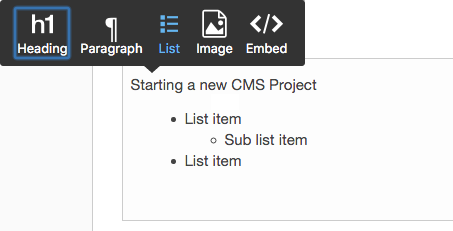
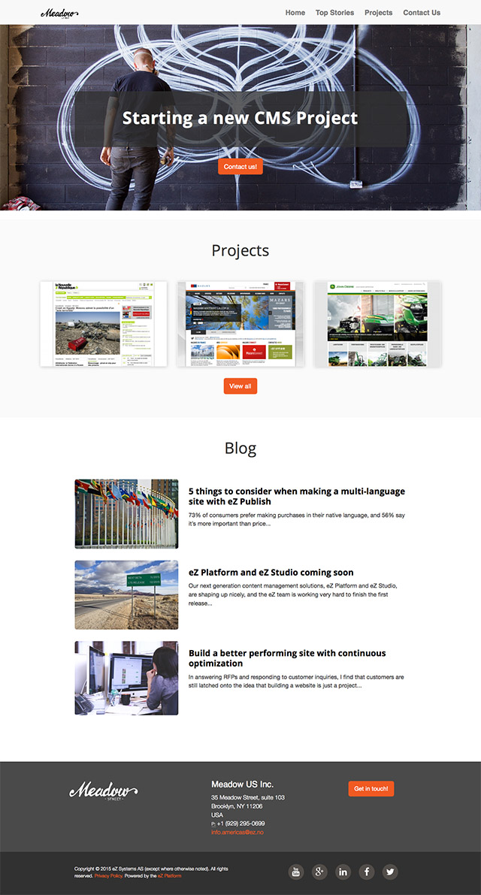

# eZ Platform 16.02 Release notes

The 16.02 *(v1.2.0)* release of eZ Platform is available as of March 3rd, and includes all features and improvements of [15.12.1](ez_platform_15.12.1_release_notes.md) from February 5th.

For the release notes of the corresponding eZ Studio release, see [eZ Studio 16.02 Release notes](ez_studio_15.12.1_release_notes.md).

### Quick links

-   [Installation instructions]((../getting_started/install_ez_platform.md))[](https://github.com/ezsystems/ezplatform/blob/v15.05/INSTALL.md)
-   [Requirements](../getting_started/requirements.md)
-   Download: See [share.ez.no/downloads](http://share.ez.no/downloads/downloads/ez-platform-16.02)

## Changes since 15.12.1

For list of issues fixed in 16.02 see [52 issues](https://jira.ez.no/secure/IssueNavigator.jspa?reset=true&jqlQuery=fixVersion+in+%28%2216.02%22%29+AND+project+%3D+EZP+AND+issuetype+in+%28Story%2C+Improvement%2C+Bug%29+order+by+issuetype++&src=confmacro) , below is a list of notable bugs/features/enhancements done in the release.

### **Online Editor**

#### **Image variation in RichText Fields**

Added option to choose image variations for images embedded in Rich text Fields.


#### **Image alignment**

 

 Both Images and Embed elements can be aligned left, right or center in the Online Editor.

 

#### New List Element
 

Added an (unordered) List element in the Online Editor.



### Permissions

Added role versioning to better handle editing of roles.

### Trash Management

Content items moved to Trash can be viewed and trash can be emptied.


### Preview of upgrade support from eZ Publish Platform 5.4/2014.11

This release contains migrations tools for migrating XmlText to RichText, this is explained in the new [5.4.x/2014.11 upgrade documentation page](../updating/updating_ez_platform.md).

### eZ Platform Demo

eZ Platform now also comes[in a new demo version](https://github.com/ezsystems/ezplatform-demo) that better showcases eZ Platform in use with a provided web site and corresponding  content:



### Easier install & testing

As of 16.02, eZ Platform now supports being tested using the built in PHP internal server as exposed by Symfony's `server:run` command.

Assuming you have [composer installed globally](https://getcomposer.org/doc/00-intro.md#installation-linux-unix-osx), and your MySQL/MariaDB server already setup with a database, you can get eZ Platform demo up and running with just the following commands:

 

``` bash
composer create-project --no-dev --keep-vcs ezsystems/ezplatform-demo
cd ezplatform-demo

php app/console ezplatform:install --env=prod demo
php app/console assetic:dump --env=prod web

php app/console server:run --env=prod 
```

 Note : the `--keep-vcs` option allows you to get the git history.

### And also

-   Display Content Type name when browsing content in UI
-   New `ez_field` Twig function to get full translated field, and not just value like existing `ez_field_value` does contributed by [@rihards]()
-   Installers don't write configuration anymore, making eZ Platform and eZ Studio installation possible on cloud hosting platforms like platform.sh
-   Product pages inside UI now works without warnings on https contributed by [@nmeirik](https://github.com/nmeirik)
-   System Info tab in Admin UI now displays correct version of eZ Platform, and there is also a new Packages tab for composer info

..and many other great improvements and fixes to this release that you can see in JIRA:  [52 issues](https://jira.ez.no/secure/IssueNavigator.jspa?reset=true&jqlQuery=fixVersion+in+%28%2216.02%22%29+AND+project+%3D+EZP+AND+issuetype+in+%28Story%2C+Improvement%2C+Bug%29+order+by+issuetype++&src=confmacro) *


Editor Roles

Be aware that for Editors to be able to successfully edit content, including content with author fields filled with other users, you'll at the moment need to configure Editor Group via Roles to have access to read user content items using a policy like `content/read Class(User), Section(User)`

This implies they have full read access to other users data, so assign this with caution. We will improve this in an upcoming release, see [EZP-25789](https://jira.ez.no/browse/EZS-593?src=confmacro) - Editors access to own user and read all user meta info for author field type Backlog for further info.

## Upgrading a from 15.12 or 15.12.1 project

Testing release candidates

If you are testing a release candidate, replace the tag `v1.2.0` with the[latest rc tag](https://github.com/ezsystems/ezplatform/releases) (example: `v1.2.1-rc1`)

New proposed upgrade process

This section reflects a proposed git based workflow for handling upgrades, feedback on how this works in practice and input on how to further improve/simplify it is welcome.

Existing 15.12.1 (1.1.0) projects can also easily be updated using Composer. From the project's root, create a new branch from the project's master, or from the branch you're upgrading on:

**From your master branch**

``` bash
git checkout -b upgrade-1.2.0
```

If it's not there, add ezsystems/ezplatform as an upstream remote:

**From the upgrade-1.2.0 branch**

``` bash
git remote add ezplatform http://github.com/ezsystems/ezplatform.git
```

Then pull the tag into your branch:

**From the upgrade-1.2.0 branch**

``` bash
git pull ezplatform v1.2.0
```

You will get conflicts, and it is perfectly normal. The most common ones will be on `composer.json` and `composer.lock`.
The latter can be ignored, as it will be regenerated when we execute composer update later. The easiest is to checkout the version from the tag, and add it to the changes:

If you get a **lot** of conflicts (on the `doc` folder for instance), and eZ Platform was installed from the [share.ez.no](http://share.ez.no) tarball, it might be because of incomplete history. You will have to run `git fetch ezplatform --unshallow` to load the full history, and run the merge again.

**From the upgrade-1.2.0 branch**

``` bash
git checkout --theirs composer.lock && git add composer.lock
```

You may also run `git remove composer.lock` if you do not keep a copy of it in the branch.

### Merging composer.json

#### Manual merging

Conflicts in `composer.json` need to be fixed manually. If you're not familiar with the diff output, you may checkout the tag's version, and inspect the changes. It should be readable for most:

**From the upgrade-1.2.0 branch**

``` bash
git checkout --theirs composer.json && git diff composer.json
```

You should see what was changed, as compared to your own version, in the diff output. The ezplatform update changes the requirements for all of the `ezsystems/` packages. Those changes should be left untouched. All of the other changes will be removals of what you added for your own project. Use `git checkout -p` to selectively cancel those changes:

``` bash
git checkout -p composer.json
```

Answer `no` (do not discard) to the requirement changes of `ezsystems` dependencies. Answer `yes` (discard) to removals of your changes.

Once you are done, inspect the file, either using an editor or by running `git diff composer.json`. You may also test the file's sanity with `composer validate`, and test the dependencies by running `composer update --dry-run`. (will output what it would do to dependencies, without applying the changes.

Once finished, run `git add composer.json.`

#### Fixing other conflicts (if any)

Depending on the local changes you have done, you may get other conflicts: configuration files, kernel... 

There shouldn't be many, and you should be able to figure out which value is the right one for all of them:

-   Edit the file, and identify the conflicting changes. If a setting you have modified has also been changed by us, you should be able to figure out which value is the right one.
-   Run `git add conflicting-file` to add the changes

### Updating composer.lock

At this point, you should have a composer.json file with the correct requirements. Run `composer update` to update the dependencies. 

``` bash
composer update --with-dependencies ezsystems/ezpublish-kernel ezsystems/platform-ui-bundle ezsystems/behatbundle
```

In order to restrict the possibility of unforeseen updates of 3rd party packages, we recommend by default that `composer update` is restricted to the list of packages we have tested the update for. You may remove this restriction, but be aware that you might get a package combination we have not tested.

On PHP conflict

Because from this release onwards eZ Platform is compatible only with PHP 5.5 and higher, the update command above will fail if you use an older PHP version. Please update PHP to proceed.

#### Database update

The 16.02 release requires an update to the database. Import `vendor/ezsystems/ezpublish-kernel/data/update/mysql/dbupdate-6.1.0-to-6.2.0.sql` into your database:

``` bash
mysql -u<username> -p<password> <database_name> < vendor/ezsystems/ezpublish-kernel/data/update/mysql/dbupdate-6.1.0-to-6.2.0.sql
```

### Dump assets

The web assets must be dumped again for the prod environment:

``` bash
php app/console assetic:dump --env=prod web
```

### Commit, test and merge

Once all the conflicts have been resolved, and `composer.lock` updated, the merge can be committed. Note that you may or may not keep `composer.lock`, depending on your version management workflow. If you do not wish to keep it, run `git reset HEAD <file>` to remove it from the changes. Run `git commit`, and adapt the message if necessary. You can now test the project, run integration tests... once the upgrade has been approved, go back to `master`, and merge the `upgrade-1.2.0` branch:

``` bash
git checkout master
git merge upgrade-1.2.0
```

Double check the following before you test:

You should now have a new route in` app/config/routing.yaml`:

`_ezplatformRepositoryFormsRoutes:    resource: "@EzSystemsRepositoryFormsBundle/Resources/config/routing.yaml"`
