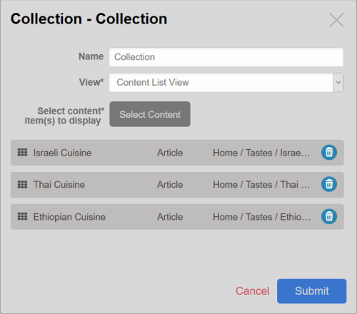

# eZ Platform v1.11.0

**The FAST TRACK v1.11.0 release of eZ Platform and eZ Platform Enterprise Edition is available as of August 24, 2017.**

If you are looking for the Long Term Support (LTS) release, see [https://ezplatform.com/Blog/Long-Term-Support-is-Here](https://ezplatform.com/Blog/Long-Term-Support-is-Here)

## Notable changes since v1.10.0

### eZ Platform Enterprise Edition

#### Collection block

New Collection block is available in the Landing Page editor.
It enables you to manually select a set of Content items to be displayed.

!!! note

    To enable adding content to a Collection block in a clean installation,
    you need to configure the views for the block and define which Content Types can be embedded in it.
    See [block templates](../guide/extending_ez_platform_ui.md#block-templates) for more information and an example.

#### RecommendationBundle adapted for YooChoose v2

In the RecommendationBundle, the id generation of a visitor was changed to use a persistent cookie value
instead of a new one each time a visitor arrives at the site.

Fetching recommendations was also refactored to use the v2 of the recommendation API.
With this step the clickrecommended event now includes detailed feedback information about how recommendations were generated.
This is very important for the analysis of statistics to measure the performance of recommendations.

See [EZEE-1611](https://jira.ez.no/browse/EZEE-1611) for details.

## Full list of new features, improvements and bug fixes since v1.10.0

| eZ Platform   | eZ Enterprise  |
|--------------|------------|
| [List of changes for final of eZ Platform v1.11.0 on Github](https://github.com/ezsystems/ezplatform/releases/tag/v1.11.0) | [List of changes for final for eZ Platform Enterprise Edition v1.11.0 on Github](https://github.com/ezsystems/ezplatform-ee/releases/tag/v1.11.0) |
| [List of changes for rc1 of eZ Platform v1.11.0 on Github](https://github.com/ezsystems/ezplatform/releases/tag/v1.11.0-rc1) | [List of changes for rc1 for eZ Platform Enterprise Edition v1.11.0 on Github](https://github.com/ezsystems/ezplatform-ee/releases/tag/v1.11.0-rc1) |
| [List of changes for beta1 of eZ Platform v1.11.0 on Github](https://github.com/ezsystems/ezplatform/releases/tag/v1.11.0-beta1) | [List of changes for beta1 of eZ Platform Enterprise Edition v1.11.0 on Github](https://github.com/ezsystems/ezplatform-ee/releases/tag/v1.11.0-beta1) |

### Installation

[Installation Guide](../getting_started/install_ez_platform.md)

[Technical Requirements](../getting_started/requirements_and_system_configuration.md)

### Download

#### eZ Platform

- Download at [eZPlatform.com](http://ezplatform.com/#download)

#### eZ Enterprise

- [Customers: eZ Enterprise subscription (BUL License)](https://support.ez.no/Downloads)
- [Partners: Test & Trial software access (TTL License)](https://support.ez.no/Downloads)

If you would like to request an eZ Enterprise Demo instance: <http://ez.no/Forms/Discover-eZ-Studio>

### Updating

To update to this version, follow the [Updating eZ Platform](updating_ez_platform.md) guide and use v1.11.0 as `<version>`.
