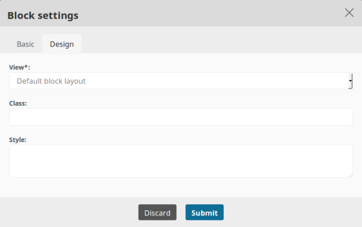
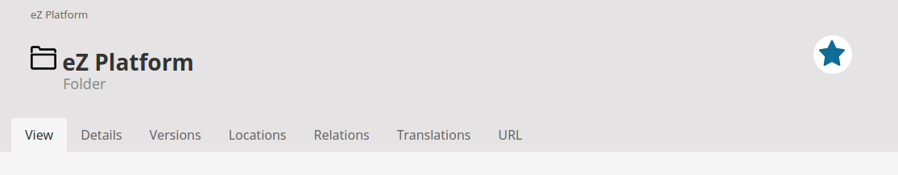
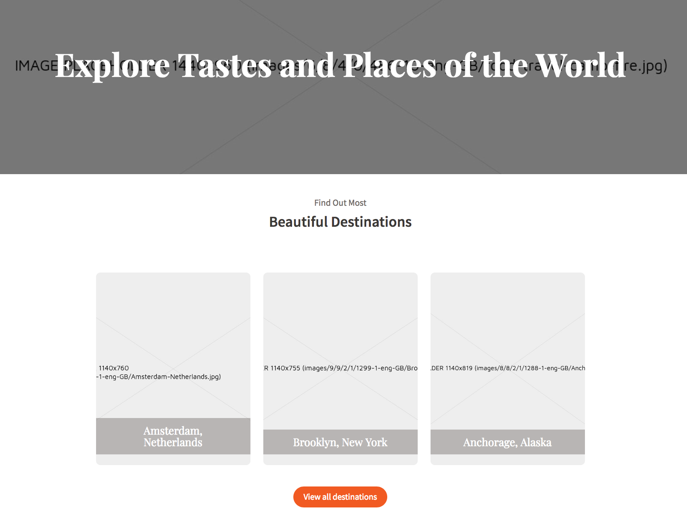
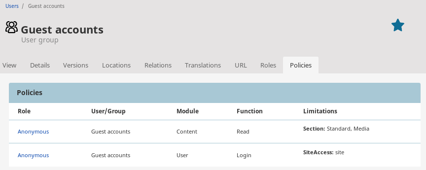

# eZ Platform v2.2.0

**Version number**: v2.2.0

**Release date**: June 29, 2018

**Release type**: Fast Track

## Notable changes

### Page Builder

This version introduces the **Page Builder** which replaces the Landing Page editor from earlier versions.

[SCREENSHOT]

!!! note

    In version v2.2 the Page Builder does not contain Schedule and Form blocks.
    They will be included again in a future release.

#### Modifying the Page Content Type

You can edit the new Page Content Type by adding Fields, as well as create new Content Types with the Page Field Type.

#### Page block design

In the Page block config you can now specify the CSS class with its own style for the specific block:

### Bookmarks

Bookmark service allows you to create bookmarks for Locations by selecting a star located next to the Content Type name as shown in the screenshot below. Each Location can only be bookmarked once, multiple bookmarks on one Location will cause an error. 

You can find the list of all bookmarks in *Browse content* section. There, you can manage bookmarks by deleting them or by checking if specific Location has been bookmarked.

### Image placeholders

[Placeholder generator](../guide/images.md#setting-placeholder-generator) enables you to replace any missing image with downloaded or generated image placeholder. It can be used when you are working on an existing database and you are not able to download uploaded images to your local development environment because of their large size.

### Previewing User and User Group permissions

When viewing User or User Group Content items you can now preview what permissions are assigned to them.

You can also [select which Content Types are treated the same way as User of User Group](../guide/configuration.md#user-identifiers) for these purposes.

### Change from UTF8 to UTF8MB4

Database charset is changed from UTF8 to UTF8MB4, in order to support 4-byte characters.

!!! caution

    To cover this change when upgrading, follow the instructions in the [update guide](updating_ez_platform.md#4-update-database).

### URL generation pattern

You can now select the pattern that will be used to generate URL patterns.

See [URL alias patterns](../guide/url_management.md#url-alias-patterns) for more information about the available settings.

!!! caution "Default URL generation pattern"

    The default URL generation pattern changes from `urlalias` to `urlalias_lowercase`.
    This change will only apply to new Content.
    Pay attention to the new `url_alias.slug_converter.transformation` setting in the meta-repository when updating your installation.

### Crowdin in-context translation

AdminUI interface is now translatable using [Crowdin's in-context tool](../community_resources/translations#how-to-translate-the-interface-using-crowdin). When navigating through the AdminUI interface you will now be able to translate it. A glossary has been established to aid in unified usage of terminology throughout. Contributions are welcome - https://crowdin.com/project/ezplatform

## Full list of new features, improvements and bug fixes since v2.1.0

| eZ Platform   | eZ Enterprise  |
|--------------|------------|
| [List of changes for final of eZ Platform v2.2.0 on Github](https://github.com/ezsystems/ezplatform/releases/tag/v2.2.0) | [List of changes for final for eZ Platform Enterprise Edition v2.2.0 on Github](https://github.com/ezsystems/ezplatform-ee/releases/tag/v2.2.0) |
| [List of changes for rc1 of eZ Platform v2.2.0 on Github](https://github.com/ezsystems/ezplatform/releases/tag/v2.2.0-rc1) | [List of changes for rc1 for eZ Platform Enterprise Edition v2.2.0 on Github](https://github.com/ezsystems/ezplatform-ee/releases/tag/v2.2.0-rc1) |
| [List of changes for beta1 of eZ Platform v2.2.0 on Github](https://github.com/ezsystems/ezplatform/releases/tag/v2.2.0-beta1) | [List of changes for beta1 of eZ Platform Enterprise Edition v2.2.0 on Github](https://github.com/ezsystems/ezplatform-ee/releases/tag/v2.2.0-beta1) |

## Installation

[Installation Guide](../getting_started/install_ez_platform.md)

[Technical Requirements](../getting_started/requirements_and_system_configuration.md)
