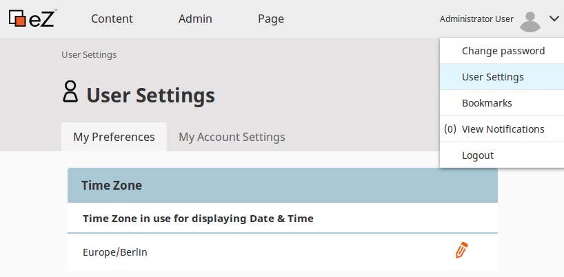

# eZ Platform v2.3

**Version number**: v2.3

**Release date**: September 28, 2018

**Release type**: Fast Track

## Notable changes

### Content scheduling

!!! enterprise

    You can now schedule content on a Page to become visible at a specific time in the future.

    To do this you can use the Schedule tab in any block's configuration or a special Content Scheduler block.

    In the Schedule tab you can define when any block becomes visible and when it disappears from a Page.

    [screenshot]

    Content Scheduler is a special block with a queue of Content items, each with its own airtime.
    The Content becomes available at the airtime, and is replaced with new Content items coming in from the queue.

    [screenshot]

    All changes to scheduled content on a Page are visible in the timeline.

    [screenshot]

    The timeline also shows other events, such a Content published using the date-based publisher.

### Form Builder

!!! enterprise

    The new Form Builder enables you to create Form Content items with multiple form fields.

    [screenshot]

    You can preview and download submissions in the Back Office.

    [screenshot]

### ImageAsset Field Type

### Regenerating URL aliases

A new `ezplatform:urls:regenerate-aliases` command enables you to regenerate all URL aliases.
You can use it after changing URL alias configuration, or in case of database corruption.

See [Regenerating URL aliases](../guide/url_management.md#regenerating-url-aliases) for more information.

### User preferences

You can now access and set user preferences in the user menu.

### API improvements

### Miscellaneous

#### Back Office translations

## Full list of new features, improvements and bug fixes since v2.2.0

| eZ Platform   | eZ Enterprise  |
|--------------|------------|
| [List of changes for final of eZ Platform v2.3.0 on Github](https://github.com/ezsystems/ezplatform/releases/tag/v2.3.0) | [List of changes for final for eZ Platform Enterprise Edition v2.3.0 on Github](https://github.com/ezsystems/ezplatform-ee/releases/tag/v2.3.0) |
| [List of changes for rc1 of eZ Platform v2.3.0 on Github](https://github.com/ezsystems/ezplatform/releases/tag/v2.3.0-rc1) | [List of changes for rc1 for eZ Platform Enterprise Edition v2.3.0 on Github](https://github.com/ezsystems/ezplatform-ee/releases/tag/v2.3.0-rc1) |
| [List of changes for beta1 of eZ Platform v2.3.0 on Github](https://github.com/ezsystems/ezplatform/releases/tag/v2.3.0-beta1) | [List of changes for beta1 of eZ Platform Enterprise Edition v2.3.0 on Github](https://github.com/ezsystems/ezplatform-ee/releases/tag/v2.3.0-beta1) |

## Installation

[Installation Guide](../getting_started/install_ez_platform.md)

[Technical Requirements](../getting_started/requirements_and_system_configuration.md)
