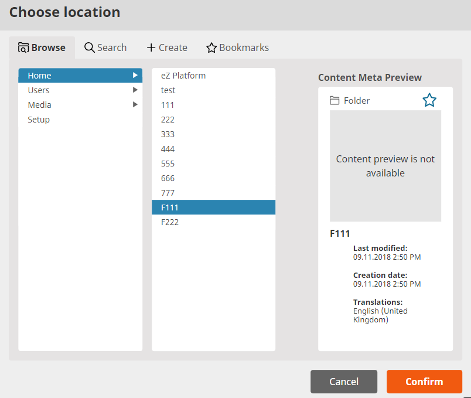
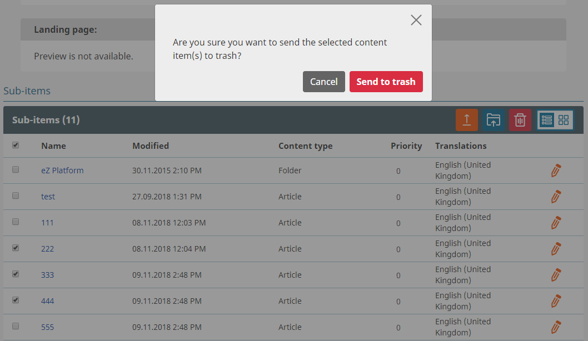

# eZ Platform v2.4

**Version number**: v2.4

**Release date**: 

**Release type**: 

## Notable changes

### Page Builder

### User Bundle

### RichText

#### RichText Field Type

#### Rich Text block

#### Improve styling in Rich Text Editor

#### Images in Rich Text

#### Literal tag in Rich text

### Translations

#### Language-region translation

#### Content Type translation

### Navbar

### Multi-file management

Multi-file content management is a set of functionalities that enables you to move and delete multiple binary files in a bulk.

 To move multiple items select them and click 'Move selected items' from 'Sub-items' top bar.
Then choose a Location from 'Choose location' modal that opens up.
After choosing and confirming new Location all selected files are moved to it.

 
 
 To delete multiple items select them and click 'Delete selected items' in the 'Sub-items' top bar.
 Confirm your choice in the pop-up window with 'Send to trash' button.
 
 

See [Multi-file content management](https://doc.ezplatform.com/projects/userguide/en/latest/multi_file_content_management/) for more information.

### Workflow

### Form block

### Draft list

List of all drafts can now be found in the **Administrator User** menu.
    

See [Reviewing a draft](https://doc.ezplatform.com/projects/userguide/en/latest/publishing/#reviewing-a-draft) for more information.

### Create form on the fly

### Subtree search filter

### Updating the outdated verbiage (add screenshot)

The outdated Policy verbiage is now updated:

|Old|New|
|---|---|
|class|Content Type|
|ParentClass|Content Type of Parent|
|node|Location|
|parentdepth|Parent Depth|
|parentgroup|Content Type Group of Parent|
|parentowner|Owner of Parent| 
|subtree|Subtree of Location|

### API improvements

## Full list of new features, improvements and bug fixes since v2.3

| eZ Platform   | eZ Enterprise  |
|--------------|------------|
| [List of changes for final of eZ Platform v2.4.0 on Github](https://github.com/ezsystems/ezplatform/releases/tag/v2.4.0) | [List of changes for final for eZ Platform Enterprise Edition v2.4.0 on Github](https://github.com/ezsystems/ezplatform-ee/releases/tag/v2.4.0) |
| [List of changes for rc2 of eZ Platform v2.4.0 on Github](https://github.com/ezsystems/ezplatform/releases/tag/v2.4.0-rc2) | [List of changes for rc2 for eZ Platform Enterprise Edition v2.4.0 on Github](https://github.com/ezsystems/ezplatform-ee/releases/tag/v2.4.0-rc2) |
| [List of changes for rc1 of eZ Platform v2.4.0 on Github](https://github.com/ezsystems/ezplatform/releases/tag/v2.4.0-rc1) | [List of changes for rc1 for eZ Platform Enterprise Edition v2.4.0 on Github](https://github.com/ezsystems/ezplatform-ee/releases/tag/v2.4.0-rc1) |
| [List of changes for beta1 of eZ Platform v2.4.0 on Github](https://github.com/ezsystems/ezplatform/releases/tag/v2.4.0-beta1) | [List of changes for beta1 of eZ Platform Enterprise Edition v2.4.0 on Github](https://github.com/ezsystems/ezplatform-ee/releases/tag/v2.4.0-beta1) |