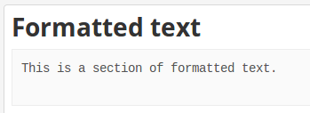
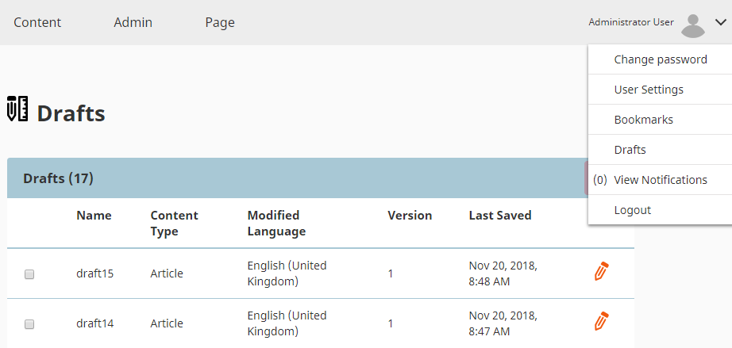
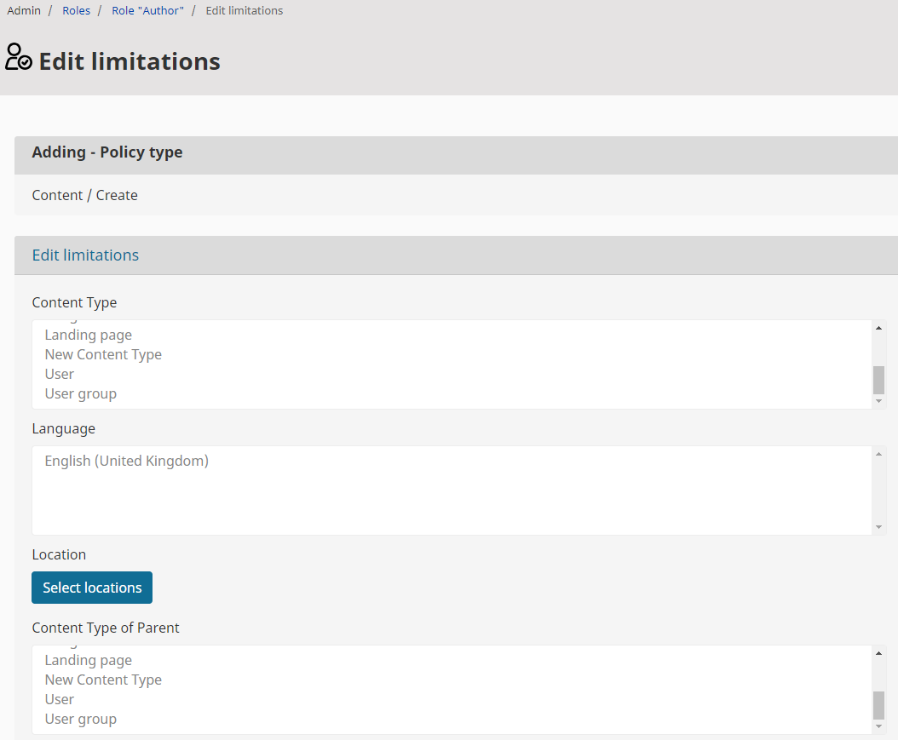

# eZ Platform v2.4

**Version number**: v2.4

**Release date**:

**Release type**:

## Notable changes

### Editorial workflow

Editorial workflow enables you to pass content through a series of stages.
Each step can be used to represent for example contributions and approval of different teams and editors.

For example, the built-in Article workflow passes through draft, design and proofreading stages.

The workflow mechanism is permission-aware. You can control which users can edit content in which stages
pass content through which transition.

Workflow Engine for eZ Platform EE is located in an [ezplatform-workflow bundle](https://github.com/ezsystems/ezplatform-workflow).

### RichText

#### RichText Field Type

RichText Field Type has been extracted to a separate bundle, [ezplatform-richtext](https://github.com/ezsystems/ezplatform-richtext).
See [RichText Field Type Reference](../api/field_type_reference.md#richtext-field-type).

#### Rich Text block

In the Page Builder you can make use of the Rich Text block.
It enables you to insert text created using the Online Editor with all features of a Rich Text Field.

#### Improve styling in Online Editor

Online Editor has been improved with new styling.

#### Images in Rich Text

You can now attach links to images in the Online Editor:

#### Formatted text in Rich text

You can now use formatted text in Rich Text Fields (provided by means of a `literal` tag).

#### Inline embedding in Rich Text

The new `embed-inline` built-in view type enables embedding Content items within a block element in Rich Text.

### Translations

#### Content Type translation

### Multi-file management

New multi-file content management functionalities enable you to move and delete multiple files at the same time.

See [Multi-file content management](https://doc.ezplatform.com/projects/userguide/en/latest/multi_file_content_management/) for more information.

### Create form on the fly

You can now create Forms on the fly from the Universal Discovery Widget.

### Draft list

The list of all drafts can now be found in the **Administrator User** menu under **Drafts**.

See [Reviewing a draft](https://doc.ezplatform.com/projects/userguide/en/latest/publishing/#reviewing-a-draft) for more information.

### Subtree search filter

A new filter enables you to filter search results by Subtree.

See [Simplified Filtered search](https://doc.ezplatform.com/projects/userguide/en/latest/search/#simplified-filtered-search) for more information.

### Policy labels update

The outdated Policy labels are now updated:

|Old|New|
|---|---|
|class|Content Type|
|ParentClass|Content Type of Parent|
|node|Location|
|parentdepth|Parent Depth|
|parentgroup|Content Type Group of Parent|
|parentowner|Owner of Parent|
|subtree|Subtree of Location|

### API improvements

#### Simplified use of Content Type objects

This release introduces a few simplifications to API use for Content Types:

- Exposes `content->getContentType()` for easier use, including from Twig as `content.contentType`
- Adds possibility to load several Content Types in bulk using `ContentTypeService->loadContentTypeList()`

### BC breaks and important behavior changes

- Online Editor format for `ezlink` inside `ezembed` tag changed to an anchor tag. See [ezplatform-richtext/pull/20](https://github.com/ezsystems/ezplatform-richtext/pull/20).
- The merge order of content edit forms has been changed. It can affect you if you extended the content edit template. See [ezplatform-admin-ui/pull/720](https://github.com/ezsystems/ezplatform-admin-ui/pull/720).

## Full list of new features, improvements and bug fixes since v2.3

| eZ Platform   | eZ Enterprise  |
|--------------|------------|
| [List of changes for final of eZ Platform v2.4.0 on Github](https://github.com/ezsystems/ezplatform/releases/tag/v2.4.0) | [List of changes for final for eZ Platform Enterprise Edition v2.4.0 on Github](https://github.com/ezsystems/ezplatform-ee/releases/tag/v2.4.0) |
| [List of changes for rc2 of eZ Platform v2.4.0 on Github](https://github.com/ezsystems/ezplatform/releases/tag/v2.4.0-rc2) | [List of changes for rc2 for eZ Platform Enterprise Edition v2.4.0 on Github](https://github.com/ezsystems/ezplatform-ee/releases/tag/v2.4.0-rc2) |
| [List of changes for rc1 of eZ Platform v2.4.0 on Github](https://github.com/ezsystems/ezplatform/releases/tag/v2.4.0-rc1) | [List of changes for rc1 for eZ Platform Enterprise Edition v2.4.0 on Github](https://github.com/ezsystems/ezplatform-ee/releases/tag/v2.4.0-rc1) |
| [List of changes for beta1 of eZ Platform v2.4.0 on Github](https://github.com/ezsystems/ezplatform/releases/tag/v2.4.0-beta1) | [List of changes for beta1 of eZ Platform Enterprise Edition v2.4.0 on Github](https://github.com/ezsystems/ezplatform-ee/releases/tag/v2.4.0-beta1) |
