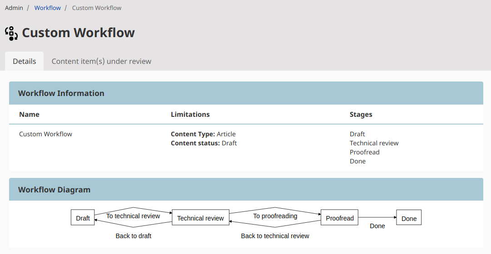
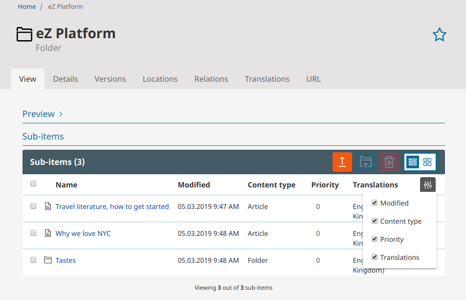

# eZ Platform v2.5

**Version number**: v2.5

**Release date**: March 29, 2019

**Release type**: Long Term Supported

## Notable changes

### Content Tree

### Webpack Encore

This release introduces [Webpack Encore](https://symfony.com/doc/3.4/frontend.html#webpack-encore)
as the preferred tool for asset management.

Assetic is still is use, but it will be deprecated in a future version.

### PostgreSQL

### User Settings

The User Settings menu has been expanded with the following options:

- Preferred language of the Back Office
- Preferred date format
- Preference to enable or disable character counter for Rich Text Fields

### User bundle

The new [ezplatform-user](https://github.com/ezsystems/ezplatform-user) bundle now centralizes
all features related to user management, such as user accounts, registering, changing passwords, etc.

!!! enterprise

    ### Workflow improvements

    You can now preview a diagram of the configured workflows in the Admin panel.

    

    After selecting configured workflow administrator user is now able to see all Content items under review for it.

    

### eZ Commerce clean Installer

### Online editor

Anchors in Richtext

#### Inline custom tags

You can now create [inline custom tags](../guide/extending_online_editor.md#inline-custom-tags) in Rich Text Fields.

### Hiding and revealing content

You can now hide and reveal Content items from the Back Office.
Hidden content will be unavailable on the front page regardless of permissions or [Location visibility](../guide/content_management.md#location-visibility).

### Back Office improvements

Several Back Office improvements to facilitate editorial experience, including:

- [Icons for Content Types and the ability to define them](../guide/extending_ez_platform.md#custom-content-type-icons)
- Ability to collapse and expand content preview to have easier access to the Sub-items list
- Responsive Sub-items table with selectable column layout
- Simpler assigning of Object States to content

### Matrix Field Type

The new Matrix Field Type enables you to store a table of data.
Columns in the matrix are defined in the Field definition.

### Product version preview

The Dashboard now shows the version of eZ Platform you are running.

TODO add screenshot with final version

### GraphQL

### API improvements

New API improvements include:

- `sudo()` exposed officially in API to make it more clear how you can skip permission checks when needed
- `AssignSectionToSubtreeSignal` to assign Sections to subtrees
- new `loadLanguageListByCode()` and `loadLanguageListById()` endpoints for bulk loading of languages
- new method `ContentService->loadContentInfoList()` for bulk loading Content information
    - it can be used with `ContentService->loadContentListByContentInfo()` to bulk load Content
    - v2.5 also takes advantage of it in e.g. `RelationList` and `ParameterProvider`

## Requirements changes

Due to using Webpack Encore, installing and updating eZ Platform now [requires Node.js and yarn](updating_ez_platform.md#3-update-the-app).

This release also changes support for versions of third-party software:

- Solr 4 is no longer supported. Use Solr 6 instead (Solr 6.6LTS recommended).
- Apache 2.2 is no longer supported. Use Apache 2.4 instead.
- Varnish 4 is no longer supported. Use Varnish 5.1 or higher (6.0LTS recommended).

For full list of supported versions see [Requirements](../getting_started/requirements.md).

## Full list of new features, improvements and bug fixes since v2.4

| eZ Platform  | eZ Enterprise  |
|--------------|------------|
| [List of changes for final of eZ Platform v2.5.0 on Github](https://github.com/ezsystems/ezplatform/releases/tag/v2.5.0) | [List of changes for final for eZ Platform Enterprise Edition v2.5.0 on Github](https://github.com/ezsystems/ezplatform-ee/releases/tag/v2.5.0) |
| [List of changes for rc1 of eZ Platform v2.5.0 on Github](https://github.com/ezsystems/ezplatform/releases/tag/v2.5.0-rc1) | [List of changes for rc1 for eZ Platform Enterprise Edition v2.5.0 on Github](https://github.com/ezsystems/ezplatform-ee/releases/tag/v2.5.0-rc1) |
| [List of changes for beta2 of eZ Platform v2.5.0 on Github](https://github.com/ezsystems/ezplatform/releases/tag/v2.5.0-beta2) | [List of changes for beta2 of eZ Platform Enterprise Edition v2.5.0 on Github](https://github.com/ezsystems/ezplatform-ee/releases/tag/v2.5.0-beta2) |
| [List of changes for beta1 of eZ Platform v2.5.0 on Github](https://github.com/ezsystems/ezplatform/releases/tag/v2.5.0-beta1) | [List of changes for beta1 of eZ Platform Enterprise Edition v2.5.0 on Github](https://github.com/ezsystems/ezplatform-ee/releases/tag/v2.5.0-beta1) |
