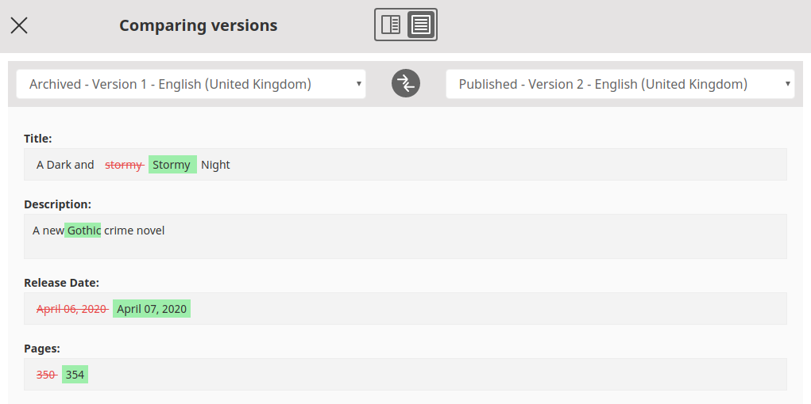
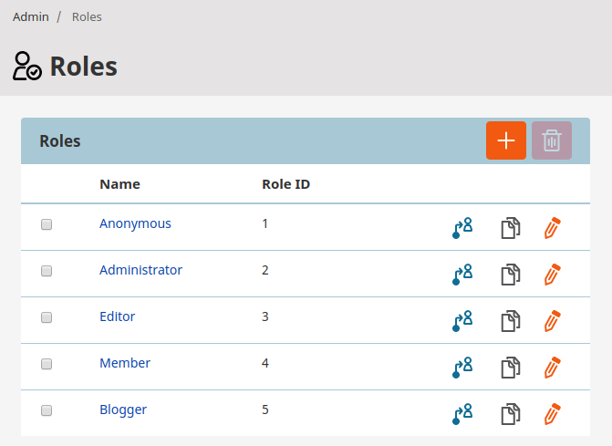

# eZ Platform v3.0

**Version number**: v3.0

**Release date**: April 2, 2020

**Release type**: Fast Track

## Overview

## Notable changes

### Symfony 5

The version 3.0 moves eZ Platform to Symfony 5.0 from the previously used Symfony 3.4.

This entails several changes to the way projects are organized.
For details, see [Symfony 4.0](https://github.com/symfony/symfony/blob/5.0/UPGRADE-4.0.md)
and [Symfony 5.0 upgrade documentation](https://github.com/symfony/symfony/blob/5.0/UPGRADE-5.0.md)

### Using Events instead of SignalSlots

The application now uses Symfony Events instead of SignalSlots.
The application triggers two Events per operation: one before and one after the relevant thing happens
(see for example [BookmarkService](https://github.com/ezsystems/ezplatform-kernel/blob/v1.0.0/eZ/Publish/Core/Event/BookmarkService.php)).

To use Symfony Events, create [Event Listeners](https://symfony.com/doc/5.0/event_dispatcher.html) in your code.

### New bundles

The list of bundles in v3.0 has been extended by the following ones:

- [`ezplatform-calendar`](https://github.com/ezsystems/ezplatform-calendar)
- [`ezplatform-content-forms`](https://github.com/ezsystems/ezplatform-content-forms)
- [`ezplatform-kernel`](https://github.com/ezsystems/ezplatform-kernel)
- [`ezplatform-rest`](https://github.com/ezsystems/ezplatform-rest)
- [`ezplatform-site-factory`](https://github.com/ezsystems/ezplatform-site-factory)
- [`ezplatform-version-comparison`](https://github.com/ezsystems/ezplatform-version-comparison)

For details, see [Bundles](../guide/bundles.md).

## New features

!!! enterprise

    ### Site Factory
    
    The new Site management User Interface is now integrated with Admin UI.
    It enables you to easily create and manage multiple sites from the Back Office without editing the configuration files.
    
    For more information on: 
    
    - enabling and configuring, see [Site Factory in developer documentation](../guide/site_factory.md)
    - using the Site Factory, see [User Guide](https://doc.ezplatform.com/projects/userguide/en/3.0/site_organization/site_factory/)

    ### Scheduling
    
    #### Schedule calendar
    
    You can now easily view and perform scheduling actions using the Calendar widget available in the Back Office.
    By default, the widget displays Content items scheduled for future publication, but custom events can be configured as well.
    You can also filter displayed events and toggle through a day, week, and month view.
    
    #### Manage planned publications with Dashboard
        
    You can now reschedule or cancel planned future publications right from the Dashboard.
    
    #### Schedule hiding a Content item
    
    You can now schedule hiding Content items.
    Using Calendar widget available in the Back Office you can also reschedule or cancel hiding a Content item.
    
    ### Defining buttons in Online Editor
    
    You can now reorder and disable buttons in Online Editor using [YAML configuration](../extending/extending_online_editor.md#customizing-buttons).

    ### Workflow improvements
    
    #### Workflow actions
    
    You can now configure your workflows to [automatically publish content](../guide/workflow.md#publishing-content-with-workflow).
    
    You can also create [custom workflow actions](../extending/extending_workflow.md#adding-custom-actions).
    
    #### Reviewers
    
    When sending content through a workflow, the user can now select reviewers.
    You can require the user to select reviewers when sending content through the workflow.
    
    In the configuration, you can also set the workflow to [automatically notify the selected reviewers](../guide/workflow.md#sending-notifications).
    
    #### Quick review
    
    A built-in Quick Review offers a quick workflow configuration for your basic needs.
    
    #### Custom transition color
    
    You can configure a custom color for each of the transitions defined in the Workflow.
    
    ## Version comparison
    
    You can now compare two versions of the same Content item and preview changes in their Fields:
    
    
    
### Universal Discovery Widget

The Universal Discovery Widget (UDW) has been re-designed and re-written.
New functionalities and changes include:

- new configuration
- filtered search 
- resizable column with custom sort order
- editing content from UDW (Enterprise only)

For full list of changes, see [Backwards compatibility doc](ez_platform_v3.0_deprecations.md#universal-discovery-widget) and [Configuration](../extending/extending_udw.md#configuration).

### Field Types

#### Content query Field Type

The new [Content query Field Type](../api/field_type_reference.md#content-query-field-type)
enables you to configure a Content query that will use parameters from a Field definition.

#### Field Type creation

You can now use [Generic Field Type](../extending/extending_field_type.md) as a template for your custom Field Types.

#### Keyword Field Type

The `keyword` Field Type can now recognize versions of a Content item.

### Login and password options

#### Login by User name or email

You can now give your users th ability to [log in with User name or with email](../guide/user_management.md#login-methods).

#### Password rules

You can now set [password expiration rules](../guide/user_management.md#password-expiration)
for user passwords.

### Duplicate a role

You can now duplicate a role with a single click in the Back Office.

### REST API reference

The REST reference has been moved from Kernel to a new page, [eZ Platform REST API.](https://doc.ezplatform.com/rest-api-reference)

### Search Criteria

The following new Search Criteria have been added:

|Search Criterion|Search based on|
|-----|-----|
|[IsUserBased](../guide/search/criteria_reference/isuserbased_criterion.md)|Whether content represents a User account|
|[IsUserEnabled](../guide/search/criteria_reference/isuserenabled_criterion.md)|Whether a User account is enabled|
|[ObjectStateIdentifier](../guide/search/criteria_reference/objectstateidentifier_criterion.md)|Object State Identifier|
|[SectionId](../guide/search/criteria_reference/sectionid_criterion.md)|ID of the Section content is assigned to|
|[SectionIdentifier](../guide/search/criteria_reference/sectionidentifier_criterion.md)|Identifier of the Section content is assigned to|
|[UserEmail](../guide/search/criteria_reference/useremail_criterion.md)|Email address of a User account|
|[Sibling](../guide/search/criteria_reference/sibling_criterion.md)|Locations that are children of the same parent|
|[UserId](../guide/search/criteria_reference/userid_criterion.md)|User ID|
|[UserLogin](../guide/search/criteria_reference/userlogin_criterion.md)|User login|

### Random sorting

The list of common Sort Clauses has been extended by the Random sorting option.

### Contextual Twig variables

You can now create [contextual Twig variables](../guide/templates.md#contextual-twig-variables) for use in templates.
They can be defined per SiteAccess, or per content view.

### Built-in Query Types

Five built-in ready-to-use Query Types have been added: `Children`, `Siblings`, `Ancestors`, `RelatedToContent`, and `GeoLocation`.

You can now use the `ez_render_content_query` and `ez_render_location_query` Twig functions
to make use of Query Types that do not use the current content or Location.

### Grouping blocks in Page Builder

You can now assign Page Builder blocks to groups using the `ezplatform_page_fieldtype.blocks.<block_name>.category` setting.

### Bulk actions in Sub-items list

You can now use the Sub-items list to quickly hide, reveal, to add Locations to multiple Content items.

### Tooltips

You can now add custom tooltips to provide more information for the users when they hover over, focus on, or tap an element.
For more information, see [Tooltips UI documentation](../guidelines/components/tooltips.md) and [Guide to adding tooltips](../extending/extending_tooltips.md).

### Thumbnails

The new thumbnails API allows you to easily choose an image for each content.
For more information, see [Extending thumbnails](../extending/extending_thumbnails.md).

### Type hints for Public API

Strict types have been added to Public API methods, for full list see [backwards compatibility breaks](ez_platform_v3.0_deprecations.md#strict-types-for-php-api).

## Other changes

### GraphQL

In GraphQL, you can now [query Locations and their children](../api/graphql_queries.md#querying-locations).

### Translations

#### Improved translating of notifications

`TranslationService` is not injected into the `NotificationService`.
You can now use `TranslatableNotificationHandlerInterface` for translated notifications.

#### Multilingual content route

New multilingual content route for internal translations has been added.

### Renamed templates and parameters

Templates and parameters used by the Back Office have been renamed for consistency.
For A full list of changes, see [Backwards compatibility doc](ez_platform_v3.0_deprecations.md).

### HTTP Cache

HTTP cache bundle now uses FOS Cache Bundle v2.
For a full list of changes this entails, see [Backwards compatibility doc](ez_platform_v3.0_deprecations.md#ezplatform-http-cache).

### Helpers

New helper method `window.eZ.helpers.contentType.getContentTypeName` replaces deprecated `ContentTypeNames`.

### User Field Type

User data is now treated as an external storage.

### SiteAccess-aware Repository

The Repository now uses the SiteAccess-aware layer by default.
This means that Repository objects will now be loaded in the translation corresponding to the SiteAccess.

### REST API

Revealing and hiding content can now be performed via REST API.

### PHP API

New methods have been introduced to the PHP API:

`\eZ\Publish\API\Repository\Values\Content\ContentInfo::getContentType`
`\eZ\Publish\API\Repository\Values\Content\ContentInfo::getSection`
`\eZ\Publish\API\Repository\Values\Content\ContentInfo::getMainLanguage`
`\eZ\Publish\API\Repository\Values\Content\ContentInfo::getMainLocation`
`\eZ\Publish\API\Repository\Values\Content\ContentInfo::getOwner`
`\eZ\Publish\API\Repository\Values\Content\VersionInfo::getCreator`
`\eZ\Publish\API\Repository\Values\Content\VersionInfo::getInitialLanguage`
`\eZ\Publish\API\Repository\Values\Content\VersionInfo::getLanguages`
`\eZ\Publish\API\Repository\Values\Content\Location::getParentLocation`

## Deprecations and removals

For full list of deprecations and removals, see  [eZ Platform v3.0 deprecations and backwards compatibility breaks](ez_platform_v3.0_deprecations.md).

### SignalSlots

SignalSlots are removed from the application.
Use [Event Listeners](https://symfony.com/doc/5.0/event_dispatcher.html) in your code instead.

### Deprecated Field Types

The deprecated `ezprice` and `ezpage` Field Types have been removed.
Nameable field type interface has been removed and replaced by `eZ\Publish\SPI\FieldType\FieldType::getName`.
For a full list of changes on Field Types, see [Backwards compatibility doc](ez_platform_v3.0_deprecations.md#field-types).

### Elastic Search

Elastic Search support has been dropped.

### REST server

REST-related code has been moved from Kernel to a new [`ezsystems/ezplatform-rest`](https://github.com/ezsystems/ezplatform-rest) package.
Following the change, the REST client has been removed from Kernel.

### Kernel

`ezpublish-kernel` has been replaced by [`ezplatform-kernel`.](https://github.com/ezsystems/ezplatform-kernel)

### Online Editor

Online Editor front-end code and assets have been moved to the `ezplatform-richtext` repository.
For a full list of resulting changes, see [Backwards compatibility doc](ez_platform_v3.0_deprecations.md#online-editor).

### Configuration through `ezplatform`

In YAML configuration, the main configuration key is now `ezplatform` instead of `ezpublish`.

### Content forms

The new `ezplatform-content-forms` package contains forms for content creation moved from `repository-forms`,
while Content Type editing has been moved to `ezplatform-admin-ui` from `repository-forms`.

### Custom Installers

The Symfony Service definitions, providing extension point to create custom installers, have been removed.

## Requirements changes

eZ Platform now requires using PHP 7.3. For full list of, see [eZ Platform requirements](../getting_started/requirements.md).

!!! note

    Some OS-es, such as  Ubuntu 10.x or CentoOS 8.x come with PHP 7.2.
    In such cases remember to manually update the PHP version.

## Updating

For the upgrade details, see [eZ Platform v3.0 project update instructions](../updating/upgrading_to_v3.md).

## Full changelog

| eZ Platform   | eZ Enterprise  |
|--------------|------------|
| [List of changes for final of eZ Platform v3.0.0 on Github](https://github.com/ezsystems/ezplatform/releases/tag/v3.0.0) | [List of changes for final for eZ Platform Enterprise Edition v3.0.0 on Github](https://github.com/ezsystems/ezplatform-ee/releases/tag/v3.0.0) |
| [List of changes for rc1 of eZ Platform v3.0.0 on Github](https://github.com/ezsystems/ezplatform/releases/tag/v3.0.0-rc1) | [List of changes for rc1 for eZ Platform Enterprise Edition v3.0.0 on Github](https://github.com/ezsystems/ezplatform-ee/releases/tag/v3.0.0-rc1) |

## eZ Platform v3.0.2

### Sort Trash items

Public PHP API `SortClause` has been exposed for `TrashService` queries:
`eZ\Publish\API\Repository\Values\Content\Query\SortClause\Trash\DateTrashed`
(to be used by `\eZ\Publish\API\Repository\TrashService::findTrashItems` only).
It enables you to sort Trash items by date.