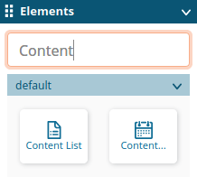
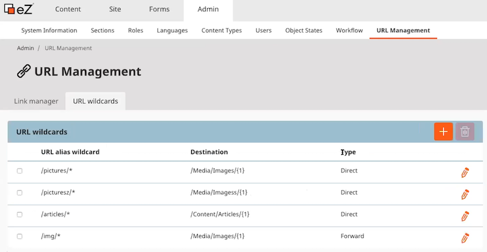
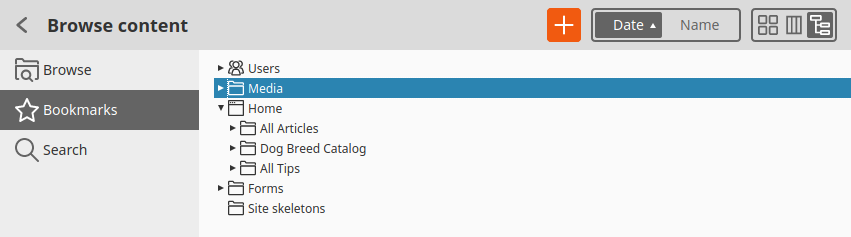

# eZ Platform v3.1

**Version number**: v3.1

**Release date**: June XX, 2020

**Release type**: Fast Track

## Overview

## Notable changes

## New features

This release of eZ Platform introduces the following new features:

!!! enterprise

    ### Site Factory

    #### Site skeleton

    You can now create multiple content structures that can be used as Site skeletons for the new sites.

    For more information about Site skeleton, see [Configure Site skeleton](../guide/site_factory.md#configure-site-skeleton).

    #### Defining parent Location

    You can now define the parent Location for every new site in the template configuration.

    For more information about defining parent Location, see [Configure parent Location](../guide/site_factory.md#configure-parent-location).
    
    ### Page Builder
    
    You can now filter elements in the sidebar during site creation process to get to the desired blocks faster.

    

### URL management UI

You can now manage URL addresses and URL wildcards with a comfortable user interface that is available in the Back Office. You can create, modify and delete URL wildcards, as well as decide if the user should be redirected to the new address on clicking the link.

!!! note

  As of this release, the Link manager is no longer part of the Content panel, and now it belongs to the Admin panel of the Back Office.

For more information about URL management, see [URL management](../guide/url_management.md) in the developer documentation.

### Tree view in the Universal Discovery Widget

The Universal Discovery Widget, referred to as the Content Browser in User Documentation, has been updated by adding the Tree view.
You can now switch between the Grid, Panels and Tree views to browse and manage user accounts, media files, content items and forms.
Selections that you make in one view survive when you switch to the other view.

For more information about configuring the Universal Discovery Widget, see [URL management](../extending/extending_udw.md) in the developer documentation.

### Saving incomplete draft

As of this release, when users create or edit a Content item or a Page, they can save it without completing all the required fields.
They can then return to editing, or pass the content to another contributor.
Validation that used to happen at each save operation now, by default, happens when you click the **Publish** button.

Also, as part of this feature, the `ContentService::validate()` method has been added that you can use to trigger validation of individual fields 
or whole Content items for completeness at other stages of the editing process.

### Search

#### ezplatform-search

[`ezplatform-search`](https://github.com/ezsystems/ezplatform-search) is a new repository
that contains search functionalities that are not dependent on the search engine

#### Search controller

A customizable search controller has been extracted and placed in `ezplatform-search`.

#### Searching in trash

You can now search through the contents of Trash and sort the search results based on a number of Search Criteria and Sort Clauses that can be used by the `\eZ\Publish\API\Repository\TrashService::findTrashItems` method only.

For more information, see [Searching in trash](../api/public_php_api_search.md#searching-in-trash).

### PermissionResolver

You can now have a Service that provides both `PermissionResolver` and `PermissionCriterionResolver` by injecting `eZ\Publish\API\Repository\PermissionService`.

## Requirement changes

This release changes support for ...

For full list of supported versions, see [Requirements](../getting_started/requirements.md).

## Full changelog

| eZ Platform  | eZ Enterprise  |
|--------------|------------|
| [eZ Platform v3.1.0](https://github.com/ezsystems/ezplatform/releases/tag/v3.1.0) | [eZ Enterprise v3.1.0](https://github.com/ezsystems/ezplatform-ee/releases/tag/v3.1.0) |
