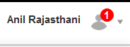
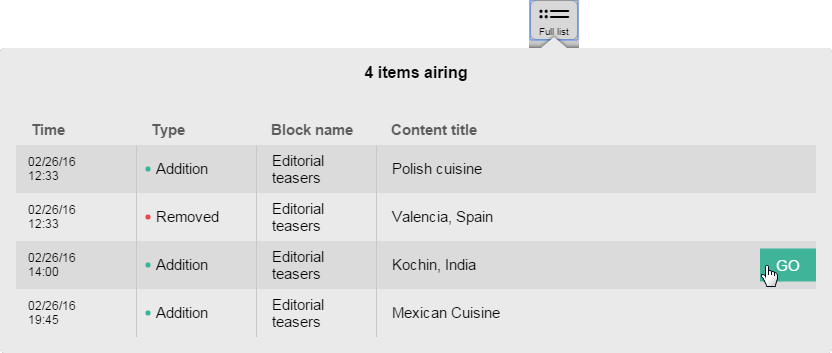
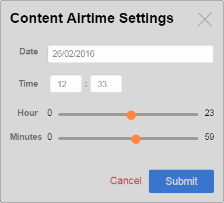

# eZ Studio 16.02 Release notes


The 16.02 *(v1.2.0)* release of eZ Studio is available as of March 3rd, and includes all features and improvements of [15.12.1](ez_platform_15.12.1_release_notes.md) from February 5th.

For the release notes of the corresponding *(and included)* eZ Platform release, see [eZ Platform 16.02 Release notes](ez_platform_16.02_release_notes.md).

### Quick links

-   [Installation instructions](https://github.com/ezsystems/ezplatform/blob/v15.05/INSTALL.md)
-   Download:

    -   As Customer with eZ Enterprise subscription: <https://support.ez.no/Downloads> *([BUL](http://ez.no/About-our-Software/Licenses-and-agreements/eZ-Business-Use-License-Agreement-eZ-BUL-Version-2.1?return=/About-our-Software/Licenses-and-agreements/eZ-Business-Use-License-Agreement-eZ-BUL-Version-2.1?processed=1457699707&return=%2FAbout-our-Software%2FLicenses-and-agreements%2FeZ-Business-Use-License-Agreement-eZ-BUL-Version-2.1?return=%2FAbout-our-Software%2FLicenses-and-agreements%2FeZ-Business-Use-License-Agreement-eZ-BUL-Version-2.1) License)*

    -   As Partner with Test & Trial software access: <https://support.ez.no/Downloads>* *([TTL](http://ez.no/About-our-Software/Licenses-and-agreements/eZ-Trial-and-Test-License-Agreement-eZ-TTL-v2.0) License)**

    -   If none of the above, request a demo instance: <http://ez.no/Forms/HTML-forms/Discover-eZ-Studio>

## Changes since 15.12.1

### Summary of changes

-   Added user profile with notifications containing the number of pending requests for review.

When you are selected as a reviewer for a Content item, you receive a notification about it by email. The message contains a direct link to the draft.

As a reviewer you also receive notifications in your user profile. When you are logged in, a number appears next to your profile picture (in the top right corner of the screen) which shows how many requests for review you have received.



Click your profile and choose View notifications. You can see a Notifications window with a list of all requests:


 


 

 

-   Timeline toolbar shows all changes in all Schedule Blocks on a given Landing Page, both in View and in Edit modes.
-   UI improvement: updated the look of the Items airing and Full list.



-   UI improvement: sliders added to the time selection modal when selecting airtime for Schedule block.



-   Various bug fixes.

 

### Full list of improvements

 

|                                                                |                                                                                                                                             |                                                                                                                                   |
|----------------------------------------------------------------|---------------------------------------------------------------------------------------------------------------------------------------------|-----------------------------------------------------------------------------------------------------------------------------------|
| Key                                                            | Summary                                                                                                                                     | T                                                                                                                                 |
| [EZP-25446](https://jira.ez.no/browse/EZP-25446?src=confmacro) | [Add the user profile in the navigation hub](https://jira.ez.no/browse/EZP-25446?src=confmacro)                                             | [](https://jira.ez.no/browse/EZP-25446?src=confmacro)   |
| [EZEE-557](https://jira.ez.no/browse/EZEE-557?src=confmacro)   | [As a user, I want to have at least two user profiles to come in the default demo bundle](https://jira.ez.no/browse/EZEE-557?src=confmacro) | [](https://jira.ez.no/browse/EZEE-557?src=confmacro)                |
| [EZEE-543](https://jira.ez.no/browse/EZEE-543?src=confmacro)   | [Create a slider field view](https://jira.ez.no/browse/EZEE-543?src=confmacro)                                                              | [](https://jira.ez.no/browse/EZEE-543?src=confmacro) |
| [EZEE-542](https://jira.ez.no/browse/EZEE-542?src=confmacro)   | [Reorganize field views files structure](https://jira.ez.no/browse/EZEE-542?src=confmacro)                                                  | [](https://jira.ez.no/browse/EZEE-542?src=confmacro) |
| [EZEE-531](https://jira.ez.no/browse/EZEE-531?src=confmacro)   | [Change the Favicon for Studio](https://jira.ez.no/browse/EZEE-531?src=confmacro)                                                           | [](https://jira.ez.no/browse/EZEE-531?src=confmacro)    |
| [EZEE-507](https://jira.ez.no/browse/EZEE-507?src=confmacro)   | [Update the look of the indicator list and full list](https://jira.ez.no/browse/EZEE-507?src=confmacro)                                     | [](https://jira.ez.no/browse/EZEE-507?src=confmacro) |
| [EZEE-495](https://jira.ez.no/browse/EZEE-495?src=confmacro)   | [Timepicker add hour and minute sliders](https://jira.ez.no/browse/EZEE-495?src=confmacro)                                                  | [](https://jira.ez.no/browse/EZEE-495?src=confmacro)    |
| [EZEE-488](https://jira.ez.no/browse/EZEE-488?src=confmacro)   | [Droppable interaction with final animation added](https://jira.ez.no/browse/EZEE-488?src=confmacro)                                        | [](https://jira.ez.no/browse/EZEE-488?src=confmacro)    |
| [EZEE-481](https://jira.ez.no/browse/EZEE-481?src=confmacro)   | [Improve the way that users hover over, select and move blocks within Page Mode](https://jira.ez.no/browse/EZEE-481?src=confmacro)          | [](https://jira.ez.no/browse/EZEE-481?src=confmacro)    |
| [EZEE-476](https://jira.ez.no/browse/EZEE-476?src=confmacro)   | [As a user, I want to be notified about new content that's sent to me for review](https://jira.ez.no/browse/EZEE-476?src=confmacro)         | [](https://jira.ez.no/browse/EZEE-476?src=confmacro)                |
| [EZEE-470](https://jira.ez.no/browse/EZEE-470?src=confmacro)   | [As a user, I want to be able to use the Timeline Toolbar in View Mode](https://jira.ez.no/browse/EZEE-470?src=confmacro)                   | [](https://jira.ez.no/browse/EZEE-470?src=confmacro)                |

 [11 issues](https://jira.ez.no/secure/IssueNavigator.jspa?reset=true&jqlQuery=key+%3D+EZS-557+OR+key+%3D+EZS-476+OR+key+%3D+EZS-507+OR+key+%3D+EZS-495+OR+key+%3D+EZS-470+OR+key+%3D+EZS-543+OR+key+%3D+EZS-542+OR+key+%3D+EZS-481+OR+key+%3D+EZS-531+OR+key+%3D+EZS-488+OR+key+%3D+EZP-25446++&src=confmacro "View all matching issues in JIRA.")

 

### Full list of bugfixes

 

|                                                              |                                                                                                                                      |                                                                                                                |
|--------------------------------------------------------------|--------------------------------------------------------------------------------------------------------------------------------------|----------------------------------------------------------------------------------------------------------------|
| Key                                                          | Summary                                                                                                                              | T                                                                                                              |
| [EZEE-559](https://jira.ez.no/browse/EZEE-559?src=confmacro) | [All siteaccesses are underlined in studio](https://jira.ez.no/browse/EZEE-559?src=confmacro)                                        | [](https://jira.ez.no/browse/EZEE-559?src=confmacro) |
| [EZEE-553](https://jira.ez.no/browse/EZEE-553?src=confmacro) | [Content Airtime Settings reset automatically after a while](https://jira.ez.no/browse/EZEE-553?src=confmacro)                       | [](https://jira.ez.no/browse/EZEE-553?src=confmacro) |
| [EZEE-549](https://jira.ez.no/browse/EZEE-549?src=confmacro) | [Timestamp appearing the date field instead of a date in the airtime config popup](https://jira.ez.no/browse/EZEE-549?src=confmacro) | [](https://jira.ez.no/browse/EZEE-549?src=confmacro) |
| [EZEE-547](https://jira.ez.no/browse/EZEE-547?src=confmacro) | [Can't return to Home page](https://jira.ez.no/browse/EZEE-547?src=confmacro)                                                        | [](https://jira.ez.no/browse/EZEE-547?src=confmacro) |
| [EZEE-545](https://jira.ez.no/browse/EZEE-545?src=confmacro) | [Push-out confirmation after freeing slots in Schedule block](https://jira.ez.no/browse/EZEE-545?src=confmacro)                      | [](https://jira.ez.no/browse/EZEE-545?src=confmacro) |
| [EZEE-540](https://jira.ez.no/browse/EZEE-540?src=confmacro) | [Issue with adding duplicated content item in Schedule block](https://jira.ez.no/browse/EZEE-540?src=confmacro)                      | [](https://jira.ez.no/browse/EZEE-540?src=confmacro) |
| [EZEE-537](https://jira.ez.no/browse/EZEE-537?src=confmacro) | [No validation on Approval Timeline page input field](https://jira.ez.no/browse/EZEE-537?src=confmacro)                              | [](https://jira.ez.no/browse/EZEE-537?src=confmacro) |
| [EZEE-536](https://jira.ez.no/browse/EZEE-536?src=confmacro) | [Typo in Approval Timeline message title](https://jira.ez.no/browse/EZEE-536?src=confmacro)                                          | [](https://jira.ez.no/browse/EZEE-536?src=confmacro) |
| [EZEE-523](https://jira.ez.no/browse/EZEE-523?src=confmacro) | [The page preview is trying to update when user is not on a landing page](https://jira.ez.no/browse/EZEE-523?src=confmacro)          | [](https://jira.ez.no/browse/EZEE-523?src=confmacro) |
| [EZEE-513](https://jira.ez.no/browse/EZEE-513?src=confmacro) | [Getting error message when previewing the content of Content List Block](https://jira.ez.no/browse/EZEE-513?src=confmacro)          | [](https://jira.ez.no/browse/EZEE-513?src=confmacro) |

 [10 issues](https://jira.ez.no/secure/IssueNavigator.jspa?reset=true&jqlQuery=key+%3D+EZS-559+OR+key+%3D+EZS-553+OR+key+%3D+EZS-540+OR+key+%3D+EZS-545+OR+key+%3D+EZS-549+OR+key+%3D+EZS-547+OR+key+%3D+EZS-537+OR+key+%3D+EZS-536+OR+key+%3D+EZS-523+OR+key+%3D+EZS-513+&src=confmacro "View all matching issues in JIRA.")

 

## Known Issues

*However here are two issues that were uncovered very late in the release process since they were hidden by other bugs that we would like to make you especially aware of:*

-    [EZP-25789](https://jira.ez.no/browse/EZS-593?src=confmacro) - Editors access to own user and read all user meta info for author field type Backlog
-    [EZP-25505](https://jira.ez.no/browse/EZP-25505?src=confmacro) - UserHash is always generated for anonymous user Backlog

 

*Both are currently being worked on and will be fixed in patch version in the next couple of weeks.*

*
*

### Disabling Studio Demo Bundle

eZStudioDemoBundle is a showcase of eZ Studio. It should not serve as a base for projects. A clean installer of Studio is on its way.

In the meantime, you can overwrite the bundle in two ways:

1. Due to Symfony2 loading mechanism, bundles are loaded last and have the highest priority, so you can place your app in a bundle and load it last in `AppKernel.php`. Then every Studio Demo configuration will be overwritten.

2. Disable the `eZStudioDemoBundle` from `AppKernel.php`, then only your configuration will remain. This solution generates extra work, you have to take care of content existing in Studio Demo and every template used in it (location views, block templates, page design, etc.). You can always remove all the content in Home root, then disable the Demo Bundle and you should encounter no exceptions.

In version **16.04** we will provide a clean installer without demo content and with generic landing page block templates, where you can create your design and place configuration wherever you want.

## Upgrading a 15.12.1 Studio project

You can easily upgrade your existing Studio project in version 15.12.1 (1.1.0) using Composer.

Start from the project root. First, create a new branch from:

a) your master project branch, or 

b) the branch you are upgrading on:

**From your master branch**

``` bash
git checkout -b upgrade-1.2.0
```

In case of different localization of the sources, add `ezsystems/ezstudio` as an upstream remote:

**From the upgrade-1.2.0 branch**

``` bash
git remote add ezstudio http://github.com/ezsystems/ezstudio.git
```

Then pull the tag into your branch:

**From the upgrade-1.2.0 branch**

``` bash
git pull ezstudio v1.2.0
```

Caution!

If you had custom siteaccesses or languages set up in your installation, a conflict may appear here. This is because new siteaccesses are introduced in Studio demo in this release: "fr" for French, "de" for German and "no" for Norwegian.

To avoid overriding your siteaccesses with the new ones, you need to accept your own changes in the `app/config/ezplatform.yml` file.

If you have no custom siteaccesses or languages and no conflict occurs, you can do one of the following things:

**A)** Add languages and permissions to use the newly introduced siteaccesses from the demo.

To do this, log in to the application and go to the Admin Panel.

Choose Languages and click Create a new language. Create a language for each of the new siteaccesses.

Then, click **Roles** and select the Anonymous Role. Click Edit limitations next to the following function:


Select all available siteaccesses and click Save.

**B)** Remove the new siteaccesses.

 

 

You will get conflicts, and it is perfectly normal. The most common ones will be on `composer.json` and `composer.lock`.

The latter can be ignored, as it will be regenerated when we execute composer update later. The easiest is to checkout the version from the tag, and add it to the changes:

If you get a **lot** of conflicts (on the `doc` folder for instance), and eZ Studio was installed from the [share.ez.no](http://share.ez.no) tarball, it might be because of incomplete history. You will have to run `git fetch ezstudio --unshallow` to load the full history, and run the merge again.

**From the upgrade-1.2.0 branch**

``` bash
git checkout --theirs composer.lock && git add composer.lock
```

### Merging composer.json

#### Manual merging

Conflicts in `composer.json` need to be fixed manually. If you're not familiar with the diff output, you may checkout the tag's version, and inspect the changes. It should be readable for most:

**From the upgrade-1.2.0 branch**

``` bash
git checkout --theirs composer.json && git diff HEAD composer.json
```

You should see what was changed, as compared to your own version, in the diff output. This update changes the requirements for all of the `ezsystems/` packages. Those changes should be left untouched. All of the other changes will be removals of what you added for your own project. Use `git checkout -p` to selectively cancel those changes:

``` bash
git checkout -p composer.json
```

Answer `no` (do not discard) to the requirement changes of `ezsystems` dependencies. Answer `yes` (discard) to removals of your changes.

Once you are done, inspect the file, either using an editor or by running `git diff composer.json`. You may also test the file's sanity with `composer validate`, and test the dependencies by running `composer update --dry-run`. (will output what it would do to dependencies, without applying the changes.

Once finished, run `git add composer.json.`

#### Fixing other conflicts (if any)

Depending on the local changes you have done, you may get other conflicts: configuration files, kernel... 

There shouldn't be many, and you should be able to figure out which value is the right one for all of them:

-   Edit the file, and identify the conflicting changes. If a setting you have modified has also been changed by us, you should be able to figure out which value is the right one.
-   Run `git add conflicting-file` to add the changes

### Updating

At this point, you should have a composer.json file with the correct requirements. Run `composer update` to update the dependencies. 

``` bash
composer update --with-dependencies ezsystems/ezpublish-kernel ezsystems/platform-ui-bundle ezsystems/repository-forms ezsystems/studio-ui-bundle ezsystems/ezstudio-demo-bundle ezsystems/landing-page-fieldtype-bundle ezsystems/flex-workflow
```

In order to restrict the possibility of unforeseen updates of 3rd party packages, we recommend by default that `composer update` is restricted to the list of packages we have tested the update for. You may remove this restriction, but be aware that you might get a package combination we have not tested.

On PHP conflict

Because from this release onwards eZ Studio is compatible only with PHP 5.5 and higher, the update command above will fail if you use an older PHP version. Please update PHP to proceed.

#### Database update

The 16.02 release requires an update to the database. Import `vendor/ezsystems/ezpublish-kernel/data/update/mysql/dbupdate-6.1.0-to-6.2.0.sql` into your database:

``` bash
mysql -p -u <database_user> <database_name> < vendor/ezsystems/ezpublish-kernel/data/update/mysql/dbupdate-6.1.0-to-6.2.0.sql
```

To enable the new Flex workflow notification feature, import the following file:

``` bash
mysql -p -u <database_user> <database_name> < vendor/ezsystems/ezstudio-notifications/bundle/Resources/install/ezstudio-notifications.sql
```

### Dump assets

The web assets must be dumped again for the prod environment:

``` bash
php app/console assetic:dump --env=prod web
```

### Commit, test and merge

Once all the conflicts have been resolved, and `composer.lock` updated, the merge can be committed. Note that you may or may not keep `composer.lock`, depending on your version management workflow. If you do not wish to keep it, run `git reset HEAD <file>` to remove it from the changes. Run `git commit`, and adapt the message if necessary. You can now test the project, run integration tests... once the upgrade has been approved, go back to `master`, and merge the `upgrade`-`1.2.0` branch:

``` bash
git checkout master
git merge upgrade-1.2.0
```

Double check the following before you test:

You should now have a new route in` app/config/routing.yml`:

`_ezplatformRepositoryFormsRoutes:    resource: "@EzSystemsRepositoryFormsBundle/Resources/config/routing.yaml"`
