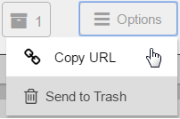

# eZ Studio 2016.04 Release notes

The 16.04 release of eZ Studio is available as of 28 April 2016.

The semantic version of this release is v1.3.0.

For the release notes of the corresponding *(and included)* eZ Platform release, see [eZ Platform 2016.04 Release notes](ez_platform_2016.04_release_notes.md)

 

### Quick links

-   [Installation instructions](../getting_started/install_ez_platform.md)
-    [Requirements](../getting_started/requirements.md)
-   Download:

    -   As Customer with eZ Enterprise subscription: <https://support.ez.no/Downloads> *( [BUL](http://ez.no/About-our-Software/Licenses-and-agreements/eZ-Business-Use-License-Agreement-eZ-BUL-Version-2.1?return=/About-our-Software/Licenses-and-agreements/eZ-Business-Use-License-Agreement-eZ-BUL-Version-2.1?processed=1457699707&return=%2FAbout-our-Software%2FLicenses-and-agreements%2FeZ-Business-Use-License-Agreement-eZ-BUL-Version-2.1?return=%2FAbout-our-Software%2FLicenses-and-agreements%2FeZ-Business-Use-License-Agreement-eZ-BUL-Version-2.1)* * License)*

    -   As Partner with Test & Trial software access: <https://support.ez.no/Downloads> *  *( [TTL](http://ez.no/About-our-Software/Licenses-and-agreements/eZ-Trial-and-Test-License-Agreement-eZ-TTL-v2.0)* * License)* *

    -   If none of the above, request a demo instance: <http://ez.no/Forms/HTML-forms/Discover-eZ-Studio>

 

## Changes since 16.02

### Summary of changes

-   Included a mechanism for migrating legacy Flow content to eZ Studio Landing Pages.
-   You can now preview and edit previous versions of content in Page mode.

In Page mode a new Versions button in available in the Studio toolbar. Click it to view a list of all versions of the current Content item.

When you point to a Content item in the list, two icons appear. You can choose to view a selected version, or to edit in:

-   Visual change to studio toolbar: addition of a Version button and an Options menu

The Options menu allows you to copy the URL of the current Content item, and to send the item to Trash:

-   You can now send content to Trash directly from Page mode.

Use the new Options menu to send a Content item to trash. You then need to go to Content mode to view and manage items in Trash.

-   When installing, you can now choose Studio with demo content, or a clean installation.

The main meta repository has been split in two: **ezstudio** with clean installer and **ezstudio-demo** with demo content. See the [Updating eZ Platform](../updating/updating_ez_platform.md) guide to learn how to select the repository to update to.

 

## Full list of improvements

|                                                              |                                                                                                                                               |                                                                                                                                |
|--------------------------------------------------------------|-----------------------------------------------------------------------------------------------------------------------------------------------|--------------------------------------------------------------------------------------------------------------------------------|
| Key                                                          | Summary                                                                                                                                       | T                                                                                                                              |
| [EZEE-679](https://jira.ez.no/browse/EZEE-679?src=confmacro) | [Xsd Validation for XML files](https://jira.ez.no/browse/EZEE-679?src=confmacro)                                                              |  |
| [EZEE-668](https://jira.ez.no/browse/EZEE-668?src=confmacro) | [Studio static layout shouldn't have hardcoded base template](https://jira.ez.no/browse/EZEE-668?src=confmacro)                               |                |
| [EZEE-614](https://jira.ez.no/browse/EZEE-614?src=confmacro) | [noreply@ez.no is default for notifications](https://jira.ez.no/browse/EZEE-614?src=confmacro)                                                |                |
| [EZEE-612](https://jira.ez.no/browse/EZEE-612?src=confmacro) | [As an administrator I want to have access to every content in eZ Studio](https://jira.ez.no/browse/EZEE-612?src=confmacro)                   |              |
| [EZEE-611](https://jira.ez.no/browse/EZEE-611?src=confmacro) | [Landing Page field type should have default templates for blocks](https://jira.ez.no/browse/EZEE-611?src=confmacro)                          |                |
| [EZEE-610](https://jira.ez.no/browse/EZEE-610?src=confmacro) | [As a user I want to have an administrator account in eZ Studio after clean install](https://jira.ez.no/browse/EZEE-610?src=confmacro)        |              |
| [EZEE-609](https://jira.ez.no/browse/EZEE-609?src=confmacro) | [As a user I want to have basic content types in eZ Studio after clean install](https://jira.ez.no/browse/EZEE-609?src=confmacro)             |              |
| [EZEE-587](https://jira.ez.no/browse/EZEE-587?src=confmacro) | [Timeline / Airtime after automating content](https://jira.ez.no/browse/EZEE-587?src=confmacro)                                               |  |
| [EZEE-581](https://jira.ez.no/browse/EZEE-581?src=confmacro) | [As a user, I want to create a new draft of a published landing page which has open drafts](https://jira.ez.no/browse/EZEE-581?src=confmacro) |              |
| [EZEE-580](https://jira.ez.no/browse/EZEE-580?src=confmacro) | [As a user, I want to edit a landing page which has no open drafts](https://jira.ez.no/browse/EZEE-580?src=confmacro)                         |              |
| [EZEE-579](https://jira.ez.no/browse/EZEE-579?src=confmacro) | [As a user, I want to edit a landing page which has open drafts](https://jira.ez.no/browse/EZEE-579?src=confmacro)                            |              |
| [EZEE-578](https://jira.ez.no/browse/EZEE-578?src=confmacro) | [As a user, I want to create and publish a new draft, based on an older archived version](https://jira.ez.no/browse/EZEE-578?src=confmacro)   |              |
| [EZEE-577](https://jira.ez.no/browse/EZEE-577?src=confmacro) | [As a user, I want to view other versions of my content](https://jira.ez.no/browse/EZEE-577?src=confmacro)                                    |              |
| [EZEE-469](https://jira.ez.no/browse/EZEE-469?src=confmacro) | [As a user, I want to send my content to the trash](https://jira.ez.no/browse/EZEE-469?src=confmacro)                                         |              |
| [EZEE-443](https://jira.ez.no/browse/EZEE-443?src=confmacro) | [As a User, I want the nav-bar to collapse in order to see more of the Page-mode view](https://jira.ez.no/browse/EZEE-443?src=confmacro)      |  |
| [EZEE-408](https://jira.ez.no/browse/EZEE-408?src=confmacro) | [Increase default upload max image size](https://jira.ez.no/browse/EZEE-408?src=confmacro)                                                    |                |
| [EZEE-207](https://jira.ez.no/browse/EZEE-207?src=confmacro) | [As a user I want to save a draft of my new landing pages or delete the draft](https://jira.ez.no/browse/EZEE-207?src=confmacro)              |              |
| [DEMO-16](https://jira.ez.no/browse/DEMO-16?src=confmacro)   | [As an editor, I want to have 3 siteaccesses by default in the demo](https://jira.ez.no/browse/DEMO-16?src=confmacro)                         |   |

 [18 issues](https://jira.ez.no/secure/IssueNavigator.jspa?reset=true&jqlQuery=key+%3D+EZS-679+OR+key+%3D+EZS-207+OR+key+%3D+EZS-443+OR+key+%3D+EZS-558+OR+key+%3D+EZS-408+OR+key+%3D+EZS-580+OR+key+%3D+EZS-581+OR+key+%3D+EZS-579+OR+key+%3D+EZS-578+OR+key+%3D+EZS-577+OR+key+%3D+EZS-668+OR+key+%3D+EZS-469+OR+key+%3D+EZS-612+OR+key+%3D+EZS-611+OR+key+%3D+EZS-610+OR+key+%3D+EZS-609+OR+key+%3D+EZS-614+OR+key+%3D+EZS-587+&src=confmacro "View all matching issues in JIRA.")

 

 

## Full list of bugfixes

 

|                                                              |                                                                                                                                                  |                                                                                                                |
|--------------------------------------------------------------|--------------------------------------------------------------------------------------------------------------------------------------------------|----------------------------------------------------------------------------------------------------------------|
| Key                                                          | Summary                                                                                                                                          | T                                                                                                              |
| [EZEE-749](https://jira.ez.no/browse/EZEE-749?src=confmacro) | [Versions pop-up form vertical scrollbar cannot be dragged by mouse](https://jira.ez.no/browse/EZEE-749?src=confmacro)                           |  |
| [EZEE-743](https://jira.ez.no/browse/EZEE-743?src=confmacro) | [Incorrect block drop animation](https://jira.ez.no/browse/EZEE-743?src=confmacro)                                                               |  |
| [EZEE-740](https://jira.ez.no/browse/EZEE-740?src=confmacro) | [eZ Studio language switcher not working](https://jira.ez.no/browse/EZEE-740?src=confmacro)                                                      |  |
| [EZEE-736](https://jira.ez.no/browse/EZEE-736?src=confmacro) | [Tag block height does not always adjust to preview size](https://jira.ez.no/browse/EZEE-736?src=confmacro)                                      |  |
| [EZEE-735](https://jira.ez.no/browse/EZEE-735?src=confmacro) | [Schedule blocks are not updating when moving timeline slider when previewing content version](https://jira.ez.no/browse/EZEE-735?src=confmacro) |  |
| [EZEE-734](https://jira.ez.no/browse/EZEE-734?src=confmacro) | [Block preview moves between pages](https://jira.ez.no/browse/EZEE-734?src=confmacro)                                                            |  |
| [EZEE-731](https://jira.ez.no/browse/EZEE-731?src=confmacro) | [Not able to edit block settings when scrolling down the preview in landing page editor](https://jira.ez.no/browse/EZEE-731?src=confmacro)       |  |
| [EZEE-730](https://jira.ez.no/browse/EZEE-730?src=confmacro) | [Landing Page field type name yml configuration](https://jira.ez.no/browse/EZEE-730?src=confmacro)                                               |  |
| [EZEE-728](https://jira.ez.no/browse/EZEE-728?src=confmacro) | [Version changes its status when switching previews between different versions](https://jira.ez.no/browse/EZEE-728?src=confmacro)                |  |
| [EZEE-727](https://jira.ez.no/browse/EZEE-727?src=confmacro) | [Versions 'Viewing' label is not refreshed after switching between Edit and View mode](https://jira.ez.no/browse/EZEE-727?src=confmacro)         |  |
| [EZEE-725](https://jira.ez.no/browse/EZEE-725?src=confmacro) | [Page blinks when switching between different pages in Studio demo](https://jira.ez.no/browse/EZEE-725?src=confmacro)                            |  |
| [EZEE-723](https://jira.ez.no/browse/EZEE-723?src=confmacro) | [Schedule block preview does not work in view mode](https://jira.ez.no/browse/EZEE-723?src=confmacro)                                            |  |
| [EZEE-720](https://jira.ez.no/browse/EZEE-720?src=confmacro) | [PhpUnit tests don't work](https://jira.ez.no/browse/EZEE-720?src=confmacro)                                                                     |  |
| [EZEE-719](https://jira.ez.no/browse/EZEE-719?src=confmacro) | [Unable to see dragged block while dragging from the blocks sidebar](https://jira.ez.no/browse/EZEE-719?src=confmacro)                           |  |
| [EZEE-718](https://jira.ez.no/browse/EZEE-718?src=confmacro) | [Unable to preview published version when selecting one from versions popup](https://jira.ez.no/browse/EZEE-718?src=confmacro)                   |  |
| [EZEE-717](https://jira.ez.no/browse/EZEE-717?src=confmacro) | [Errors when opening versions popup with less than 5 items in it](https://jira.ez.no/browse/EZEE-717?src=confmacro)                              |  |
| [EZEE-713](https://jira.ez.no/browse/EZEE-713?src=confmacro) | [Contextual toolbar is still underneath the action drawer](https://jira.ez.no/browse/EZEE-713?src=confmacro)                                     |  |
| [EZEE-710](https://jira.ez.no/browse/EZEE-710?src=confmacro) | [White space when in landing page creator](https://jira.ez.no/browse/EZEE-710?src=confmacro)                                                     |  |
| [EZEE-709](https://jira.ez.no/browse/EZEE-709?src=confmacro) | [Incorrect order of loading js files](https://jira.ez.no/browse/EZEE-709?src=confmacro)                                                          |  |
| [EZEE-708](https://jira.ez.no/browse/EZEE-708?src=confmacro) | [Page height is not set correctly after returning to Page mode](https://jira.ez.no/browse/EZEE-708?src=confmacro)                                |  |
| [EZEE-700](https://jira.ez.no/browse/EZEE-700?src=confmacro) | [Loading screen not appearing when blocks are being initialized in landing page editor](https://jira.ez.no/browse/EZEE-700?src=confmacro)        |  |
| [EZEE-691](https://jira.ez.no/browse/EZEE-691?src=confmacro) | [LandingPage field types typehint the content service implementation](https://jira.ez.no/browse/EZEE-691?src=confmacro)                          |  |
| [EZEE-685](https://jira.ez.no/browse/EZEE-685?src=confmacro) | [Minor typo in Installation instructions](https://jira.ez.no/browse/EZEE-685?src=confmacro)                                                      |  |
| [EZEE-670](https://jira.ez.no/browse/EZEE-670?src=confmacro) | [Ends up in non-existing url after publishing](https://jira.ez.no/browse/EZEE-670?src=confmacro)                                                 |  |
| [EZEE-660](https://jira.ez.no/browse/EZEE-660?src=confmacro) | [Improvement sorting in Schedule Blocks Overflow](https://jira.ez.no/browse/EZEE-660?src=confmacro)                                              |  |
| [EZEE-659](https://jira.ez.no/browse/EZEE-659?src=confmacro) | [The dark overlay stays after deleting Tag block](https://jira.ez.no/browse/EZEE-659?src=confmacro)                                              |  |
| [EZEE-656](https://jira.ez.no/browse/EZEE-656?src=confmacro) | [Empty Schedule block preview is generated with a delay](https://jira.ez.no/browse/EZEE-656?src=confmacro)                                       |  |
| [EZEE-654](https://jira.ez.no/browse/EZEE-654?src=confmacro) | [Landing Page can not be indexed with Solr bundle](https://jira.ez.no/browse/EZEE-654?src=confmacro)                                             |  |
| [EZEE-649](https://jira.ez.no/browse/EZEE-649?src=confmacro) | [eZ Studio hangs on log out](https://jira.ez.no/browse/EZEE-649?src=confmacro)                                                                   |  |
| [EZEE-645](https://jira.ez.no/browse/EZEE-645?src=confmacro) | [Not able to send a content to review when it was published by other user](https://jira.ez.no/browse/EZEE-645?src=confmacro)                     |  |
| [EZEE-644](https://jira.ez.no/browse/EZEE-644?src=confmacro) | [Dynamic layout selection pop-up is not loaded](https://jira.ez.no/browse/EZEE-644?src=confmacro)                                                |  |
| [EZEE-642](https://jira.ez.no/browse/EZEE-642?src=confmacro) | [eZ Studio Schedule block preview does not work in edit mode](https://jira.ez.no/browse/EZEE-642?src=confmacro)                                  |  |
| [EZEE-638](https://jira.ez.no/browse/EZEE-638?src=confmacro) | [Schedule block menu does not show](https://jira.ez.no/browse/EZEE-638?src=confmacro)                                                            |  |
| [EZEE-637](https://jira.ez.no/browse/EZEE-637?src=confmacro) | [Editing root location of siteaccess edits wrong object](https://jira.ez.no/browse/EZEE-637?src=confmacro)                                       |  |
| [EZEE-605](https://jira.ez.no/browse/EZEE-605?src=confmacro) | [landing page frozen](https://jira.ez.no/browse/EZEE-605?src=confmacro)                                                                          |  |
| [EZEE-584](https://jira.ez.no/browse/EZEE-584?src=confmacro) | [eZ Studio blocks does not preview javascript](https://jira.ez.no/browse/EZEE-584?src=confmacro)                                                 |  |

 [36 issues](https://jira.ez.no/secure/IssueNavigator.jspa?reset=true&jqlQuery=key+%3D+EZS-685+OR+key+%3D+EZS-645+OR+key+%3D+EZS-654+OR+key+%3D+EZS-660+OR+key+%3D+EZS-691+OR+key+%3D+EZS-720+OR+key+%3D+EZS-605+OR+key+%3D+EZS-644+OR+key+%3D+EZS-642+OR+key+%3D+EZS-638+OR+key+%3D+EZS-584+OR+key+%3D+EZS-649+OR+key+%3D+EZS-637+OR+key+%3D+EZS-659+OR+key+%3D+EZS-656+OR+key+%3D+EZS-709+OR+key+%3D+EZS-717+OR+key+%3D+EZS-708+OR+key+%3D+EZS-718+OR+key+%3D+EZS-710+OR+key+%3D+EZS-719+OR+key+%3D+EZS-670+OR+key+%3D+EZS-730+OR+key+%3D+EZS-725+OR+key+%3D+EZS-723+OR+key+%3D+EZS-700+OR+key+%3D+EZS-730+OR+key+%3D+EZS-725+OR+key+%3D+EZS-723+OR+key+%3D+EZS-700+OR+key+%3D+EZS-728+OR+key+%3D+EZS-727+OR+key+%3D+EZS-731+OR+key+%3D+EZS-735+OR+key+%3D+EZS-736+OR+key+%3D+EZS-734+OR+key+%3D+EZS-713+OR+key+%3D+EZS-743+OR+key+%3D+EZS-749+OR+key+%3D+EZS-740+&src=confmacro "View all matching issues in JIRA.")

 

 

## Updating

To update to this version, follow the [Updating eZ Platform](../updating/updating_ez_platform.md) guide and use v1.3.0 as `<version>`.
