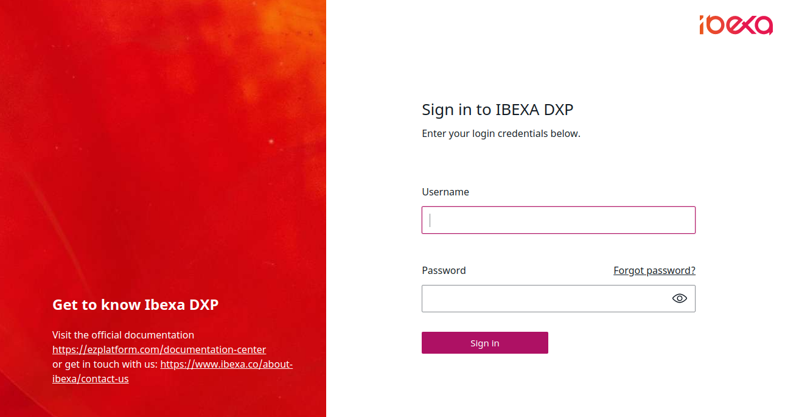
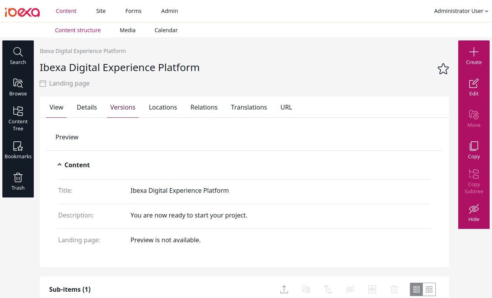
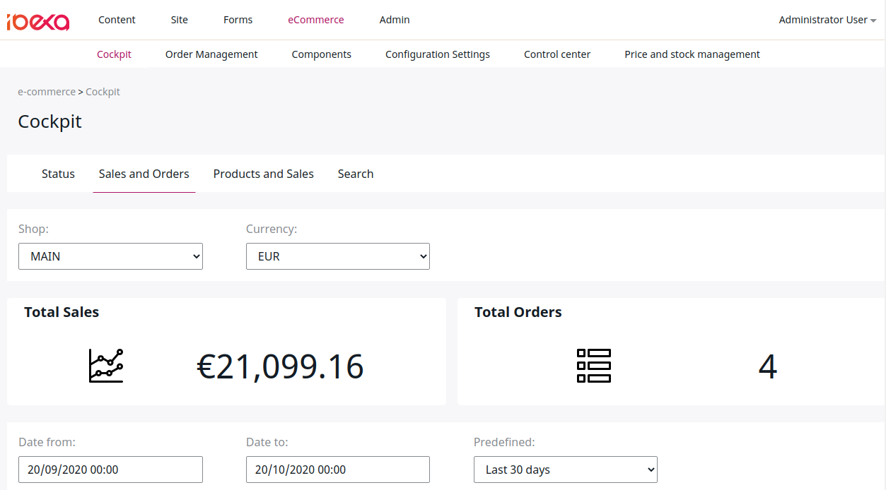

# Ibexa DXP v3.2

**Version number**: v3.2

**Release date**: October 23, 2020

**Release type**: Fast Track

## Notable changes

### New UI

This version offers a completely reworked user interface, covering all of the Back Office,
including eCommerce administration.

### DAM connector

You can now [connect your installation to a Digital Asset Management (DAM) system](../guide/config_connector.md#dam-cofniguration)
and use assets such as images directly from the DAM in your content.

### Autosave

Ibexa Platform can now save your edits in a Content item or product automatically to help you preserve the progress in an event of a failure.
For more information, see [Autosave](https://doc.ibexa.co/projects/userguide/en/latest/publishing/publishing/#autosave).

### Aggregation API

When using Solr or Elasticsearch search engines you can now use aggregations
to group search results and get the count of results per aggregation type.

You can aggregate results by general conditions such as Content Type or Section,
or by Field aggregations such as the value of specific Fields.

See [Aggregation API](../api/public_php_api_search.md#aggregation-api) for more information.

### Targeting block and Segmentation API

Targeting block for the Page Builder enables you to display different Content items to different users
depending on the Segments they belong to.

You can [configure Segments](../guide/admin_panel.md#segments) in the Back Office.

[Segmentation API](../api/public_php_api_managing_users.md#segments) enables you to create and edit Segments and Segment Groups,
as well as assign Users to Segments.

### Twig helpers for content rendering

Three new Twig helpers are available to make rendering content easier.

Use `ez_render_content(content)` and `ez_render_location(location)` to render the selected Content item.

You can also use `ez_render()` and provide it with either a content or Location object.

See [`ez_render` Twig helper](../guide/content_rendering/twig_function_reference/content_twig_functions/#ez_render) for more information.

### JWT authentication

You can now use JWT tokens to authenticate in [REST API](../api/general_rest_usage.md#jwt-authentication)
and [GraphQL](../api/graphql.md#jwt-authentication).

See [JWT authentication](../guide/security.md#jwt-authentication) to learn how to configure this authentication method.

### Searching in Ibexa Commerce with Elasticsearch

You can now use Elasticsearch for searching in Ibexa Commerce.

See [Install Ibexa Platform](../getting_started/install_ez_platform.md#install-and-configure-a-search-engine) to learn how to install and configure the search engine.

## Other changes

### Site Factory improvements

You can now define User Group skeletons where you define Policies and Limitations that apply to a specific User Group. 
You can then associate a number of such skeletons with a site template. 
User Group skeletons survive deleting a site.

See [Configure User Group skeleton](../guide/site_factory.md#configure-user-group-skeleton) for more information.

### Calendar widget improvements

You can now see the scheduled blocks in the calendar after you configure the reveal and/or hide dates for them. 
This way you can envision what content will be available in the future.

Also, you can now apply new filters that are intended to help you declutter the calendar view.

For more information, see [Calendar widget](https://doc.ibexa.co/projects/userguide/en/latest/publishing/advanced_publishing_options/#calendar-widget).

### Cloning Content Types

When creating Content Types in the Back Office, you do not have to start from scratch.
You can now clone an existing Content Type instead.

To do this, click the **Copy** icon located next to the Content Type that you want to clone.
Then, refresh the view to see an updated list of Content Types.

### Object state API improvements

You can now use `ObjectStateService::loadObjectStateByIdentifier()` and `ObjectStateService::loadObjectStateGroupByIdentifier()`
to [get Object states and Object state groups](../api/public_php_api_managing_repository.md#getting-object-state-information) in the PHP API.

## Full changelog

| Ibexa Platform  | Ibexa DXP  | Ibexa Commerce |
|--------------|------------|------------|
| [Ibexa Platform v3.2.0](https://github.com/ezsystems/ezplatform/releases/tag/v3.2.0) | [Ibexa DXP v3.2.0](https://github.com/ezsystems/ezplatform-ee/releases/tag/v3.2.0) | [Ibexa Commerce v3.2.0](https://github.com/ezsystems/ezcommerce/releases/tag/v3.2.0)
