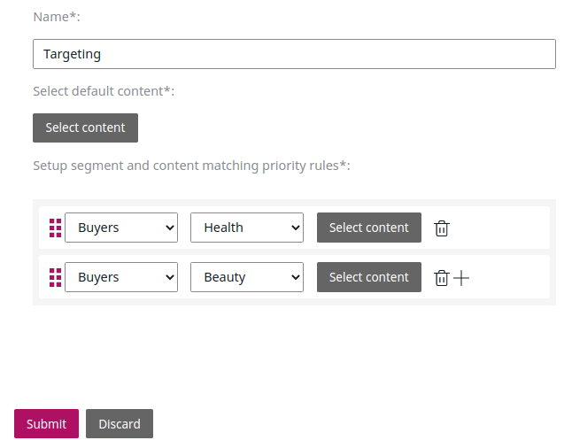

# Ibexa DXP v3.1

**Version number**: v3.2

**Release date**: October 20, 2020

**Release type**: Fast Track

## Notable changes

### New UI

This version offers a completely reworked user interface, covering all of the Back Office,
including eCommerce administration.

### DAM connector

### Autosave

eZ Platform can now save your edits in a Content item or product automatically to help you preserve the progress in an event of a failure. For more information, see [Autosave](https://doc.ezplatform.com/projects/userguide/en/latest/publishing/publishing/#autosave).

### Aggregation API

When using Solr or Elasticsearch search engines you can now use aggregations
to group search results and get the count of results per aggregation type.

You can aggregate results by general conditions such as Content Type or Section,
or by Field aggregations such as the value of specific Fields.

See [Aggregation API](../api/public_php_api_search.md#aggregation-api) for more information.

### Targeting block and Segmentation API

Targeting block for the Page Builder enables you to display different Content items to different users
depending on the Segments they belong to.

You can [configure Segments](../guide/admin_panel.md#segments) in the Back Office.

[Segmentation API](../api/public_php_api_managing_users.md#segments) enables you to create and edit Segments and Segment Groups,
as well as assign Users to Segments.

### Twig helpers for content rendering

Three new Twig helpers are available to make rendering content easier.

Use `ez_render_content(content)` and `ez_render_location(location)` to render the selected Content item in `embed` view.

You can also use `ez_render()` and provide it with either a content or Location object.

See [Using `ez_render` Twig helpers](../guide/templates.md#using-ez_render-twig-helpers) for more information.

### Further Elastic search support

## Other changes

### Site Factory improvements

### Scheduled blocks in calendar

### Object state API improvements

You can now use `ObjectStateService::loadObjectStateByIdentifier()` and `ObjectStateService::loadObjectStateGroupByIdentifier()`
to [get Object states and Object state groups](../api/public_php_api_managing_repository.md#getting-object-state-information) in the PHP API.

## Full changelog

| eZ Platform  | eZ Enterprise  | eZ Commerce |
|--------------|------------|------------|
| [eZ Platform v3.2.0](https://github.com/ezsystems/ezplatform/releases/tag/v3.2.0) | [eZ Enterprise v3.2.0](https://github.com/ezsystems/ezplatform-ee/releases/tag/v3.2.0) | [eZ Commerce v3.2.0](https://github.com/ezsystems/ezplatform/releases/tag/v3.2.0)
