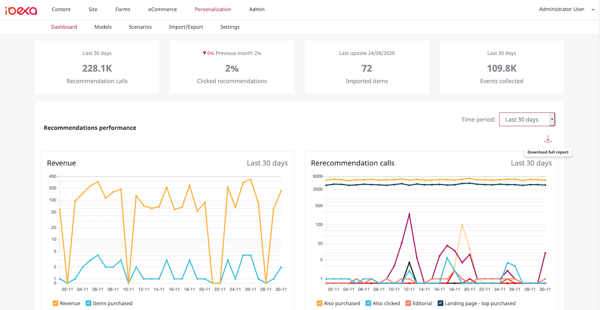

# Ibexa DXP v3.3

**Version number**: v3.3

**Release date**: December 30, 2020

**Release type**: Long Term Support

## Notable changes

### New Personalization UI

This release brings a completely reconstructed user interface of the Personalization feature.

### Symfony Flex

Ibexa DXP is now installed using [Symfony Flex](https://symfony.com/doc/current/quick_tour/flex_recipes.html).

See [the updated installation instruction](../geting_started_install_ez_platform.md) for a new guide to installing the product.

### Image Editor

With the Image Editor, users can now perform basic image editing, such as cropping, flipping 
or setting a point of focus. 
The Image Editor is available when browsing the Media library, or creating or editing Content Items 
that contain an ezimage or ezimageasset Field.

You can modify the Image Editor's default settings to change its appearance or behavior.
For more information, see [Configuring the Image Editor](../guide/image_editor.md)

### Migration bundle

The new [migration bundle](../guide/data_migration.md) enables you to export and import your Repository data using YAML files.

## Other changes

### Extended Search API capabilities

Search API has been extended with the following capabilities:

- [Score Sort Clause](../guide/search/sort_clause_reference/score_sort_clause.md) orders search results by their score.
- [CustomField Sort Clause](../guide/search/sort_clause_reference/customfield_sort_clause.md) sorts search results by raw search index fields.
- [ContentTranslatedName Sort Clause](../guide/search/sort_clause_reference/contenttranslatedname_sort_clause.md) sorts search results by the Content items' translated names.

### PHP API improvements

You can now use the following new PHP API methods:

- [`UserService::loadUserGroupByRemoteId`](https://github.com/ezsystems/ezplatform-kernel/blob/master/eZ/Publish/API/Repository/UserService.php#L71)
- [`PasswordHashService::getDefaultHashType`](https://github.com/ezsystems/ezplatform-kernel/blob/master/eZ/Publish/API/Repository/PasswordHashService.php#L18)
- [`PasswordHashService::getSupportedHashTypes`](https://github.com/ezsystems/ezplatform-kernel/blob/master/eZ/Publish/API/Repository/PasswordHashService.php#L25)
- [`PasswordHashService::isHashTypeSupported`](https://github.com/ezsystems/ezplatform-kernel/blob/master/eZ/Publish/API/Repository/PasswordHashService.php#L30)
- [`PasswordHashService::createPasswordHash`](https://github.com/ezsystems/ezplatform-kernel/blob/master/eZ/Publish/API/Repository/PasswordHashService.php#L37)
- [`PasswordHashService::isValidPassword`](https://github.com/ezsystems/ezplatform-kernel/blob/master/eZ/Publish/API/Repository/PasswordHashService.php#L44)

### Query Field Location handling

## Full changelog

| Ibexa Content  | Ibexa Experience  | Ibexa Commerce |
|--------------|------------|------------|
| [Ibexa Content v3.3.0](https://github.com/ibexa/content/releases/tag/v3.3.0) | [Ibexa Experience v3.3.0](https://github.com/ibexa/experience/releases/tag/v3.3.0) | [Ibexa Commerce v3.3.0](https://github.com/ibexa/commerce/releases/tag/v3.3.0)
