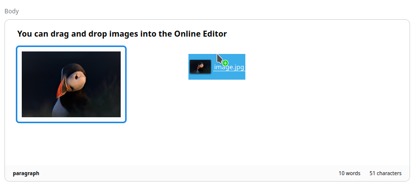

# Ibexa DXP v4.2

**Version number**: v4.2

**Release date**: August 8, 2022

**Release type**: [Fast Track](../community_resources/release_process.md#release-process)

## Notable changes

### Customer Portal

The new Customer Portal allows you to create and manage business account for your company.
With this new feature, you can easily manage members of your organization,
your shipping information and view your past orders.
You can invite members to your company, activate or deactivate their accounts, 
assign them specific roles and limitations, such as a buyer, or sales representative, and group them into teams.

### User management

#### Inviting users

You can invite users to create their account in the frontend as customers or in the Back Office.

#### Configure register form

Register forms for new users can now be [configured straight in the YAML file](https://doc.ibexa.co/en/4.2/guide/content_rendering/layout/add_register_user_template/#configure-existing-form).

### Catalogs

You can now create catalogs containing sub-sets of products.
Choose products for a catalog by applying filters which enable you to select products
for example by product type, price range, availability or category.

Catalogs are useful when creating special discount lists, campaigns, tenders,
or other situations where you need to present a selected set of products.

### Product variants

To cover use cases of products with variable characteristics (such as colors, technical parameters or sizes),
you can now create product variants based on selected attributes.
The system automatically generates variants for the attribute values you select.

You can set prices, including custom pricing, as well as availability and stock for each variant separately.

### Product assets

To provide your products with images, you can now upload multiple assets to each product.
Assets are grouped into collections based on attribute values
and in this way are connected to product variants which have these attributes.

### Product completeness

The new product completeness tab in product view lists all the parts of a product you can configure:
attributes, assets, prices, availability, and so on.
You can use it to get a quick overview of missing parts of product configuration
and to instantly move to the proper screen to fill the gaps.

### Product categories

With product categories you can organize products that populate the Product Catalog.
You do it, for example, to assist users in searching for products.

For more information, see [Product categories](https://doc.ibexa.co/projects/userguide/en/master/shop_administration/categories).

### Cross-content type recommendations

If a recommendation scenario has more than one content type configured, with cross-content type parameter in the request,
you can now get recommendations for all these content types.

### Taxonomy Field Type

Taxonomy is now [configured with a Field Type](https://doc.ibexa.co/projects/userguide/en/4.2/taxonomy/#add-tag),
so you can use many Fields to add different taxonomy categories, for example, tags and product categories in the same Content Type.

### Repeatable migration steps

Data migration now offers [repeatable migrations steps](https://doc.ibexa.co/en/4.2/guide/data_migration/importing_data/#repeatable-steps),
especially useful when creating large amounts of data, for example for testing.

You can vary the migration values by using the iteration counter, or by generating random data by using [`FakerPHP`](https://fakerphp.github.io/).

### Search Engine Optimization

Version 4.2 brings an integrated [Search Engine Optimization](https://doc.ibexa.co/projects/userguide/en/4.2/seo) (SEO) solution that includes title tag, meta tag, meta description Fields, and special Twitter and cards. Users can enable the SEO capability at a content/product type level, while editing or adding content to the site.

You can also expand the functionality of SEO with extension points if needed.

## Other changes

### New product Search Criteria and Sort Clauses

New Search Criteria and Sort Clauses help better fine-tune searches for products.

Price-related Search Criteria enable you to search by base or custom product price:

- [BasePrice](https://doc.ibexa.co/en/4.2/guide/search/criteria_reference/baseprice_criterion/)
- [CustomPrice](https://doc.ibexa.co/en/4.2/guide/search/criteria_reference/customprice_criterion/)

Attribute Criteria search for products based on their attribute values, per attribute type:

- [CheckboxAttribute](https://doc.ibexa.co/en/4.2/guide/search/criteria_reference/checkboxattribute_criterion/)
- [ColorAttribute](https://doc.ibexa.co/en/4.2/guide/search/criteria_reference/colorattribute_criterion/)
- [FloatAttribute](https://doc.ibexa.co/en/4.2/guide/search/criteria_reference/floatattribute_criterion/)
- [IntegerAttribute](https://doc.ibexa.co/en/4.2/guide/search/criteria_reference/integerattribute_criterion/)
- [SelectionAttribute](https://doc.ibexa.co/en/4.2/guide/search/criteria_reference/selectionattribute_criterion/)

Creation date Criteria and Sort Clauses allow searching by date of the product's creation:

- [CreatedAt](https://doc.ibexa.co/en/4.2/guide/search/criteria_reference/createdat_criterion/)
- [CreatedAtRange](https://doc.ibexa.co/en/4.2/guide/search/criteria_reference/createdatrange_criterion/)
- [CreatedAt](https://doc.ibexa.co/en/4.2/guide/search/sort_clause_reference/createdat_sort_clause/)

Finally, you can search product by product category:

- [ProductCategory](https://doc.ibexa.co/en/4.2/guide/search/criteria_reference/productcategory_criterion/)

### API improvements

#### GraphQL

Taxonomy is now covered with GraphQL API.

Querying product attributes with GraphQL is improved with the option to [query by attribute type](https://doc.ibexa.co/en/4.2/api/graphql_queries/#querying-product-attributes).

### New ways to add images in Online Editor

You can now drag and drop images directly into the Online Editor. 
To achieve the same result, you can also click the **Upload image** button and select a file from the disk.
Images that you upload this way are automatically added to the Media library.

!!! note

    In Media library, to avoid potential conflicts, 
    if several images are added with identical file names, 
    each of them is modified by appending a unique prefix.  

### Search in URL wildcards

You can now search in the **URL wildcards** table in the Back Office.

### Product price events

The price engine now dispatches [events related to creating, updating and deleting prices](https://doc.ibexa.co/en/4.2/guide/repository/event_reference/catalog_events/#price).

### Data migration

#### Migrations for attributes and attribute groups

Data migration now supports `attribute` and `attribute_group` types when generating migration files.

#### Hide and reveal content actions

You can now hide and reveal Content items in data migrations by using the [`hide` and `reveal` actions](https://doc.ibexa.co/en/4.2/guide/data_migration/data_migration_actions/#available-migration-actions).

### Fastly shielding

Ibexa DXP now supports Fastly shielding.

## Deprecations

### Segmentation

- `SegmentationService::loadSegmentGroup()` and `SegmentationService::loadSegment()` are now deprecated.
Use `SegmentationService::loadSegmentGroupByIdentifier()` and `SegmentationService::loadSegmentByIdentifier()` instead,
which take `SegmentGroup` and `Segment` identifier respectively, instead of numerical IDs.
- `SegmentationService::updateSegmentGroup()` and `SegmentationService::updateSegment()` now take
a `SegmentGroup` and `Segment` objects respectively, instead of numerical IDs.

## Full changelog

| Ibexa Content  | Ibexa Experience  | Ibexa Commerce |
|--------------|------------|------------|
| [Ibexa Content v4.2](https://github.com/ibexa/content/releases/tag/v4.2.0) | [Ibexa Experience v4.2](https://github.com/ibexa/experience/releases/tag/v4.2.0) | [Ibexa Commerce v4.2](https://github.com/ibexa/commerce/releases/tag/v4.2.0)|
