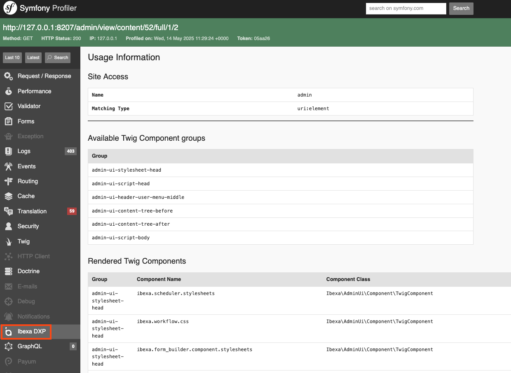

# Twig Components

Twig Components are widgets (for example, **My dashboard** blocks from Headless edition) and HTML code (for example, a tag for loading JS or CSS files) that you can inject into the existing templates to customize and extend the user interface.
They are combined into groups that are rendered in designated templates.

Twig Component groups are available for:

- [back office](custom_components.md)
- [storefront](customize_storefront_layout.md)

To learn which groups are available in a given view, use the [integration Symfony Profiler](#symfony-profiler-integration).

## Create Twig Component

You can create Twig Components in one of two ways:

### PHP code

Create a class implementing the `\Ibexa\Contracts\TwigComponents\ComponentInterface` interface and register it as a service by using the `ibexa.twig.component` service tag, for example:

``` yaml
App\Component\MyNewComponent:
    tags:
        - { name: ibexa.twig.component, group: content-edit-form-before, priority: 0 }
```

The available attributes are:

- `group` - indicates the group to which the component belongs
- `priority` - indicates the priority of rendering this component when rendering the whole component group. The higher the value the earlier the component is rendered

This way requires writing custom code, but it allows you to fully control the rendering of the component.

### YAML Configuration

You can create a Twig Component and add it to a group using YAML configuration, as in the example below:

``` yaml
ibexa_twig_components:
    # Component group
    storefront-before-head:
        # Component name
        google_tag_manager:
            type: script
            arguments:
                src: 'https://...'
```

The Component priority cannot be specified when using the YAML configuration, but it allows you to use the built-in components to quickly achieve common goals.

You can use an unique group name when creating a Twig Component to create your own group.

## Built-in components

| Name | Description | YAML type |
|---|---|---|
| [Script](https://github.com/ibexa/twig-components/blob/main/src/lib/Component/ScriptComponent.php) | Renders a [`<script>` tag](https://developer.mozilla.org/en-US/docs/Web/HTML/Reference/Elements/script) | `script` |
| [Stylesheet](https://github.com/ibexa/twig-components/blob/main/src/lib/Component/LinkComponent.php) | Renders a [`<link>` tag](https://developer.mozilla.org/en-US/docs/Web/HTML/Reference/Elements/link) | `stylesheet`
| [Template](https://github.com/ibexa/twig-components/blob/main/src/lib/Component/TemplateComponent.php) | Renders a Twig template|`template` |
| [Controller](https://github.com/ibexa/twig-components/blob/main/src/lib/Component/ControllerComponent.php) | Renders a Symfony controller |`controller` |
| [HTML](https://github.com/ibexa/twig-components/blob/main/src/lib/Component/HtmlComponent.php) | Renders static HTML |`html` |

## Example

The following example shows how you can use each of the built-in components to customize the back office:

``` yaml
[[= include_file('code_samples/back_office/components/twig_components.yaml') =]]
```

## Render Twig Components

Render both single Twig Components and whole groups using the [dedicated Twig functions](component_twig_functions.md).
You can modify the Component rendering process by:

- listening to one of the [related events](twig_component_events.md)
- decorating the `\Ibexa\Contracts\TwigComponents\Renderer\RendererInterface` service

## Symfony Profiler integration

Use the built-in integration with [Symfony Profiler]([[= symfony_doc =]]/profiler.html) to see which Twig Components have been rendered in a given view. In the **[[= product_name =]]** tab you can find:

- the list of all rendered Twig Component groups by the given view, including empty groups
- the list of rendered Twig Components with information about the group they belong to


