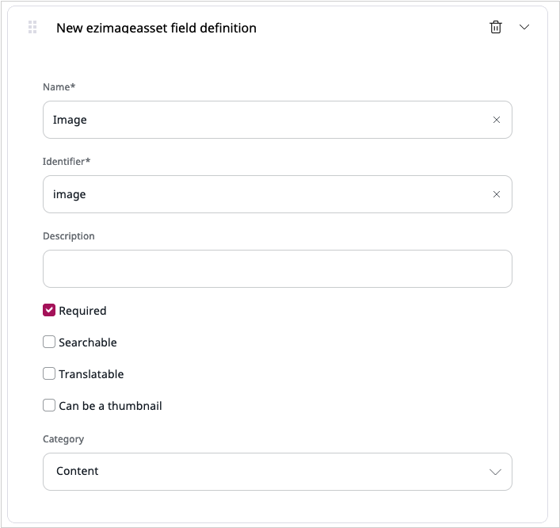
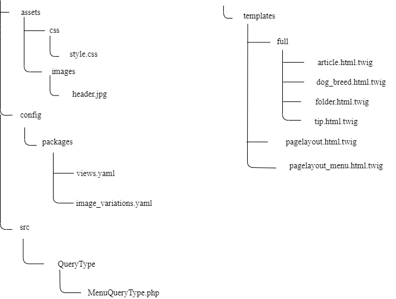

# Step 1 — Get a starter website

!!! tip

    You can find all files used and modified in this step on [GitHub](https://github.com/ezsystems/ezstudio-beginner-tutorial/tree/v2-step1).

To set up the starter website, you need to follow these steps:

## Get a clean eZ Enterprise installation

To begin the tutorial, you need a clean installation of eZ Platform Enterprise Edition.

Get it by following the [Install eZ Platform](../../getting_started/install_ez_platform.md)
and [Install eZ Enterprise](../../getting_started/install_ez_enterprise.md) guides.

## Create Content Types

Log in to the Back Office – add `/admin` to your installation's address (`<yourdomain>/admin`) and log in using `admin` as the login and `publish` as the password. In Admin go to Content types tab and (under the Content category) create two Content Types with the following settings:

### Dog Breed

- **Name:** Dog Breed
- **Identifier:** `dog_breed`
- **Fields:**

| Field Type | Name              | Identifier          | Required | Searchable | Translatable |
|------------|-------------------|---------------------|----------|------------|--------------|
| Text line  | Name              | `name`              | yes      | yes        | yes          |
| Text line  | Short Description | `short_description` | yes      | yes        | yes          |
| Image      | Photo             | `photo`             | yes      | no         | no           |
| RichText   | Full Description  | `description`       | yes      | yes        | yes          |

### Tip

- **Name:** Tip
- **Identifier:** `tip`
- **Fields:**

| Field Type  | Name  | Identifier | Required | Searchable | Translatable |
|-------------|-------|------------|----------|------------|--------------|
| Text line   | Title | `title`    | yes      | yes        | yes          |
| Text block  | Body  | `body`     | no       | no         | yes          |

### Modify existing Article Content Type

You also need to modify the built-in Article Content Type. It will make inserting photos into articles easier.
Edit it to remove the Image Field that has a Content Relation (ezobjectrelation) type, and create a new Field in its place:

| Field Type | Name  | Identifier | Required | Searchable | Translatable |
|------------|-------|------------|----------|------------|--------------|
| Image      | Image | `image`    |yes       |no          | yes          |



## Add template, configuration and style files

!!! tip

    For an introduction on how to use templates in eZ Platform, take a look at the [Building a Bicycle Route Tracker in eZ Platform tutorial](../platform_beginner/building_a_bicycle_route_tracker_in_ez_platform.md)

Place the [`pagelayout.html.twig`](https://github.com/ezsystems/ezstudio-beginner-tutorial/blob/v2-step1/app/Resources/views/pagelayout.html.twig) and [`pagelayout_menu.html.twig`](https://github.com/ezsystems/ezstudio-beginner-tutorial/blob/v2-step1/app/Resources/views/pagelayout_menu.html.twig) files in `app/Resources/views` folder. Create a new folder, called `full`, under `views`. Place further template files in it:

- [`article.html.twig`](https://github.com/ezsystems/ezstudio-beginner-tutorial/blob/v2-step1/app/Resources/views/full/article.html.twig)
- [`dog_breed.html.twig`](https://github.com/ezsystems/ezstudio-beginner-tutorial/blob/v2-step1/app/Resources/views/full/dog_breed.html.twig)
- [`folder.html.twig`](https://github.com/ezsystems/ezstudio-beginner-tutorial/blob/v2-step1/app/Resources/views/full/folder.html.twig)
- [`tip.html.twig`](https://github.com/ezsystems/ezstudio-beginner-tutorial/blob/v2-step1/app/Resources/views/full/tip.html.twig)

Place two configuration files in `app/config` folder:

- [`views.yml`](https://github.com/ezsystems/ezstudio-beginner-tutorial/blob/v2-step1/app/config/views.yml)
- [`image_variations.yml`](https://github.com/ezsystems/ezstudio-beginner-tutorial/blob/v2-step1/app/config/image_variations.yml)

Modify the `config.yml` file located in `app/config` folder and add the following lines at the end of the `imports` block:

``` yaml
    - { resource: views.yml }
    - { resource: image_variations.yml }
```

In `web/assets` folder create:

- a `css` subfolder and add this stylesheet file to it: [`style.css`](https://github.com/ezsystems/ezstudio-beginner-tutorial/blob/v2-step1/web/assets/css/style.css)
- an `images` subfolder and add the [`header.jpg`](https://github.com/ezsystems/ezstudio-beginner-tutorial/blob/v2-step1/web/assets/images/header.jpg) file to it

In `src/AppBundle` folder create a `QueryType` subfolder and add [`LocationChildrenQueryType.php`](https://github.com/ezsystems/ezplatform-ee-beginner-tutorial/blob/v2-step1/src/AppBundle/QueryType/LocationChildrenQueryType.php) to it. This file allows your folders to display all content that they contain (read up on it [in the documentation](../../guide/controllers.md#query-controller)).

Finally, add the following files to `src/AppBundle`, to create dynamic links in the top menu:

- [`Controller/MenuController.php`](https://github.com/ezsystems/ezstudio-beginner-tutorial/blob/v2-step1/src/AppBundle/Controller/MenuController.php)
- [`DependencyInjection/AppExtension.php`](https://github.com/ezsystems/ezstudio-beginner-tutorial/blob/v2-step1/src/AppBundle/DependencyInjection/AppExtension.php)
- [`QueryType/MenuQueryType.php`](https://github.com/ezsystems/ezstudio-beginner-tutorial/blob/v2-step1/src/AppBundle/QueryType/MenuQueryType.php)
- [`Resources/config/services.yml`](https://github.com/ezsystems/ezstudio-beginner-tutorial/blob/v2-step1/src/AppBundle/Resources/config/services.yml)

All the files you've placed in `src/AppBundle` are not the scope of this tutorial and we won't go here into detail on how they work.

This is what the structure of the new and modified files should look like (excluding pre-existing files):



## Create content

Now return to the Back Office and create some content for your website.

First, make three Folders under the `Content/Content structure` tab. Call them 'All Articles', 'Dog Breed Catalog' and 'All Tips'. Remember that you save and close them by using the 'Publish' button.

Next, create a few Content items of proper Content Types in each of these folders:

- 4 Articles (at least, to best see the effects of the Content Scheduler block that you will create in step 3.)
- 3 Dog Breeds
- 3 Tips

Finally, remove the "eZ Platform" folder. You will not need it for this tutorial.

### Add images

When you need an image, you can use one from [this image pack](img/photos.zip).
This will let you compare effects of your work to screenshots in the tutorial.

At this point you are ready to proceed with the next step.
