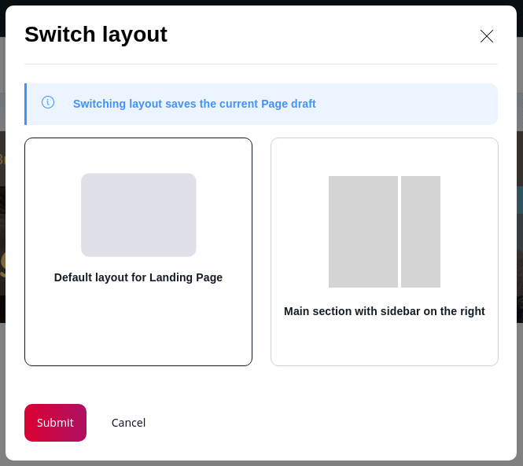

# Step 2 - Prepare the Landing Page

!!! tip

    You can find all files used and modified in this step on [GitHub](https://github.com/ezsystems/ezstudio-beginner-tutorial/tree/step2).

In this step you'll prepare and configure your front page, together with its layout and templates.

## Create Landing Page layout

Go to the front page of your website (`<yourdomain>`). You can see that it looks unfinished. (You can, however, still use the menu and look around the existing content in the website).


!!! tip

    At any point in the tutorial if you don't see the results of your last actions, try clearing the cache and regenerating assets:

    `php app/console cache:clear`

    `php app/console assets:install`

Log in to the Back Office. Go to Content &gt; Content Structure.
The **Home** Content item is the first page that is shown to the visitor.
Here you can check what Content Type it belongs to: it is a Landing Page.


The page contains one Tag block and is displayed without any template.
Now go to the Page tab. This is the mode that enables you to work with Landing Pages. Click Edit and you will see that the Home Landing Page has only one zone with the block.


The design for the website you are making needs a layout with two zones: a main column and a narrower sidebar.
eZ Enterprise provides only a one-zone default layout, so you need to create a new one.

!!! note

    It is not possible to change the layout of a Landing Page once it has been published.
    This means that after preparing the new layout you will have to create a completely new Landing Page,
    replace the current Home with it and delete the old one.

Preparing a new layout requires three things:

- **entry in configuration**
- **thumbnail** 
- **template** 

#### Create entry in configuration

First create a new file for layout configuration, `app/config/layouts.yml`:

``` yaml hl_lines="3 5 7 8"
ez_systems_landing_page_field_type:
    layouts:
        sidebar:
            identifier: sidebar
            name: Right sidebar
            description: Main section with sidebar on the right
            thumbnail: /assets/images/layouts/sidebar.png
            template: layouts/sidebar.html.twig
            zones:
                first:
                    name: First zone
                second:
                    name: Second zone
```

Creating the file is not enough, you also need to tell the app to read and use it.
Add the following line to `app/config/config.yml`, at the end of the `imports` block:

``` yaml
- { resource: layouts.yml }
```

#### Add thumbnail

!!! tip

    For a detailed description of creating a Page layout, see [Page layouts](../../guide/landing_page_rendering.md#page-layouts):

The `sidebar` (line 3) is the internal key of the layout. `name` (line 5) is displayed in the interface when the user selects a layout.
The `thumbnail` (line 7) points to an image file that is shown when creating a new Landing Page next to the name.
Use the [supplied thumbnail file](https://github.com/ezsystems/ezstudio-beginner-tutorial/blob/step2/web/assets/images/layouts/sidebar.png) and place it in the `web/assets/images/layouts/` folder.

The `template` (line 8) points to the Twig file containing the template for this layout.

#### Create Landing Page template

Configuration points to `sidebar.html.twig` as the template for the layout.
The template defines what zones will be available in the layout.

Create an `app/Resources/views/layouts/sidebar.html.twig` file:

``` html+twig hl_lines="1 2 15"
<div data-studio-zones-container>
    <main class="landing-page__zone landing-page__zone--{{ zones[0].id }} landing-page__zone--left col-xs-8" data-studio-zone="{{ zones[0].id }}">
        
            
                <div class="landing-page__block block_{{ block.type }}">
                    {{ render_esi(controller('ez_block:renderBlockAction', {
                        'contentId': contentInfo.id,
                        'blockId': block.id,
                        'versionNo': versionInfo.versionNo
                    })) }}
                </div>
            
        
    </main>
    <aside class="landing-page__zone landing-page__zone--{{ zones[1].id }} landing-page__zone--left col-xs-4" data-studio-zone="{{ zones[1].id }}">
        
            
                <div class="landing-page__block block_{{ block.type }}">
                    {{ render_esi(controller('ez_block:renderBlockAction', {
                        'contentId': contentInfo.id,
                        'blockId': block.id,
                        'versionNo': versionInfo.versionNo
                    })) }}
                </div>
            
        
    </aside>
</div>
```

The above template creates two columns and defines their widths. Each column is at the same time a zone, and each zone renders the blocks that it contains.

!!! tip

    In sites with multiple layouts you can separate the rendering of zones into a separate `zone.html.twig` template
    to avoid repeating the same code in every layout.

!!! note

    A zone in a layout template **must have** the `data-studio-zone` attribute (lines 2 and 15).
    The zone container **must have** the `data-studio-zones-container` attribute (line 1) to allow dropping Content into zones.

With these three elements: configuration, thumbnail and template, the new layout is ready to use.


### Create a Landing Page

Now you can create a Landing Page with the new layout. When in Page mode, activate **Create** and select a Landing Page.
Choose the new layout called "Right Sidebar" and name the new page "Front Page".
The empty zones you defined in the template will be visible in the editor.



!!! tip

    If the new layout is not available when creating a new Landing Page, you may need to clear the cache (using `php app/console cache:clear`) and/or reload the app.

Publish the new Landing Page. You will notice that it still looks the same as the old Home.
This is because the looks of a Landing Page are controller by two separate template files, and you have only prepared one of those.
The `sidebar.html.twig` file defines how zones are organized and how content is displayed in them.
But you also need a general template file that will be used for every Landing Page, regardless of its layout.

Add this new template, `app/Resources/views/full/landing_page.html.twig`:

``` html+twig



    <div class="col-md-12">
        {{ ez_render_field(content, 'page') }}
    </div>

```

This template simply renders the page content. If there is any additional content or formatting you would like to apply to every Landing Page, it should be placed in this template.

Now you need to tell the app to use this template to render Landing Pages.
Edit the `app/config/views.yml` file and add the following code under the `full:` key:

``` yaml
landing_page:
    template: full/landing_page.html.twig
    match:
        Identifier\ContentType: landing_page
```

After adding this template you can check the new Landing Page.
The part between menu and footer should be empty, because you have not added any content to it yet.


Until the Front Page is swapped with the current Home, you can access the new page by adding `/Front-Page` to the address: `<yourdomain>/Front-Page`.

### Replacing the front page

Now let's replace the current Home with the new Front Page.

To swap these two Content items, go to Home in the Back Office (if you are in Page mode, switch by clicking Content at the top).
Open the Locations tab, click "Select Content Item" under "Content Location Swap" and select the newly created Front Page.
The two pages will swap, with the new Landing Page becoming the first item in the Content tree.
It will now be the first page that visitors will see. In the next step you will fill it up with content.

You can now delete the previous Home page, as you don't need it anymore.
Navigate to it in the Content mode and click Send to Trash in the menu on the right.
