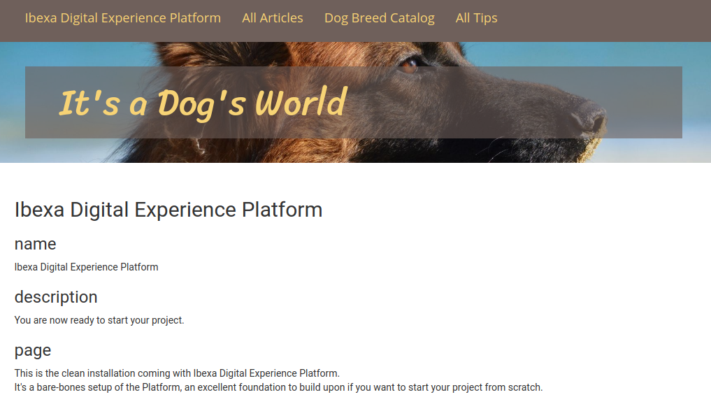

# Step 2 — Prepare the Page [[% include 'snippets/experience_badge.md' %]] [[% include 'snippets/commerce_badge.md' %]]

!!! tip

    You can find all files used and modified in this step on [GitHub](https://github.com/ezsystems/ezplatform-ee-beginner-tutorial/tree/v3-step2).

In this step you'll prepare and configure your front page, together with its layout and templates.

## Create Page layout

Go to the front page of your website (`<yourdomain>`). You can see that it looks unfinished. (You can, however, still use the menu and look around the existing content in the website).



!!! tip

    At any point in the tutorial if you don't see the results of your last actions, try clearing the cache and regenerating assets:

    `php bin/console cache:clear`

    `yarn encore <dev|prod>`

Log in to the Back Office. Go to Content &gt; Content Structure.
The **Ibexa Digital Experience Platform** Content item is the first page that is shown to the visitor.
Here you can check what Content Type it belongs to: it is a Landing Page.


The page contains one Code block and is displayed without any template.
Now go to the Site tab and click **site**. This is the mode that enables you to work with Pages. Click Edit and you will see that the home Page has only one zone with the block.


Remove the Tag block. Hover over it and select the trash icon from the menu.
Switch to editing Page Fields and change the Title of the page to "Home".
Then, publish the Page to update its name.

The design for the website you are making needs a layout with two zones: a main column and a narrower sidebar.
[[= product_name_exp =]] provides only a one-zone default layout, so you need to create a new one.

Preparing a new layout requires three things:

- **entry in configuration**
- **thumbnail** 
- **template** 

#### Create entry in configuration

First create a new file for layout configuration, `config/packages/ezplatform_page_fieldtype.yaml`:

``` yaml hl_lines="3 5 7 8"
ezplatform_page_fieldtype:
    layouts:
        sidebar:
            identifier: sidebar
            name: Right sidebar
            description: Main section with sidebar on the right
            thumbnail: /assets/images/layouts/sidebar.png
            template: layouts/sidebar.html.twig
            zones:
                first:
                    name: First zone
                second:
                    name: Second zone
```

#### Add thumbnail

!!! tip

    For a detailed description of creating a Page layout, see [Page layouts](../../guide/page_rendering.md#page-layouts).

The `sidebar` (line 3) is the internal key of the layout. `name` (line 5) is displayed in the interface when the user selects a layout.
The `thumbnail` (line 7) points to an image file that is shown when creating a new Landing Page next to the name.
Use the [supplied thumbnail file](https://github.com/ezsystems/ezplatform-ee-beginner-tutorial/blob/v3-step2/public/assets/images/layouts/sidebar.png) and place it in the `public/assets/images/layouts/` folder.

The `template` (line 8) points to the Twig file containing the template for this layout.

#### Create Page template

Configuration points to `sidebar.html.twig` as the template for the layout.
The template defines what zones will be available in the layout.

Create a `templates/layouts/sidebar.html.twig` file:

``` html+twig hl_lines="2 7 19 24"
<div class="landing-page__zones">
    <main class="landing-page__zone landing-page__zone--{{ zones[0].id }} col-xs-8" data-ez-zone-id="{{ zones[0].id }}">
        
            

            
                <div class="landing-page__block block_{{ block.type }}" data-ez-block-id="{{ block.id }}">
                    {{ render_esi(controller('EzSystems\\EzPlatformPageFieldTypeBundle\\Controller\\BlockController::renderAction', {
                        'locationId': locationId,
                        'contentId': contentInfo.id,
                        'blockId': block.id,
                        'versionNo': versionInfo.versionNo,
                        'languageCode': field.languageCode
                    })) }}
                </div>
            
        
    </main>
    <aside class="landing-page__zone landing-page__zone--{{ zones[1].id }} col-xs-4" data-ez-zone-id="{{ zones[1].id }}">
        
            

            
                <div class="landing-page__block block_{{ block.type }}" data-ez-block-id="{{ block.id }}">
                    {{ render_esi(controller('EzSystems\\EzPlatformPageFieldTypeBundle\\Controller\\BlockController::renderAction', {
                        'locationId': locationId,
                        'contentId': contentInfo.id,
                        'blockId': block.id,
                        'versionNo': versionInfo.versionNo,
                        'languageCode': field.languageCode
                    })) }}
                </div>
            
        
    </aside>
</div>
```

The above template creates two columns and defines their widths. Each column is at the same time a zone, and each zone renders the blocks that it contains.

!!! tip

    In sites with multiple layouts you can separate the rendering of zones into a separate `zone.html.twig` template
    to avoid repeating the same code in every layout.

!!! note

    A zone in a layout template **must have** the `data-ez-zone-id` attribute (lines 2 and 19).
    A block **must have** the `data-ez-block-id` attribute (lines 7 and 24)

With these three elements: configuration, icon and template, the new layout is ready to use.

### Change Home Page layout

Now you can change the Home Page to use the new layout. In Page mode edit Home, open the options menu and select **Switch layout**.
Choose the new layout called "Main section with sidebar on the right".
The empty zones you defined in the template will be visible in the editor.


!!! tip

    If the new layout is not available when editing the Page, you may need to clear the cache (using `php bin/console cache:clear`) and/or reload the app.


Publish the Home Page. You will notice that it still has some additional text information.
This is because the looks of a Page are controller by two separate template files, and you have only prepared one of those.
The `sidebar.html.twig` file defines how zones are organized and how content is displayed in them.
But you also need a general template file that will be used for every Page, regardless of its layout.

Add this new template, `templates/full/landing_page.html.twig`:

``` html+twig



    <div class="col-md-12">
        {{ ez_render_field(content, 'page') }}
    </div>

```

This template simply renders the page content. If there is any additional content or formatting you would like to apply to every Page, it should be placed in this template.

Now you need to tell the app to use this template to render Pages.
Edit the `config/packages/views.yaml` file and add the following code under the `full:` key:

``` yaml
landing_page:
    template: full/landing_page.html.twig
    match:
        Identifier\ContentType: landing_page
```

After adding this template you can check the new Page.
The part between menu and footer should be empty, because you have not added any content to it yet.


