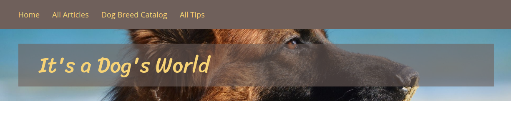

# Step 2 - Preparing the Landing Page

!!! tip

    You can find all files used and modified in this step on [GitHub](https://github.com/ezsystems/ezstudio-beginner-tutorial/tree/step2).

In this step you'll prepare and configure your front page, together with its layout and templates.

### Create Landing Page layout

If at this point you view the website from the front end, you will see that the home page looks quite unfinished. (You can, however, still use the menu and look around the existing content in the website.)


!!! tip

    At any point in the tutorial if you don't see the results of your last actions when viewing the page, try clearing the cache and regenerating assets:

    `php app/console cache:clear`

    `php app/console assets:install`

Log in to the app's back end. Through the Platform UI, go to the Home Content item, which is the first page that is shown to the visitor. There you can check what Content Type it belongs to: it is a Landing Page.


The page contains only one simple Tag block and is displayed without any template. Now, switch to the Studio UI by going to the Page mode and click Edit. You can see here that the Home Landing Page has only one zone wit the block.


This will not do for our plans, because as you can see in the proposed screenshot, we need a layout with two zones: a main column and a narrower sidebar. As only one default one-zone layout is provided for starters with eZ Enterprise, we will need to create a new layout.

!!! note

    It is not possible to change the layout of a Landing Page once it has been published. This means that after preparing our new layout we will have to create a completely new Landing Page, replace the current Home with it and scrap the old one.

Preparing a new layout requires three things:

- **entry in configuration**
- **thumbnail** 
- **template** 

Let's first create a new file that will house our layout configuration (and the configs for any other layouts you may want to create in future):

``` yaml
# app/config/layouts.yml
ez_systems_landing_page_field_type:
    layouts:
        sidebar:
            identifier: sidebar
            name: Right sidebar
            description: Main section with sidebar on the right
            thumbnail: assets/images/layouts/sidebar.png
            template: layouts/sidebar.html.twig
            zones:
                first:
                    name: First zone
                second:
                    name: Second zone
```

Creating the file is not enough, you also need to tell the app to read and use it. Add the following line to the `config.yml` file located in `app/config`, at the end of the `imports` block:

``` yaml
# in app/config/config.yml
  - { resource: layouts.yml }
```

!!! tip

    You could alternatively place the whole `layouts` configuration block directly inside `ezplatform.yml`. However, for clarity we'll keep the configs in separate files in this tutorial.

Let's take a look at the most important things that this configuration defines (for a detailed description of creating a Landing Page layout, see [Creating Landing Page layouts (Enterprise)](../../cookbook/creating_landing_page_layouts_(enterprise).md)):

`sidebar` is the key of the layout, but it is the `name` that is displayed in the interface when the user is selecting a layout. The `thumbnail` links to an image file with an icon of the layout. It will also be shown when creating a new Landing Page, as a visual hint next to the name. Use the [supplied thumbnail file](https://github.com/ezsystems/ezstudio-beginner-tutorial/blob/step2/web/assets/images/layouts/sidebar.png) and place it in the `web/assets/images/layouts/` folder.

The `template` points to the twig file where in the next step we will create the template for this layout. This is the most important part of the configuration, as the templates are what distinguishes all layouts from one another.

### Create Landing Page templates

Our configuration points to `sidebar.html.twig` as the template for the layout. Let's create it and fill it in. Go to `app/Resources/views`. You can already see here some templates that define the looks of the existing parts of the website. Create a `layouts` folder and the following file inside it:

``` html
<!--app/Resources/views/layouts/sidebar.html.twig-->
<div data-studio-zones-container>
    <main class="landing-page__zone landing-page__zone--{{ zones[0].id }} landing-page__zone--left col-xs-8" data-studio-zone="{{ zones[0].id }}">
        
            
                <div class="landing-page__block block_{{ block.type }}">
                    {{ render_esi(controller('ez_block:renderBlockAction', {
                        'contentId': contentInfo.id,
                        'blockId': block.id,
                        'versionNo': versionInfo.versionNo
                    })) }}
                </div>
            
        
    </main>
    <aside class="landing-page__zone landing-page__zone--{{ zones[1].id }} landing-page__zone--left col-xs-4" data-studio-zone="{{ zones[1].id }}">
        
            
                <div class="landing-page__block block_{{ block.type }}">
                    {{ render_esi(controller('ez_block:renderBlockAction', {
                        'contentId': contentInfo.id,
                        'blockId': block.id,
                        'versionNo': versionInfo.versionNo
                    })) }}
                </div>
            
        
    </aside>
</div>
```

The template above creates two columns and defines their widths. Each column is at the same time a zone, and each zone renders the blocks that it contains.

!!! tip

    In more complex setups with multiple different layouts you might want to consider separating the rendering of zones into a separate `zone.html.twig` template to avoid repeating the same code in every layout.

!!! note

    Layout templates can be configured and adapted in any way you like, like all other templates in eZ Platform. However, for a layout to work together with a Landing Page, the zone **must have** the  `data-studio-zone` attribute (line 2 and 15), and the zone container **requires** the `data-studio-zones-container` attribute (line 1) to allow dropping Content into zones.

With these three elements: configuration, thumbnail and template, your new layout is ready to use.


### Create a Landing Page

Now you can create your Landing Page with the new layout to see the effects of your work. Do it as a child of the Home Content item (that is, go to Home in the Page mode, click Create and select a Landing Page) – we will momentarily replace Home with this new Landing Page. Choose the new layout called "Right sidebar" and call the new page "Front Page". The empty zones as you have defined them will be visible in the editor.


If the new layout is not available when creating a new Landing Page, you may need to clear the cache (using `php app/console cache:clear`) and/or reload the app.

Once you Publish, you will notice that the new, empty Landing Page unfortunately hasn't changed and still looks awful. This is because the looks of a Landing Page are actually defined in two separate templates files, and we have only prepared one of those. Our `sidebar.html.twig` file defines that way in which zones are organized and governs the displaying of zone contents. But one more general template file is needed that will be used for every Landing Page, regardless of its layout. Because we haven't created it yet, the page is instead displayed using default settings.

Let's correct this by creating a `landing_page.html.twig` template. In our case, the file will be rather short:

``` html
<!--app/Resources/views/full/landing_page.html.twig-->



    <div class="col-md-12">
        {{ ez_render_field(content, 'page') }}
    </div>

```

As you can see, this file, placed in the `views/full` folder, simply renders the page content. If there is any additional content or formatting you would like to apply to every Landing Page, it should be placed in this template.

Now you need to tell the app to use this template whenever it tries to render a Landing Page. Edit the `views.yml` file in `app/config` and add the following code:

``` yaml
# in app/config/views.yml
landing_page:
    template: "full/landing_page.html.twig"
    match:
        Identifier\ContentType: "landing_page"
```

You can place this block anywhere before or after other view configuration blocks, but remember that the indentations must match and the block must be placed under the `full` key.

!!! tip

    The `views.yml` file already contains a handful of view config blocks, and the `views/full` folder has templates that correspond to them. They are used to render the existing content we have in our website - articles, dog breed information and tips. In a clean installation these configurations and the folder would not exist and you would have to build all view templates from scratch.

After adding this template you can check your new Landing Page. The part between menu and footer should be empty, which is the desired result – it should be empty, because we have not added any actual content to it.



Until we swap the Front Page with the current Home, you can access the new page by adding `/Front-Page` to the URI address.

### Replacing the front page

!!! caution

    This part only works from v1.7.0 onward. If you are using an earlier version, skip this last section and as a workaround in the next steps access your new Front Page directly by its URI, for example: `tutorial.lh/Front-Page`.

Now for the last part in this step: let's replace the current Home with your new Front Page.

To swap the two Content items, go to Home in Platform UI (if you are in the Studio UI, switch by clicking Content at the top). Open the Locations tab, click Select Content Item under Content Location Swap and select the newly created Front Page. The two pages should now be swapped, with the new Landing Page becoming the first item in the Content tree. It will now be the first page that visitors to your website see. We will momentarily start filling it up with content.

You can now delete the previous Home page, as you don't need it anymore. Navigate to it in the Content mode and click Send to Trash in the menu on the right.

 
