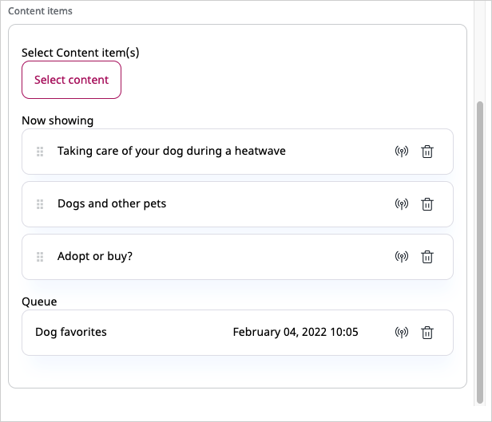

# Step 3 — Use existing blocks [[% include 'snippets/experience_badge.md' %]] [[% include 'snippets/commerce_badge.md' %]]

!!! tip

    You can find all files used and modified in this step on [GitHub](https://github.com/ezsystems/ezplatform-ee-beginner-tutorial/tree/v3-step3).

In this step you'll add a Content List block and a Content Scheduler block and customize them.

### Add a Content List block

First, create an override template for the Content List block: `templates/blocks/contentlist/default.html.twig`:

``` html+twig hl_lines="10"
<div>
    <h3 class="heading">{{ parentName }}</h3>
    
        <div class="content-list">
            
                <div class="content-list-item">
                    <div class="content-list-item-image">
                        {{ ez_render_field(content.content, 'photo', {
                            'parameters': {
                                'alias': 'content_list'
                             }
                        }) }}
                    </div>
                    <h4><a href="{{ ez_path(content.location) }}">{{ ez_content_name(content.content) }}</a></h4>
                    
                        <div class="attribute-short-description">
                            {{ ez_render_field(content.content, 'short_description') }}
                        </div>
                    
                </div>
            
        </div>
    
</div>
```

Then add a configuration that will tell the app to use this template instead of the default one.
In `config/packages/ezplatform_page_fieldtype.yaml` add the following code at the end of the file, under the `ezplatform_page_fieldtype` key on the same level as `layouts`:

``` yaml
blocks:
    contentlist:
        views:
            contentList:
                template: blocks/contentlist/default.html.twig
                name: Content List
```

The template makes use of an [image variation](../../guide/images.md) (line 10).
It is the thumbnail of the Dog Breed image that will be displayed in the block.
To configure this variation, open the `config/packages/image_variations.yaml` file and add the following code under the `image_variations` key:

``` yaml
content_list:
    reference: null
    filters:
        - {name: geometry/scaleheightdownonly, params: [81]}
        - {name: geometry/crop, params: [80, 80, 0, 0]}
```

Finally, add some styling to the block. Add the following CSS to the end of the `assets/css/style.css` file:

``` css
/* Landing Page */
@media only screen and (min-width: 992px) {
    aside > div {
        padding-left: 45px;
    }
}

/* Content list block */
.content-list-item {
    clear: left;
    min-height: 90px;
    padding-bottom: 5px;
    border-bottom: 1px solid black;
}

.content-list h5 {
    font-size: 1.3em;
}

.content-list-item-image {
    float: left;
    margin-right: 10px;
}
```

Run `yarn encore <dev|prod>` to regenerate assets.

At this point you can start adding blocks to the Page.
You do it in the Site tab in Edit mode by dragging a block from the menu on the right to the correct zone on the page.

Drag a Content List block from the menu to the left zone on the page.
Click the block and fill in the form. Here you name the block and decide what it will display.
Choose the "Dog Breed Catalog" folder as the Parent, select Dog Breed as the Content Type to be displayed, and choose a limit (3).
You'll display the first three Dog Breeds from the database.


Click Submit and you should see a preview of what the block will look like with the dog breed information displayed.


The block is displayed using the new template.
Built-in blocks have default templates included in a clean installation, but you can override them.
Publish the page now and move on to creating another type of block.

### Create a Content Scheduler block for featured articles

The next block is the Content Scheduler block that will air articles at predetermined times.

First, add a configuration that points to the layout. Go to `config/packages/ezplatform_page_fieldtype.yaml` again and add the following code under `blocks` on the same level as the `contentlist` key:

``` yaml
schedule:
    views:
        featured:
            template: blocks/schedule/featured.html.twig
            name: Featured Schedule Block
```

The configuration defines one view for the Schedule block called `featured` and points to a `featured.html.twig` template.
Create the new file `templates/blocks/schedule/featured.html.twig`:

``` html+twig hl_lines="11"

    <div class="schedule-layout schedule-layout--grid">
        <div class="featured-articles-block">
            <h2 class="heading">{{ 'Featured Articles'|trans }}</h2>
            <div>
                
                    <div class="col-md-4 featured-article-container">
                        
                        {{ render(controller('ez_content::viewAction', {
                            'locationId': items[idx].id,
                            'viewType': 'featured'
                            })) }}
                        
                    </div>
                
            </div>
        </div>
    </div>

```

When you look at the template, you can see three blocks, each of which will render the Content items using the `featured` view (line 11).
So far you only have templates for `full` view for Articles. This means you need to create a `featured` view template,
otherwise you will get an error when trying to add Content to the block.

You need to modify the `config/packages/views.yaml` file to indicate when to use the template.
Add the following code to this file, on the same level as the `full` key:

``` yaml
featured:
    article:
        template: featured/article.html.twig
        match:
            Identifier\ContentType: article
```

Now create a `templates/featured/article.html.twig` file:

``` html+twig

<div class="featured-article" style="background-image: url('{{ imageAlias.uri }}');">
    <h4><a class="featured-article-link" href="{{ ez_path(content) }}">{{ ez_content_name(content) }}</a></h4>
</div>
```

Like in the case of the Content List block, the template specifies an image variation.
Add it in `config/packages/image_variations.yaml` under the `image_variations` key:

``` yaml
featured_article:
    reference: null
    filters:
        - {name: geometry/scaleheightdownonly, params: [200]}
```

The Block is already operational, but first update the stylesheet. Add the following CSS at the end of the `assets/css/style.css` file:

``` css
/* Featured articles Content Scheduler block */
.featured-article-container {
    background-size: cover;
    padding: 0;
    margin-bottom: 20px;
}

.featured-article {
    height: 200px;
    padding: 0;
    background-repeat: no-repeat;
}

.featured-article-link:link,
.featured-article-link:visited {
    position: absolute;
    bottom: 0;
    margin-bottom: 0;
    background-color: rgba(255,255,255,.8);
    color: #000;
    font-size: 1.1em;
    padding: 7px;
}

.featured-article-link:hover,
.featured-article-link:focus {
    color: #654d31;
    text-decoration: none;
    border-bottom: none;
}
```

Run `yarn encore <dev|prod>` to regenerate assets.

At this point you can add a new Content Scheduler block to your Page and fill it with content to see how it works.

!!! tip

    If you do not see the featured block template, you may need to clear the cache (using `php bin/console cache:clear`) and/or reload the app.

Go back to editing the Home Page and drag a Content Scheduler block from the pane on the right to the main zone in the layout, above the Content List block.
Select the block and click the Block Settings icon.

Set the Limit to three and click Select Content.
Navigate to the "All Articles" folder and select the articles you had created and confirm.


Accept the suggested airtime and click Submit.

Now click the Airtime button next to one of the Articles and choose a time in the future.
This article will be listed in the queue.



Publish the Page.

Now open the Timeline at the top of the screen.
You can move the slider to different times and preview what the Content Scheduler block will look like at different hours.
Content will be shown when you move the slider to the point when it airs.

!!! tip

    At this point you have configured the Content Scheduler block to work with Articles only.
    If you try to add Content of any other type, you will see an error.
    This is because there is no `featured` view for content other than Articles defined at the moment.


