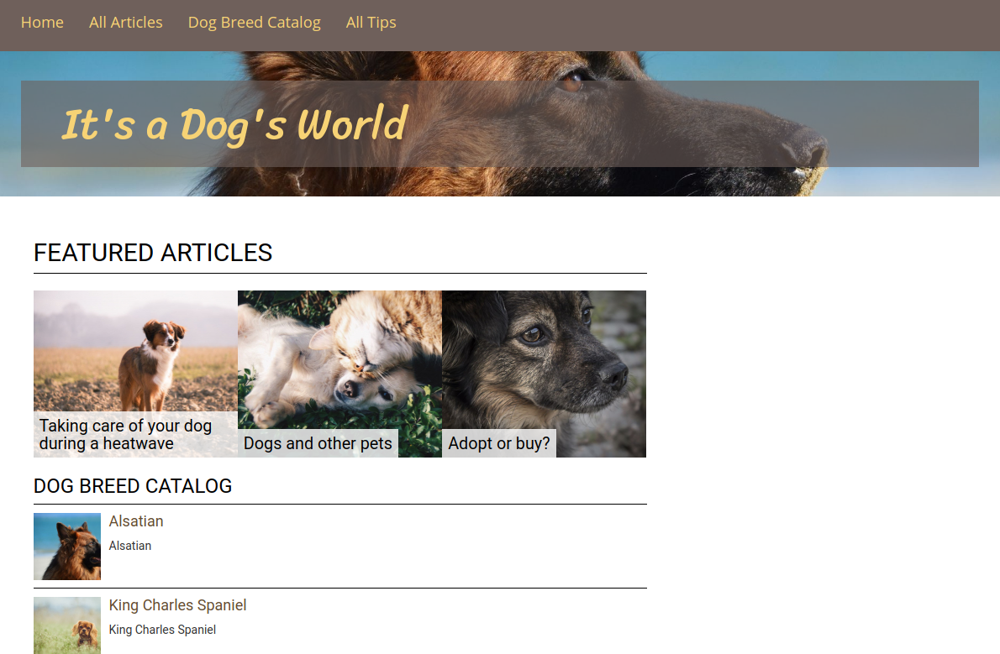

# Step 3 - Use existing blocks

!!! tip

    You can find all files used and modified in this step on [GitHub](https://github.com/ezsystems/ezstudio-beginner-tutorial/tree/step3).

In this step you'll add a Content List block and two Schedule blocks and customize them.

!!! caution

    Pay close attention to the order of tasks.
    If you overlook a configuration file and try to generate a Landing Page without it,
    the Landing Page may become corrupted in the database.
    You may then get a 500 error when trying to access it.
    If this happens, you should delete the page and create it again from scratch.

### Add a Content List block

First, create an override template for the Content List block: `app/Resources/views/blocks/contentlist.html.twig`:

``` html+twig hl_lines="10"
<div>
    <h3 class="heading">{{ parentName }}</h3>
    
        <div class="content-list">
            
                <div class="content-list-item">
                    <div class="content-list-item-image">
                        {{ ez_render_field(content.content, 'photo', {
                            'parameters': {
                                'alias': 'content_list'
                             }
                        }) }}
                    </div>
                    <h4><a href="{{ path(content.location) }}">{{ ez_content_name(content.content) }}</a></h4>
                    
                        <div class="attribute-short-description">
                            {{ ez_render_field(content.content, 'short_description') }}
                        </div>
                    
                </div>
            
        </div>
    
</div>
```

Then add a configuration that will tell the app to use this template instead of the default one.
In `app/config/layouts.yml` add the following code at the end of the file, under the `ez_systems_landing_page_field_type` key on the same level as `layouts`:

``` yaml
blocks:
    contentlist:
        views:
            contentList:
                template: blocks/contentlist.html.twig
                name: Content List
```

The template makes use of an [image variation](../../guide/images.md) (line 10).
It is the thumbnail of the Dog Breed image that will be displayed in the block.
To configure this variation, open the `app/config/image_variations.yml` file and add the following code under the `image_variations` key:

``` yaml
content_list:
    reference: null
    filters:
        - {name: geometry/scaleheightdownonly, params: [81]}
        - {name: geometry/crop, params: [80, 80, 0, 0]}
```

Finally, add some styling to the block. Add the following CSS to the end of the `web/assets/css/style.css` file:

``` css
/* Landing Page */
@media only screen and (min-width: 992px) {
    aside > div {
        padding-left: 45px;
    }
}

/* Content list block */
.content-list-item {
    clear: left;
    min-height: 90px;
    padding-bottom: 5px;
    border-bottom: 1px solid black;
}

.content-list h5 {
    font-size: 1.3em;
}

.content-list-item-image {
    float: left;
    margin-right: 10px;
}
```

At this point you can start adding blocks to the Landing Page.
You do it in the Page tab in Edit mode by dragging a block from the menu on the right to the correct zone on the page.


Drag a Content List block from the menu to the right zone on the page.
Click the block and fill in the form. Here you name the block and decide what it will display.
Choose the "Dog Breed Catalog" folder as the Parent, select Dog Breed as the Content Type to be displayed, and choose a limit (3).
You'll display the first three Dog Breeds from the database.


Click Submit and you should see a preview of what the block will look like with the dog breed information displayed.


The block is displayed using the new template.
Built-in blocks have default templates included in a clean installation, but you can override them.
Publish the page now and move on to creating another type of block.

### Create a Schedule block for Featured Articles

The next block is the Schedule block that will air articles at predetermined times.
You will use two different Schedule blocks with different templates and set up overflow between them.

First, add a configuration that points to the layout. Go to `app/config/layouts.yml` again and add the following code under `blocks` on the same level as the `contentlist` key:

``` yaml
schedule:
    views:
        schedule_featured:
            template: blocks/schedule_featured.html.twig
            name: Featured Schedule Block
```

The configuration defines one view for the Schedule block called `schedule_featured` and points to a `schedule_featured.html.twig` template.
Create the new file `app/Resources/views/blocks/schedule_featured.html.twig`:

``` html hl_lines="5 7 11"

    <div class="schedule-layout schedule-layout--grid">
        <div class="featured-articles-block">
            <h2 class="heading">{{ 'Featured Articles'|trans }}</h2>
            <div data-studio-slots-container>
                
                    <div class="col-md-4 featured-article-container" data-studio-slot>
                        
                            {{ render(controller('ez_content:viewLocation', {
                                'locationId': items[idx],
                                'viewType': 'featured'
                            })) }}
                        
                    </div>
                
            </div>
        </div>
    </div>

```

The template must contain the `data-studio-slots-container` (line 5) and `data-studio-slot` (line 7) attributes.
Without them you won't be able to place Content in the slots of the Schedule block.

When you look at the template, you can see three blocks, each of which will render the Content items using the `featured` view (line 11).
So far you only have templates for `full` view for Articles. This means you need to create a `featured` view template,
otherwise you will get an error when trying to add Content to the block.

You need to modify the `app/config/views.yml` file to indicate when to use the template.
Add the following code to this file, on the same level as the `full` key:

``` yaml
featured:
    article:
        template: featured/article.html.twig
        match:
            Identifier\ContentType: article
```

Now create an `app/Resources/views/featured/article.html.twig` file:

``` html+twig

<div class="featured-article" style="background-image: url('{{ imageAlias.uri }}');">
    <h4><a class="featured-article-link" href="{{ path('ez_urlalias', {'contentId': content.id}) }}">{{ ez_content_name(content) }}</a></h4>
</div>
```

Like in the case of the Content List block, the template specifies an image variation.
Add it in `app/config/image_variations.yml` under the `image_variations` key:

``` yaml
featured_article:
    reference: null
    filters:
        - {name: geometry/scaleheightdownonly, params: [200]}
```

The Block is already operational, but first update the stylesheet. Add the following CSS at the end of the `web/assets/css/style.css` file:

``` css
/* Featured articles schedule block */
.featured-article-container {
    background-size: cover;
    padding: 0;
    margin-bottom: 20px;
}

.featured-article {
    height: 200px;
    padding: 0;
    background-repeat: no-repeat;
}

.featured-article-link:link,
.featured-article-link:visited {
    position: absolute;
    bottom: 0;
    margin-bottom: 0;
    background-color: rgba(255,255,255,.8);
    color: #000;
    font-size: 1.1em;
    padding: 7px;
}

.featured-article-link:hover,
.featured-article-link:focus {
    color: #654d31;
    text-decoration: none;
    border-bottom: none;
}
```

At this point you can add a new Schedule block to your Landing Page and fill it with content to see how it works.

!!! tip

    If you do not see the featured block template, you may need to clear the cache (using `php app/console cache:clear`) and/or reload the app.

Go to Page mode, click Edit and drag a Schedule block from the pane on the right to the main zone in the layout.
Select the block and click the Block Settings icon. Choose the "Featured Schedule" block template and confirm.
You will only be able to set up overflow once both blocks are ready.

Now click the Add content (plus) icon, and choose one of the Articles in the All Articles folder.
It will appear in one of the slots in the preview. Hover over this Article and click Airtime.
Here you can choose the time at which this Content item will be published on the Landing Page.
Do the same for two more Articles, so that all three slots are filled with content.

Try to choose different airtimes for all three Articles – you will then be able to see how the Schedule block functions.
Once you are done, take a look at the Timeline at the top of the screen.
You can move the slider to different times and preview what the Schedule block will look like at different hours.
Content will be hidden if you moved to a point before it airs.

!!! tip

    At this point you have configured the Schedule block to work well with Articles only.
    If you try to add Content of any other type, you will see an error.
    This is because there is no `featured` view for content other than Articles defined at the moment.



### Create a Schedule block for other Articles

Now you can prepare the second Schedule block for the Landing Page.
First, add the new block to configuration by adding this code to `app/config/layouts.yml`:

``` yaml
schedule_list:
    template: 'blocks/schedule_list.html.twig'
    name: 'List Schedule Block'
```

Next, provide a template for the block in `app/Resources/views/blocks/schedule_list.html.twig`:

``` html

    <div class="other-articles-block">
        <h4 class="heading">{{ 'Other Articles'|trans }}</h4>
        <div data-studio-slots-container>
            
                <div data-studio-slot>
                    
                        {{ render(controller('ez_content:viewLocation', {
                            'locationId': items[idx],
                            'viewType': 'list'
                        })) }}
                    
                </div>
            
        </div>
    </div>

```

You also need a template for the list view for Articles (`app/Resources/views/list/article.html.twig`):

``` html
<div class="other-article">
    <div class="other-article-image">
        {{ ez_render_field(content, 'image', {
            'parameters': {
                'alias': 'other_article'
             }
        }) }}
    </div>
    <h5>
        <a class="other-article-link" href="{{ path('ez_urlalias', {'contentId': content.id}) }}">{{ ez_content_name(content) }}</a>
    </h5>
</div>
```

and an entry in `app/config/views.yml` on the same level as `full` key:

``` yaml
list:
    article:
        template: 'list/article.html.twig'
        match:
            Identifier\ContentType: 'article'
```

Like before, you must add one more image alias to the `app/config/image_variations.yml` file:

``` yaml
other_article:
    reference: null
    filters:
        - {name: geometry/scaleheightdownonly, params: [120]}
        - {name: geometry/crop, params: [120, 100, 0, 0]}
```

Finally, provide the new block with some styling. Add the following code at the end of the `web/assets/css/style.css` file:

``` css
/* Other articles schedule block */
.other-articles-block {
    padding-top: 20px;
}

.other-article {
    clear: left;
    padding-top: 5px;
}

.other-article-image {
    float: left;
    margin-right: 18px;
}

.other-article h5 {
    padding-top: 25px;
    font-size: 1.2em;
}

.other-article-link:link,
.other-article-link:visited {
    font-size: 1.2em;
}
```

You are now able to add a new Schedule block to the Front Page and select the "List Schedule" block layout.
Give the block an easily recognizable name, such as "Other Articles".
Add two Articles to it to see how their look will differ from the featured ones.


### Set up overflow

Now you will make use of the overflow functionality.

In the settings of the Featured Articles block turn on overflow and select the Other Articles block as its overflow target.

This controls how content will behave once it has to leave the first block.
You may know this behavior from many websites.
When a new article appears in the first Schedule block, the last article currently in it will be 'pushed off'
and will land in the block designated as the overflow block – this means in the list of articles below.
This way the most current articles are shown at the top, while older articles are still easily accessible from the front page.

You can try it out now. Add one more Article to the Featured Articles block.
You will see a warning that some content will be pushed out.
When you confirm, the pushed out Article will move to the top of the Other Articles block.


