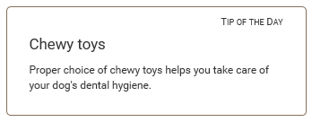

# Step 4 — Create a custom block [[% include 'snippets/experience_badge.md' %]] [[% include 'snippets/commerce_badge.md' %]]

!!! tip

    You can find all files used and modified in this step on [GitHub](https://github.com/ezsystems/ezplatform-ee-beginner-tutorial/tree/v3-step4).

This step will guide you through creating a custom block.
The custom block will display a randomly chosen Content item from a selected folder.

To create a custom block from scratch you need four elements:

- block configuration
- a template
- a listener
- the listener registered as a service

### Block configuration

In `config/packages/ezplatform_page_fieldtype.yaml` add the following block under the `blocks` key:

``` yaml hl_lines="10"
random:
    name: Random block
    thumbnail: /assets/images/blocks/random_block.svg#random
    views:
        random:
            template: blocks/random/default.html.twig
            name: Random Content Block View
    attributes:
        parent:
            type: embed
            name: Parent
            validators:
                not_blank:
                    message: You must provide value
                regexp:
                    options:
                        pattern: '/[0-9]+/'
                    message: Choose a Content item
```

This configuration defines one attribute, `parent`. You will use it to select the folder containing tips.

### Block template

You also need to create the block template, `templates/blocks/random/default.html.twig`:

``` html+twig
<div class="row random-block">
    <h4 class="text-right">{{ 'Tip of the Day'|trans }}</h4>
    <h5>{{ ez_content_name(randomContent) }}</h5>
    <div class="random-block-text">
        {{ ez_render_field(randomContent, 'body') }}
    </div>
</div>
```

### Block listener

Block listener provides the logic for the block. It is contained in `src/Event/RandomBlockListener.php`:

``` php
<?php

declare(strict_types=1);

namespace App\Event;

use eZ\Publish\API\Repository\Values\Content\Location;
use EzSystems\EzPlatformPageFieldType\FieldType\Page\Block\Renderer\BlockRenderEvents;
use EzSystems\EzPlatformPageFieldType\FieldType\Page\Block\Renderer\Event\PreRenderEvent;
use Symfony\Component\EventDispatcher\EventSubscriberInterface;
use eZ\Publish\API\Repository\Values\Content\Query;
use eZ\Publish\API\Repository\Values\Content\Query\Criterion;
use eZ\Publish\API\Repository\LocationService;
use eZ\Publish\API\Repository\ContentService;
use eZ\Publish\API\Repository\SearchService;

class RandomBlockListener implements EventSubscriberInterface
{
/** @var \eZ\Publish\API\Repository\ContentService */
private $contentService;

/** @var \eZ\Publish\API\Repository\LocationService */
private $locationService;

/** @var \eZ\Publish\API\Repository\SearchService */
private $searchService;

/**
 * @param \eZ\Publish\API\Repository\ContentService $contentService
 * @param \eZ\Publish\API\Repository\LocationService $locationService
 * @param \eZ\Publish\API\Repository\SearchService $searchService
 */
public function __construct(
    ContentService $contentService,
    LocationService $locationService,
    SearchService $searchService
) {
    $this->contentService = $contentService;
    $this->locationService = $locationService;
    $this->searchService = $searchService;
}

/**
 * @return array The event names to listen to
 */
public static function getSubscribedEvents()
{
    return [
        BlockRenderEvents::getBlockPreRenderEventName('random') => 'onBlockPreRender',
    ];
}

/**
 * @param \EzSystems\EzPlatformPageFieldType\FieldType\Page\Block\Renderer\Event\PreRenderEvent $event
 *
 * @throws \eZ\Publish\API\Repository\Exceptions\InvalidArgumentException
 * @throws \eZ\Publish\API\Repository\Exceptions\NotFoundException
 * @throws \eZ\Publish\API\Repository\Exceptions\UnauthorizedException
 */
public function onBlockPreRender(PreRenderEvent $event): void
{
    $blockValue = $event->getBlockValue();
    $renderRequest = $event->getRenderRequest();

    $parameters = $renderRequest->getParameters();

    $contentIdAttribute = $blockValue->getAttribute('parent');
    $location = $this->loadLocationByContentId((int) $contentIdAttribute->getValue());
    $contents = $this->findContentItems($location);
    shuffle($contents);

    $parameters['randomContent'] = reset($contents);

    $renderRequest->setParameters($parameters);
}

/**
 * @param Location $location
 *
 * @return \eZ\Publish\API\Repository\Values\Content\Content[]
 *
 * @throws \eZ\Publish\API\Repository\Exceptions\InvalidArgumentException
 */
private function findContentItems(Location $location): array
{
    $query = new Query();
    $query->query = new Criterion\LogicalAnd(
        [
            new Criterion\ParentLocationId($location->id),
            new Criterion\Visibility(Criterion\Visibility::VISIBLE),
        ]
    );

    $searchHits = $this->searchService->findContent($query)->searchHits;

    $contentArray = [];
    foreach ($searchHits as $searchHit) {
        $contentArray[] = $searchHit->valueObject;
    }

    return $contentArray;
}

    /**
     * @param int $contentId
     *
     * @return \eZ\Publish\API\Repository\Values\Content\Location
     *
     * @throws \eZ\Publish\API\Repository\Exceptions\NotFoundException
     * @throws \eZ\Publish\API\Repository\Exceptions\UnauthorizedException
     */
    private function loadLocationByContentId(int $contentId): Location
    {
        $contentInfo = $this->contentService->loadContentInfo($contentId);

        return $this->locationService->loadLocation($contentInfo->mainLocationId);
    }
}
```

At this point the new custom block is ready to be used.

You're left with the last cosmetic changes. First, the new Block has a broken icon in the Elements menu in Page mode.
This is because you haven't provided this icon yet. If you look back to the YAML configuration, you can see the icon file defined as `random_block.svg` (line 4). Download [the provided file](https://github.com/ezsystems/ezplatform-ee-beginner-tutorial/blob/v3-step4/public/assets/images/blocks/random_block.svg) and place it in `public/assets/images/blocks`.

Finally, add some styling for the new block. Add the following to the end of the `assets/css/style.css` file:

``` css
/* Random block */
.random-block {
    border: 1px solid #83705a;
    border-radius: 5px;
    padding: 0 25px 25px 25px;
    margin-top: 15px;
}

.random-block h4 {
    font-variant: small-caps;
    font-size: 1.2em;
}

.random-block h5 {
    font-size: 1.2em;
}

.random-block-text {
    font-size: .85em;
}
```

Run `yarn encore <dev|prod>` to regenerate assets.

Go back to editing the Front Page. Drag a Random Block from the Elements menu on the right to the Page's side column.
Access the block's settings and choose the "All Tips" folder from the menu. Save and publish all the changes.

Refresh the home page. The Tip of the Day block will display a random Tip from the "Tips" folder.
Refresh the page a few more times and you will see the tip change randomly.


