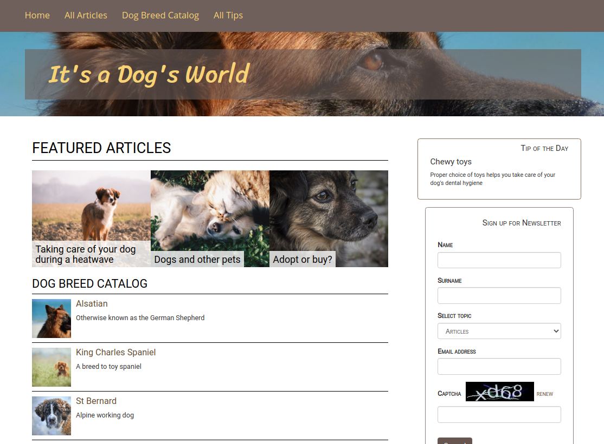

# Step 4 - Creating a custom block

!!! tip

    You can find all files used and modified in this step on [GitHub](https://github.com/ezsystems/ezstudio-beginner-tutorial/tree/master).

The last of the planned Landing Page elements is to create a custom block for the Landing Page.
The custom block will display a randomly chosen Content item from a selected folder.

To create a custom block from scratch you need four elements:

- a block definition
- a template for the block
- a block extension class
- block configuration for the services and templates config

### Block definition and template

A block definition contains block structure and the information that is passed from it to the template.
The definition will be contained in `src/AppBundle/Block/RandomBlock.php`:

``` php
<?php

namespace AppBundle\Block;

use EzSystems\LandingPageFieldTypeBundle\Exception\InvalidBlockAttributeException;
use EzSystems\LandingPageFieldTypeBundle\FieldType\LandingPage\Definition\BlockDefinition;
use EzSystems\LandingPageFieldTypeBundle\FieldType\LandingPage\Definition\BlockAttributeDefinition;
use EzSystems\LandingPageFieldTypeBundle\FieldType\LandingPage\Model\AbstractBlockType;
use EzSystems\LandingPageFieldTypeBundle\FieldType\LandingPage\Model\BlockValue;
use eZ\Publish\API\Repository\ContentService;
use eZ\Publish\API\Repository\LocationService;
use eZ\Publish\API\Repository\SearchService;
use eZ\Publish\API\Repository\Values\Content\Query\Criterion;
use eZ\Publish\API\Repository\Values\Content\LocationQuery;

class RandomBlock extends AbstractBlockType
{
    /**
     * Content ID regular expression.
     *
     * @example 16
     *
     * @var string
     */
    const PATTERN_CONTENT_ID = '/[0-9]+/';

    /** @var \eZ\Publish\API\Repository\LocationService */
    private $locationService;

    /** @var \eZ\Publish\API\Repository\ContentService */
    private $contentService;

    /** @var \eZ\Publish\API\Repository\SearchService */
    private $searchService;

    /**
     * @param \eZ\Publish\API\Repository\LocationService $locationService
     * @param \eZ\Publish\API\Repository\ContentService $contentService
     * @param \eZ\Publish\API\Repository\SearchService $searchService
     */
    public function __construct(
        LocationService $locationService,
        ContentService $contentService,
        SearchService $searchService
    ) {
        $this->locationService = $locationService;
        $this->contentService = $contentService;
        $this->searchService = $searchService;
    }

    public function getTemplateParameters(BlockValue $blockValue)
    {
        $attributes = $blockValue->getAttributes();
        $contentInfo = $this->contentService->loadContentInfo($attributes['parentContentId']);
        $randomContent = $this->getRandomContent(
            $this->getQuery($contentInfo->mainLocationId)
        );

        return [
            'content' => $randomContent,
        ];
    }

    /**
     * Returns random picked Content.
     *
     * @param \eZ\Publish\API\Repository\Values\Content\LocationQuery $query
     *
     * @return \eZ\Publish\API\Repository\Values\Content\Content
     */
    private function getRandomContent(LocationQuery $query)
    {
        $results = $this->searchService->findLocations($query);
        $searchHits = $results->searchHits;
        if (count($searchHits) > 0) {
            shuffle($searchHits);
            return $this->contentService->loadContentByContentInfo(
                $searchHits[0]->valueObject->contentInfo
            );
        }

        return null;
    }

    /**
     * Returns LocationQuery object based on given arguments.
     *
     * @param int $parentLocationId
     *
     * @return \eZ\Publish\API\Repository\Values\Content\LocationQuery
     */
    private function getQuery($parentLocationId)
    {
        $query = new LocationQuery();
        $query->query = new Criterion\LogicalAnd([
            new Criterion\Visibility(Criterion\Visibility::VISIBLE),
            new Criterion\ParentLocationId($parentLocationId),
        ]);

        return $query;
    }

    public function createBlockDefinition()
    {
        return new BlockDefinition(
            'random',
            'Random',
            'default',
            'assets/images/blocks/random_block.svg',
            [],
            [
                new BlockAttributeDefinition(
                    'parentContentId',
                    'Parent',
                    'embed',
                    self::PATTERN_CONTENT_ID,
                    'Choose a valid ContentID',
                    true,
                    false,
                    [],
                    []
                ),
            ]
        );
    }

    public function checkAttributesStructure(array $attributes)
    {
        if (!isset($attributes['parentContentId']) || preg_match(self::PATTERN_CONTENT_ID, $attributes['parentContentId']) !== 1) {
            throw new InvalidBlockAttributeException('Parent container', 'parentContentId', 'Parent ContentID must be defined.');
        }
    }
}
```

Now you need to define the block template, `src/AppBundle/Resources/views/blocks/random.html.twig`:

``` html+twig
<div class="row random-block">
    <h4 class="text-right">{{ 'Tip of the Day'|trans }}</h4>
    <h5>{{ ez_content_name(content) }}</h5>
    <div class="random-block-text">
        {{ ez_render_field(content, 'body') }}
    </div>
</div>
```

### Block extension and configuration

The next step is to define the extension that will provide block configuration to the eZ Platform Enterprise Edition app. To do this you need to make some additions to `src/AppBundle/DependencyInjection/AppExtension.php`.

First, add these three lines after the existing `use` statements:

``` php
use Symfony\Component\DependencyInjection\Extension\PrependExtensionInterface;
use Symfony\Component\Yaml\Yaml;
use Symfony\Component\Config\Resource\FileResource;
```

Second, add `implements PrependExtensionInterface` to the `AppExtension extends Extension` line, so that it looks like this:

``` php
class AppExtension extends Extension implements PrependExtensionInterface
```

Finally, add the following function at the end of the one existing class:

``` php
public function prepend(ContainerBuilder $container)
{
    $configFile = __DIR__ . '/../Resources/config/blocks.yml';
    $config = Yaml::parse(file_get_contents($configFile));
    $container->prependExtensionConfig('ez_systems_landing_page_field_type', $config);
    $container->addResource(new FileResource($configFile));
}
```

Next, you need to provide the block configuration in two files.
Add this section in the `src/AppBundle/Resources/config/services.yml` file under the `services` key:

``` yaml
app.block.random:
    class: AppBundle\Block\RandomBlock
    arguments:
        - '@ezpublish.api.service.location'
        - '@ezpublish.api.service.content'
        - '@ezpublish.api.service.search'
    tags:
        - { name: landing_page_field_type.block_type, alias: random }
```

Create a `src/AppBundle/Resources/config/blocks.yml` file:

``` yaml
blocks:
    random:
        views:
            random:
                template: 'AppBundle:blocks:random.html.twig'
                name: 'Random Content Block View'
```

At this point the new custom block is ready to be used.

You're left with the last cosmetic changes. First, the new Block has a broken icon in the Elements menu in Page mode.
This is because you haven't provided this icon yet. If you look back to the `RandomBlock.php` file, you can see the icon file defined as `random_block.svg` (line 109). Download [the provided file](img/enterprise_tut_random_block.svg) and place it in `web/assets/images/blocks`.

Finally, add some styling for the new block. Add the following to the end of the `web/assets/css/style.css` file:

``` css
/* Random block */
.random-block {
    border: 1px solid #83705a;
    border-radius: 5px;
    padding: 0 25px 25px 25px;
    margin-top: 15px;
}

.random-block h4 {
    font-variant: small-caps;
    font-size: .8em;
}

.random-block h5 {
    font-size: 1.2em;
}

.random-block-text {
    font-size: .85em;
}
```

Go back to editing the Front Page. Drag a Random Block from the Elements menu on the right to the Landing Page side column.
Access the block's settings and choose the "All Tips" folder from the menu. Save and publish all the changes.

Refresh the home page. The Tip of the Day block will display a random Tip from the "Tips" folder.
Refresh the page a few more times and you will see the tip change randomly.


### Congratulations!

You have finished the tutorial and created your first customized Landing Page.

You have learned how to:

- Create and customize a Landing Page
- Make use of existing blocks and adapt them to your needs
- Plan content airtimes using Schedule blocks
- Create custom blocks


