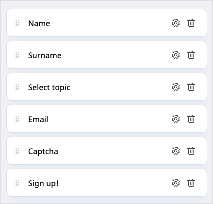
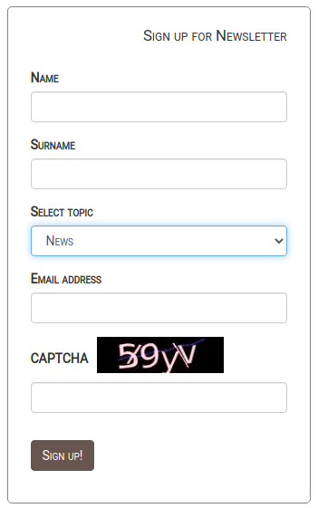

# Step 5 — Create a newsletter form [[% include 'snippets/experience_badge.md' %]] [[% include 'snippets/commerce_badge.md' %]]

!!! tip
    You can find all files used and modified in this step on [GitHub.](https://github.com/ezsystems/ezplatform-ee-beginner-tutorial/tree/v3-master)

The final step of this tutorial assists you in adding to the home page a Form block for signing up to a newsletter.

### Add a Form block

Start with creating a Form Content item.
In the **Forms** panel, click **Create** and select **Form**.
Provide the title, e.g. "Sign up for Newsletter" and click **Build form**.

In the Form Builder, add and configure (using the **Basic** and **Validation** tabs) the following form fields:

|Form field|Name|Required|Additional properties|
|-----|----|--------|---------------------|
|Single line input|Name|yes|Minimum length = 3|
|Single line input|Surname|no|Minimum length = 3|
|Dropdown|Select topic|yes|Options:</br>- News</br>- Tips </br> - Articles|
|Email|Email address|yes|—|
|Captcha|CAPTCHA|—|—|
|Button|Sign up!|—|Action: Show a message</br>Message to display: Thank you!|

The configuration should look like this:



When you add all the fields, go to the previous menu and click **Publish**.
Now you can edit the Front Page and add a Form block below the Random block.
Edit the block and select the form you created. Click **Submit**.

The Page should refresh with the Form block.


It clearly differs from the page design, so you also need to customize the block's layout.

### Change the block template

First, add a new template for the Form block to align it with the Random block design.
Create an `templates/blocks/form/newsletter.html.twig` file:

``` html+twig hl_lines="1"
<div class="row">
    <div class="block-form {{ block_class }}">
        {{ fos_httpcache_tag('relation-location-' ~ locationId) }}
        {{ render(controller('ez_content::viewAction', {
            'locationId': locationId,
            'viewType': 'embed'
        })) }}
        <style type="text/css">{{ block_style|raw }}</style>
    </div>
</div>
```

This template extends the default block layout by adding an additional class (line 1) that shares CSS styling with the Random block.

Append the new template to the block by adding it to `config/packages/ezplatform_page_fieldtype.yaml`.
Add the following configuration under the `blocks` key at the same level as other block names, e.g. `random`:

``` yaml hl_lines="3"
blocks:
#...
    form:
        views:
            newsletter:
                template: blocks/form/newsletter.html.twig
                name: Newsletter Form View
```

Now you have to apply the template to the block.
Go back to editing the Page.
Edit the Form block again. 
In the **Design** tab, select the **Newsletter Form View** and click **Submit**.

The block remains unchanged, but the results will be visible when you add CSS styling.

### Change the field template 

At this point, you need to change the field template.
This results in alternating the position and design of the Form fields.

Create a `templates/fields/form_field.html.twig` file:

``` html+twig

    
    
        
        
        
            
                {{ form(form) }}
            
        
    

```

Next, assign the template to the Page.
In `config/packages/views.yaml`, at the same level as `pagelayout`, add:

``` yaml
field_templates:
    - { template: fields/form_field.html.twig, priority: 30 }
```

Clear the cache by running `bin/console cache:clear` and refresh the Page to see the results.

### Configure the Form field

Before applying the final styling of the block, you need to configure the [CAPTCHA field](../../extending/extending_form_builder.md#captcha-field).
In `config/packages/gregwar_captcha.yaml`, under the `gregwar_captcha` key, add the following configuration:

``` yaml
gregwar_captcha:
    # existing keys
    width: 150
    invalid_message: Please, enter again.
    reload: true
    length: 4
```
The configuration resizes the CAPTCHA image (line 3), changes the error message (line 4), enables the user to reload the code (line 5), and shortens the authentication code (line 6).

### Add stylesheet

The remaining step in configuring the block is adding CSS styling.
Add the following code to `assets/css/style.css`:

``` css
/* Newsletter Form block */
.block-form {
    border: 1px solid #8b7f7b;
    border-radius: 5px;
    padding: 0 25px 25px 25px;
    margin-top: 15px;
}

.block-form .ezstring-field {
    display: inline-block;
    font-variant: small-caps;
    font-size: 1.2em;
    width: 100%;
    text-align: right;
    padding-top: 20px;
}

.block-form .col-form-label {
    display: none;
}

.block-form .form-group {
    font-variant: small-caps;
    font-size: 1em;
    margin-top: 12px;
}

.captcha_image {
    padding-left: 10px;
    padding-bottom: 10px;
}

.captcha_reload {
    font-variant: all-small-caps;
    padding-left: 5px;
}

.btn-primary {
    background-color: rgb(103,85,80);
    border-color: rgb(103,85,80);
    margin-top: 15px;
    margin-bottom: -20px;
}

.block-form h3 {
    font-variant: all-small-caps;
    text-align: center;
}
```
Reinstall the assets and clear the cache by running the following commands:

``` bash
yarn encore <dev|prod>
php bin/console cache:clear
```
Your newsletter form block is ready.



Refresh the Page and enter a couple of mock submissions.

### Manage the submissions

You can view all submissions in the Back Office.
Go to **Forms** panel. From the Content Tree, select the Form and view the **Submissions** tab.
There, after selecting submission(s), click **Download** or **Delete**.
To see details about a submission, click **View**.


For more details, see [viewing form results.](https://doc.ezplatform.com/projects/userguide/en/latest/creating_content_advanced/#viewing-results)

## Congratulations!

You have finished the tutorial and created your first customized Page.

You have learned how to:

- Create and customize a Page
- Make use of existing blocks and adapt them to your needs
- Plan content airtime using the Content Scheduler block
- Create custom blocks
- Use Form Builder and configure your form
- Apply custom styling to blocks


